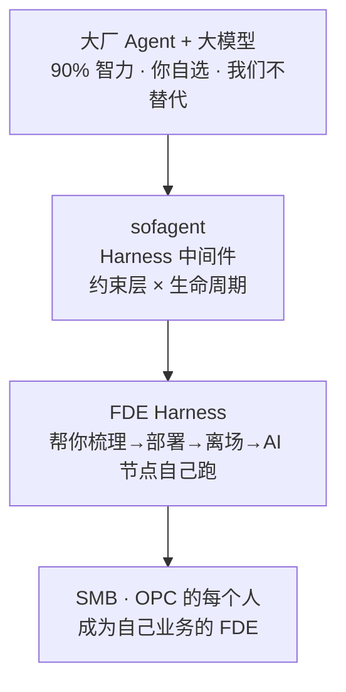
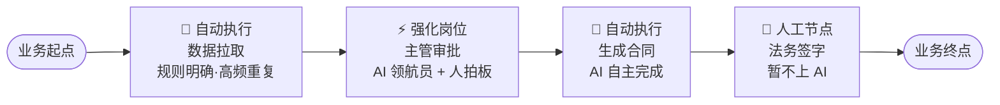

# FDE 完全指南 · 从理念到落地

> v1.5.1 · 2026-09-22（UTC）· ✅ 已发版 · 孔放勋 · 面向想系统掌握 FDE 方法论的人。读完你能独立做一次 FDE 诊断，并能判断客户的 AI 成熟度。
> 本文档是学习手册（人读）。给 AI Agent 的操作指令见 `SKILL/SKILL.md` 与 `SKILL/skills/01-05`。
>
> **FDE 四阶段十二步索引**（模板中 §1~§12 对应本指南章节）：
>
> | 步骤 | 内容 | 对应章节 |
> |------|------|---------|
> | §1-§3 | 企业建档（画像/历史/组织） | 第一章 + 第三章 |
> | §4 | 工作流挖掘 | 第二章 |
> | §5 | AI 节点判定 + 本体构建 | 第三章 + 第四章 |
> | §6 | 价值数据/ROI | 第四章 §4.3 |
> | §7 | 部署方案 | 第五章 |
> | §8 | Skill 定制 | 第五章 §5.2（沉淀）与 §5.12（激活链） |
> | §9 | 知识库初始化 | 第五章 §5.6 |
> | §10 | 运行状态检查 | 第五章 §5.5 |
> | §11 | 交接 | 第五章 §5.8 |
> | §12 | 离场 | 第五章 §5.10 |
>
> **本文档的定位：FDE 诊断方法论。** 它讲清楚一件事——怎么梳理 workflow、定义 ontology，最终交付 **Workflow Graph + Ontology Graph 双图谱**，并判定 AI 节点。**诊断是起点，不是终点**：诊断交付的 ontology + workflow.yml + skills/ 会通过激活链（ACTIVATE→ORCHESTRATE→EXECUTE→SUSTAIN）自动注册为企业 SubAgent、编排成可运行工作流。本文档专注"把诊断做对"，激活链部分见 [5.12 交付之后](#512-交付之后激活链从交付物到自动运转activateorchestrateexecutesustain-完整交付)（完整设计见 sofagent 仓库 docs/guides/fde-activation-chain.md；仅读方法论的独立读者：激活链是 sofagent 引擎的自动执行机制，纯 FDE 手工交付可不依赖它——把它当作「交付物如何变成自动系统」的参考读法即可）。

---

## 目录

- [第一章：为什么要 FDE](#第一章为什么要-fde)
- [第二章：五要素深挖](#第二章五要素深挖)
- [第三章：本体数据构建](#第三章本体数据构建)
- [第四章：节点判定与量化](#第四章节点判定与量化)
- [第五章：三层交付](#第五章三层交付)
- [第六章：理论底座（为什么信这套）](#第六章理论底座为什么信这套)
- [附录](#附录)

## 第一章：为什么要 FDE

### 1.1 AI 进企业的真问题

企业 AI 落地失败的首要原因不是技术选错，是**顺序搞反了**——上来就选模型、搭平台、买 Agent，结果发现没人用。

一个帮几百家企业跑通 AI 落地的创始人发现：真正的瓶颈从来不是「AI 不够好」，而是**企业还没搞清楚自己的业务流程，就想让 AI 来接管**。80 人销售团队仅加早会 5 分钟提问环节（未采购任何 AI 工具），四周见效——联系率从 27% 升到 81%。

「管理动作先行」——先让人跑通流程，再用 AI 加速。FDE 方法论正是照着这个逻辑设计的：第一步梳理工作流，本身就是管理动作。

### 1.2 FDE 是什么

FDE 全称 Forward Deployed Engineer（前线部署工程师），源自 Palantir 的交付纪律——工程师驻场客户，把通用产品变成客户能用的方案。

sofagent 把它从岗位 title 升级为能力模型，再升级为**常驻 FDE Harness**：

- 人（FDE）帮客户部署完离场，FDE 能力留在客户那里继续干活（装在成熟 Agent 上 7×24 运行）
- 产品形态 = FDE Harness 层：不造 Agent，嵌在成熟 Agent（DSH / OpenClaw / WorkBuddy）与模型层之间做治理——对执行体约束、对智力源治理，plugin + skill + MCP + CLI + dashboard 五种形态分发，任何已有 Agent 装上它就是一个 FDE Harness（见 [WIKI 产品叙事](../docs/WIKI.md#二产品叙事sofagent-是-fde-harness-层不造-agent嵌在-agent-与模型之间做治理)）
- 梳理好的工作流在跑、合规自检在跑、周度巡检在跑
- 客户得到的不是一个工具，是一个 7×24 在线的 FDE 能力

**最终目标不是培养更多 FDE，而是让 SMB 与 OPC 的每个人，都具备 FDE 的能力：掌握完整上下文、打破岗位边界、对结果负责。**

**端到端责任的外部印证**：OpenAI 当前 FDE 岗位定义把 discovery（业务发现）、technical scoping（技术圈定）、system design、build、production rollout 五件事放在同一个人的端到端责任里（招聘原文 "You will own discovery, technical scoping, system design, build, and production rollout"）——**问问题的人和建系统的人是同一个人**，所以每个问题都直接服务于「能不能跑起来」。这和售前调研有本质区别：售前的调研服务于签单，FDE 的调研服务于交付。sofagent 的 `fde_interview`（访谈结构化落盘）就是这个纪律的机制化——访谈产出不是会议纪要，是可直接进 profile 重算的结构化对象。

> 📖 来源：OpenAI FDE 岗位招聘定义（openai.com/careers，2026-08 核验）

**补充：Palantir 官方口径下的三种 Echo 形态**

Palantir 官方博客澄清了两件常被误传的事：① **Echo 与 Delta 的边界是模糊的**——「理论上 Echo 更偏产品经理、Delta 更偏技术，但现实中两个角色都是产品经理 + 软件工程师 + 战略师的混合体，界线经常严重模糊」；② 同一职位名下并存三种形态：

| 形态 | 干什么 |
|------|--------|
| Pilot Lead | 4–12 周试点，白天写数据管道，下午对客迭代 |
| Enterprise Lead | 偏组织赋能与售前，写 1 页 thesis 把特性推进核心产品 |
| **Internal Echo** | 审 PR、给核心产品补「项目团队急需但产品里还没有」的功能 |

其中 **Internal Echo 就是 sofagent 进化模块的人肉版本**——介于嵌入团队与核心产品团队之间，把现场缺口补成平台能力。原文那句「你通常同时负责跑一个项目和造一个产品，同时确保学到的一切都回流进 Palantir 的软件」说的就是经验回流；sofagent 要做的是把这条职责**机制化**，不依赖个人自觉。

> 📖 来源：[A Day in the Life of a Palantir Deployment Strategist](https://blog.palantir.com/a-day-in-the-life-of-a-palantir-deployment-strategist-951cb59a5a96)（blog.palantir.com，2022）

### 1.3 三种交付形态与三角色

FDE 交付不是只有一种姿势。Palantir 交付实践给出三种交付形态，各有适用条件和责任分担：

| 形态 | 谁拥有建模资产 | 适用条件 | sofagent 怎么对应 |
|------|-------------|---------|-----------------|
| **A：合伙人级顾问兼任** | 沉淀归规格 + 客户共享 | 制造业可、零售可、服务业必选 | sofagent FDE 进场 + 离场后 Agent 继续跑 |
| **B：客户共建 CoE** | 沉淀归客户，FDE 给迁移路径 | 客户须配齐三角色 | sofagent 交付物 + 激活链交给客户自运维 |
| **C：远程团队交付** | 沉淀归规格 | 零售可、服务业禁 | sofagent 远程 MCP 支持 |

**三角色（B 形态前置条件，A/C 形态可代行但有期限）**：

| 角色 | 可否替代 | 缺位后果 |
|------|---------|---------|
| **平台 owner**（生产副总级） | 不可替代 | 用例决策、成功标准定义、跨部门协调——缺位则项目停摆 |
| **权限经理**（IT 部门） | 不可替代 | Agent 身份发放、权限路线判定——缺位则生产写入权限无法开放 |
| **业务建模师**（车间主任级） | FDE 可代行≤3 个月 | 确认对象口径与状态机约束——超期客户须自行培养接任 |

> 💡 **与 sofagent Onboard Agent 的关系**：Onboard Agent L1-L5 本质是在替代"业务建模师"角色——Agent 自动调试 AI 节点到跑通。平台 owner 和权限经理的判断仍然不可被 Agent 替代。

### 1.4 FDE 解决的核心矛盾

AI 能力强但不可控 vs 企业需要可控可审计。FDE 用四件事化解：

| 矛盾 | FDE 的做法 |
|------|-----------|
| 不知道 AI 该干什么 | 逐岗位梳理工作流，识别 AI 节点 |
| 不知道 AI 干得对不对 | 审计模块（git diff 硬证据）每次变更自动审计 |
| 不知道经验怎么留 | think.md 反思库，每次任务沉淀教训 |
| 不知道边界在哪 | knowledge-domain 访问边界 + 数据主权审计 |

### 1.5 案例：一纸一会两周

某 80 人销售团队，客户联系率只有 27%。

| 步骤 | 怎么做 |
|------|--------|
| **一纸** | 写下当前最痛的一个业务场景：「客户联系率只有 27%」 |
| **一会** | 第二天早会执行一个最小动作：「每人汇报 5 个客户跟进情况」 |
| **两周** | 不看 AI、不买工具，只看数据变化 → 4 周后联系率 27% → 81% |

启示：先让流程本身变好，AI 是加速器不是发动机。

### 1.6 三个常见误解

| ❌ 误解 | ✅ 正确认知 |
|--------|-----------|
| 这是个 Git 审计安全工具 | 审计模块只是 FDE Harness「约束层」中的一环，单独拿出来没有意义 |
| 这是要跟大厂 Agent 竞争 | 我们不造 Agent，嵌在大厂 Agent 与模型之间做问责底座（对执行体约束、对智力源治理） |
| 这是卖软件的 | 这是开源（MIT）的 FDE Harness——目标是让每个人都能成为 FDE |

### 1.7 心智模型



**sofagent 是「约束层 × 生命周期」双层架构**——这是理解整份指南的关键：

| 层 | 是什么 | 回答什么问题 | 本文档覆盖 |
|:--:|--------|-------------|-----------|
| **层 1 · 约束层** | 一个层五种能力（约束层：注入·审计·回溯·沉淀·进化） | "怎么保证每次执行都做对" | 贯穿（审计模块是 FDE 的问责底座） |
| **层 2 · 生命周期** | 诊断 → 激活 → 编排 → 执行 → 进化 | "企业 AI 从诊断到自运转怎么走" | 本文档 = 第一环（诊断）；激活链见 [5.12](#512-交付之后激活链从交付物到自动运转activateorchestrateexecutesustain-完整交付) |

> **约束层为生命周期提供能力，生命周期让约束层有活干**——审计模块在执行阶段每步把关，进化模块在闭环阶段吃 think.md 回写。约束层是"怎么保证做对"，生命周期是"让什么跑起来"。FDE 方法论（四阶段十二步，本指南第一章到第六章展开）就是生命周期第一环（诊断）的完整展开。

### 1.8 什么时候该上 FDE

FDE 有巨大前期成本，只在三种情况成立：

1. **深度实施需求 + 毛利足以吸收成本**——常规产品自助就能跑通的场景，不必上 FDE
2. **强监管行业**（金融 / 医疗 / 国防 / 政务）——合规要求必须现场定制
3. **需要探路的全新垂直**——产品还没覆盖的行业，FDE 去打样

**客户分层打法**：

| 维度 | SMB / 小客户 | 中型客户 | 大型 / 央国企 |
|------|------------|---------|-------------|
| 团队配置 | 1 名 FDE + agent 舰队 | pod：FDE + PM + 数据工程师 | 全队 + RACI + 指导委员会 |
| 切入方式 | 低价起步 + 自助试用 | 业务驱动 + 多线程 | 高层关系 + 灯塔 POC |
| 第一个项目 | 单一高频关键场景 × 一个用例 | 一个部门 × 有清晰 KPI 的流程 | 灯塔 POC（有限范围 + 内部标杆） |

> 📌 中型客户（专精特新小巨人）是 FDE 甜点区——有大企业的复杂度，但没有大企业的预算浪费。

**客户就绪三前提**（缺一不可，否则部署必败）：

| 前提 | 检查点 | 没满足怎么办 |
|------|--------|------------|
| 流程已标准化 | 合同怎么审、风险怎么分级、指标怎么权重——先定义清楚 | 先帮客户做流程梳理，不急着上 Agent |
| 数据已打通 | ERP / MES / 财务 / 银行网银不能是孤岛 | 评估数据打通成本，或缩小覆盖范围 |
| 权限边界已划定 | 高敏感场景明确自动化范围 + 人工确认节点 | 风险分级配置时一起定 |

> 🎯 切入顺序：非车间场景（法务 / 采购 / 财务）先跑通——这类「隐形生产线」规则明确、重复频繁、风险敏感，是 Agent 最容易出效果的入口。车间/产线场景后做。

### 1.8.1 适用象限：两根轴定生死

三种情况之外，还有一个更根本的二维判定——**销售产品的复杂度 × 采购方的技术能力**：

| 产品复杂度 \ 买家技术力 | 技术型买家（CTO / 工程团队） | 非技术型买家（业务高管 / 行业老板） |
|---|---|---|
| **高复杂度平台**（深度定制、需实施） | 开发者生态 / DevRel（文档 + SDK 自己长） | **FDE 的主场**——买家没法自己落地，必须外派工程师交付结果 |
| **轻量可配置产品**（标准 SaaS） | 产品导向增长（PLG，自助试用） | 传统销售驱动（SLG，销售 + 客服） |

读法：**只有右上格必须 FDE**——高复杂度产品撞上非技术买家，落地摩擦大到靠文档、销售、外包都解不掉。判断自己该不该养 FDE 能力，先回答两问：

1. **买家匹配度**：我们的产品对右上格吗？（买家缺工程能力，落地必须有人替他做）
2. **底座就绪度**：我们有没有可快速装配的平台原语？（没有 → 见 §5.1.2 平台/前线边界，先补底座再扩交付，否则退化为项目制外包）

### 1.9 企业 AI 成熟度三级台阶

判断客户成熟度，决定 FDE 帮到多深：

| 级别 | 特征 | 典型风险 | FDE 怎么帮 |
|:--:|------|------|------|
| 第一级·替换 | 把 AI 当便宜员工 1:1 替换，仅以降本为目标 | 责任悬空。Klarna 裁 700 人用 AI 替代，一年后服务质量崩盘被迫召回 | 最小安装：审计模块 + 约束底座，确保每个 AI 操作可追溯、有负责人 |
| 第二级·增强 | 全员配 AI 工具，但流程和组织没变（德勤 2026：84% 企业停在这一级） | AI 只提高手速，没改变流程。文案快了审核更累 | 标准安装：审计 + 编排 + Skill + AI 知识库，建立完整责任链路 |
| 第三级·重构 | 围绕「活儿怎么流转」重画岗位、审批、绩效。人机混编组队 | — | 深度 FDE：三层实体稳定后，AI 知识库自动积累最佳实践，Skill 自进化 |

> 84% 的企业停在第二级。目标是让企业跨到第三级：不只装 AI，还装上责任机制。

### 1.10 进场前三道关——PSF 检验 + PoC 坟墓防线

> 📖 方法论来源：范冰《前线部署工程师》第 2 章「解决正确的问题」——FDE 最贵的成本是前置的（最优秀的工程师、最长的现场投入全发生在回款之前），一旦陷入泥潭不是亏一单的问题，是整支精英团队被拖住、机会成本雪崩。所以**拒绝错误的项目，本身就是 FDE 模式的盈利能力**。

五要素深挖（第二章）管的是「怎么挖」，这里管的是**挖之前先判断该不该挖**。一个候选项目必须同时过三关，才值得进场：

**PSF 三关**（Problem-Solution Fit，问题与方案的契合）：

| 关 | 检验什么 | 不过关的信号 |
|----|---------|-------------|
| ① 痛点检验 | 是不是**某个具体的人**的**具体的痛**？「提升客服效率」不是痛点（是方向）；「客服主管每周一花三小时从四个系统手动汇总上周升级工单」才是痛点 | 只能说出方向，说不出具体的人+具体的动作+具体的时间消耗 |
| ② 经济性检验 | 解决这个问题值多少钱？每周吃掉多少人时？折合多少成本？出错一次赔多少？省下来的人手能去干什么？ | 算不清这笔账的项目，做了也活不过下一个预算季 |
| ③ 可行性检验 | 数据在哪、什么状态？准确率门槛多少？（「99% 可用」和「90% 可用」之间隔着数量级的工程投入，而很多业务场景 90% + 人工复核就是最优解） | 数据分散在七个系统里、三个版本对不上、最权威那份在某个老员工私人表格里 |

**PoC 坟墓三防线**——拒绝错误项目的可操作机制：

| 防线 | 做什么 | 核心纪律 |
|-----|--------|---------|
| ① 概念验证必须有「毕业标准」 | 启动时就写明：几周后、用什么指标、达到什么数值，项目「毕业」进入付费部署；达不到，双方体面散伙 | 传统 PoC 沦为坟墓，恰恰因为它「无限期、无指标、无裁判」 |
| ② 警惕三类高危信号 | **无主之地**（项目在公司内没有明确业务方负责人，只有信息部门对接）· **只许看不给碰**（要求先证明能力但拒绝提供真实数据）· **宇宙级需求**（第一次会议就要「覆盖全公司所有场景」）| 三类信号出现两个以上就要高度警惕 |
| ③ 给「拒绝」留台阶 | 把「现在不做」翻译成「什么时候做」：「这个场景的数据基础还差三件事，建议先做另一个场景，顺手补齐，下季度再来」| 把拒绝包装成路线图，既守产能又维护关系 |

> 💡 **MVD 三军规**（Minimum Viable Deployment，最小可行部署）：一旦决定进场，验证价值时遵守——① 真实数据没例外（客户必须带自己的真实业务数据来，脱敏样例数据是 PoC 坟墓的第一块砖）② 缩小的是范围不是价值（不砍方案深度，只砍覆盖的面：不追求「覆盖全公司」，而追求「只做退换货这一类工单，但端到端无人干预」）③ 定死截止时间倒逼取舍（验证周期以周计不以月计，Palantir 训练营 1-5 天，Sierra 最快 4 周，Decagon 典型 4-8 周）。

### 1.11 六项业务要素检查表——判断 AI 真进业务还是停在工具层

企业刚用 AI 会先在个人工具上看到效果——周报写得快、资料查得快、会议纪要出得快。**工具层离经营动作还有距离**：销售预测变了，供应链会不会跟着调整？采购计划会不会被改？AI 输出一段漂亮建议，最后还是有人复制到微信群再手工改表——这就还没进入工作流。

拿任何一个企业 AI 项目填这张表，**填不出来 = 还在演示层或工具层**：

| # | 检查项 | 判问 |
|---|--------|------|
| 1 | 解决什么问题 | 成本 / 流程 / 响应 / 质量 / 风险 / 经验沉淀？ |
| 2 | 涉及哪些对象 | 要识别或改变哪些状态？ |
| 3 | 数据从哪来 | 系统表、接口、文档、日志？ |
| 4 | Owner 是谁 | 会触发什么动作？ |
| 5 | 结果写回哪里 | 是否进入业务系统？ |
| 6 | 出错能否审计 | 能不能复盘决策依据？ |

> 三张表三层用途：**本表（六项）管「事前判断」**——项目该不该接、AI 进没进业务；**§3.3 业务四问管「进场首日」**——把企业业务钉死；**§3.7 动作访谈表管「逐节点深挖」**——每个动作的工程细节。六项填不出来，先别谈 Agent 多聪明，先把业务对象世界补出来。企业愿意为 AI 买单的真实原因是五类业务问题（响应/成本/流程/风险/经验沉淀），不是工具提效。

**Ontology 不是唯一方案**：个人助手、单文档问答、一次性分析，用 RAG + 向量检索就够。**场景一旦跨系统、跨角色、触发动作、写回结果、接受审计**，就需要 ontology 类表达——这也是 §3.2 适配性判断的业务版判据。

### 梳理是起点不是终点：四层价值链

FDE 的交付物远不止「一次梳理」。梳理（第①层）是入口，后面三层——编排（②）、治理（③）、专属模型（④）——都是这次梳理的延续价值。**FDE 卖的不是一张 Workflow Graph，是企业 AI 运行的完整形态**：

| 层 | FDE 交付/牵出 | 客户得到的延续价值 |
|---|--------------|------------------|
| ① 梳理与转换 | 访谈 → 梳理 workflow、定义 ontology，交付 Workflow Graph + Ontology Graph（双图谱并行产出） | 「我的业务第一次被结构化地看清」 |
| ② 编排与执行 | 双图谱 → 受约束图（LangGraph 编排层 + DSH/fallback 执行层） | 「图谱变成 AI 真的能跑的节点」 |
| ③ 插件服务 | sofagent plugin：审计·验收·审批·门禁（事件域全域生效） | 「每一步可审计、可验收、危险事有人审」 |
| ④ 底层模型 | 不同节点调用企业专属后训练模型（商业模型层） | 「用我自己的数据训出我自己的模型」 |

> 这句是 FDE 的销售话术升级：「我们从梳理你的业务开始（①），把业务编成能跑的 AI（②），让它的每一步都可信（③），最后用你的数据训出你的模型（④）——四层一次交付，越用越强。」**梳理不是 FDE 的终点，是四层价值链的起点**——最终输出统一为「梳理 workflow、定义 ontology，交付 Workflow Graph + Ontology Graph 双图谱」。这也是 sofagent 区别于「直接在运行时上做垂直产品」的玩家的根因：他们从③开始造，我们从①开始梳理，梳理过的企业插件才装得进去。

---

## 第二章：五要素深挖

### 2.1 先找主战场

AI 不是司令员只是援军。先集中资源打一场能计算结果的小仗，问三个问题定位突破口：

1. 哪个环节卡住了企业？
2. 在不增加人手的前提下，AI 能承担 30% 还是 80%？
3. 打赢之后（可量化结果）再复制到下一个流程？

跑通一个流程比铺开十个半成品更有说服力。

<!-- METHODOLOGY: five-elements -->
### 2.2 五要素

对每个节点，把五个要素全部填满：

| 要素 | 追问 |
|------|------|
| **输入** | 这个节点接收什么信息/数据？谁给的？ |
| **输出** | 这个节点产出什么？交给谁？ |
| **负责人** | 谁在做这件事？什么岗位/职级？ |
| **耗时** | 每次花多长时间？每天/每周做几次？ |
| **最卡的地方** | 最大的难点/最烦人的地方是什么？ |

### 2.3 追问话术

- 「这个岗位每天第一件事做什么？」
- 「做完上一步，下一步是什么？」
- 「这一步输入是什么？谁给你的？输出是什么？交给谁？」
- 「这一步花多长时间？最烦人的地方是什么？」
- 「**能不能现场带我走一遍最近一个真实案例？**」——不听 SOP 口述，让执行者打开真实系统从头走一遍（见下文名义流程 vs 实际流程）

五要素全部填满 → 换下一个岗位。所有关键岗位全部填满 → 进入第三章构建本体数据。

### 2.3.1 证据等级——同一个问题，三种答案

五要素访谈拿回来的答案，性质完全不同，不能一视同仁。**每个答案都要标证据等级**：

| 等级 | 判据 | 例子 | 能干什么 |
|------|------|------|---------|
| **系统可核验**（事实） | 能回系统查到 | 「上个月 4280 张工单，平均解决 16 小时」 | 可进方案与报价 |
| **一线判断** | 执行者的经验判断 | 「客服觉得查政策最浪费时间」 | 须跟岗/抽样验证后才能用 |
| **目标愿望** | 希望式表达 | 「希望上线后效率提升一倍」 | **不能当项目基线**，只能当目标 |

这条纪律防的是企业 AI 项目最常见的死法：**在客户的愿望上做方案和报价**。落到 sofagent 的 `fde_interview` 落盘里，耗时/频次这类数字型答案优先回系统核验（工单系统、审批记录），核验不了的一律降级为「一线判断」并生成验证任务，不许直接进 `fde_quantify` 的 ROI 计算。

### 2.3.2 名义流程 vs 实际流程——看一遍胜过问十句

同一个来源：审批 SOP 写在 OA 系统里，真正的优先级在微信群确认；数据名义上归某部门，接口权限实际由集团 IT 管理。**把这些组织现实问出来，比多确认一个模型参数更能预测项目能否落地。**

操作要领：访谈到关键节点时，别满足于口述——「现场带我走一遍最近一个真实案例」，打开真实系统从头走一遍。FDE 才能看到口述里不会说的东西：复制粘贴、私人表格、群内确认、绕过系统的旁路。这些旁路恰恰是 AI 节点判定的真实依据（旁路多 = 流程未被系统消化 = 自动化价值大）。

### 2.4 案例：两个节点的五要素

**客服节点**：

| 要素 | 内容 |
|------|------|
| 输入 | 用户工单 + 历史对话记录（客服系统自动生成） |
| 输出 | 工单处理结果 + 回执 → 推回用户 |
| 负责人 | 客服专员（3 人轮班） |
| 耗时 | 每单约 15 分钟，每天 40 单 |
| 最卡的地方 | 跨系统查订单状态、重复回答常见问题 |

**报表节点**：

| 要素 | 内容 |
|------|------|
| 输入 | 各业务系统原始数据（手工导出） |
| 输出 | 周报 PDF → 发给部门主管 |
| 负责人 | 数据分析师 |
| 耗时 | 每次 2 小时，每周 1 次 |
| 最卡的地方 | 跨系统手工搬运数据、格式反复调整 |

### 2.5 产出

「完整工作流节点图」——每个节点有完整五要素，按岗位分组。这是后面一切判断的原料。

**未知项也是产出**。访谈必然留下一堆答不上来的问题——未知项本身是发现成果，前提是它被记录成验证任务，而不是被乐观假设掩盖。按责任方分三类：

| 类别 | 例子 | 后续动作 |
|------|------|---------|
| 客户待提供 | 系统权限申请、历史数据导出 | 落进下一步计划，带截止日期 |
| FDE 待验证 | 一线判断类答案的跟岗抽样 | 排进跟岗计划 |
| 需安全/法务决策 | 数据红线、必须人批准的动作 | 识别出需要谁进入下一轮会议 |

三类未知项不闭环，五要素节点图就不算完成——「完整」的定义包含已知和已知未知。

---

## 第三章：本体数据构建

### 3.1 什么是本体数据

类比城市规划中的「用地性质图」——每块地是住宅/商业/工业，决定了这块地能干什么、归谁管。

**本体数据 = 企业知识的「用地性质图」**——每个知识节点是什么类型、归哪个业务域、能看什么不能看什么。

> 📌 本体 ≠ 知识图谱数据库：本体的核心是**业务刻画**——完整呈现业务领域的客观事实与关联关系（如「客户下单 → 订单含哪些产品 → 产品由哪些零部件构成 → 零部件从哪些供应商采购」）。知识图谱只是它的一种技术实现。

> 📌 **本体是可运行的业务契约，不是词典**（Palantir 官方定义吸收）：它表达「业务里有什么、现在是什么状态、人和 Agent 分别可以做什么」——库存不足能不能发起调拨？采购金额超多少必须二次审批？排产修改后哪些下游对象要一起更新？**对象定义必须和动作一起做**——只统一名词、不定义状态/变化/权限/写回，得到的是一层漂亮标签，不是生产级本体。

> 📌 **垂直切片，不做全域治理**（Palantir 落地路径吸收）：为做成一个具体业务决定，只接通这条决定需要的最小数据链（如缺料场景 = ERP 订单/采购单 + MES 工单/产线状态 + WMS 库存 + 供应商交期，其他表先别碰）——不是先做全域数据治理再排队业务问题，而是先让一个决定真正闭环。

### 3.2 适配性判断

多数中小企业**不必**建全量本体数据——本体数据搭建 + 配套 Agent 开发的投入高，中小企业流程相对简单，投入产出比严重失衡。

动手前先判两件事：

1. 是否需要**业务域级 Agent Runtime**（深度提效、规避人为干预损耗）？
2. 是否作为**一号位工程**推进？

若两者皆否，用**轻量 Agent + 企业 Skill**（个人增强节点 / harness 层）即可满足需求，无需本体数据建设。

### 3.3 业务四问（入场必填）

在补节点字段之前，先用四问把「企业到底在做什么业务」钉死：

1. **关键业务对象有哪些？** —— 客户 / 商品 / 订单 / 供应商……列清实体类型
2. **每个对象的归属负责人是谁？** —— 谁对这个结果负责
3. **权威数据来源系统是哪个？** —— ERP / CRM / 自研 / Excel，避免 Agent 从非权威源编造
4. **动作风险等级？** —— 每个业务动作定级：低（查询/只读）/ 中高（写操作/审批/对外发）

### 3.4 Object Type 候选筛选

业务四问列出的名词不是全部都能当 Object Type——**数据库表 ≠ 业务对象**。供应商表只有字段，但「供应商」这个业务对象要大得多：采购看供货、财务看付款、法务看合同、质量看批次。Object Type 表达的是**业务身份**，不是表结构翻译。

**五条筛选标准**（缺两三条就要谨慎）：

| # | 标准 | 判问 |
|---|------|------|
| 1 | 业务可命名 | 业务人员叫得出这个名字吗？ |
| 2 | 系统可查询 | 系统里能稳定查到它吗？ |
| 3 | AI 可推理 | AI 能围绕它做推理吗？ |
| 4 | 动作可落地 | 后面的业务动作能落在它身上吗？ |
| 5 | 责任可绑定 | 权限和责任能绑定到它身上吗？ |

**动作记录 vs 业务对象**——有些名词（purchase / request / approval）听起来像对象，其实只是动作留下的记录。用五个问题区分：

- 有没有**生命周期**？有没有**独立状态**？有没有 **owner**？
- 有没有被**多人查询和复盘**？有没有可能被**再次审批、撤回、会签或驳回**？
- 答不上来 → 先放动作日志，不建 Object Type。

**排除项**（数据工程产物不能抢 Object Type 位置）：`supplier_table` / `tmp` / `order_merge` / `monthly` / `risk_report`——业务人员不会围绕它负责，AI 也不该围绕它做决策。可以做支撑数据源，不做 Object Type。

**候选表八列**（每圈出一个候选对象，必须填出至少一个真实实例）：

| 候选名称 | 业务定义 | 真实实例 | 来源系统 | 关键状态 | 关联动作 | owner | 暂缓原因 |
|----------|---------|---------|---------|---------|---------|-------|---------|

> **设计顺序铁律**：先定对象身份，再定 property（属性）——属性口径才有地方落。

### 3.4.1 Property 三类属性——口径稳定是 AI 可信的前提

> **术语桥接**：Palantir 体系的 Object Type / Property / Link Type / Action Type，对应 sofagent 本体数据（§3.5-3.6）的 entity / 属性字段 / relations / action——**同一套东西的两层叫法**：前者是方法论语言（面向 FDE 访谈与设计），后者是 sofagent 数据结构（objects.yml / relations 的落地形态）。本章用方法论语言讲设计纪律，§3.5-3.6 讲怎么落到 sofagent 文件。

**Property ≠ 字段搬运**。原始字段回答「系统里存了什么」，Property 回答「这个对象在业务决策里该呈现什么」——原始字段可来自多张表多个系统，Property 要压成**一个稳定口径**，让业务、应用、AI 按同一含义使用。直接把供应商表的 `risk score` 搬成对象属性，AI 做风险建议时口径不清立刻暴露。

| 类别 | 管什么 | 例子 |
|------|--------|------|
| **身份属性** | 确认对象是谁 | supplier ID / material code / order ID |
| **状态属性** | 描述当前处境 | risk level / delivery status / approval state |
| **决策属性** | 决定建议能否进入下一步 | revenue at risk / evidence count / freshness |

**状态属性最危险**——听起来简单，实际牵着流程边界。状态规则不写清楚，状态就只是好看的标签：

- 采购申请状态只写 `draft/submitted/approved/rejected` 不够，还要写：谁能提交？谁能批？rejected 能否重提？approved 能否写回 ERP？
- 库存可用量：账面 / 冻结 / 安全 / 在途 / 高优先级预占——**AI 真正能用的是哪一个**？差一点建议就完全相反。

**Property 十列表**（计算口径和 owner 写不出来，这个属性就不能驱动 AI 决策）：

`object type · property name · 中文业务含义 · 数据类型 · 来源 · 计算口径 · 刷新频率 · owner · 敏感级别 · 下游动作`

外加一列 **evidence / lineage**（数据溯源）：值从哪来、经过哪些计算、最近更新时间——AI 说「这个订单有延期风险」时，业务必须能点开看到依据。

### 3.4.2 Link Type——业务关系底座，不是数据库 Join

Link Type 定义业务对象之间**可解释、可治理、可追踪的关系**。与 SQL Join 的本质区别：

| 维度 | Link Type | SQL Join |
|------|-----------|----------|
| 性质 | 长期存在的业务关系底座 | 一次查询的临时拼接 |
| 复用性 | 报表/Agent/workflow 反复用 | 仅单次查询生效 |
| 业务含义 | 关系本身有明确定义 | 含义藏在 SQL 代码里 |

**三条工程纪律**：

1. **双向可查**：supplier → supplies → material，material 也可反查 supplier——靠两侧清晰的业务名称支撑
2. **多关系并存**：同一对对象间可有多种含义不同的关系（实际供货 / 准入资格 / 合同约束）——**混成一条，风险结论一定脏**
3. **关系错比字段错更难发现**：字段错页面上直接可见；关系错会让 AI 走一条看似合理的路径，把风险传给错误订单

**建关系前必问**：这条关系回答什么业务问题？会不会被复用？谁维护？有没有生命周期？关系变更影响哪些决策？——答不上来，画进图里只会增加噪音。

> 落地到 sofagent：通过必问的关系进 `relations` 字段（三种类型见 §3.6）——`belongs_to / has_many / depends_on` 承载的正是这里「回答业务问题、可复用、有生命周期」的关系，答不上来的不写入。

### 3.5 怎么从五要素推导出本体

五要素 → entity（实体）→ concept（概念）→ relations（关系）。

**推演示例**：从「合同审核」节点出发

- §4 五要素：输入 = 合同草稿（法务系统）；输出 = 审核结论（推回业务）；负责人 = 法务专员；耗时 = 每次 1 小时；最卡 = 条款逐条核对
- 推导出：「合同」entity（业务对象）→「审核通过」action（动作）→「belongs_to 法务域」relation（归属）
- 补上边界：「knowledge-domain include = 合同库、审批流；exclude = 人事档案」

> 🤝 **交互模式**：本体推导是**咨询产物**，不是 Agent 单方面生成——**FDE Harness 引导提问，用户拍板确认**：
> 1. **Agent 引导**：拿五要素当提问脚本，一句句问（「这个节点输入是什么？输出给谁？最卡在哪？」）
> 2. **Agent 给建议**：根据五要素给出 entity/concept/relations 推导建议（LLM 辅助，供用户参考）
> 3. **用户拍板**：每个 entity/concept/relations 用户可改、可否定——「合同 belongs_to 订单」对不对只有用户知道
> 4. **确认后写入**：用户确认 → 落盘 `knowledge/entities/` + `knowledge/concepts/` → `validate_ontology` 校验 → D1-D5 审计
>
> **为什么必须咨询**：ontology 是**企业业务知识的结构化表达**——只有用户自己知道业务关系是不是真的。模型只能当「建议来源」，不能替代用户确认。这也保证了**没有模型也能生成 ontology**（FDE 的咨询能力，不是模型能力）。

### 3.6 entity / concept / relations 怎么建

**entity 页模板**（业务实体）：

```markdown
---
type: entity
name: 合同
domain: 法务
properties:                    # ← §3.4.1 三类属性的落地位置
  - name: risk_level          # 状态属性
    meaning: 风险等级
    source: 法务系统 + 质检记录加权
    refresh: 每日
    owner: 法务专员
    lineage: 新闻源 + 交付历史 + 人工标注合并
  - name: contract_id         # 身份属性
    meaning: 合同编号
    source: 法务系统主键
relations:
  belongs_to: [订单, 客户]
  has_many: [审批记录]
knowledge-domain:
  include: [合同库, 审批流]
  exclude: [人事档案]
created_at: 2026-08-01
updated_at: 2026-08-01
---
# 合同
## 定义
...
```

> properties 字段是 §3.4.1 Property 十列表的落地形态——`meaning / source / owner / lineage` 四项写不出来的属性，不应出现在这里（还不能驱动 AI 决策）。

**concept 页模板**（业务概念）：

```markdown
---
type: concept
name: 审批流
domain: 法务
relations:
  depends_on: [合同]
created_at: 2026-08-01
updated_at: 2026-08-01
---
# 审批流
## 定义
...
```

**relations 的三种类型**：

| 类型 | 含义 | 示例 |
|------|------|------|
| `belongs_to` | 输入从哪个节点来 | 合同 belongs_to 订单 |
| `has_many` | 产出交给哪些节点 | 合同 has_many 审批记录 |
| `depends_on` | 依赖哪个概念/实体 | 审批流 depends_on 合同 |

### 3.7 业务动作访谈表（现场交付物）

把业务方口中的「愿望」拆成可执行的动作链——监测 → 找物料 → 算订单 → 生成建议 → 审批 → 写回。每个动作是本体数据的一个 action 节点，链的衔接关系是 relations。

| 栏 | 问题 |
|:--|:--|
| 谁触发 | 什么角色/事件发起这个动作 |
| 触发条件 | 什么信号/阈值/时间到了才动 |
| 读哪些系统 | ERP/CRM/Excel，权威源是哪个 |
| 影响哪些业务对象 | 写哪些 objects（客户/订单/库存） |
| 输出什么 | 建议单/审批流/报表 |
| 写回哪里 | 回写业务系统（写比读高风险一个量级） |
| 出错谁负责 | 责任到人 |
| 怎么审批 | 人机分工：哪步必须人确认 |
| 怎么复盘 | 结果好不好谁说了算 |

> 这张表是节点 frontmatter 的事实来源——访谈填完，frontmatter 的输入/产出/风险等级几乎是照抄。第一个动作可能要聊半天（翻遍上下游系统），第十个动作半小时：动作链骨架已搭好。

### 3.8 案例：供应链动作链

一家制造企业，业务方说「希望 AI 帮我管采购」。

拆成动作链：**监测库存 → 找物料 → 算订单 → 生成建议 → 审批 → 写回 ERP**。

- 每个动作 = 一个 action 节点
- 「生成建议」的输入 = 库存监测结果 + 供应商报价（belongs_to）
- 「审批」的 output = 采购单（has_many 写回 ERP）
- 「写回 ERP」风险等级 = 中高（写操作），必须人工确认

本体数据建完，企业从「采购靠人拍脑袋」变成「采购有据可依、责任到人」。

### 3.9 数据底座评估——FDE 进场第一件事（Palantir 交付实践启发）

建 Ontology 之前先回答一件事：现有的数据够不够。制造业在三个行业里离 Ontology 最近（物料 / BOM / 工序 / 工单已结构化），但"离得近"省的是建模时间，不是数据治理时间。

**数据治理强度二维判定**——按"数据类型 × 系统性混乱程度"判定治理策略：

| 数据类型 \ 混乱程度 | 低 | 中 | 高 |
|---|---|---|---|
| 结构化交易数据（工单/库存/质检） | 直接写动作 | 必先治理口径 | 不治理不能写动作 |
| 半结构化日志（设备日志） | 内容版本治理 | 内容版本 + 元数据 | 单一事实源重建 |
| 非结构化知识（工艺文档/作业指导书） | 可容忍噪声 | 必须建内容版本 + 元数据 | 重构（不归 FDE 做） |

**制造业三处清洗卡点**：① 同一物理量多语义（"产量"在报工/入库/结算指不同数——投入量/产出量/合格量被压在一个字段里，不拆开无法给动作定义前置校验）；② 计量单位隐式换算（"3"不知道是 3 吨还是 3 件）；③ 批次号断链（入库/领料/质检各编号，跨段靠人对）。

> 💡 FDE 实操建议：进场第一周不做建模，做数据底座评估——把企业数据填进上面的二维表，标出哪些格子落在"高混乱"，那些格子里的数据不能开放写动作。这与"用例先行、用例倒逼建模"同向——先确定当前用例覆盖到的概念，不是全域本体。

### 3.9.1 七层数据链路——Ontology 的供血系统

Ontology 是业务世界的**地图**，Pipeline 是往地图送新鲜数据的**血管**——没有血管，地图再漂亮也只是死模型。企业 AI 进生产后卡壳，往往不是模型不行，是**链路不可靠**：销售看到的客户状态是昨天的、采购看到的库存是手工改过的——AI 建议再漂亮也没人敢让它改系统。

| 层 | 名称 | 核心作用 |
|---|------|---------|
| 1 | 数据接入 | 连接 ERP/CRM/Excel/传感器，记录来源与时间 |
| 2 | 原始层 | 保留源头形态，承担**追责和重算** |
| 3 | 清洗解析 | 格式/编码/单位/名称不一致——不解决，AI 会把同一供应商当两家公司 |
| 4 | 标准表 | 稳定业务口径：字段、定义、更新频率、owner |
| 5 | **表→对象映射** | 表行→对象、字段→属性、外键→业务关系——**最容易被低估的一层**：它决定 AI 看到的是业务对象还是一堆表格 |
| 6 | AI 逻辑 | AI 在对象世界里读取授权对象、属性、关系、函数 |
| 7 | 动作写回 | 审核通过后写回，处理权限、审批、审计、回滚 |

**链路担责四检查**：① 数据新鲜度满足业务动作吗？② 字段和关系稳定吗？③ Schema 变更会触发大范围重建吗？④ 写回失败谁处理、谁回滚、谁通知 owner？——某一层只能写「目前不清楚」，这条链路就**没有资格让 AI 承担关键动作**。

### 3.9.2 Action Type 四级动作——企业 AI 进入生产流程的分界线

AI 只给建议停在**工具层**；能执行受控动作才进入**生产流程**。前提是每个动作都能**被定义、被校验、被授权、被记录、被追责**。Action Type 管四件事：改哪个对象、输入哪些参数、改完属性关系怎么变、触发什么副作用（通知/审批/Webhook）。

**动作四级推进**（不用一上来追求全自动）：

| 级 | 类型 | 说明 |
|---|------|------|
| 一 | 只读建议 | AI 只输出分析，不碰业务 |
| 二 | 生成提案 | AI 起草动作草稿（proposal） |
| 三 | 人工审核后执行 | **高风险动作长期停在这级很正常**，关键是边界清楚 |
| 四 | 低风险自动执行 | 边界清楚的小事才放开 |

**LLM 的边界**：LLM 适合**生成动作草稿、帮人补齐参数和理由**；动作能不能提交，要靠 schema 校验、权限、审批、审计这些**确定性机制**把关——不靠模型自觉。

> sofagent 对应：四级 = 节点 frontmatter 的 `risk_level`（v1.3.6 审阅协议的 merge_criteria/approver 就是三级动作的门）；「LLM 起草 + 确定性机制把关」= 审计模块看 git diff 硬证据、不认 Agent 自我报告。三级动作落到商业平台即「数字员工提 PR → owner（人或 AI）审阅 → 合并进 trunk」——Action Type 的审批/写回/审计三件套，正是 PR 机制能被企业信任的原因。

### 3.10 FMEA 风险管理参照——部署后的十大失效模式

FDE 交付不只是建 Ontology 和部署——还要识别哪些失效模式会击穿交付物。Palantir 交付实践给出 FMEA（失效模式与后果分析）框架，用 RPN = S（严重度）× O（发生频度）× D（探测难度）量化风险。以下是 sofagent 视角的 TOP 5：

| 失效模式 | RPN | sofagent 怎么防 |
|---------|:---:|---------------|
| Agent 身份权限误判（继承人的角色权限，越权操作） | 高 | 独立身份 + 最小 scope token + 季度复核（v1.3.7 沙箱） |
| 无审计追溯（出事后无法归因、无法举证） | 高 | 六项必留痕 + 审计模块 24 条规则（v1.3.0 运行时审计补全） |
| 范围蔓延（试点期不断新增对象类型，工期和人月双超） | 中 | RFC 流程 + 内核契约边界 + 复用率 <30% 暂停新用例 |
| 中止开关无人具名（无人能紧急叫停 Agent 写入） | 中 | FDE 离场前具名中止负责人 + 季度演练 |
| 隐性成本爆（数据清洗/合规/运维不在报价单上） | 中 | 进场时 1.5-2 系数 + 季度对账更新 |

---

### 3.11 可选：外部记忆后端（v1.3.0+ · Path A）

> 可选能力，**缺省关闭**——不配置 `memory_backends` 段时，sofagent 行为与 v1.2.9 完全一致，不加载任何外部依赖、不发起任何外部请求。

如果企业希望 Agent 拥有**跨会话记忆**（对话结束后经验自动沉淀，下次会话可检索），可以启用外部记忆后端（如 [TencentDB-Agent-Memory](https://github.com/TencentCloud/TencentDB-Agent-Memory)，独立部署的 MCP 服务）。

**启用方式**（在 `.sofagent/config.yml` 新增段）：

```yaml
memory_backends:
  - name: "tencentdb-agent-memory"
    enabled: true               # ⚠️ 缺省 false；启用才加载
    type: "mcp"                 # mcp（外部服务）| workbuddy（本机降级）
    endpoint: "http://localhost:8125"
    tools:
      - "memory_search"
      - "memory_write"
      - "skill_extract"
      - "wiki_search"
    sensitivity_map:
      private: "restricted"
      team: "internal"
      restricted: "restricted"
      agent: "internal"
```

**设计边界**：
- 零架构改造——不替换 sofagent Ledger-Views-Policy，记忆后端只做增量检索/沉淀
- 权限映射——restricted Agent 只能检索 restricted 记忆；internal Agent 可用 team 级；public 不走记忆后端
- endpoint 不可达时优雅降级（warn + skip），不 crash、不影响主流程
- `type: "workbuddy"` 为降级通道：`memory_write` 写本机 `.workbuddy/memory/`；`conversation_search` 走 WorkBuddy 会话检索（v1.3.0 已支持，MA6）

> 完整开发日志见 `docs/changelog/v1.3/v1.3.0.md §外部记忆后端 Path A 专项`

---

## 第四章：节点判定与量化

<!-- METHODOLOGY: three-questions -->
### 4.1 三问判定

对每个节点问三个问题：

1. 输入能从系统自动取到吗？
2. 处理规则能写清楚吗？
3. 输出能自动推到人手里吗？

| 三问 | 🔄 自动执行 | ⚡ 强化岗位 | 👤 暂不动 |
|------|:---:|:---:|:---:|
| 输入能自动取到？ | ✅ | ✅/❌ | ❌ |
| 处理规则能写清？ | ✅ | ✅ | ❌ |
| 输出能自动推送？ | ✅ | ❌（需人确认） | ❌ |

三个全「是」→ 🔄 自动执行（AI 自主，如数据拉取、报表生成）；两个「是」→ ⚡ 强化岗位（AI 做领航员辅助人，如设计稿审核、合同检查）；否则 → 👤 暂时不动（不量化）。

> 🏢 **最小工作单元原则（2026-08-16 补充）**：三问判定管「这个环节上不上 AI」，但在此之前还有一个更基础的问题——**按什么粒度切**。切分铁律：**按「最小工作单元」切，绝不按「部门/职能」切**。部门是工业时代的产物，它存在的两个前提（人的能力局限 + 利益局限）在 AI 时代都消失了——AI 没有专业边界、没有个人利益诉求，所以「按部门做财务 Agent / 法务 Agent / 营销 Agent 让它们互相开会」是旧地图找新大陆。正确做法是找到**最小化、AI 可参与甚至主动全部接管的工作单元**（有明确输入/输出/验收的一件事）。成熟公司尤其如此：不要一上来改流程（会动到大动脉、全公司慌），先从最小单元切入。切分粒度用「六步分解法」（配合三问判定使用），切分后每个最小单元 = 一个仓库 = 一棵树的枝条。

### 4.1.1 梳理完成的 workflow 全景图

**这是 FDE 诊断的最终产出**——全部节点判定完，一条业务链路由三种节点交替组成（🔄 自动执行 / ⚡ 强化岗位 / 👤 人工节点）：



| 节点类型 | 三问判定 | 谁在执行 | 例子 |
|---------|:---:|---------|------|
| 🔄 **自动执行** | 三个「是」 | AI 自主跑完，Goal 达成自动收工 | 数据拉取、报表生成、格式转换 |
| ⚡ **强化岗位** | 两个「是」 | AI 跑 Loop，人在关键环节介入（审批/检查/兜底） | 设计稿审核、合同条款检查、风险定级 |
| 👤 **人工节点** | 否则 | 人完成，当前不适合上 AI | 法务签字、对外沟通、最终拍板 |

> **Human-in-the-loop 不是"loop 里塞了人"，是 workflow 里 loop 节点和 human 节点的协同编排**——一条 workflow = 不同类型节点串联的路径。判定完这张图，就是激活链（v1.2.5+）的输入：🔄/⚡ 节点注册为企业 SubAgent，⚡ 节点的"人确认"变成 HITL 中断点。

### 4.1.2 第六问：产出进不进树干（复用价值）

三问判定管「这个环节**上不上 AI**」。判定之后还有第六问，与三问正交——**上不上 AI 是产出方式问题，进不进树干是资产归属问题**。一个节点即使判了 🔄 自动执行，产出也可能只是一次性的，不值得进组织基线。对每个已判定节点再问一句：**这个节点的产出，是组织资产还是个人试验？**

| 第六问答案 | 含义 | 处置 |
|:---:|------|------|
| 🌳 **树干资产** | 可复用、多人受益、值得共同维护 | 走「审阅→合并」入主干（ontology 登记 + 共同基线），对应 §5.13 枝条入主干机制 |
| 🌿 **枝条试验** | 有价值但生命周期短、范围窄、一次性 | 留在枝条层，不进基线；试验成功再升格树干 |
| ✂️ **不种** | 既不可复用也不值得试验 | 不投入沉淀——做完就做完，避免能力地图长出死枝 |

> 🧠 **两个判定叠加使用**：三问判「上不上 AI」（🔄/⚡/👤），第六问判「产出进不进树干」（🌳/🌿/✂️）。四个象限里最关键的是 🔄+🌳（自动执行 + 树干资产）——这是 FDE 交付里最该优先做、最该走审阅合并的节点；👤+✂️ 则直接不做任何投入。

### 4.1.3 授权递进：L1-L4 能力成熟度阶梯

三问判定回答「节点**上不上 AI**」，L1-L4 回答「AI 化到什么程度、**谁兜底**」——两维度互补：节点在三问判定后还需定授权层级。

| 层级 | 含义 | 人机分工 |
|:---:|------|------|
| **L1 人执行** | AI 只出建议 | 人做全部动作 |
| **L2 人复核** | AI 执行，人复核放行 | HITL（对应 ⚡ 强化岗位） |
| **L3 人观测** | AI 自主执行 | 人只监控告警 |
| **L4 全自主** | AI 全流程自主 | 无人介入 |

**升级条件 = 生产证据**：每升一级需上一层级在生产环境有足够可靠运行记录背书，禁止跨级授权。

> 维度对照：三问判定（🔄 自动 / ⚡ 强化 / 👤 暂不动）是**节点分类**，L1-L4 是**授权递进**——同一个 🔄 节点也可先以 L2 运行，积累生产证据后再升 L3/L4。

> ⚠️ **红线原则：后果越严重，AI 自主权越小**。三问与 L1-L4 都判「能力」，还须叠加一条判「责任」——影响大、错了难发现、需明确责任主体的事，无论三问多顺、证据多足，终审权必须留给人（对应授权层级即上限 L2；付款、对外承诺、规则修改这类动作，Agent 只查证收集证据，拍板与执行归人归代码）。判定纪律可浓缩成一句：**能用规则不用模型判断，能预先编排不让模型临时决定，能留给人负责的不交给机器**——这条与三问/第六问/L1-L4 全部正交，是压在所有判定之上的最高约束。

### 4.2 判定案例

| 节点 | 输入自动取？ | 规则可写清？ | 输出自动推？ | 判定 |
|------|:---:|:---:|:---:|:---:|
| 数据拉取 | ✅ | ✅ | ✅ | 🔄 |
| 报表生成 | ✅ | ✅ | ✅ | 🔄 |
| 设计稿审核 | ✅ | ✅ | ❌ 需人确认 | ⚡ |
| 合同条款检查 | ✅ | ✅ | ❌ 需法务终审 | ⚡ |
| 客户关系维护 | ❌ 靠人脉 | ❌ 靠人情 | ❌ | 👤 |

<!-- METHODOLOGY: quantification -->
### 4.3 量化：年节省多少？

- 🔄 **按替人成本算**：`年节省 = 岗位真实市场年薪 × AI 接管工时占比`（真实市场年薪已内含工时与年工作日，无需再乘日耗时/250）
- ⚡ **按升级成本算**：招一个能驾驭 AI 的人的年薪 / 培训周期

每个 🔄/⚡ 节点填四个字段：**当前成本 / AI 后成本 / 年节省 / 回本周期**。

> 💰 **年节省算的是「值不值」，交易结构决定「怎么卖」**：FDE 模式的商业本质是**卖商业结果（Outcome）**——客户不买软件许可（要自己学）、不买人天工时（要自己管质量），只买「销售吞吐量提升」「排架率提升」这样的业务结果。三层递进：① §4.3 公式**算出**结果（年节省多少钱）；② 交付物 + 激活链**保证**结果（AI 节点真的跑起来，§5）；③ 报价按结果锚定（参考年节省分成/对赌，而非人天累计）——这是 FDE 与外包在商业层面的分界：外包卖工时，FDE 卖结果，敢于对结果负责才收得上结果的价钱。

### 4.4 量化案例（5 个）

| 节点 | 口径 | 计算 | 年节省 |
|------|------|------|--------|
| 数据录入 | 🔄 替人成本 | 岗位年薪 6 万 × AI 接管 33% 工时（每天 2.7h/8h） | ≈ 2 万 |
| 报表生成 | 🔄 替人成本 | 岗位年薪 10 万 × AI 接管 5% 工时（每周 2h/40h） | ≈ 0.5 万 |
| 设计稿审核 | ⚡ 升级成本 | 招聘溢价 + 培训周期 | 视岗位而定 |
| 合同检查 | ⚡ 升级成本 | AI 预检省法务 60% 时间 | 视法务薪资而定 |
| 客服工单 | 🔄 替人成本 | 岗位年薪 5 万 × AI 接管 42% 工时（每天 3.3h/8h） | ≈ 2.1 万 |

### 4.5 常见坑

| 坑 | 表现 | 正确做法 |
|----|------|---------|
| 高估自动化 | 输入还要人手工整理就判 🔄 | 输入不能自动取到 → 至少降一档 |
| 漏掉人工确认 | 输出涉及钱/权益/合规但判 🔄 | 六类场景（钱/权益/合规/人事/医疗/法律）必须 human-in-the-loop |
| 年薪拍脑袋 | 用平均工资代替岗位真实市场年薪 | 追问「什么岗位、大致年薪」拿真实数 |
| 接管占比拍脑袋 | 不看实际工时直接拍占比 | 按五要素实际耗时算：AI 接管小时 ÷ 岗位日/周总工时 |

---

## 第五章：三层交付

> 💡 **「三层」在此处的含义**：本章的「三层」指每个 AI 节点的**三层交付实体**（文档层 / Skill 层 / 运行层），与第一章的四层价值链（梳理→编排→治理→模型）、商业侧文档的三层架构（平台层/约束层/模型层）是三个不同维度，勿混淆——此处只管「单个节点交付了什么实体」。

### 5.1 交付什么：三层实体

每个 🔄/⚡ 节点都要有三层实实在在的实体：

| 层 | 文件 | 给谁读 | 创建时机 |
|----|------|--------|---------|
| 📄 文档层 | `nodes/[节点名].md` | 人读 + 编排模块读 | §7 |
| 🧠 Skill 层 | `skills/[节点名]/SKILL.md` | AI 读（节点的大脑） | §7-§8 |
| 🔴 运行层 | 设备上的 session | 活的（SubAgent / AI 领航员） | §8 |

#### 5.1.2 平台 / 前线边界：为什么必须这样分层

三层实体不只是交付格式，是 **FDE 模式不退化为外包的生死线**。边界判据一条：**专属单客户的逻辑留在交付层（三层实体），任何第二个客户用得上的能力必须沉淀回平台原语**。

- **守住这条线**：交付层轻（数据 + 约束 + Skill，都是声明式文件），平台层越来越厚——每个新客户装配更快，毛利随规模上升，FDE 顺手成为产品侦察兵（一线最快发现平台缺哪个原子能力）。
- **守不住**：每个客户一堆定制代码，交付层越来越重——维护 N 个客户 = 维护 N 套代码库，维护成本吃掉全部利润，FDE 模式退化为换皮的项目制外包。

sofagent 的三层实体 + 激活链（交付物 → SubAgent → 自动运转）就是这条边界的工程化实现：**客户专属的部分全是声明式数据**（entity / workflow.yml / SKILL.md），**通用的部分全在平台里**（注册、编排、审计、进化）——FDE 离场时不留下一段只有他能改的代码，留下的是平台能继续跑、组织能继续养的能力资产。

### 5.2 先跑通，后沉淀 Skill（黄金顺序）

**先做产物，后做 Scale。** 在生成任何 Skill 文件之前，先走完一步：用 Agent 完成一次真实任务，并交付高质量产物。

- 以最高频、最痛的那个节点为起点
- 用 Agent 把真实任务从头到尾跑通一次——不是模拟，是真数据、真流程
- 确认产出达到交付标准后，再回过头来，把这次跑通过的过程抽象成 Skill 模板

**禁止一上来直接写 Skill 文档。** 凭空设计的 Skill 模板来自脑补而非实跑——看起来可能对，但在真实任务中失败的概率极高。

对应三层实体的生成顺序：

```
先：运行层（Agent 跑通真实任务，产生产物）
↓  确认跑通
中：Skill 层（把跑通过程抽象为 SKILL.md）
↓  提炼完成
后：文档层（为 Skill 补充人读文档）
```

### 5.3 部署流程（人怎么看懂）

部署的本质是「把方案变成在跑的节点」。交付给企业的部署文档应该让人看懂三件事：

1. **装了什么**——约束底座（规则注入 Agent 上下文）+ 审计模块（每次变更自动审计）+ 编排模块（拆任务/编排/执行）
2. **节点怎么跑**——每个 🔄/⚡ 节点的输入源、输出目标、检查点配置
3. **出事怎么办**——失败恢复路径、降级方案、谁负责

**部署检查清单**：

- [ ] 每个 AI 节点三层实体齐全，有明确主人
- [ ] 检查点已配置（默认抽检 10%，不合格 → 标记 → 反馈主人）
- [ ] 教会一个人：每个节点指定企业方主人
- [ ] 交付手册落地到企业自有平台（让企业方随时翻得到）
- [ ] 对抗性测试已跑过（prompt 注入模拟 / 权限越界 / 异常输入）

### 5.4 节点类型决策

| 节点类型 | 适用场景 | 编排方式 |
|---------|---------|------|
| 自动运行节点 | 企业无人值守设备（AI 全自动执行） | 通道 + 编排内部 API |
| 个人增强节点 | 个人开发者用 WorkBuddy/Codex 等 | 编排 CLI 入口 |

两种模式的核心约束体系完全一致——都是宪法层 + 规范层 + 反思层 + 知识库。区别只在编排触达方式。

### 5.4.1 U 盘部署：给"不懂电脑"的员工（v1.1.8+）

**三种部署场景，一种方式**——U 盘覆盖全部交付需求：

| 场景 | 用户 | 方式 |
|------|------|------|
| 装电脑 | 技术人员 | 正常安装流程，部署到电脑上就能用 |
| U 盘 | 普通员工 | sofagent + 联邦密钥 + knowledge 全在盘上，插上即用 |
| 无头设备 | 服务器/工控机 | U 盘插上别拔，Agent 一直在联邦里跑 |

**企业叙事**：「买 U 盘 → 下载 sofagent → 写盘 → 发给员工」——FDE 梳理好 workflow 节点后，一条命令烧录完整运行时到 U 盘：

```bash
sofagent-daemon create-usb-key \
  --role "财务审计节点" \
  --target /Volumes/SOFAGENT \
  --platform macos   # 或 linux / win
```

**U 盘里有什么**：Node.js 便携版 + sofagent 约束层（审计/编排/约束/回溯）+ knowledge/ 加密落盘（AES-256-GCM，明文只在内存）+ 三平台启动脚本（start.command/.sh/.bat）+ HMAC-SHA256 防篡改签名。

**插上即用**：双击启动脚本 → 全量验签（fail-closed：签名不匹配拒绝启动）→ 内存解密 knowledge（明文不落盘）→ daemon 启动（cron + 文件监听 + 联邦在线）→ 本机零残留（所有路径指向 U 盘，退出清空内存密钥）。

> 💡 **跟你的 Agent 说"帮我烧一个 XX 节点的 U 盘"**——Agent 会通过 FDE Skill 触发 `create-usb-key`。
>
> ⚠️ **安全模型**：U 盘即信任根——AES key 存 U 盘 federation.json，防的是"U 盘丢失后 knowledge/ 被非授权读取"；物理持有 U 盘 = 信任。拔掉零残留。

### 5.5 交付之后：怎么判断真的跑起来了

- **节点跑通**：每个 🔄/⚡ 节点的实际产出与预期一致
- **两周无报错**：系统连续运行两周无关键报错，且连续两天无人问操作问题

> 客户满意度 ≠ 退出条件——客户满意可能只是因为 FDE 一直在无底线兜底。独立运行才是验收标准。

### 5.6 经验怎么沉淀

think.md 是经验反思库，记录每次任务的教训：

```
## [日期] 任务名
### 做了什么
### 验证了什么
### 踩了什么坑
```

AI 节点跑起来后，自动生成这些文件：

| 文件 | 是什么 |
|------|--------|
| think.md | 反思日志——每次任务后的经验沉淀 |
| task/logs/ | 任务记录——每次编排决策、执行过程 |
| eval.md | Skill 评分——哪些 Skill 好用、哪些要优化 |
| orchestrator/ | 编排决策——拆任务的过程记录 |

### 5.7 数据主权审计为什么重要

一句话讲清边界：**企业数据不经允许不外传。**

- 每条知识带 sensitivity 分级（public / internal / restricted），restricted 不外发
- 数据主权审计追踪每次数据流向——谁读的、谁写的、写到哪里
- 离场前确认数据边界清晰：数据流向报告 + 敏感项脱敏

### 5.8 交接清单（离场前逐条确认）

交付手册 4 章：

| 章节 | 来源 | 内容 |
|------|------|------|
| 企业画像 | 模板填写 | 企业基本信息 + 技术环境 + 持续回写区 |
| 部署方案 | 模板填写 | 工作流全景图 + 节点分类 + 价值清单 + 节点→方案对照表 |
| 运行规范 | 安装包自带 | 加载到 AI 节点的约束层。直接复用 |
| 上手文档 | 安装包自带 | 企业方人员第一次用怎么操作。直接复用 |

离场前还确认：私有化评估体系（eval.md 有初始基线 ≥5 条评分、Skill 迭代历史可见、知识库演变可追溯）。

### 5.9 行业 overlay 标注（进场时）

> 进场梳理时在 `context.md` 标注行业 → 约束层自动发现并加载对应行业规则包（overlay）。完整机制见 v1.3.7 开发日志「行业 overlay 规则包」节。

| 行业 | 标注值 | 自动加载 |
|------|--------|---------|
| 金融 | `industry: fintech` | `sofagent-ruleset-fintech`（反洗钱留痕 + 交易审计双通道 + 监管报送） |
| 医疗 | `industry: medical` | `sofagent-ruleset-medical`（患者数据保护 + 诊断必须人工复核） |
| 政务 | `industry: government` | `sofagent-ruleset-government`（数据不出专网 + 国密 + 等保三级） |
| AI 行业 | `industry: ai` | `sofagent-ruleset-ai`（模型选型审计 + agent 安全治理） |

- 标注放在 context.md 顶部 frontmatter（`industry:` 字段），部署时约束层读它决定加载哪个 overlay
- 未标注行业 = 只跑 24 条默认规则，不加载任何 overlay（保守默认）
- overlay 复用 `--ruleset` 机制（v1.2.9），与规则市场同一加载通道

### 5.10 离场：五大能力

离场前确认企业方具备五大能力：

1. **能解释系统**——指标含义、场景边界、为什么这样配
2. **能处理常见问题**——告警响应、权限变更、配置调整、知识库更新
3. **能执行回滚降级**——故障时切回手动流程，不慌
4. **能独立风险判断**——审批规则、风险边界、什么情况升级到外部支持
5. **有后续改进机制**——下一阶段优化清单已有，不是「装完就结束」

> 🚀 人走，FDE Harness 不走。离场那一刻，它从部署模式自动切到持续优化模式：日常巡检知识库健康度、汇总审计趋势、回顾 Skill 退化。
> 📊 **周 / 月 / 季度报告的当前状态**：配置项 `weekly` / `monthly` 为预留值，实现侧**仅 daily 实装**（周报导出为 Dashboard 治理面能力）——口径见 [HANDBOOK](../docs/HANDBOOK.md)。客户看到的不是「FDE 走了系统就没人管」，而是「FDE 一直在，只是换了个工作节奏」。

> 📋 **离场前必做：回写交付报告**。FDE 工程师离场前，按 `templates/delivery-report.md` 模板回写一份交付报告——把本次交付中踩的坑、调试难点、可复用模式结构化沉淀。这份报告**不交给客户**，而是回流到 sofagent 知识库，作为飞轮闭环的数据入口（详见 PHILOSOPHY §五「飞轮闭环」）。没有它，经验就散落在对话和脑子里，随时间流失。

> 📖 **外部参考：FDE 量化验收指标（Perspective AI，2026）**
>
> Perspective AI《2026 FDE Founder's Playbook》（getperspective.ai 官方报告，1500 名 FDE / 154 家公司普查）给出四指标记分卡：
>
> | 指标 | 参考阈值 | 含义 |
> |------|---------|------|
> | Deal velocity | 试点→生产 ≤90 天 | 部署速度 |
> | NRR | ≥130% | 客户续约价值增长 |
> | 产品化率 | ≥1.0 功能/engagement | 每次部署沉淀的可复用功能 |
> | 复用率 | 12 个月 ≥70% 代码在主仓 | 从定制退化为产品的反向指标 |
>
> ⚠️ **口径声明**：以上是**传统 FDE 行业的验收阈值参考**（以 1650 测试 / 158 场景为例），**非 sofagent 当前验收标准**。sofagent 自有量化体系：测试数与验收场景数以门禁脚本实跑为准（`tools/check/test-count.sh` / `playbook/acceptance-test.sh` 头部声明）· 24 条规则。场景数口径 = `acceptance-test.sh` 中 `scenario` 调用行数，SSOT 由 `check-review-system.sh` 对账，**不等于最大 S 编号**——S 编号间有历史空洞号，勿按编号去重计数。此处仅作行业参考，帮助 FDE 评估自身交付成熟度。

### 5.11 案例：一次完整交付

某电商公司（80 人）请 FDE 帮做客服 + 报表两个节点：

- **进场**（半天）：摸清公司 = 电商，客服 3 人 + 数据分析师 1 人；平台 = 钉钉 + 自研 ERP；建企业画像
- **深挖**（1 天）：客服节点五要素填满（见 2.4），报表节点五要素填满；补 domain/relations/knowledge-domain
- **量化**（半天）：客服工单判 🔄（年省 3.3 万），报表生成判 🔄（年省 0.8 万），客户关系维护判 👤
- **交付**（2 天）：客服节点先跑通真实工单 → 抽象成 Skill → 补文档；报表节点同理；部署清单 + 交付手册 4 章落盘
- **离场**（2 周）：节点跑通、两周无报错、客服主管能独立操作 → 企业确认离场

结果：客服工单处理从每单 15 分钟降到 3 分钟，报表从每周 2 小时降到 20 分钟。

### 5.12 交付之后：激活链——从交付物到自动运转（ACTIVATE→ORCHESTRATE→EXECUTE→SUSTAIN 完整交付）

> **FDE 交付的断裂带**：上面交付了三层实体（文档层 + Skill 层 + 运行层），但交付物本质是静态文件——`nodes/*.md`、`workflows/*.yml`、`skills/*/SKILL.md`、`objects.yml`。企业 IT 拿到后需要手动搭编排、手动配审批节点、手动接审计 hook。这道"从交付到运转"的大断裂带，正是激活链要解决的。

**激活链 = 把 FDE 交付物"点燃"的自动化流程**：

```
FDE 交付物（静态文件）         →  ACTIVATE（v1.2.5）: 读交付物 → 注册企业 SubAgent
ontology/ + workflows/ +        →  ORCHESTRATE（v1.2.6-7）: 多 Agent → StateGraph 编排
skills/ + nodes/               →  EXECUTE（v1.2.8-9）: DAG 执行 + HITL 审批 + 审计
                               →  SUSTAIN（v1.3.0）: 执行 → 审计 → 反思 → 进化循环
```

| 阶段 | 版本 | 做什么 | 对 FDE 的意义 |
|------|------|--------|-------------|
| ACTIVATE | v1.2.5 | `activate.ts` 读交付物 → 注册企业 SubAgent + MCP `activate_workflow` tool | FDE 交付的文件不再需要企业 IT 手动搭环境 |
| ORCHESTRATE | v1.2.6-v1.2.7 | workflow-parser 扩展 + `composeEnterpriseWorkflow()` + StateGraph 构建 | FDE 梳理的多节点工作流自动串联 |
| EXECUTE | v1.2.8-v1.2.9 | dag-runner node-executor + HITL interrupt + 审计集成 + 异常兜底 | 工作流跑起来时自动带审批和审计 |
| SUSTAIN | v1.3.0 | 全链路验证 + `wrapToolCall` 联动 | 跑完一轮自动反思 + 进化，喂下一轮 |

> **简单说**：现在 FDE 离场后留下的是"图纸 + 说明书"，激活链交付后留下的是"按图纸自动造好且自己跑着的工厂"。现有 `registry.ts` 的动态注册机制（v1.0.8 起支持从 `.sofagent/subagents/*.yml` 加载自定义 Agent）早就铺好了轨道——激活链是往轨道上放车厢。详见 sofagent 仓库 docs/guides/fde-activation-chain.md（从 [GitHub 仓库](https://github.com/KongFangXun/sofagent) 获取）。

> **workflow.yml 标准格式（v1.2.6+）**：FDE 交付的 `workflow.yml` 使用**嵌套格式**——`workflow:` 根节点下包含 `name`、`description`、`nodes`。激活链同时兼容旧版平铺格式（无 `workflow:` 包裹层），但新交付物应使用嵌套标准：
>
> ```yaml
> workflow:
>   name: 客户接单流程
>   description: 从客户接单到发货的全流程
>   nodes:
>     - id: customer-intake
>       name: 客户接单
>       agent: enterprise
>       type: "🔄"
>       task: 接收客户订单并录入系统
>       actions: [read, write]
>     - id: order-review
>       name: 订单审核
>       agent: enterprise
>       type: "⚡"
>       task: 审核订单金额和客户信用
>       depends_on: [customer-intake]
>       actions: [read]
> ```

### 5.13 能力资产管理：企业 AI 能力树（AI Native 组织视角）

AI 时代组织不应是「飞书式协作」（人找人同步），应是「GitHub 式协作」（树形：主干 + 枝条 + 审阅 + 合并）。与 sofagent「本体数据 = GitHub 生长树」架构同源（ARCHITECTURE §七）。一句话：**不是聊天里讨说法，是 PR 里见交付**——飞书式围绕消息与审批流转，GitHub 式围绕变更提案（Pull Request）。

**为什么 FDE 要讲这一章**：FDE 交付的 AI 节点（枝条）如果只停留在「企业能用」，它仍然是个人的 / 一次性的成果——没有变成**组织共同维护、反复复用的能力资产**。文章的核心判断：AI 时代组织的新难题不是「怎么让局部尝试变多」（AI 已经让这变得很容易），而是「**哪些局部尝试值得成为组织资产**」。FDE 的交付，正是企业长出第一根「能入主干的枝条」的起点。

**树形组织的五个要素 ↔ FDE 交付对照**：

| 树形要素 | 文章定义 | FDE 交付对照 | 落到 sofagent |
|---------|---------|-------------|--------------|
| **种子** | 创始人的愿景——树为什么长 | §1 业务四问 + 企业画像（为什么上 AI、往哪长） | enterprise-profile.md |
| **树干** | 共同维护的基线 | ontology 本体数据（企业共享模型） | objects.yml + workflows.yml |
| **枝条** | 有明确目标/范围/生命周期的变更空间 | 单个 AI 节点（🔄/⚡） | nodes/*.md |
| **审阅 + 合并** | 改了什么/为什么/证据 → 负责人批准 → 合并 | 审计模块（git diff 硬证据）+ 回溯（可回退） | 审计能力 + 回溯能力 |
| **根系** | 每个能力带声明：解决什么/输入/产出/通过标准/谁能用/哪些数据禁用 | 节点 frontmatter 强制声明 | 约束层四层加载链 |
| **养护** | 明确 owner + 审阅机制 + 回退权 | 交付后 7×24 巡检 + 审计 + 进化 | daemon + 进化能力 |

**FDE 要做的三件事（新增能力资产管理动作）**：

1. **每个 AI 节点交付时，明确它的「养护人」**——不是「部署完就走」，而是「这个能力归谁维护、谁能改、失效了谁负责修正或退役」。对应文章「持续养护：明确 owner、审阅机制和回退权」。
2. **交付时讲清「这枝往哪长」**——不只要答「年节省多少」（值不值），还要答「这个能力在组织能力树上的位置」（往哪长）。量化公式（§4.3）管「值不值」，能力树定位管「往哪长」（是 🌳 树干资产还是 🌿 枝条试验，见 §4.1.2 第六问）。
3. **预留「枝条入主干」的机制**——FDE 交付的节点经审计 + 人工确认后合并进企业共同基线；后续新节点（客户自建 or 市场获取）走同样的「审阅→合并」流程。对应 v1.3.4 L3 组织能力市场（发布→发现→调用→评价）。

> 💡 **一句话**：FDE 不只是「帮企业把 AI 装进岗位」，更是「帮企业长出第一棵会自我养护的 AI 能力树」——让每一次合并不只问「能不能跑」，还问「是否让树更健康、朝组织认定的方向生长」。

**横向视角：企业不是一棵树，是一片仓库森林**

单看一棵树（上面五要素）是「纵向生长」——枝条怎么长成树干。放大到整个企业，还有一条**横向流动**的维度：组织采用 **GitHub 式协议当协作底座**（不是搭一个中心化中台），AI 是每个人、每个仓库的增强。这片森林里：

| 横向要素 | 含义 | FDE 交付对照 |
|---------|------|-------------|
| **仓库 = 树** | 一个最小工作单元（任务 / 一件事 / 一个项目）——**不是部门**（部门是工业时代人的能力局限 + 利益局限的产物，AI 时代这两个前提都消失了） | 每个交付的 AI 节点群 = 一片林子 |
| **流动的园丁** | 人 + AI 穿梭于树之间：既能主导自己的仓库，也能给别人的仓库提 PR | FDE 帮企业把「人找人的岗位制」改造成「人+AI 围绕仓库的贡献制」 |
| **双形态节点** | 仓库可能是纯自动的 AI 节点，也可能是人 + AI 共同维护；提 PR 的同样如此 | 节点 frontmatter 标注自动/人机协作模式 |
| **能力地图** | ontology 本体数据 = 整片森林的能力地图：哪棵树长了什么能力、谁在维护、能否复用或提 PR 改进 | ontology 就是那张让「流动」变得可能的森林地图 |

> 🧠 **纵向 + 横向的关系**：纵向（五要素）管「一棵树长得好不好」，横向（仓库森林）管「人 + AI 能不能在树之间流动」。两者叠加 = GitHub 式协作底座。身份不再按组织架构的岗位划分，而是凭「人 + AI 的能力」进入多个仓库——这是 AI 时代组织形态的核心转变。

> ⚠️ **地图 ≠ 运转（FDE 最该警惕的自我催眠）**：ontology 是「GitHub 式运转」的**地图**，不是运转本身——就像给你一张组织结构图，不等于公司就按它运作了。GitHub 式运转需要四样东西**同时在场**：

| 组件 | 角色 | sofagent 对应 | 只有 ontology 缺它会怎样 |
|---|---|---|---|
| **地图** | 知道「有什么、在哪」 | ontology 本体数据 | ✅ 有 |
| **审阅门** | 保证「改动不悄悄混进主线」 | 审计模块（git diff 硬证据） | ❌ 缺了，枝条乱长，树干被污染 |
| **流动** | 人+AI 能跨树提 PR、纯自动节点能自主跑 | 激活链 + daemon + DSH 执行后端 | ❌ 缺了，地图是死的，没人动 |
| **养护** | 有 owner、能回退、会巡检 | daemon 巡检 + 快照回溯 | ❌ 缺了，能力烂了没人管 |

> 一句话：**ontology 是地图，激活链是发动机，审计模块是审阅门，daemon 是免疫系统**——缺哪个，企业都只是「画了一张很像 GitHub 的图」，而不是「真的在按 GitHub 的方式运转」。这正是「大断裂带」教训的本质：早期 FDE 交付了静态文件（ontology + workflow + skills），但没点燃它，交付物躺在磁盘上。**FDE 交付的终点不是「交地图」，是「地图 + 发动机 + 审阅门 + 免疫系统」一起上线。**

> 🧠 **与激活链的关系**：激活链（§5.12）管「从交付物到自动运转」，能力资产管理（本节）管「从运转到组织资产」——前者是技术链路，后者是组织视角。两者叠加 = FDE 交付的不只是会跑的工厂，而是会生长的树。

### 5.14 激活部署六件事——从「上线」到「真在用」

> 📖 方法论来源：范冰《前线部署工程师》第 4 章「激活部署」——企业软件的「上线」走完的只是采购和验收的行政流程；「激活」发生在用户的行为里。上线那天值得庆祝，但项目最终是否成功，要看三个月后还有没有人用。MIT NANDA 报告：只有约四成企业为员工提供官方 AI 工具订阅，而九成员工日常在用个人消费级工具——大量企业的真实状态是「官方系统空转、影子 AI 横行」。

§5.5 管「怎么判断跑起来了」（技术视角），本节管「怎么让它真的被用起来」（人与组织视角）。激活是 FDE 的主场，也是它跟「交付即走」的传统实施最大的不同——**传统实施把验收单当终点，FDE 把客户行为的改变当终点**。

**六件事**（按部署时间线排列）：

| # | 做什么 | 核心纪律 | sofagent 对应 |
|---|--------|---------|--------------|
| ① | **热修复文化——部署期以天/小时计迭代** | 反馈必须直达写代码的人（中间不隔传话筒）；迭代优先级按「使用阻塞度」排（不按功能重要度）；每天收工问「今天的改动让用户明天的哪一刻更顺了」 | Refine Agent（v1.3.3）的循环机制 |
| ② | **评估体系驱动质量提升** | 三步：从真实案例长出来 → 让业务方当评委 → 接到生产回路上（上线不是评估终点，持续采样评估分数下滑即告警）。摩根士丹利每天把旧考题重跑一遍防退步 | Benchmark 评测（v1.3.1）+ Refine 质量规则集（v1.3.3）；**评估体系三步方法论在 v1.3.4 落地** |
| ③ | **降低使用门槛——四手法** | 寄生已有界面（不要求登录新系统）· 默认值预装（第一次打开就有属于他的待办）· 把「问 AI」翻译成「点按钮」（高频场景封装成一键动作）· 先副驾驶后自动（AI 起草人来确认，确认通过率高了再谈自动化） | 入口路由（v1.3.3 route_workflow）|
| ④ | **集成大战——把集成当战役打** | 四要点：数据问题先于模型解决（数据问题九成五是接入清洗关联，根本不是分析——库雷希）· 用 AI 打 AI 的集成战（浏览器智能体取数/字段映射自动化）· 进场就画系统地图分级排期最硬的骨头最早啃 · 知道什么时候绕开不攻克（影子读取/人工摆渡/宣告隔离） | 数据底座评估（§3.9）+ Ontology 本体数据（数据语义层）|
| ⑤ | **变革管理——经营三人物** | **支持者**（你的内部盟友，给他战功和安全感）· **影响者**（非正式意见领袖，请他第一批试用、把采纳他的建议显性化）· **受损者**（方案触动的利益群体，提前设计出路：被释放的人力导向更高价值工作、守门人转型为教练）| sofagent 目前无直接对应——这是 FDE 的组织工程动作，不是工具能力 |
| ⑥ | **交付工作本身自动化** | 四类资产：部署模板（环境搭建一键化）· 集成组件库（连接器写一次处处复用）· 检查清单（安全审查/上线准入/撤场交接）· 自动化汇报（周报半自动生成）。**每一次交付都在为下一次交付修路**——同样一支队伍，速度一轮快过一轮 | install.sh + workflow 批量生成（v1.3.2）+ FORGE 自迭代工具链 |

> 💡 **激活的终极检验**：当你的团队撤场后，系统是否依然被使用？如果你在场时热火朝天、撤场后迅速冷却，那不是激活，是伴舞。真正被激活的组织，会自己往前走。

> 💡 **真交付留三样**：持续运行的实体（节点/daemon 在跑）、跑通的业务闭环（结果写回业务系统，不是停在演示）、可验证的业务结果（指标对得上，复盘有据）。三样都缺，交付的只是一堆文档——客户拿到的不是能力，是纪念品。

### 5.15 守住续约——离场后的五道防线

> 📖 方法论来源：范冰《前线部署工程师》第 5 章「守住续约」——激活只能让项目活过第一年，能不能长期活下去还得看续约。获取一个新客户的成本是留住一个老客户的数倍；企业级生意把这笔账放大了两个数量级（数月销售周期+训练营投入+PoC 成本动辄数十万美元，而续约成本趋近于零）。续约率是这门生意能不能算过账的关键。

§5.10（离场五能力）管「FDE 走了留下什么」，本节管「**FDE 走了之后怎么守住这门生意**」。企业客户流失是一场漫长的凌迟——先是使用率阴跌，然后例会上有人质疑「值不值」，接着续约谈判被「明年再看」无限推迟，最后在某个预算季被连根拔掉。

**五道防线 + 企业客户流失五类原因对照**：

| 流失原因 | 防线 | 核心动作 | sofagent 对应 |
|---------|------|---------|--------------|
| **质量漂移**（业务在变数据在变模型在更新，输出质量缓慢下滑） | ① 性能与稳定性 | SLA 可见（做成客户能看的面板）· 为 AI 的概率性设计护栏（拿不准的标注或转人工）· 模型大更新重新过评估 | 审计模块 + Dream Cycle + 进化闭环（v1.3.3 Benchmark 驱动）|
| **成本反噬**（用量越大账单越高，财务审视越严） | ② 有损服务 | 敢对长尾需求说不（两个否决标准：用户数×频率值不值终身维护成本？能否泛化为平台能力？）· 分级承诺（核心链路四个九，报表大方接受降级）· 用量账单主动管理（在客户财务问起之前先算好价值账） | 审计拦截（越界当场阻断）+ 配置可控 |
| **价值蒸发**（系统还在跑但没人记得解决了什么问题） | ③ 上手与培训 | 分层培训（管理员深度/普通用户场景化/高管一句话）·「培训培训师」杠杆（识别热情分子培养成内部讲师）· 文档按任务组织不按功能 | dashboard（价值可见）+ SKILL 体系（按岗位注入） |
| **支持者离场**（你的内部盟友升职调岗离职，继任者无感） | ④ 组织维系 | 关系网格化（一个支持者之外至少再发展两条独立关系线）· 价值组织化（把系统价值从「支持者的政绩」改写为「组织的资产」，嵌入流程文件）· 离场做成仪式（善待离场者=下一个客户的潜在入口）| 审计轨迹（价值留痕不依赖个人记忆）|
| **总防线**（五类风险的综合预警） | ⑤ 健康分 + QBR | 健康分四信号（使用/价值/关系/商业合成一个分，每周全量巡视跌破警戒线告警）· 季度业务回顾三纪律（讲客户语言不讲产品语言 · 客户业务方当主角不当听众 · 以下季度价值计划收尾）| dashboard 数据源（审计日志=使用信号 / decision-log=价值信号）|

> 💡 **QBR 的纪律**：把续约拆成每个季度的价值对齐，到期那天签字往往只是走一道手续。好的 QBR 讲「本季度为你们节省了多少工时」，不讲「本季度我们上线了什么功能」——前者是客户的语言，后者是厂商的语言。

---

## 第六章：理论底座（为什么信这套）

> ⚠️ 本节是研读印证的**精简摘要**，不是全文搬运。全文归 PHILOSOPHY.md / THANKS.md。

**FDE 五问 CheckList（F1）**——交付前的边界自查：① 事实来源（这条规则谁说了算）② 最终写入（谁负责写回业务系统）③ 人工确认（涉及钱/权益/合规/人事/医疗/法律吗）④ 失败接管（旧流程能否切回）⑤ 客户维护（客户能否独立理解/配置/监控）。

**五问前置 · 开工预检（F1b）**——F1 不只离场用，还能**前置到进场/计划阶段**：动工前用同一套五问预检，判断「这个客户 / 这个计划能不能开工」。判定：五问全答得清 → 开工；≥2 问答不清 → 先补边界再动工，别急着上 AI。把 FDE 五问当「健康检查」而不是「离场仪式」——开工预检是第一次用，离场审计是最后一次用。典型场景：产品计划 / 商业方案 / 新客户进场前，先把边界问清，避免「顺序搞反」（见 §1.2）。可复用模板：`templates/plan-review.md`。

**四模式渐进交付（F2）**——按客户成熟度选交付深度：只读 → 人工确认 → 受控自动 → 全自动（仅低风险·高确定性·可回滚）。从「只读」起步，逐级验证再升档。

**知识组织 Stage 0-4 成熟度（F4）**——判断客户知识库起点：S0 纯 Prompt → S1 YAML 文件 → S2 统一文件库 → S3 数据库+Web → S4 图库+自动进化。大部分团队终身停在 S1/S2，不是越高越好。

**渐进交付的行业共识**——不是 sofagent 独有：Palantir 的 Ontology 也是"先建最小可用模型，随客户使用逐层加深"；国内头部协同办公厂商对"数字员工"的判断同样要求 SOP + Skill + 权限 + MCP 四件套齐备才可独立运行。FDE 的三问判定、五要素深挖，本质是把这套共识转译成可对话的提问框架。

**外部对标**：

- a16z《你刚雇了一百万个糟糕员工》——面向存量传统企业的 AI 转型服务市场 = Neofirm 的 10 倍；Palantir 卖转型非卖工具；Jevons 悖论：每落地 1 个 AI 用例暴露 10 个新需求
- 国标 GB/T 48000.3-2026 本体建模——「实体类型」「责任到人」「不可追溯即不可信任」对齐

> **一句话总结**：FDE 不是拍脑袋发明的方法论——它把 Palantir 的交付纪律、行业对数字员工的操作性定义、国标的本体建模要求，转译成一套企业能用大白话聊完的诊断流程。信它，是因为每一条都有出处可查。

→ 深挖：sofagent 仓库 docs/PHILOSOPHY.md · docs/THANKS.md（从 [GitHub 仓库](https://github.com/KongFangXun/sofagent) 获取）

---

## 附录

### FDE 量化指标体系（四层）

> 📖 方法论来源：范冰《前线部署工程师》附录 A「FDE 应当关注的常用指标」——指标贵精不贵多，每个客户项目盯住 3-5 个核心指标，胜过铺满一面墙的仪表盘。

FDE 工作全链路的指标体系，按四个层面组织。每层挑 1-2 个核心指标盯，组合起来就是一个项目的健康度体检：

| 层面 | 核心指标 | 定义与及格线 |
|------|---------|-------------|
| **交付层**（项目做得对不对） | TTV（Time to Value，价值实现时间） | 从进场到客户获得第一次可衡量价值的时间。MVD 以周计（2-6 周），完整部署以月计（1-4 个月）。持续变长是方法论或平台底座出问题的第一信号 |
| | PoC 转化率 | 验证项目进入付费部署的比例。Palantir 训练营把这个数字从 5-10% 提升到约 75%。过低=进场筛选失职；过高（接近 100%）= 只接没挑战的单 |
| **客户层**（客户活得怎么样） | 激活率 | 目标用户群中形成稳定使用习惯的比例（分母是「目标用户群」不是「账号数」）。长期低迷=名义活着实际死了 |
| | 健康度评分 | 使用/价值/关系/商业四类信号合成（详见 §5.15）。每周全量巡视，跌破警戒线自动触发干预 |
| **商业层**（生意值不值） | NRR（净收入留存） | 存量客户收入年度变化。及格线 100%，优秀线 120%——高于 120% 意味着增长引擎已经内生（不签新单存量也在涨）。Palantir 2025 Q4 达 139% |
| | 定制递减率 | 第 N 个客户的定制工作量应显著小于第 1 个（麦格鲁试金石）。连续三个客户不降=产品回流机制出问题，你做的不是 FDE 是外包 |
| **组织层**（团队能不能走远） | 现场到产品回流速率 | 单位时间内从现场沉淀为组件/平台能力的产出数。测的是 FDE 模式的「灵魂器官」是否还在跳动 |
| | FDE 人均产能 | 每名 FDE 支撑的年收入。纯人力模式天花板明显（TCS 约 4.9 万美元），平台化后应持续抬升（Palantir 约 100 万美元） |

> 💡 **使用纪律**：① 基线数据项目启动第一天采集（错过永不再来）② 指标与客户共建、双方共认（否则续约谈判桌上没有效力）③ 每半年检修一次指标体系本身（删无人看的，补反复被问的）④ 企业场景慎用 NPS（样本小、政治化），更可靠的是「续约意向提前问询」——到期前两个季度直接问支持者「如果今天续约你会续吗」。

### FDE 职业道德六条底线

> 📖 来源：范冰《前线部署工程师》后记「FDE 的职业道德」——FDE 手里握着的不是一般的技术，是客户组织最深处的秘密，和越来越大的、代替人做决定的权力。客户把这一切向你敞开，基于一个朴素的约定：你是来帮忙的。这份信任是 FDE 模式的地基，毁掉它只需要一次越界。

| # | 底线 | 一句话 |
|---|------|--------|
| ① | **数据的主权属于客户** | 在客户现场看到的数据，一个字节都不应该出现在不该出现的地方——不进训练数据（除非合同授权）、不进案例素材（除非客户书面同意）、不进下一份工作的谈资。最小权限原则不只是技术规范，是职业操守 |
| ② | **诚实报告结果，包括坏消息** | 按结果收费的模式里最大的道德风险是粉饰结果——把「系统上线了」包装成「价值实现了」。FDE 的立身之本是「敢被检验」，被检验出不好的结果时也要以同样心态呈上去 |
| ③ | **不制造依赖，不贩卖恐惧** | 不故意把系统做成黑箱让客户永远离不开你；不夸大「不用 AI 就会死」的恐慌促成交易。健康的 FDE 模式，交付结束的标志是客户自己跑得动 |
| ④ | **把「被替代的人」当回事** | 不在被替代者面前庆祝效率，不在方案里把人写成「成本项」而不给出路，不对自己「正在改变谁的命运」装糊涂。别拿「技术是中立的」当借口——部署者每天做的选择本身就是立场 |
| ⑤ | **对「客户要求但不该做的事」说不** | 真正的专业不是满足客户的一切要求，而是敢于引导客户走向对他真正有利、也对世界无害的方向。说不的底气来自你账上有别的客户——所以道德从来也和商业模式有关 |
| ⑥ | **记住你代表的是「技术」本身** | 对很多客户而言，你是他们接触 AI 的第一副面孔。你的每一次夸大都在透支整个行业的信用，每一次兑现都在为整个行业存款。你设计的护栏也在替普通人做决定——不能假设把关的人永远清醒 |

> 💡 **sofagent 的工程呼应**：这六条底线不是空洞口号——sofagent 的约束层是它们的工程实现。① 数据主权→数据不出本机 + 联邦查询可选 + sensitivity 分级；② 诚实报告→审计模块 git diff 硬证据（不粉饰）；③ 不制造依赖→MIT 开源 + 交付物客户可自主维护 + FDE 离场机制；④⑤→审计规则 A1-A23 守住底线 + HITL 钩子强制人审；⑥→产品签名（每次输出带「sofagent 审计」标识，让用户知道这是经过验证的结果）。

### 术语表

| 术语 | 含义 |
|------|------|
| FDE | Forward Deployed Engineer（前线部署工程师），四阶段诊断方法论 |
| 本体数据 | 企业知识的结构化模型，含实体/概念/关系（ontology 本体数据） |
| entity | 业务实体（如「客户」「订单」「员工」） |
| concept | 业务概念（如「审批流」「权限矩阵」） |
| relations | 实体/概念间的关系：belongs_to / has_many / depends_on |
| domain | 业务域归属，节点产出服务哪个部门 |
| knowledge-domain | 知识访问边界：include（能读）/ exclude（不能读） |
| 🔄 自动执行 | AI 自主完成的岗位类型（三问全「是」） |
| ⚡ 强化岗位 | AI 辅助人完成的岗位类型（两问「是」） |
| 👤 暂不动 | 暂不量化/不上 AI 的节点 |
| 五要素 | 输入/输出/负责人/耗时/最卡的地方 |
| 三问判定 | 输入自动取？规则可写清？输出自动推？ |
| 企业画像 | 贯穿全流程的活文档，记录企业基本信息与持续回写区 |
| 三层实体 | 文档层 + Skill 层 + 运行层，每个 AI 节点的完整交付 |
| 交付手册 | 4 章文档：企业画像 + 部署方案 + 运行规范 + 上手文档 |
| think.md | 经验反思库，记录每次任务的教训 |
| 数据主权 | 企业数据不经允许不外传，sensitivity 分级管控 |
| 检查点 | 输出端抽检机制，默认抽检 10% |
| 对抗性测试 | 针对 prompt 注入/权限越界/异常输入的测试 |
| sustain 模式 | 离场后的持续优化模式：周度巡检 + 月度汇总 + 季度回顾 |

### FAQ

**Q: FDE 需要多久才能完成一次诊断？**
A: 取决于企业规模。20 人以下约半天，100 人约 2-3 天，500+ 人需要分期。

**Q: 没有 AI Agent 平台能用 FDE 吗？**
A: 能。FDE 方法论本身不依赖工具，你可以用 Excel + 人脑完成。但有了 sofagent 的 AI Agent + MCP 工具，效率提升 5-10 倍。

**Q: FDE 做完之后怎么维护？**
A: 三件事——定期巡检（健康检查）、经验回溯（think.md）、本体数据演化（新 entity/concept 追加）。

**Q: 中小企业一定要建本体数据吗？**
A: 不一定。多数中小企业流程相对简单，全链路本体数据建设投入产出比严重失衡。先判断是否需要业务域级 Agent Runtime / 是否一号位工程，两者皆否就用轻量 Agent + 企业 Skill。

**Q: 量化数字算错了怎么办？**
A: 量化基于 §4 五要素的真实耗时与真实薪资。数字必须让用户确认；如果实际运行后发现偏差，回写画像并重算——画像是活文档，数字跟着企业一起长。

### 隐性代价

| 代价 | 说明 |
|------|------|
| 理解债 | 企业员工需要理解 sofagent 的约束模型——为什么 Agent 不能直接改代码、为什么要过审计。学习曲线 1-2 周 |
| 认知让渡 | FDE 把 workflow 设计权部分让渡给 sofagent 框架——企业需在框架约束内运作 |

> 以上为客观陈述，帮助 FDE 做出知情决策。价值在于用约束换取可追溯性——代价是短期摩擦，收益是长期可控。
