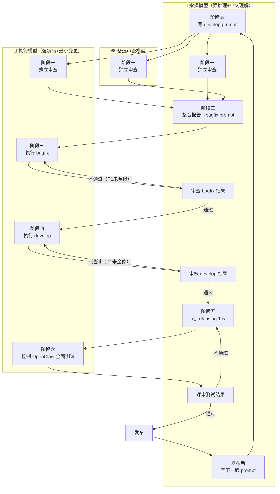

# sofagent 开发本体模型（Development Ontology）

> 本文件描述 sofagent 项目自身的开发维护流程——人、工具、项目三者如何协作完成版本迭代。
> 这也是一次 dogfooding：用项目自己的本体建模方法论（FDE §5），给自己的开发流程建了一份模型。
>
> 作者：孔放勋 · 许可证：MIT

---

## 一、本体三元组

sofagent 的开发维护由三个维度构成——**人 + 项目 + 工具链**，三者缺一不可：

| 维度 | 说明 | 关键实体 |
|------|------|---------|
| **人** | 项目维护者，拥有最终决策权，控制发版节奏与方向 | 孔放勋 |
| **项目** | sofagent 开源项目本体——代码仓库、文档体系、发布渠道 | 13 个 npm 子包 + Skill 分发 + 文档体系 |
| **工具链** | 支撑开发迭代的多模型协作工具与自动化脚本 | 指挥模型（强推理+中文理解） / 执行模型（强编码+最小变更） / 备选审查模型 / 开发环境 / 自动化测试 |

三者关系简述：**人**（孔放勋）通过**工具链**（多模型 + 自动化脚本）驱动**项目**（sofagent）按照六阶段闭环持续迭代。人提供方向与决策，工具链执行编码/审查/测试，项目积累版本与文档。任何一个环节缺失——无人决策则方向失控，无工具链则效率归零，无项目则无迭代对象。

---

## 二、版本迭代闭环（核心 workflow）

sofagent 采用**六阶段版本迭代闭环**，每个版本从上一版发布后的审查开始，到下一版 develop prompt 生成为止，形成完整闭环。

### 多模型分工版本周期



### 闭环全景

```
阶段零（上一版发布后即写）
  │  指挥模型 基于下一版本开发日志编写 develop prompt
  ▼
阶段一：三模型独立审查 ────────────────────────┐
  │  指挥模型 / 执行模型 / 备选审查模型 各自独立审查上一版本  │
  ▼                                            │
阶段二：指挥模型 整合报告                            │
  │  整合三份审查 → bugfix prompt               │ 上一版本
  │  + 阶段零的 develop prompt 就绪             │ 发布后
  ▼                                            │
阶段三：bugfix 执行循环                         │
  │  执行模型 修复 → 指挥模型 审查（P1 必须全修）    │
  │  不通过 → 循环，直到通过                     │
  ▼                                            │
阶段四：develop 执行循环                        │
  │  执行模型 开发 → 指挥模型 审核（P1 必须全修）    │
  │  不通过 → 循环，直到通过                     │
  ▼                                            │
阶段五：指挥模型 走 releasing 阶段 1-5              │
  │  审查→开发→自测（D3 闸门）→代码审核         │
  │  →审查体系合并更新                           │
  ▼                                            │
阶段六：执行模型 控制 OpenClaw 全面测试 ────────┘
  │  新 session，执行模型 控制 OpenClaw 跑：
  │  acceptance-test + regression-checklist
  │  + 覆盖率交叉检查
  │
  ├── 指挥模型 评审通过 → releasing 剩余阶段（7-12）
  │   → 最终确认 → 文档收尾 → 脚本检查
  │   → 确认关口 → 发布 → 发布后
  │
  └── 指挥模型 评审不通过 → 回阶段五（最多 2 轮）

发布后：指挥模型 写下一版 develop prompt → 闭环回到阶段零
```

### 六阶段详细说明

#### 阶段零：develop prompt 准备

| 属性 | 说明 |
|------|------|
| **时机** | 上一版本发布后即写 |
| **执行者** | 指挥模型 |
| **输入** | `docs/changelog/vX.Y/vX.Y.Z.md`（下一版本开发日志） |
| **输出** | develop prompt（开发本版新功能的指令） |
| **说明** | 在阶段一之前就准备好，确保三模型审查结束后可以立即进入开发 |

#### 阶段一：三模型独立审查

| 属性 | 说明 |
|------|------|
| **时机** | 上一版本发布后 |
| **执行者** | 三个独立模型各自审查 |
| **输入** | 上一版本已发布代码 + 发布后审查报告 |
| **输出** | 三份独立审查报告 |

开三个独立 session，各自审查上一版本：

| Session | 模型 | 角色 | 说明 |
|---------|------|------|------|
| A | 指挥模型 | 主审查官 | 第一视角审查 |
| B | 执行模型 | 执行者兼审查 | 第二独立视角审查 |
| C | 备选审查模型 | 备选审查 | 免费，第三独立视角审查 |

#### 阶段二：指挥模型 整合报告

| 属性 | 说明 |
|------|------|
| **执行者** | 指挥模型 |
| **输入** | 三份独立审查报告 + 阶段零的 develop prompt |
| **输出** | ① bugfix prompt（修上一版的问题）② develop prompt（开发本版新功能） |

指挥模型 的整合顺序：
1. 先将自己的审查结果整理成 bugfix prompt
2. 再吸收 执行模型 的审查报告，整合进 bugfix prompt
3. 备选审查模型 的审查作为补充视角参考

#### 阶段三：bugfix 执行循环

| 属性 | 说明 |
|------|------|
| **执行者** | 执行模型（执行）+ 指挥模型（审查） |
| **审查标准** | P0/P1/P2 三级分级，**P1 问题必须全部修复才算通过** |
| **循环机制** | 不通过 → 执行模型 再修 → 指挥模型 再审 → 直到通过 |

#### 阶段四：develop 执行循环

| 属性 | 说明 |
|------|------|
| **执行者** | 执行模型（执行）+ 指挥模型（审核） |
| **审查标准** | P0/P1/P2 三级分级，**P1 必须全修** |
| **循环机制** | 不通过 → 执行模型 再开发 → 指挥模型 再审 → 直到通过 |

#### 阶段五：指挥模型 走 releasing 阶段 1-5

| 属性 | 说明 |
|------|------|
| **执行者** | 指挥模型 |
| **依据** | `docs/changelog/releasing.md` 十一阶段发版 SOP |

按 releasing SOP 走前五个阶段：

| 阶段 | 名称 | 关键动作 |
|------|------|---------|
| 阶段一 | 审查 | 问题收敛，产出 P0/P1/P2 清单 |
| 阶段二 | 开发 + 基础自测 | 按优先级分批开发，收尾跑基础自测 |
| 阶段三 | 质量循环 | **D3 闸门**：`acceptance-test.sh` 必须补齐新场景 |
| 阶段四 | 审查体系合并更新 | regression-checklist 加法 + fresh-eyes-review 校准 + acceptance-test 自动化 + 最终确认 |
| 阶段五 | 发版闸门 | release-gate-loop 必须 verdict=PASS |

#### 阶段六：执行模型 控制 OpenClaw 全面测试

| 属性 | 说明 |
|------|------|
| **执行者** | **执行模型**（控制 OpenClaw，不是指挥模型） |
| **环境** | **新开一个独立 session** |
| **检查内容** | acceptance-test + regression-checklist + 覆盖率交叉检查 |

执行模型 控制 OpenClaw 执行三组检查：
1. **端到端验收测试**：`bash playbook/acceptance-test.sh`
2. **回归检查**：逐项跑 `regression-checklist.md` 的全部维度
3. **覆盖率交叉检查**：changelog 功能点逐条对照 acceptance-test 场景

测试结果交给 指挥模型 评审：

| 评审结果 | 下一步 |
|---------|--------|
| 通过 | 继续 releasing 剩余阶段（6-11） |
| 不通过 | 回阶段四（最多 2 轮） |

#### 发布后

指挥模型 写下一版 develop prompt，闭环回到阶段零。

---

## 三、外部输入循环

版本迭代闭环之外，有一套持续进行的外部输入循环，为版本开发提供方向和素材：

```
知识库（通用知识库）
  │  收集资料、收集概念、收集迭代点
  ▼
与 AI 讨论
  │  哪个模型有 token 就用哪个讨论
  ▼
更新文档
  │  讨论后将结论更新到对应文档
  ▼
定 Roadmap 方向
  │  规划后续版本的堆叠方向
  ▼
（流入阶段零的 develop prompt）
```

| 环节 | 说明 |
|------|------|
| **知识库** | 一个通用知识库，持续收集资料、概念、迭代点。不绑定特定工具或个人习惯 |
| **与 AI 讨论** | 哪个模型有 token 就用哪个讨论，模型选择灵活 |
| **更新文档** | 讨论后将结论沉淀到对应的项目文档（FDE / DEVELOPMENT / ARCHITECTURE 等） |
| **定 Roadmap 方向** | 规划后续版本的堆叠方向，写入 `ROADMAP.md` |

> 外部输入循环是版本迭代闭环的"上游水源"——它持续滋养项目方向，最终汇入每个版本的 develop prompt。

---

## 四、多模型分工

三个模型各有明确角色定位，分工铁律不可混淆：

| 角色 | 定位 | 核心职责 | 不可越界 |
|------|------|---------|---------|
| **指挥模型** | 指挥官 / 审查官 | 写 bugfix prompt、写 develop prompt、审查 bugfix/develop 结果、走 releasing 流程（阶段 1-5）、评审阶段六测试结果、写下一版 develop prompt | 不直接执行编码/修复 |
| **执行模型** | 执行者 | 执行 bugfix prompt、执行 develop prompt、**控制 OpenClaw 做阶段六全面测试** | 不自行审查自己的执行结果 |
| **备选审查模型** | 备选审查 | 免费，作为第三独立视角参与阶段一审查 | 仅审查，不执行不决策 |

> **铁律**：指挥模型 审查、执行模型 执行、备选审查模型补充。角色不可互换——执行者不审自己的代码，审查官不亲自编码。

---

## 五、文档分级清单

项目文档按维护频率分为三层：

### L1 核心高频（每版本必更新）

| # | 文档 | 说明 |
|---|------|------|
| 1 | `docs/changelog/vX.Y/vX.Y.Z.md` | 本版本开发日志（develop prompt 输入源） |
| 2 | `CHANGELOG.md` | 根索引（纯目录，每版本一行链接） |
| 3 | `ROADMAP.md` | 版本堆叠路线图 |
| 4 | `playbook/regression-checklist.md` | 回归清单（加法更新） |
| 5 | `playbook/fresh-eyes-review.md` | 审查体系（校准更新） |
| 6 | `docs/changelog/releasing.md` | 发版 SOP |
| 7 | `README.md` | 项目首屏 |
| 8 | `playbook/acceptance-test.sh` | 验收测试脚本（每版本补场景） |
| 9 | `tools/release/bump-version.sh` | 版本号管理（13 类位置同步） |

### L2 版本跟随（有相关改动时更新）

| # | 文档 | 说明 |
|---|------|------|
| 10 | `docs/ARCHITECTURE.md` | 架构总览 |
| 11 | `docs/HANDBOOK.md` | 开发者手册 |
| 12 | `docs/DEVELOPMENT.md` | 开发指南 |
| 13 | `FDE/GUIDE.md` + `FDE/README.md` | FDE 方法论 |
| 14 | `SKILL/SKILL.md` + `SKILL/AGENTS.md` | Skill 入口 |
| 15 | `FORGE/README.md` | FORGE 说明 |
| 16 | `README.en.md` + `CONTRIBUTING.md` | 英文 / 贡献指南 |

### L3 写完基本不维护（归档 / 参考性质）

| # | 文档 | 说明 |
|---|------|------|
| 17 | `docs/archive/changelog-experimental/` | v0.71-v0.99 实验期历史（冻结） |
| 18 | `docs/archive/design/` | 旧设计文档 |
| 19 | `docs/archive/evidence/` + `docs/evidence/` | 实验证据快照（只追加） |
| 20 | `docs/PHILOSOPHY.md` + `docs/THANKS.md` + `LIMITATIONS.md` | 哲学 / 致谢 / 限制 |
| 21 | `CODE_OF_CONDUCT.md` + `SECURITY.md` + `.github/*` | 社区规范 |

---

## 六、核心测试资产

releasing 流程依赖以下核心测试资产，每个版本迭代都会更新和使用：

| 资产 | 路径 | 用途 | 更新方式 |
|------|------|------|---------|
| **回归清单** | `playbook/regression-checklist.md` | 每次发版前逐项核对，确认已修问题无回退 | 加法更新（发现新问题追加维度） |
| **验收测试脚本** | `playbook/acceptance-test.sh` | 端到端全场景自动化验收 | 每版本补场景（只增不改编号） |
| **审查体系** | `playbook/fresh-eyes-review.md` | 留白式直觉审查，凭直觉发现新问题 | 校准更新（不是加法） |
| **版本号脚本** | `tools/release/bump-version.sh` | 13 类位置版本号同步替换 | 自动化脚本，禁止手动 grep/sed |

> **防膨胀机制**：回归清单 ≤ 1000 行、验收脚本 ≤ 1500 行。每版本发版做一轮瘦身，防止验证文件膨胀失控。

### Action Type 判定标准

`actions.yml` 中每个动作的 `action_type` 反映该动作的风险等级，判定依据：

| Action Type | 含义 | 判定标准 |
|-------------|------|---------|
| **可直接建议** | 输出建议，不自动执行 | 只读/分析类操作（审查、检查、评估），产出是报告或建议 |
| **需审批** | 能生成方案但需人确认 | 会产生代码/文档变更，或决定版本方向（写 prompt、走 releasing 阶段） |
| **可执行** | 低风险、规则明确 | 执行已审批的指令（跑测试、执行已确认的 prompt） |
| **必须阻断** | 越界/高危 | 破坏性操作（删库、外部写、零覆盖阻断） |

---

## 七、如何使用这份本体

这份开发本体是 sofagent 的 dogfooding 产物——**用 sofagent 自己的 FDE §5 本体建模方法论，给 sofagent 自己的开发流程建了一份模型**。

### 给开源用户的说明

1. **理解项目如何迭代**：通过本文档了解 sofagent 的六阶段版本闭环、多模型分工、文档分级体系
2. **参考开发方法论**：如果你也在做多模型协作开发，可以参考本体的实体/动作/约束设计
3. **机器可读文件**：`objects.yml` / `actions.yml` / `constraints.yml` 可被工具消费，用于自动化理解项目结构
4. **贡献代码时的参考**：了解项目的审查标准（P1 必修）、测试要求（D3 闸门）、文档规范（三层分级），让你的贡献更容易通过审查

### 给 FDE 实践者的说明

这份本体是 FDE §5 方法论的一个完整案例：
- `objects.yml` 对应实体声明 + 关联关系
- `actions.yml` 对应 Domain / Range / Action Type 三元约束
- `constraints.yml` 对应约束规则（P0/P1/P2 分级 + 业务铁律）

你可以把它当作模板，为自己的项目建立类似的开发本体。

> **关于 `knowledge-domain` 字段**：当前所有实体的 `include` 都是 `["*"]`（全开），看起来像是形式字段。这是有意的——开发本体描述的是"一个人维护的开源项目"，人和工具之间不存在跨角色的知识隔离（不像多团队企业场景）。字段保留是为了模板完整性，方便多团队场景复用时直接收紧。
