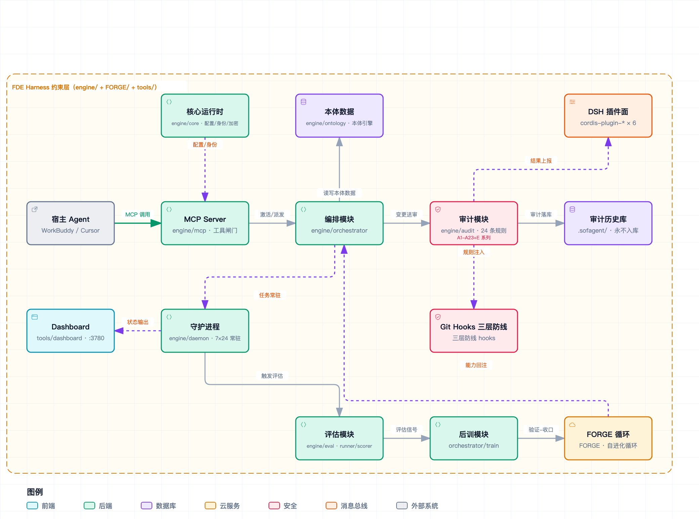
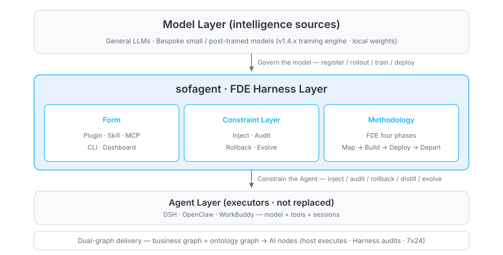
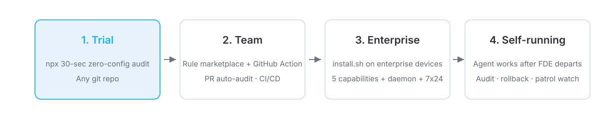

# sofagent

<p align="center">
  
</p>

<!-- H1 & banner split: the H1 is the repo name and semantic anchor (search engines / no-image environments / screen readers); the banner carries the visuals -->

<p align="center">
  <a href="https://github.com/KongFangXun/sofagent/actions/workflows/verify.yml"></a>
  <a href="./LICENSE"></a>
  <!-- ⚠️ bump version: manually sync this badge version (Version-vX.Y.Z) -->
  <a href="./CHANGELOG.md"></a>
</p>

<p align="center"><sub><a href="./README.md">简体中文</a> | English</sub></p>

---

## Table of Contents

- [What is this](#what-is-this)
- [Core Features](#core-features)
- [What is the FDE Harness](#what-is-the-fde-harness)
- [Multi-platform Mounting](#multi-platform-mounting)
- [v1.5.2: Audit · External Provability & Decision Semantics](#v152-audit--external-provability--decision-semantics--released--2026-09-24)
- [The Two FDE Harness Phases](#the-two-fde-harness-phases)
- [Installation](#installation)
- [Usage](#usage)
- [FAQ](#faq)
- [Ecosystem & Docs Index](#ecosystem--docs-index)

---

## What is this

> 💬 **One-sentence version**: on entry, it maps your business and writes it down as files; after it leaves, every time your digital employee touches code or files, it passes a security check, leaves a record, and saves a snapshot — traceable and roll-backable when things go wrong. That is what sofagent does.

> 🏢 **The organizational lens**: the bottleneck of AI adoption has shifted from "is the model smart enough" to "can the organization dare to onboard it" — does it fit the org chart, does it get an account, how is performance measured, what happens when it errs. sofagent is the onboarding system for digital employees: on entry it writes the job description into files; after departure it runs performance reviews (evidence for every change), organizational memory (compounding know-how), and fault tolerance (every mistake reversible). Install sofagent before you give AI an employee ID.

> 🧩 **The three-factor framing**: sofagent is **a S1M with a built-in Harness, delivered with the FDE playbook** — **FDEing** is the playbook layer (turning FDE from human labor into a reusable capability), **S1M** is the judgment layer (System One Model, a decision model that separates judgment from generation; its foundation is under construction across v1.6.0–v1.9.0, with the declaration landing in v2.0.0), and **harness** is the governance layer (the five constraint-layer capabilities — today's main landing points). Each layer sits in its own place; see "Core Features".

**An open-source FDE Harness layer** (FDE = Forward Deployed Engineer — see the "[What is the FDE Harness](#what-is-the-fde-harness)" section) — embedded between mature Agents (DSH / OpenClaw / WorkBuddy) and the model layer (general LLMs + bespoke post-trained models) to govern both: on entry, it writes the business judgment down as files (workflow, ontology data, AI-node deployment); after departure, it audits every change against those files. Five Harness capabilities (inject · audit · rollback · distill · evolve), five distribution forms (FDE plugins / Skill / MCP / CLI / Dashboard). sofagent does not build the Agent — it delivers the layer that keeps any Agent governed.

<p align="center">
  <br/>
  <sub>Zero-config audit in action: one command audits the latest commit; leaked secrets get blocked on the spot</sub>
</p>

<details>
<summary>🗺️ System architecture overview (FDE Harness five-module structure)</summary>

<p align="center">
  <br/>
  <sub>Constrain Agent behavior · Audit every change · Distill experience (five-module structure: governance module released in v1.5.0 · execution module planned for v1.5.4; full interactive version in <a href="./docs/ARCHITECTURE.md">ARCHITECTURE</a>)</sub>
</p>

</details>

## Should you install it?

| If you are... | Recommendation |
|---------------|----------------|
| **Adding discipline to an existing Agent** — you already run DSH / OpenClaw / WorkBuddy and want your AI to behave, leave traces, and stay roll-backable when things go wrong | ✅ **Install now**. The core value is exactly the constraint layer (inject · audit · rollback · distill · evolve) — works right after installation |
| **A one-person company / SMB landing AI** — no dedicated engineer, you need a "never-quitting FDE" to map your workflow and deploy AI nodes | ✅ **Install now**. The FDE Harness layer is built for this — the full journey from mapping to deployment to post-departure audit |
| **Looking for a turnkey enterprise Agent platform** — you expect a complete commercial product (multi-tenancy, permission management, billing, SLA) | ⏸️ **Hold off**. sofagent is an FDE Harness layer, not a platform product — platform-grade capabilities are out of this open-source repository's scope. Teams with integration capacity can still embed the constraint layer into their own platform as its governance module; if you need pure turnkey, look at platform products elsewhere |
| **Researching / curious about constraint-layer design** — reading code, studying architecture, borrowing methodology | ✅ **Install now**. Full documentation ([HANDBOOK](./docs/HANDBOOK.md) / [ARCHITECTURE](./docs/ARCHITECTURE.md) / [PHILOSOPHY](./docs/PHILOSOPHY.md)), MIT licensed |

**How does it relate to gitleaks / pre-commit?** (complementary, not substitutes)

| | gitleaks-style scanners | pre-commit hooks | sofagent |
|---|---|---|---|
| Positioning | full-history secret scanning | generic commit-hook framework | Agent behavior audit harness |
| Evidence | repo text patterns | your own scripts | git-diff hard evidence + Agent logs + decision trail |
| Coverage | secret leaks | anything (DIY) | 24 rules: secrets / scope / injection / privilege / backdoors |
| Deployment cost | Low — standalone binary, zero deps | Low — one CLI from your language ecosystem | Medium — a one-time `install.sh` on the enterprise device (you can also try it zero-config via npx first) |
| Maintenance burden | Low — rules track upstream | Medium — custom scripts are yours to maintain | Medium — rules and hooks ship with this repo, but each version needs the hook reinstalled and config re-aligned |
| Advice | a must for strict secret compliance | keep if you have one | use alongside both — focused on Agent governance |

**10-minute lightweight trial** (covers package fetch and environment checks end to end; a single engine audit itself takes ~1.1 seconds — see the measured figures below): `npx -y -p @sofagent/audit sofagent-audit` (any git repo; secret leaks blocked on the spot).

**Five-minute theatrical demo** (shipped in v1.5.1; sandboxed, zero touch on real files): `npx -y -p @sofagent/audit sofagent-audit demo` — one command runs the full five-act chain: sandbox build → injection → deliberate violation → audit interception → snapshot rollback → HMAC evidence export (`--speed fast` for a 60-second cut; artifacts land under `$SOFAGENT_DATA/demo`, never in your home directory).

## Core Features

Three layers, each in its place: the **playbook layer (FDEing)** writes judgment down on entry, the **judgment layer (S1M)** governs how judgment forms, is traced, and is evidenced, and the **governance layer (harness)** keeps judgment executing 24/7 after departure.

**Playbook layer · FDEing** (on entry · generate judgment, the FDE stage — deciding where AI belongs and what it's worth, frozen into deliverables):

- 🧭 **Map the workflow** — five-element deep-dive + three-question triage, capturing every role's process steps and pricing out what each AI node is worth
- 🤖 **Deploy AI nodes** — three-layer deliverables (documents + Skills + runtime), installed into your existing AI tools; from "you do the work" to "you delegate the work"
- 📦 **Judgment frozen into deliverables** — every node carries "what counts as done (merge_criteria) · who signs off (approver)", machine-checkable and shared across both stages

**Judgment layer · S1M** (System One Model — a decision model that separates judgment from generation; **its foundation is scheduled for construction across v1.6.0–v1.9.0 and its declaration for v2.0.0 — not yet shipped**. What ships today in this layer is the existing judgment-and-evidence surface):

- 🔎 **Judgment trail** — decision-log causal chains record every accountable decision (who signed off, on what basis, why), consumed by auto-PR explanation blocks and the daemon weekly digest
- 🔗 **Judgment made provable** — the audit history lands on an HMAC chain; `--verify-chain` recomputes chain integrity offline, so conclusions can be re-checked by a third party

**Governance layer · harness** (after departure · retain judgment, the Harness stage — executing against the deliverables 24/7, writing back as it evolves):

- 🏠 **Stay resident after departure** — the FDE capability remains for inspection, audit, and optimization, 7×24 online guardian (audit triggers on commit); the human leaves, governance doesn't
- 🔍 **Zero-setup audit** — `npx -y -p @sofagent/audit sofagent-audit`, auditing the latest commit of any git repo in seconds (single-machine measured: quick ~1.1s, 50k-line diff ~6.1s; see [HANDBOOK](./docs/HANDBOOK.md))
- 🧱 **24 audit rules + 107 MCP tools** — secret leaks, out-of-scope edits, injection defense, privilege red lines; judged on two evidence tiers: 19 of the 24 rules run on git-diff hard evidence (effective locally), 4 hybrid (diff + Agent logs, active once an Agent is connected), 1 filesystem scan; log-based rules such as A7/A8 are skipped when no Agent logs exist, violations blocked on the spot (once a critical-layer rule hits, remaining rules are skipped — fail-fast design); evidence is based on local diffs — trust boundaries and known bypass surfaces in [LIMITATIONS §3](./docs/LIMITATIONS.md) (quick runs 17 by default; full 24 = 17 default + 7 extensions)
- 🛡️ **Automatic snapshot rollback** — auto-archived after every audit, one-click restore to any snapshot when something breaks

## What is the FDE Harness

**FDE = Forward Deployed Engineer** — the person who embeds models into real enterprise operations. sofagent turns this role into an open-source FDE Harness layer, sitting between the Agents you already have (DSH / OpenClaw / WorkBuddy) and the model layer. A full FDE workflow has two stages, **sewn together by the deliverables handed over in between**:

- **On entry · generate judgment**: four steps — **map the workflow → build dual graphs → qualify AI nodes → deploy**. Dual graphs = business graph (system boundaries, data flows; read by humans) + ontology graph (shared semantic foundation; read by AI), turning the enterprise into a machine-readable structure; for every AI node, "what counts as done (merge_criteria) · who signs off (approver) · when it runs (trigger)" is judged here and frozen into the deliverables (workflow.yml + ontology + skills).
- **After departure · retain judgment**: the FDE leaves, the judgment stays — audit triggers automatically on change events (commits) against the frozen criteria, 24 rules judging on git-diff hard evidence; daemon inspects 7×24, snapshots roll back, experience distills back. The human leaves, governance doesn't.

> 🔗 **Why they must be one thing**: the deliverables are a living state shared by both stages — written on entry, read during execution, written back during evolution (trial branches promoted to baseline, reflections distilled back). Without FDE, the constraint layer has no criteria to enforce; without the constraint layer, FDE judgment evaporates the moment the engineer leaves. That is where the name "FDE Harness" comes from — not a bundle of an FDE feature and a Harness feature, but two stages of one job.
>
> **From FDE to FDEing — everything can be FDEing**: the combined effect of the two stages is turning Forward Deployed **Engineer** (a job title) into Forward Deployed **Engineering** (a capability) — the person moves on, the capability stays with the deliverables. **FDEing is short for Forward Deployed Engineering** (pronounced /ef-di-i-ing/) — as a noun it names that capability, as a verb it means turning FDE labor into it.
>
> - **FDE is the noun; FDEing is the verb** — turning FDE from human labor into an auto-executable capability (playbook × judgment × governance): less human labor, more capability delivered.
> - **Not limited to software** — any business object, process, or node can be FDEing'd through "map → judge → deliver → sustain"; hardware nodes and robot motion are workflows too — the difference lies in the actuator, not the governance.
> - **It is also a mindset** — before doing anything, think: ① how to structure the workflow; ② which nodes are AI nodes; ③ how AI can best help you get it done (see [PHILOSOPHY](./docs/PHILOSOPHY.md)).

<p align="center"></p>

**Why the FDE Harness**

- **The bottleneck for enterprise AI is deployment, not the model** — mapping workflows, drawing system boundaries, and setting data rules is precisely the FDE's job. MIT NANDA's *The GenAI Divide*: 95% of enterprise GenAI projects failed to produce value worth a financial statement, while FDE job postings surged 729% in a year (verification in [VALIDATION](./docs/VALIDATION.md))
- **Completeness comes from the union** — DSH solves "can work"; sofagent solves "keeps working"; only together do they make a complete FDE Harness (next chapter)
- **"Continuous optimization" only holds with a constraint layer** — backed by auditable, rollback-capable mechanisms, not promises in prompts. Independent external experiment (ARC-AGI-3, **capability-harness data** — it lifts task scores and token efficiency, a different dimension from the reliability gains of a governance constraint layer): optimizing only the outer Harness around the same model significantly lifts task completion. Verification in [VALIDATION](./docs/VALIDATION.md) · [THANKS](./docs/THANKS.md) (write-surface audit coverage: the weight and skill surfaces have shipped; the prompt / memory surfaces are scheduled for v1.5.9)
- **Capabilities are portable, never dead-bound to a platform** — the constraint layer is platform-agnostic; the methodology follows the business, not the platform

> 🔄 **Self-bootstrapping**: sofagent's first FDE engagement is sofagent itself — the project is a complete FDE workflow (map → build → deploy → depart), and this open-source repository is that deliverable.

## Multi-platform Mounting

Sits between the Agents you already use and the model layer — it doesn't replace the model, only adds reliable execution. **The FDE Harness layer is platform-agnostic** (five forms — plugin / Skill / MCP / CLI / Dashboard — distributed by host capability); the methodology follows the business, not the platform:

| Tier | Platform | Constraint injection | Mounting method |
|------|----------|---------------------|-----------------|
| **Deep integration** | DeepSeek Harness | ✅ **Per-tool-call interception** | 6 atomic `cordis-plugin-sofagent-*` mounted into the runtime (1 optional aggregate plugin also available; see "Upstream & plugin entries" below) — 7 lifecycle events incl. `tools/pre-execute` (per the vocabulary table in `engine/dsh-plugins/SEAMS.md`) |
| **Full mounting** | OpenClaw | ✅ **Once per session** | Hook-injected four-layer constraints + circuit breaker + 4 OpenClaw plugins |
| **Standard mounting** | Claude Code / Cursor | ⚠️ Skill self-load | Skills-directory symlink + platform rule file + interception config (content = commit-level 24 rules, not call-level interception) |
| **Thin mounting** | WorkBuddy / Codex / Gemini CLI / Hermes | ⚠️ Skill self-load | Skills-directory symlink (Codex uses the `AGENTS.md` mount point) + git-hook audit |

- **Never assume capability parity — tiers differ in injection strength, not in "supported or not"** — DSH intercepts per tool call, OpenClaw injects once per session, and on every other host constraints ride along as Skill text the Agent reads on its own (advisory). "Supports platform X" means the constraint assets work there; it does **not** mean constraint strength matches other platforms. Before migrating hosts or writing integration docs, check which tier the target host falls into — full matrix in the [load-chain HOOK](./engine/hooks/sofagent-load-chain/HOOK.md)
- **Audit fallback is platform-agnostic** — `sofagent-audit --install-hook` runs as a git hook; at every tier, every commit is audited automatically (audits with the 17 default rules out of the box; the full 24 require enabling `extendedRulesEnabled: true` in `.sofagent/config.yml`), violations hard-blocked. Constraints are advisory; auditing is mandatory

One command selects your mounting tier: `bash install.sh --platform <platform-name>` (all platforms and differences in [HANDBOOK](./docs/HANDBOOK.md))

## v1.5.2: Audit · External Provability & Decision Semantics (✅ Released · 2026-09-24)

🔍 **The audit module goes externally provable** — three things at once:

| Capability | In one line |
|------|--------|
| **Audit data outside** | Read-only MCP `audit_query` (filter by time / rule / exitCode, byte-level read-only invariant) + audit event subscription push |
| **Ruleset export + standalone verification** | `ruleset_export` machine-readable JSON, round-trip reversible (24-rule metadata + version fingerprint); `verify-chain` zero-dependency verifier — third parties can validate HMAC chains without installing sofagent |
| **Decision semantics on both ends** | A five-question should-run gate before work starts (health / human-gate / evidence / focus / quota — suspend-not-fail with auto-resume) + conclusion invalidation semantics (three triggers mark stale conclusions so they stop feeding downstream) |

Also in this release: egress governance (default-deny host allowlist + outbound adjudication HMAC-chained) · pre-authorization mandate loop (scope/expiry/approver, rejected before execution) · identity three-layer narrative injection (bilingual README) · DSH plugin npm debut surface (kit + seven `cordis-plugin-sofagent-*`) · v1.5.2 post-release review fix batch (35 items incl. six fail-open closures). **Tests 5083 → 5296 · acceptance 367 → 373 · 85 regression dimensions · MCP 105→107** (13-package workspace count, as of release). Full details in the [devlog](./docs/changelog/v1.5/v1.5.2.md) · earlier versions in [CHANGELOG](./CHANGELOG.md).

## The Two FDE Harness Phases

**On entry · generate judgment** (FDE phase): map workflows (five-element deep-dive + three-question test — price every AI node) → build the dual graphs (business graph for humans + ontology for AI) → decide AI nodes → deploy three-layer deliverables. Each node carries "done criteria (merge_criteria) · who approves (approver) · when it runs (trigger)", frozen into the deliverable.

**After departure · retain judgment** (Harness phase): the FDE leaves, the judgment remains — daemon patrols 24/7, every commit triggers the 24 audit rules (including **AgentShield static scanning across five config surfaces**), snapshots are rollback-ready, experience keeps accumulating; evolution writes promotion and distilled reflection back into the deliverable.

**The organizational-management lens** — the two phases map onto onboarding a digital employee:

| Organizational act | sofagent equivalent |
|--------------------|---------------------|
| Job description | Frozen deliverables from the entry phase (merge_criteria / approver / trigger) |
| Performance review | Audit evidence + governance KPI dashboard (v1.5.0) |
| Organizational memory | Knowledge distillation (think.md reflection + knowledge/) |
| Training pipeline | Experience → exam → promotion self-evolution chain (scheduled v1.5.8) |
| Fault tolerance | Snapshot rollback + capability baseline timeline (scheduled v1.5.9) |
| Employment contract boundary | Pluggable contracts & core capability registry (scheduled v1.5.7) |

| Go deeper | Where |
|--------|--------|
| Four-phase twelve-step methodology (half-day read) | [FDE/GUIDE.md](./FDE/GUIDE.md) |
| Constraint layer's five capabilities · module layout | [ARCHITECTURE](./docs/ARCHITECTURE.md) |
| Why they must be one · design no-go zones | [PHILOSOPHY](./docs/PHILOSOPHY.md) |
| Skill system & knowledge pipeline | [FDE/Skill system](./FDE/README.md) |

## Installation

**Release stage (read before installing)**: sofagent is in its **Alpha construction period** (**v1.x**) — the feature surface moves fast and **no interface stability is promised**; read the [CHANGELOG](./CHANGELOG.md) before upgrading across versions. From **v2.0.0** on it enters the **Beta stage**.

The matching npm release-channel policy: **construction-period versions are published to the `latest` dist-tag as usual** — `npx @sofagent/audit` pulls the current latest by default, no dist-tag needed. Measured on 2026-09-24: `npm view @sofagent/audit dist-tags` → `{ latest: '1.5.1' }` (this value updates after v1.5.2 ships — treat a live run as authoritative). **After v2.0.0 ships, `latest` points to 2.0**.

> ⚠️ **Enterprise users read first** [LIMITATIONS §3](./docs/LIMITATIONS.md) — `config.yml` is **non-fail-closed by default** (rules can be bypassed by Agent tampering), and **write-side** multi-tenant isolation is not yet landed (v0 delivered query-side isolation: orgId filtering + the data/<tenant>/ path foundation — see LIMITATIONS). For strict-compliance scenarios use CI fallback + file-permission lock (`chmod 400 .sofagent/config.yml` — an auxiliary layer, ineffective against same-user processes; see [LIMITATIONS §3](./docs/LIMITATIONS.md)); do not put the single-machine default config directly into production.
>
> 🔐 **Data sovereignty**: runtime data never leaves your machine (no network access except the npm package fetch at install time); the three opt-in exits (cloud sync / model inference endpoint / cloud VM execution surface) require your explicit configuration — see [SECURITY](./SECURITY.md).

**30 seconds, zero setup** (first run includes the npx package fetch, ~30 seconds; reruns finish in seconds — the engine itself takes ~1.1s, measured basis above) — run an audit in any git repo:

```bash
npx -y -p @sofagent/audit sofagent-audit
```

> 💡 quick runs the **17 default rules** (A3 task-scope / A9 commit-msg injection detection active — quick mode auto-reads the latest commit message; when no message is available, A9 is handled by the engine as no-input and marked skipped). `--init` installs the hook (still the same 17 default rules); the full 24 additionally require `extendedRulesEnabled: true` in `.sofagent/config.yml` — see [LIMITATIONS §3](./docs/LIMITATIONS.md).

> ⚠️ This step is a **one-off audit** (inside a single process) — it does not install a git hook, so later commits will not be auto-blocked. For continuous protection run `sofagent-audit --init` (see Full install below).

Here's what it looks like when a known-format secret leak is blocked (real output; A2 detects AWS AKIA/Secret, OpenAI sk-*, GitHub ghp_, Google AIza, Slack xox*-, JWT, PEM private keys and other known formats — generic secret shapes are intentionally out of scope, a conservative design against false positives, see [LIMITATIONS §3 A2](./docs/LIMITATIONS.md#%E4%B8%89%E5%AE%89%E5%85%A8%E4%B8%8E%E4%BF%A1%E4%BB%BB%E6%A8%A1%E5%9E%8B%E5%B1%80%E9%99%90)). This is exactly the scenario shown in the screenshot above (first screen); not repeated here.

**Full install** (Node.js ≥ 18, download and review before running) — **installed on the enterprise devices running the AI nodes**:

```bash
curl -fsSL https://raw.githubusercontent.com/KongFangXun/sofagent/refs/tags/v1.5.1/bootstrap.sh -o bootstrap.sh
less bootstrap.sh          # review the script first, confirm it's safe
bash bootstrap.sh && rm bootstrap.sh
```

> 🔒 Supply-chain trust: tag pinning + sha256 verification + fail-closed + self-anchored hash re-verification (see [SECURITY.md](SECURITY.md), remote-install section); ⚠️ audit logs are plaintext on disk by default — enterprise deployments should enable encryption-at-rest.

```bash
sofagent-audit --init      # install the git hook — every commit is audited from now on
sofagent-audit --doctor    # verify the environment (optional)
```

> 🔧 **First `--doctor` on a fresh machine reports "no dist baseline"?** Run `sofagent-audit --doctor --baseline` to establish it (the trust anchor = the moment you confirm the dist is trustworthy — never auto-recorded, to defend against shadow-auditor hijacking).


> 💡 The install scripts mainly write to `~/.sofagent/` (data directory) + `~/.local/bin` (CLI entry); when OpenClaw is detected they additionally write into its integration directory; if npm permissions are insufficient, the CLI entry falls back to `/usr/local/bin`. No other system files are touched. `--init` installs the three-layer git hook defense (pre-commit blocks `.sofagent/` from entering the repo + commit-msg rule audit + post-commit reconciliation). `--no-verify` can skip **both pre-commit and commit-msg** (the first two layers); **post-commit reconciliation is unaffected** (the git-native switch does not apply to post-commit) — it guards against honest Agents' carelessness, not malicious bypass; skipped commits are reconciled afterwards by the post-commit hook (flagged "suspected bypass") but not blocked. Personal fallbacks: CI-side `sofagent-audit --diff`, periodic `--doctor`, and reviewing the audit records. See [LIMITATIONS](./docs/LIMITATIONS.md).
>
> 📌 **install.sh is the enterprise device installer** — install it on the enterprise devices running the AI nodes (constraint-layer engine + daemon inspection + single-machine dashboard); FDEs do not need to run it on their own machines — the FDE's tools are the [FDE Skill](https://clawhub.ai/kongfangxun/skills/sofagent) (methodology). See [deployment architecture](./docs/ARCHITECTURE.md#%E5%AE%89%E8%A3%85%E5%8C%85%E8%BE%B9%E7%95%8C%E4%B8%8E%E9%83%A8%E7%BD%B2%E6%9E%B6%E6%9E%84v132-%E5%AE%9A%E4%BD%8D%E6%A0%A1%E5%87%86).
>
> 📌 **How bootstrap.sh and install.sh relate**: bootstrap.sh is a one-line download wrapper around install.sh — `curl bootstrap.sh | bash` is equivalent to "download install.sh + run install.sh". Both scripts install exactly the same thing; bootstrap just saves you the manual clone/download step.

**To uninstall**: `bash engine/scripts/uninstall.sh` — removes the Skill/constitution files, hook registrations and the three git hooks (`pre-commit` / `commit-msg` / `post-commit`), while keeping your `~/.sofagent/` data. Full install options (clone install / full npx install / minimal install / enterprise deployment), uninstall, and how to tell the two channels both named `sofagent` apart (npm bare-name umbrella `sofagent` = sub-package forwarder, see the package-name warning in Usage; the install.sh state exposes `status` / `web` / `dashboard`) → [HANDBOOK · Installation](./docs/HANDBOOK.md). Enterprise users who just want the FDE methodology for mapping business workflows, see [FDE/README.md](./FDE/README.md) (zero dependencies, no Node.js needed; for the 15-minute shortest path see its "15-minute shortest path" section).

## Usage

<p align="center"><br/><sub>Dashboard cockpit (single-file HTML · screenshot shows v1.4.0): rule pass rate, audit tasks, violation trends — see at a glance what the AI is doing.<br>(See CHANGELOG for UI evolution; the installed UI is the source of truth.)</sub></p>

> 📊 **The Dashboard has three entries, each in its place**:
>
> | Entry | Command | Form | Who it's for |
> |------|------|------|--------|
> | **Terminal** | `sofagent-dashboard --full` | Terminal ASCII three-pane (zero frontend dependencies) | Developers / FDE quick check |
> | **Web** | `sofagent web` (available in the install.sh-installed state) · repo-mode `node tools/dashboard/serve-dashboard.mjs` | Browser visualization (localhost:3780) | Boss / IT visual review |
> | **macOS double-click** | Double-click `start-dashboard.command` | macOS shortcut to the Web version (macOS double-click entry only) | macOS users |

> 👁️ **Agent's view**: with hooks installed, every commit triggers an audit — PASS prints a short echo then passes (auto-snapshot), violations are printed directly into the terminal output and pushed via Webhook / IM per config; there is no separate GUI on the Agent side (see [PHILOSOPHY §2](./docs/PHILOSOPHY.md#%E7%B3%BB%E7%BB%9F%E6%9A%B4%E9%9C%B2%E7%9A%84%E8%83%BD%E5%8A%9Bagent-%E8%A7%86%E8%A7%92)).

<p align="center"></p>

| Entry | What it does | Where installed | Time needed |
|------|--------|--------|:----:|
| **`npx -y -p @sofagent/audit sofagent-audit`** | Zero-setup audit of the last commit, results in seconds (first npx ~30s) | Any git repo (temporary) | 30 sec |
| **`--ruleset` rule marketplace** | Load rulesets like security, or custom JSON rules | Same as above | 1 min |
| **GitHub Action** | Auto-audit every PR, violations annotated on the diff lines | CI/CD | Set up once |
| **install.sh full suite** | inject · audit · rollback · distill · evolve + daemon inspection + dashboard — the Agent's complete constraint layer | **Enterprise device** (server/computer running the AI nodes) | FDE residency |

> ⚠️ **Do not bare-install either bare name** — both look like "sofagent itself", neither is the CLI:
>
> - **`npm i sofagent-audit`**: the bare-name package `sofagent-audit` on npm is **this project's legacy proxy package** (deprecated; it lags far behind the main package).
> - **`npm i sofagent`**: the bare-name umbrella `sofagent` (`engine/umbrella/`, forwarding to the audit / mcp / orchestrator / daemon sub-packages) pulls a **dependency tree of 604 packages**, 5 of which carry native modules and install scripts (`node-pty` / `koffi` / `@google/genai` / `protobufjs` / `@deepseek-ai/dsh-subprocess-local`) — new npm versions do not run unreviewed install scripts, so those native builds / postinstalls are **silently skipped**. If you only want the CLI, do not install it.
>
> The official CLI package is the scoped `@sofagent/audit` — install the CLI via bootstrap.sh / install.sh / `@sofagent/audit` only.

**Rule marketplace** — community rulesets are published as `sofagent-ruleset-*` npm packages and loaded manually via `--ruleset-path` (which also accepts your own JSON rules):

```bash
npx -y -p @sofagent/audit sofagent-audit --list-rulesets      # see available rulesets
npx -y -p @sofagent/audit sofagent-audit --ruleset security   # load the security ruleset
```

**FDE on-site deployment** — pick either of two paths:

- **Methodology path** (zero dependencies): read [FDE/GUIDE.md](./FDE/GUIDE.md) and map business workflows manually following the handbook — Excel + your own brain is enough
- **Tooling path** (Node.js ≥ 18): after the FDE installs the constraint layer on the enterprise device via install.sh, tell your own AI tool "run an FDE diagnosis for me" — the Agent guides you from entry onward

## FAQ

- **Is it production-ready?** Currently single-machine, single-user (tenancy on the [ROADMAP](./docs/ROADMAP.md); encryption-at-rest and boundaries in [LIMITATIONS](./docs/LIMITATIONS.md) — read [SECURITY](./SECURITY.md) before enterprise deployment).
- **Does it collect my data?** Fully local by default. Optional federation queries leave your machine only when you configure them yourself (see SECURITY).

## Ecosystem & Docs Index

> 🌏 Note: the linked docs (LIMITATIONS / ARCHITECTURE / PHILOSOPHY / WIKI / SECURITY …) are Chinese-first — English readers can rely on this README plus the EN summary at the top of [WIKI](./docs/WIKI.md); full doc translation is tracked in issue #8.

**Featured in** (community listings, incl. pending PRs):

[](https://glama.ai/mcp/servers/KongFangXun/sofagent)
[](https://github.com/awesome-dsh-plugin/awesome-dsh-plugin)
[](https://github.com/Jenqyang/Awesome-AI-Agents)
[](https://github.com/AdamPlatin123/dsh-plugin-radar/blob/main/PLUGINS.md)
[](https://github.com/0xsline/awesome-deepseek-harness)
[](https://github.com/punkpeye/awesome-mcp-servers)
[](https://github.com/ai-boost/awesome-harness-engineering/pull/227)
[](https://github.com/e2b-dev/awesome-ai-agents/pull/1471)

**Upstream & plugin entries**:

- DeepSeek Harness (upstream repository): <https://github.com/deepseek-ai/deepseek-harness>
- Cordis runtime: <https://github.com/cordiverse/cordis>
- 7 `cordis-plugin-sofagent*` plugin sources (6 atomic + 1 aggregate): [`engine/dsh-plugins/`](./engine/dsh-plugins/)

| What you want to know | Where |
|:---------|:--------|
| **Full doc index** (by intent) | [WIKI](./docs/WIKI.md) |
| Install, use, troubleshoot | [HANDBOOK](./docs/HANDBOOK.md) |
| Architecture & the 24 rules | [ARCHITECTURE](./docs/ARCHITECTURE.md) |
| What each release did | [CHANGELOG](./CHANGELOG.md) |
| Security statement · known limits | [SECURITY](./SECURITY.md) · [LIMITATIONS](./docs/LIMITATIONS.md) |

> 🧪 **Engineering credibility** (current): 5296 tests / 13 module packages + 11 plugins (7 DSH + 4 OpenClaw) · 24 audit rules · fresh-eyes independent review continuously running.
> **Package-count standard** (disambiguation): workspace 27 = 13 module packages + load-chain + dsh-plugin-kit + umbrella + 7 DSH plugins + 4 OpenClaw plugins (see [WIKI §6](./docs/WIKI.md#六当前状态)); the **test-count standard** = 13 module packages (25 workspaces bear a test script; plugin packages, the load-chain utility package and dsh-plugin-kit are outside this counting standard) — they are not the same set.
> There are two test-count figures: the **release-time value** (the `4805 → 4903` delta account — see each version's section) and the **current measured value** (the value in the engineering-credibility line above, rolling forward with fix batches); the current authoritative value is whatever `tools/check/check-test-count.sh` reports (`test-count.sh` produces the SSOT count, `check-test-count.sh` verifies doc-claimed figures for consistency) — counting standard in [WIKI package-count definition](./docs/WIKI.md#六当前状态). Review-environment notes in [docs/guides/review-system.md](./docs/guides/review-system.md); performance figures are single-machine reference values.

---

<p align="center">
  Issues and PRs welcome, especially the nitpicky kind · <a href="./CONTRIBUTING.md">Contributing</a> · <a href="./docs/THANKS.md">Thanks</a><br/>
  <sub>Everything can be FDEing — turning FDE labor into FDEing capability · coined by sofagent</sub><br/>
  <sub>MIT License © <a href="https://github.com/KongFangXun/sofagent">Kong Fangxun</a> · <a href="https://github.com/KongFangXun/sofagent">⭐ If sofagent helps you, star it and help more people find it</a></sub>
</p>
