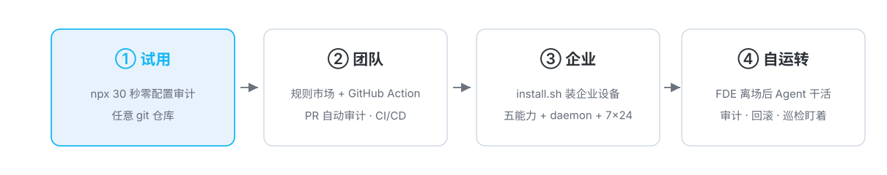

# sofagent

<p align="center"></p>

<!-- H1 与横幅分工：H1 是仓库名与语义锚点（供搜索引擎/无图环境/screen reader），横幅承载视觉 -->

<p align="center">
  <a href="https://github.com/KongFangXun/sofagent/actions/workflows/verify.yml"></a>
  <a href="./LICENSE"></a>
  <!-- ⚠️ bump 版本时手动同步此 badges 版本号（Version-vX.Y.Z） -->
  <a href="./CHANGELOG.md"></a>
</p>

<p align="center"><sub>简体中文 | <a href="./README.en.md">English</a></sub></p>

---

## 目录

- [这是什么](#这是什么)
- [核心特性](#核心特性)
- [什么是 FDE Harness](#什么是-fde-harness)
- [多平台挂载](#多平台挂载)
- [v1.5.1：编排模块 · 事件驱动](#v151编排模块--事件驱动-已发版--2026-09-22)
- [FDE Harness 两阶段](#fde-harness-两阶段)
- [安装](#安装)
- [使用](#使用)
- [常见问题](#常见问题)
- [生态与文档索引](#生态与文档索引)

---

## 这是什么

> 💬 **一句话版本**：进场时它替你把业务摸清、写成文件；离场后你的数字员工每次改代码、动文件，都按文件过一道安检、留一份记录、存一个快照——出事能查、能回滚。

> 🏢 **组织视角版本**：AI 落地的卡点已经从「模型够不够聪明」迁移到「组织敢不敢接」——能不能进组织架构、有没有账号、绩效怎么算、做错了怎么退回。sofagent 就是给数字员工办入职的那套制度：进场把岗位职责写成文件（岗位职责说明书），离场按文件做绩效考核（每次变更留证据）、组织记忆（越干越有的家底）、试错容错（做错了退得回）。给 AI 发工号之前，先装 sofagent。

**开源 FDE Harness 层**——嵌在成熟 Agent（DSH / OpenClaw / WorkBuddy）与模型层之间做治理：进场把业务判断写成文件（工作流、本体数据、AI 节点部署），离场按文件审计每一次变更。约束层五种能力（注入 · 审计 · 回溯 · 沉淀 · 进化），五种形态分发（FDE 插件 / Skill / MCP / CLI / Dashboard）。sofagent 不造 Agent——交付的是让任何 Agent 被管住的那一层。

<p align="center">
  <br/>
  <sub>零配置审计实拍：一行命令审计最近一次 commit，密钥泄漏当场拦截</sub>
</p>

<details>
<summary>🗺️ 系统架构总览（FDE Harness 五模块编制）</summary>

<p align="center">
  <br/>
  <sub>约束 Agent 行为 · 审计每次变更 · 沉淀经验（五模块编制：治理模块 v1.5.0 已发版 · 执行模块规划中（v1.5.3）；完整交互版见 <a href="./docs/ARCHITECTURE.md">ARCHITECTURE</a>）</sub>
</p>

</details>

**10 分钟轻量试用**（含拉包与环境检查的完整走查；单次引擎审计本身约 1.1 秒，实测口径见下）：`npx -y -p @sofagent/audit sofagent-audit`（任意 git 仓库，密钥泄漏当场拦截）。

**五分钟戏剧演示**（v1.5.1 已交付，沙箱隔离、真实文件零接触）：`npx -y -p @sofagent/audit sofagent-audit demo`——一条命令跑完「沙箱构建 → 注入 → 故意违规 → 审计拦截 → 快照回滚 → HMAC 举证导出」五幕完整链路（`--speed fast` 60 秒精简版；产物落 `$SOFAGENT_DATA/demo`，不写用户家目录）。

### 该不该装？

| 如果你是… | 建议 |
|----------|------|
| **给现有 Agent 加纪律**——已有 DSH / OpenClaw / WorkBuddy，想让 AI 干活时守规矩、留痕、出事能回溯 | ✅ **现在装**。核心价值就是约束层（注入 · 审计 · 回溯 · 沉淀 · 进化），装完即用 |
| **一人公司 / 小企业想落地 AI**——没有专职工程师，需要一个"不离职的 FDE"帮你梳理工作流、部署 AI 节点 | ✅ **现在装**。FDE Harness 层就是干这个的——进场把判断写成文件，离场按文件执行与审计，全链路 |
| **要开箱即用的企业级 Agent 平台**——期待完整商业产品（多租户、权限管理、计费、SLA） | ⏸️ **暂缓**。sofagent 是 FDE Harness 层，不是平台产品——平台级能力不在本开源仓库范围内。有集成能力的团队仍可把约束层接入自有平台，作为其中的治理模块；纯开箱需求建议另选平台产品 |
| **纯研究 / 想看看约束层怎么设计**——读代码、学架构、借鉴方法论 | ✅ **现在装**。文档齐全（[HANDBOOK](./docs/HANDBOOK.md) / [ARCHITECTURE](./docs/ARCHITECTURE.md) / [PHILOSOPHY](./docs/PHILOSOPHY.md)），MIT 协议 |

**和 gitleaks / pre-commit 这类工具什么关系？**（互补不互替）

| | gitleaks 等扫描器 | pre-commit 等钩子 | sofagent |
|---|---|---|---|
| 定位 | 密钥全量历史扫描 | 通用提交钩子框架 | Agent 行为审计约束层 |
| 证据面 | 仓库文本模式 | 自定义脚本 | git diff 硬证据 + Agent 日志 + 决策留痕 |
| 覆盖维度 | 密钥泄漏 | 任意（自己写） | 24 条规则：密钥/越界/注入/权限/后门 |
| 部署成本 | 低——单二进制，零依赖 | 低——随语言生态装一个 CLI | 中——企业设备需一次 `install.sh` 装约束层（也可先用 npx 零配置试用） |
| 维护负担 | 低——规则随上游更新 | 中——自定义脚本需自己维护 | 中——规则与 hook 随本仓升级，但每版需重装 hook 并对齐配置 |
| 建议 | 强密钥合规必配 | 已有体系可保留 | 与前两者并用，专注 Agent 治理维度 |

## 核心特性

**进场 · 生成判断**（FDE 相位——把「该不该上 AI、值多少钱」判断出来，冻结成交付物）：

- 🧭 **梳理工作流**——五要素深挖 + 三问判定法，把每个岗位环节摸清，算清每个 AI 节点值多少钱
- 🤖 **部署 AI 节点**——三层交付物（文档层 + Skill 层 + 运行层），装进你已有的 AI 工具，从"你干活"变"你派活"
- 📦 **判断冻结成交付物**——每个节点带「做好标准（merge_criteria）· 谁拍板（approver）」，机器可判定、跨阶段共享

**离场 · 驻留判断**（Harness 相位——按交付物 7×24 执行，进化时写回）：

- 🏠 **离场后常驻**——FDE 能力留下巡检、审计、优化，7×24 在线守护（commit 时触发审计），人离场治理不离开
- 🔍 **零配置审计**——`npx -y -p @sofagent/audit sofagent-audit`，任何 git 仓库秒级审计最近一次 commit（单机实测：quick 约 1.1s、5 万行 diff 约 6.1s，口径见 [HANDBOOK](./docs/HANDBOOK.md)）
- 🧱 **24 条审计规则 + 105 个 MCP tool**——密钥泄漏、越界编辑、注入防御、权限红线，违规当场拦截（critical 层命中后其余规则跳过——fail-fast 设计）。**证据两档**：24 条中 19 条基于 git diff 硬证据（本地即生效）+ 4 条混合（diff + Agent 日志，Agent 接入后生效）+ 1 条文件系统扫描；A7/A8 等日志规则在无 Agent 日志时跳过（信任边界详见 [LIMITATIONS §三](./docs/LIMITATIONS.md#三安全与信任模型局限)）
- 🛡️ **自动快照回溯**——每次审计后自动存档，出事一键回到任意快照

## 什么是 FDE Harness

**FDE = Forward Deployed Engineer（前线部署工程师）**——把模型塞进企业真实业务里的人。sofagent 把这个角色做成开源 FDE Harness 层，嵌在你的 Agent（DSH / OpenClaw / WorkBuddy）与模型层之间。一个 FDE Harness 的完整工作流分两个阶段，**中间的交接物把它们缝成一件事**：

- **进场 · 生成判断**：四步走完——**梳理工作流 → 构建双图谱 → 判定 AI 节点 → 部署**。双图谱 = 业务图谱（系统边界、数据流向，人读）+ 本体图谱（共享语义底座，AI 读），把企业变成机器可读的结构；每个 AI 节点的「做好标准（merge_criteria）· 谁拍板（approver）· 何时跑（trigger）」在这一步被判断出来，冻结进交付物（workflow.yml + 本体数据 + skills）。
- **离场 · 驻留判断**：FDE 走，判断留下——审计在 commit 等变更事件时按冻结的标准自动触发（证据分档见「核心特性」首条）；daemon 7×24 巡检、快照可回滚、经验持续沉淀。人离场，治理不离开。

> 🔗 **为什么必须一体**：交付物是两个阶段共享的活状态——进场时写入、离场后执行时读、进化时写回（试验分支晋升基线、反思蒸馏回流）。没有 FDE，约束层没有判据可执行；没有约束层，FDE 的判断随人离场蒸发。这正是「FDE Harness」名字的由来——不是 FDE 功能 + Harness 功能的拼盘，是同一件事的两个阶段。
>
> **从 FDE 到 FDEing**：两个阶段的合成效果，是把 Forward Deployed **Engineer**（一个岗位）变成 Forward Deployed **Engineering**（一种能力）——岗位随人走，能力随交付物留。FDEing 读作 /ef-di-i-ing/，与 engineering 同构。

<p align="center"></p>

**为什么是 FDE Harness**

- **企业 AI 落地的瓶颈不是模型，是部署**——MIT NANDA《生成式人工智能的鸿沟》：95% 的企业 GenAI 项目没能产生能写进财务报表的价值，而 FDE 岗位发布量一年涨了 729%（核验见 [VALIDATION](./docs/VALIDATION.md)）
- **完整来自组合**——DSH 解决「能干活」，sofagent 解决「持续干」，两者合起来才是完整的 FDE Harness（见下一章「多平台挂载」的 DSH 档）
- **约束层「持续优化」靠机制不靠承诺**——外部独立实验（ARC-AGI-3，**能力型 harness 数据**——提升的是任务得分与 token 效率，与治理型约束层的可靠性收益非同一量纲）：同一模型仅优化外层 Harness 可显著提升任务完成率。核验见 [VALIDATION](./docs/VALIDATION.md) · [THANKS](./docs/THANKS.md)（写面审计覆盖：权重面与 skill 面已交付；prompt / memory 两面排期 v1.5.5）
- **能力可迁移，绝不绑死单一平台**——约束层平台无关，方法论跟着业务走、不跟着平台走

> 🔄 **自举**：sofagent 给自己做的第一份 FDE，就是 sofagent 自己——项目本身就是一条完整的 FDE 工作流（梳理 → 构建 → 部署 → 离场），这个开源仓库就是那份交付物。

## 多平台挂载

横跨你已有的 Agent、纵贯模型层，不替代模型，只补可靠执行——**FDE Harness 层平台无关**（插件 / Skill / MCP / CLI / Dashboard 五种形态按宿主能力分发），方法论跟着业务走，不跟着平台走：

| 档位 | 平台 | 约束注入 | 挂载方式 |
|------|------|---------|---------|
| **深度结合** | DeepSeek Harness | ✅ **逐工具调用可拦** | 6 款原子 `cordis-plugin-sofagent-*` 挂进运行时（另有 1 款聚合插件可选，见「上游与插件入口」）——`tools/pre-execute` 等 7 个生命周期事件（以 `engine/dsh-plugins/SEAMS.md` 词汇表为准） |
| **完整挂载** | OpenClaw | ✅ **每会话注入一次** | Hook 注入四层约束 + 断路器 + 4 款 OpenClaw 插件 |
| **标准挂载** | Claude Code / Cursor | ⚠️ Skill 自觉加载 | Skill 目录 symlink + 平台规则文件 + 拦截配置（内容为提交级 24 规则，非调用级拦截） |
| **薄挂载** | WorkBuddy / Codex / Gemini CLI / Hermes | ⚠️ Skill 自觉加载 | Skill 目录 symlink（Codex 走 `AGENTS.md` 挂载点）+ git hook 审计 |

- **别假设能力对齐——档位差的是注入强度，不是「有没有」**：DSH 逐工具调用可拦，OpenClaw 每会话注入一遍，其余宿主由 Agent 自觉读 Skill 文本（建议性）。「支持某平台」= 约束资产在该平台可用，**≠ 约束强度与其他平台相同**；跨宿主迁移或写集成文档前，先看目标宿主落在哪一档，完整矩阵见[加载链 HOOK](./engine/hooks/sofagent-load-chain/HOOK.md)
- **审计兜底平台无关**——`sofagent-audit --install-hook` 走 git hook，任何档位每次 commit 都自动审计（默认启用 17 条；完整 24 条需在 `.sofagent/config.yml` 显式开启 `extendedRulesEnabled: true`），违规硬拦截。约束是建议性的，审计是强制性的

一条命令选定挂载档位：`bash install.sh --platform <平台名>`（全部平台与差异见 [HANDBOOK](./docs/HANDBOOK.md)）

## v1.5.1：编排模块 · 事件驱动（✅ 已发版 · 2026-09-22）

⚡ 编排模块从「指令驱动」升级「事件驱动」——三件事一次到位：

| 能力 | 一句话 |
|------|--------|
| **业务事件触发** | 上游产出 / 邮件到达 / 表单提交 / 定时器四类事件源 + `on:` 声明式订阅 + 死信重放，事件投递全程审计留痕 |
| **理解债务应对** | auto-PR 决策解释块引 decision-log 因果链（「为什么这么做」）+ daemon 周报 INSPECTORS 登记四段落盘 |
| **设备 OTA 远程升级** | 升级指令走事件总线 + 设备 daemon 拉取验签 + 灰度批次次序 + 离线暂存上线补投 |

同版另有：AI 异常处理总线（三分类路由）· 任务下发通道二期（推送直达 + 离线心跳捎带）· 生产管线接线（三层敏感检测 + 灰度分流）· 审计输入双通道（意图脱敏落盘）· `sofagent demo` 五分钟戏剧弧 · 存量断链修复（`--legacy` 清零）。**测试 4903→5083 · acceptance 357→367 · 回归 87 维**（13 包 workspace 口径，发版时点；发版期四项已归并入既有维度）。完整内容见[开发日志](./docs/changelog/v1.5/v1.5.1.md) · 更早版本见 [CHANGELOG](./CHANGELOG.md)。

## FDE Harness 两阶段

**进场 · 生成判断**（FDE 相位）：梳理业务流（五要素深挖 + 三问判定法，算清每个 AI 节点值多少钱）→ 构建双图谱（业务图谱人读 + 本体图谱 AI 读）→ 判定 AI 节点 → 部署三层交付物。每个节点带「做好标准 merge_criteria · 谁拍板 approver · 何时跑 trigger」，冻结进交付物。

**离场 · 驻留判断**（Harness 相位）：FDE 走，判断留下——daemon 7×24 巡检、commit 触发 24 条审计（含 **AgentShield 五类配置面静态扫描**）、快照可回滚、经验持续沉淀；进化时把试验分支晋升、反思蒸馏写回交付物。

**组织管理学视角**——两阶段对应给数字员工办入职的全流程：

| 组织动作 | sofagent 对应 |
|----------|--------------|
| 岗位职责说明书 | 进场冻结的交付物（merge_criteria / approver / trigger） |
| 绩效考核 | 审计留痕 + 治理 KPI 面板（v1.5.0） |
| 组织记忆 | 知识沉淀（think.md 反思 + knowledge/） |
| 培训体系 | 经验→考核→晋级的自进化链（v1.5.5 排期） |
| 试错容错 | 快照回滚 + 能力基线版本线（v1.5.5 排期） |
| 劳动合同边界 | 可拔契约与主干能力清单（v1.5.4 排期） |

| 想深入 | 看哪里 |
|--------|--------|
| 方法论四阶段十二步（半天精读） | [FDE/GUIDE.md](./FDE/GUIDE.md) |
| 约束层五种能力 · 模块编制 | [ARCHITECTURE](./docs/ARCHITECTURE.md) |
| 为什么必须一体 · 设计禁区 | [PHILOSOPHY](./docs/PHILOSOPHY.md) |
| Skill 体系与知识资产管道 | [FDE/SKILL 体系](./FDE/README.md) |

## 安装

> ⚠️ **企业用户先读** [LIMITATIONS §三](./docs/LIMITATIONS.md#三安全与信任模型局限)——`config.yml` 默认**非 fail-closed**（规则可被 Agent 篡改绕过），多租户**写入侧**隔离尚未落地（v0 已交付查询侧隔离：orgId 过滤 + data/<tenant>/ 路径地基，见 LIMITATIONS）。强合规场景建议 CI 兜底 + 文件权限锁（`chmod 400 .sofagent/config.yml`——辅助层，对同用户进程无效，见 [LIMITATIONS §三](./docs/LIMITATIONS.md)），不要用单机默认配置直接上生产。
>
> 🔐 **数据主权**：运行时数据不出本机（除安装时 npm 拉包外不联网）；三个 opt-in 出口（云同步 / 模型推理端点 / 云 VM 执行面）需你显式配置，详见 [SECURITY](./SECURITY.md)。

**30 秒，零配置**（首次含 npx 拉包约 30 秒，复跑秒级——引擎本体约 1.1s，实测口径见上）——在任何 git 仓库跑一次审计：

```bash
npx -y -p @sofagent/audit sofagent-audit
```

> 💡 quick 跑 17 条默认规则（A3 任务范围 / A9 commit-msg 注入检测激活——自动读最近一次 commit 消息，无消息时 A9 按无输入处理标记跳过）；`--init` 装的是 hook（默认仍跑这 17 条），完整 24 条另需在 `.sofagent/config.yml` 开启 `extendedRulesEnabled: true`——详见 [LIMITATIONS §三](./docs/LIMITATIONS.md#三安全与信任模型局限)。

> ⚠️ 这一步是**一次性审计**（当次进程内），不装 git hook——之后 commit 不会被自动拦。要长期守护请跑 `sofagent-audit --init`（见下方完整安装）。

拦截特定格式密钥泄漏时是这样的（真实输出；A2 检测 AWS AKIA/Secret、OpenAI sk-*、GitHub ghp_、Google AIza、Slack xox*-、JWT、PEM 私钥等已知格式，通用密钥形态暂不覆盖——保守设计防误报，详见 [LIMITATIONS §三 A2](./docs/LIMITATIONS.md#三安全与信任模型局限)）——首屏的实拍图即此场景，此处不再重复。

**完整安装**（Node.js ≥ 18，先下载审查再执行）——**装在企业跑 AI 节点的设备上**：

```bash
curl -fsSL https://raw.githubusercontent.com/KongFangXun/sofagent/refs/tags/v1.5.1/bootstrap.sh -o bootstrap.sh
less bootstrap.sh          # 先看一眼脚本内容，确认安全
bash bootstrap.sh && rm bootstrap.sh
```

> 🔒 供应链信任链：tag 钉定 + sha256 校验 + fail-closed + 自锚定哈希重入二次校验（详见 [SECURITY.md](SECURITY.md) 远程安装节）；⚠️ 审计日志默认明文落盘——企业部署建议开启静态加密。

```bash
sofagent-audit --init      # 装 git hook，之后每次 commit 自动审计
sofagent-audit --doctor    # 验证环境（可选）
```

> 💡 安装脚本主要写入 `~/.sofagent/`（数据目录）+ `~/.local/bin`（CLI 入口）；检测到 OpenClaw 时额外写入其集成目录；npm 权限不足时 CLI 入口 fallback 到 `/usr/local/bin`。其余系统文件零改动。`--init` 安装三层防线 git hook（pre-commit 拦 .sofagent/ 入库 + commit-msg 规则审计 + post-commit 对账）；`--no-verify` 可跳过 **pre-commit 与 commit-msg 两个阶段**（即前两层防线），**post-commit 事后对账不受其影响**（git 原生开关不作用于 post-commit）——防的是诚实 Agent 的疏忽不是恶意绕过，被跳过的 commit 由 post-commit 事后对账留痕（提示「疑似绕过」）但不阻断；个人兜底三件事：CI 侧 `sofagent-audit --diff`、定期 `--doctor`、翻审计记录。详见 [LIMITATIONS](./docs/LIMITATIONS.md)。
>
> 📌 **install.sh 是企业设备安装器**——装在企业跑 AI 节点的设备上（约束层 + daemon 巡检 + 单机 dashboard）；FDE 自己的电脑不需要跑，FDE 的工具是 [FDE Skill](https://clawhub.ai/kongfangxun/skills/sofagent)（方法论），详见 [部署架构](./docs/ARCHITECTURE.md#安装包边界与部署架构v132-定位校准)。
>
> 📌 **bootstrap.sh 和 install.sh 的关系**：bootstrap.sh 是 install.sh 的一行下载包装器——`curl bootstrap.sh | bash` 等价于「下载 install.sh + 运行 install.sh」。两个脚本装的是完全一样的东西，bootstrap 只是省掉手动 clone/下载那一步。

完整安装方式（clone / npx / 最小安装 / 企业部署）、卸载、以及「两条通道都叫 sofagent 怎么分辨」等消歧细节见 [HANDBOOK · 安装](./docs/HANDBOOK.md)。企业用户想直接用 FDE 方法论梳理工作流，看 [FDE/README.md](./FDE/README.md)（零依赖，不需要 Node.js；15 分钟最短路径见其「15 分钟最短路径」小节）。

## 使用

<p align="center"><br/><sub>Dashboard 驾驶舱（单文件 HTML · 截图版本 v1.4.0）：规则通过率、审计任务、违规趋势——AI 在干什么，一眼看清。<br>（实际界面以安装态为准）</sub></p>

> 📊 **Dashboard 有三个入口，各归各位**：
>
> | 入口 | 命令 | 形态 | 给谁看 |
> |------|------|------|--------|
> | **终端版** | `sofagent-dashboard --full` | 终端 ASCII 三栏（零前端依赖） | 开发者 / FDE 快速看 |
> | **Web 版** | `sofagent web`（install.sh 安装态可用）· 仓库态 `node tools/dashboard/serve-dashboard.mjs` | 浏览器可视化（localhost:3780） | 老板 / IT 可视化看 |
> | **macOS 双击** | 双击 `start-dashboard.command` | Web 版的 macOS 快捷方式（仅 macOS 双击入口） | macOS 用户 |

> 👁️ **Agent 视角**：装完 hook 后每次 commit 触发审计——PASS 输出简短回声后放行（自动快照），违规直接打进终端输出并按配置推送 Webhook / IM，Agent 侧无独立图形界面（详见 [PHILOSOPHY §二](./docs/PHILOSOPHY.md#系统暴露的能力agent-视角)）。

<p align="center"></p>

| 入口 | 做什么 | 装在哪 | 花多久 |
|------|--------|--------|:----:|
| **`npx -y -p @sofagent/audit sofagent-audit`** | 零配置审计最近一次 commit，秒级出结果（首次 npx 约 30 秒） | 任意 git 仓库（临时） | 30 秒 |
| **`--ruleset` 规则市场** | 加载安全等规则集，或自定义 JSON 规则 | 同上 | 1 分钟 |
| **GitHub Action** | 每次 PR 自动审计，违规标注在 diff 行上 | CI/CD | 配置一次 |
| **install.sh 全套** | 注入·审计·回溯·沉淀·进化五能力 + daemon 巡检 + dashboard——Agent 的完整约束层 | **企业设备**（跑 AI 节点的服务器/电脑） | FDE 驻场安装 |

> ⚠️ **两条裸名通道都别裸装**——名字都像「sofagent 本体」，但都不是 CLI：
>
> - **`npm i sofagent-audit`**：npm 上的裸名包 `sofagent-audit` 是**本项目的旧代理包**（已 deprecated，长期滞后于主包）。
> - **`npm i sofagent`**：裸名总包 `sofagent`（`engine/umbrella/`，把 audit / mcp / orchestrator / daemon 四个子包转发进来）**依赖树 604 包**，其中 5 个含原生模块与 install script（`node-pty` / `koffi` / `@google/genai` / `protobufjs` / `@deepseek-ai/dsh-subprocess-local`）——新版 npm 默认不执行未审阅的 install script，这些原生依赖的编译 / postinstall 会被**静默跳过**。只想要 CLI 就别装它。
>
> CLI 的正式包名是 `@sofagent/audit`（带 scope），CLI 安装统一走 bootstrap.sh / install.sh / `@sofagent/audit`。

**规则市场**——社区规则集以 `sofagent-ruleset-*` npm 包发布、`--ruleset-path` 手动加载（也支持指向你自己的 JSON 规则）：

```bash
npx -y -p @sofagent/audit sofagent-audit --list-rulesets      # 看有哪些规则集
npx -y -p @sofagent/audit sofagent-audit --ruleset security   # 加载安全规则集
```

**FDE 进场部署**——两条路径任选：

- **方法论路径**（零依赖）：读 [FDE/GUIDE.md](./FDE/GUIDE.md)，按手册手动梳理工作流，Excel + 人脑也能跑
- **工具路径**（Node.js ≥ 18）：FDE 在企业设备上跑 install.sh 装好约束层后，用自己的 AI 工具说"帮我做 FDE 诊断"，Agent 从进场开始引导

## 常见问题

- **能上生产吗？** 当前为单机单用户设计（多租户见 [ROADMAP](./docs/ROADMAP.md)；静态加密与边界见 [LIMITATIONS](./docs/LIMITATIONS.md)——企业部署前必读 [SECURITY](./SECURITY.md)）。
- **收集我的数据吗？** 缺省全量本地。可选联邦查询 = 你主动配置才出本机（见 SECURITY）。

## 生态与文档索引

**Featured in**（社区收录 · 含收录申请中）：

[](https://glama.ai/mcp/servers/KongFangXun/sofagent)
[](https://github.com/awesome-dsh-plugin/awesome-dsh-plugin)
[](https://github.com/Jenqyang/Awesome-AI-Agents)
[](https://github.com/AdamPlatin123/dsh-plugin-radar/blob/main/PLUGINS.md)
[](https://github.com/0xsline/awesome-deepseek-harness)
[](https://github.com/punkpeye/awesome-mcp-servers/pull/13312)
[](https://github.com/ai-boost/awesome-harness-engineering/pull/227)
[](https://github.com/e2b-dev/awesome-ai-agents/pull/1471)

**上游与插件入口**：

- DeepSeek Harness（DSH 上游仓库）：<https://github.com/deepseek-ai/deepseek-harness>
- Cordis 运行时：<https://github.com/cordiverse/cordis>
- 7 款 `cordis-plugin-sofagent*` 插件源码（6 款原子 + 1 款聚合）：[`engine/dsh-plugins/`](./engine/dsh-plugins/)

| 你想了解 | 看哪里 |
|:---------|:--------|
| **全部文档索引**（按意图选路） | [WIKI](./docs/WIKI.md) |
| 怎么装、怎么用、排查 | [HANDBOOK](./docs/HANDBOOK.md) |
| 架构设计与 24 条规则 | [ARCHITECTURE](./docs/ARCHITECTURE.md) |
| 每个版本做了什么 | [CHANGELOG](./CHANGELOG.md) |
| 安全声明 · 已知局限 | [SECURITY](./SECURITY.md) · [LIMITATIONS](./docs/LIMITATIONS.md) |

> 🧪 **工程可信度**（当前口径）：5083 测试 / 13 模块包 + 11 插件（7 DSH + 4 OpenClaw）· 24 条审计规则 · fresh-eyes 独立审查持续运行。
> **包数口径**（消歧）：workspace 26 = 13 模块包 + load-chain + umbrella + 7 DSH 插件 + 4 OpenClaw 插件（见 [WIKI §六](./docs/WIKI.md#六当前状态)）；**测试计数口径** = 13 个含测试的 workspace 包——二者不是同一个集合。
> 测试数有两个口径：**发版时点值**（各版本章节内的 `4805→4903` 增量账，见 v1.5.0 章节）与**当前实测值**（上述 5083，随修复批滚动）；当前权威值以 `tools/check/test-count.sh` 实跑为准，包数统计标准见 [WIKI 包数口径](./docs/WIKI.md#六当前状态)。审查环境注意事项见 [docs/guides/review-system.md](./docs/guides/review-system.md)；性能数据为单机参考值，跨工具横评排期 v1.4.x 与 Benchmark 集成。

---

<p align="center">
  欢迎提 Issue 和 PR，尤其较真的那种 · <a href="./CONTRIBUTING.md">贡献指南</a> · <a href="./docs/THANKS.md">致谢</a><br/>
  <sub>MIT License © <a href="https://github.com/KongFangXun/sofagent">孔放勋</a> · <a href="https://github.com/KongFangXun/sofagent">⭐ 如果 sofagent 帮到你，Star 一下让更多人看到</a></sub>
</p>
