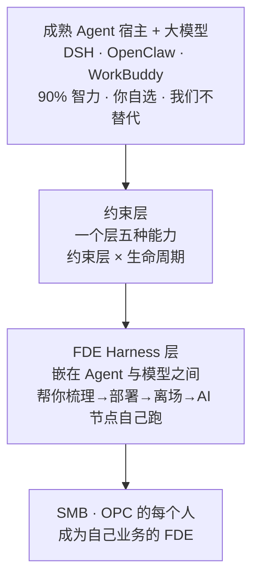
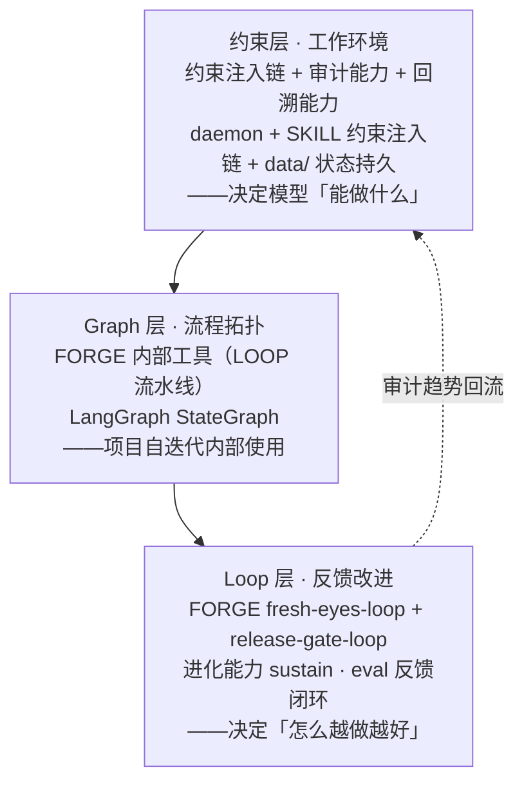
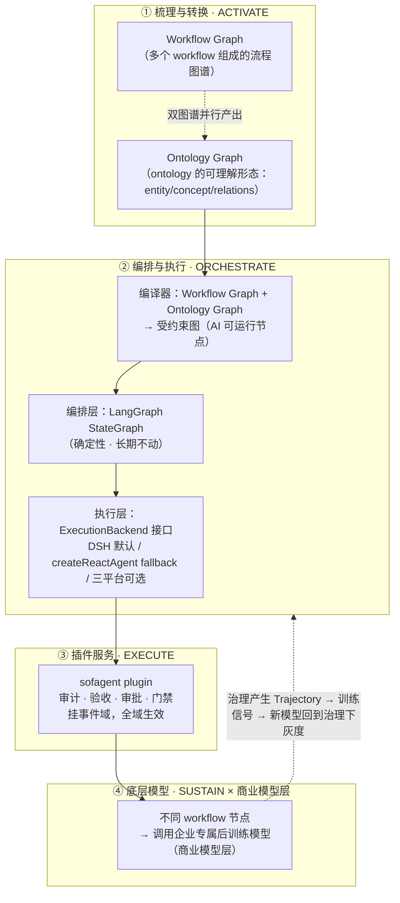
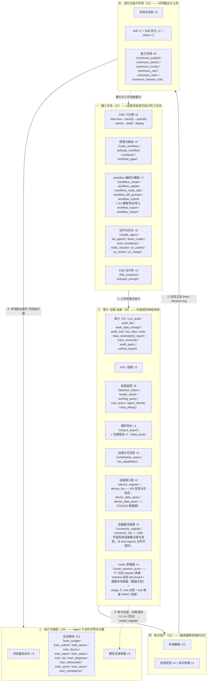
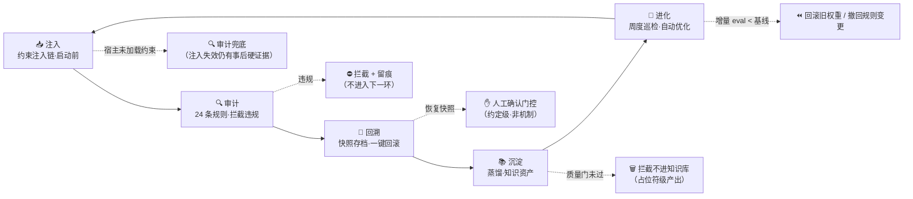
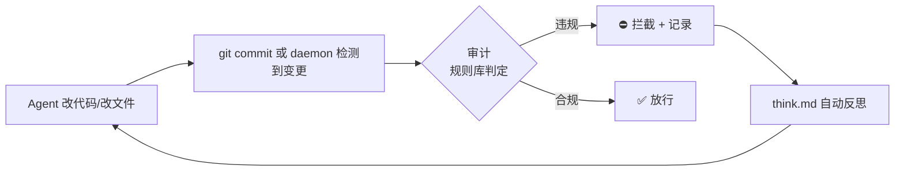
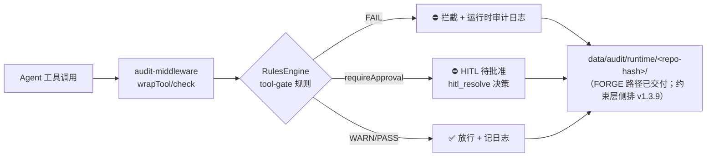
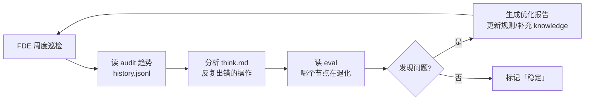
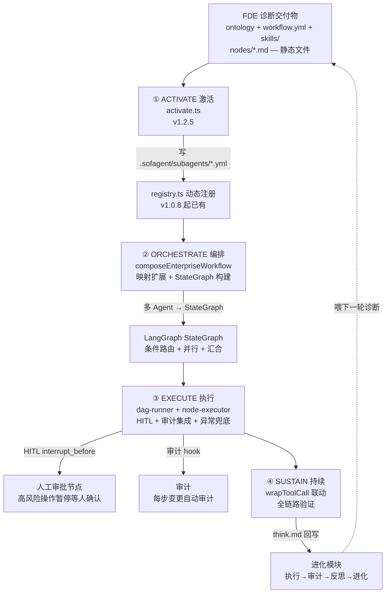

# sofagent Architecture

<p align="center"></p>

> v1.5.2 · 2026-09-24（UTC）· ✅ 已发版 · 孔放勋
>
> 设计决策记录——从为什么存在、约束层五种能力如何协作，到每个关键决策的工程理由。
>

## 目录

> **怎么读这份文档**（按需跳转，不必通读）：
>
> | 你的目的 | 读哪几节 | 大约 |
> |---------|---------|:--:|
> | 只要全貌 | [心智模型](#心智模型先读这个) + [能力与状态总览](#能力与状态总览) | 15 分钟 |
> | 查术语/查能力在哪个包 | [术语对照](#术语对照) + 能力总览（查阅型，可跳过） | 随查 |
> | 改代码 · 看模块编制 | 第二章 + 第三章 | 30 分钟 |
> | 追溯某个设计决策为什么这么定 | 第四章 + 第七章 | 按需 |
>

- [心智模型（先读这个）](#心智模型先读这个)
- [术语对照](#术语对照)
- [能力与状态总览](#能力与状态总览)
- [一、核心理念与架构全景](#一核心理念与架构全景)
- [二、约束层（Harness）设计——一个层，五种能力](#二约束层harness设计一个层五种能力)
- [三、部署与运行架构](#三部署与运行架构)
- [四、核心设计决策](#四核心设计决策)
- [五、激活链架构（v1.2.5+ Phase 1-4 已交付）](#五激活链架构v125-phase-1-4-已交付)
- [六、已知局限与未来方向](#六已知局限与未来方向)
- [七、架构设计决策的行业锚点](#七架构设计决策的行业锚点)
- [八、数据层路线建议](#八数据层路线建议)

## 心智模型（先读这个）

> **sofagent 是一个开源 FDE Harness 层**（MIT）——不造 Agent，嵌在成熟 Agent（DSH / OpenClaw / WorkBuddy）与模型层之间做治理，对外帮你进场把业务判断写成文件（梳理工作流、构建本体图谱、部署 AI 节点），离场后按文件 7×24 执行与审计。能力底座是一套约束 Agent 行为的约束层，**约束层 × 生命周期**双层架构：层 1 约束层 = 一个层五种能力（注入·审计·回溯·沉淀·进化）；层 2 生命周期 = 诊断 → 激活 → 编排 → 执行 → 进化。FORGE 自迭代工具链（LOOP 流水线）是项目内部开发工具，保证每次变更可审计、可回滚、可进化。**FORGE = 项目内部自迭代工具链，非产品能力**（本文档中 FORGE 的后续出现均指此；术语表见 [WIKI](./WIKI.md)）。



### 双层架构：约束层与生命周期（主框架）

**这是理解 sofagent 最关键的一张图**——之前只有「约束层五种能力」（那是**能力视角**：怎么保证做对）。激活链（Activation Chain：FDE 诊断交付物 → 注册企业 SubAgent → 编排成 LangGraph 工作流自动跑，四阶段 ACTIVATE→ORCHESTRATE→EXECUTE→SUSTAIN）引入后，产品在「治理」之外多了一条**流程视角**（企业 AI 从诊断到自动运行怎么走）：

| 层 | 是什么 | 视角 | 回答什么问题 |
|----|--------|------|-------------|
| **层 1 · 约束层** | 一个层五种能力（注入·审计·回溯·沉淀·进化） | 能力视角 | 「怎么保证每次执行都做对」 |
| **层 2 · 生命周期** | 诊断 → 激活 → 编排 → 执行 → 进化 | 流程视角 | 「企业 AI 从诊断到自运转怎么走」 |

```mermaid
graph LR
    subgraph 层2 · 生命周期（流程视角 · v1.2.5+）
        D1[诊断<br/>FDE 四阶段] --> D2[激活 ACTIVATE<br/>交付物→SubAgent]
        D2 --> D3[编排 ORCHESTRATE<br/>多 Agent→StateGraph]
        D3 --> D4[执行 EXECUTE<br/>DAG + HITL + 审计]
        D4 --> D5[进化 SUSTAIN<br/>反思 + 回灌]
        D5 -.->|喂下一轮诊断| D1
    end
    subgraph 层1 · 约束层（能力视角 · 已交付）
        C0[📥 注入<br/>约束注入链·开工前]
        C1[🔍 审计<br/>每次变更硬证据]
        C2[🔄 回溯<br/>快照·回滚]
        C4[📚 沉淀<br/>蒸馏·知识资产]
        C3[🧬 进化<br/>反思·知识·优化]
        C0 --> C1 --> C2 --> C4 --> C3
    end
    D4 -.->|每步审计| C1
    C1 -.->|违规拦截·回滚| C2
    C2 -.->|回滚后重试| D4
    C2 -.->|重试上限| TERM[🛑 终止 + 审计留痕]
    D5 -.->|think.md 回写| C3
```

> **约束层为生命周期提供能力，生命周期让约束层有活干**——审计在 EXECUTE 阶段每步把关，进化在 SUSTAIN 阶段吃 think.md 回写。两个模型不是并列关系，是**能力 × 流程的矩阵**：约束层是「怎么保证做对」，生命周期是「让什么跑起来」。

### 补充视角：约束层内部分层与业务概念嵌套

> 以下两个视角是对双层架构内部结构的补充展开，不是独立的架构框架——**双层架构是唯一主框架**。**何时需要哪张图**：产品定位 → 双层架构图；约束层内部组织 → 约束层工程视角；企业业务概念 → 业务概念视角；落地终态 → 四层运行形态图。**生命周期五段 vs 激活链四阶段**：诊断=进场审计，激活=ACTIVATE，编排=ORCHESTRATE，执行=EXECUTE，进化=SUSTAIN。

**约束层工程视角**——约束层内部按「环境 → 流程 → 反馈」组织：



> **记忆法：环境、流程、反馈。** 约束层给 Agent 一个稳定的工作间（上下文/工具/权限/可观测性），Graph 告诉它任务流向哪（节点边界/路由条件/并行/汇合），Loop 让它出错后能基于证据自己改进（验证→反馈→修复→再验证）。三层缺一不可——再漂亮的 Graph 没有约束层就不可执行，再好的 Loop 没有 Graph 就不知道在哪个环节改进。
>
> 📌 三层嵌套的**完整 ASCII 架构图（唯一源 / SSOT）见 [WIKI §三·三层嵌套](./WIKI.md#三层嵌套harness--graph--loop)**。本节只做补充说明，不在 ARCHITECTURE 重复维护完整三层图——修改三层结构请改 WIKI 那份。

**业务概念视角**——从企业用户角度看，同一套系统体现为四个自外向内的嵌套层级：

| 层级 | 定义 | sofagent 对应 | 例子 |
|------|------|--------------|------|
| **本体图谱（Ontology Graph）** | 企业全部业务节点和关联关系的全局拓扑——FDE 交付的静态语义图谱（机器读） | FDE 第三章 本体数据（objects / relations / knowledge-domain） | objects.yml + relations |
| **业务图谱（Workflow Graph）** | 企业全部工作流组成的流程图谱——FDE 交付的动态流程图谱（人读）；其中每条完整业务链路即单个工作流 | FDE 第四章 梳理出的工作流集合 | 采购审批流、财报生成流 |
| **Loop** | 工作流中的一个闭环执行单元，由 Goal 驱动 | FORGE loop / AI 节点跑起来 | fresh-eyes-loop、release-gate-loop |
| **Goal** | Loop 的退出条件——达成即停，偏离即纠 | exit-gate 判定 | 「所有 P0 修复完成」 「审查全绿」 |

**工作流（Workflow）由业务节点组成**——业务节点 = AI 节点 + Human 节点（对应 FDE 第四章 三问判定法：从业务节点中识别哪些可 AI 化 → 🔄/⚡ 成为 AI 节点，👤 保持 Human 节点）：

- 🔄 **纯 Loop（AI 节点·自动执行）** — AI 跑完即退出，Goal 达成自动收工
- ⚡ **Loop + Human（AI 节点·强化岗位）** — AI 跑 Loop，Human 在关键环节介入（审批 / 检查 / 兜底）
- 👤 **纯 Human（Human 节点·暂不动）** — 当前不适合上 AI，保持人工

> **Human-in-the-loop 不是「loop 里面塞了人」，而是 workflow 里 loop 节点和 human 节点的协同编排。** 一个 workflow = 一条由不同类型节点串联而成的路径。

举例：采购审批流 = `[🔄 收集报价] → [⚡ 主管审批] → [🔄 生成合同] → [Human 签字]`

### 四层运行形态：企业 AI 从梳理到专属模型

上文双层架构图同时承载「能力视角」（约束层五种能力）与「流程视角」（生命周期五阶段）。这张图是**第三个视角——站在企业/客户看完整运行形态**，回答「装上 sofagent 之后，企业 AI 最终长成什么样」：
上文双层架构图同时承载「能力视角」（约束层五种能力）与「流程视角」（生命周期五段 ＝ 诊断 + 激活链四阶段 ACTIVATE→ORCHESTRATE→EXECUTE→SUSTAIN，对位见 [相位模型对位表](#相位模型对位表同一套流程的四种切法)）。这张图是**第三个视角——站在企业/客户看完整运行形态**，回答「装上 sofagent 之后，企业 AI 最终长成什么样」：



> 这张图的三处关键精化：
> - **L1 是「双图谱并行产出」不是单向转换**——Workflow Graph 管流转（**人读它理解企业怎么运转**）、Ontology Graph 管语义（**AI 读它理解企业是什么**），两者从同一次 FDE 访谈并行产出、互相校验（SHACL），不是「Workflow Graph 画完再转 Ontology Graph」（转换会丢访谈里的隐性知识）。**双图谱术语**：ontology 本身是哲学定义，加 Graph 让它成为可被理解、可视化的东西——FDE 交付的两张图谱即 Workflow Graph（多个 workflow 组成，人读的运转图）与 Ontology Graph（本体数据的图谱化形态，AI 读的语义图）。**行业坐标**：Workflow Graph / Ontology Graph / 知识图谱 / 上下文图谱同属「知识层」（描述业务世界），图谱工程（构建·校验·维护图谱的工程实践）属「工程层」——sofagent 的双图谱交付 = 用工程层方法产出知识层资产，行业对标详见 [VALIDATION](./VALIDATION.md)。
> - **L2 是「编排层长期不动 + 执行层可换」两层分离**——编排层 LangGraph StateGraph 长期不换（确定性审计依赖显式图结构；换掉编排层 = 放弃确定性审计，这是架构级取舍而非永久承诺），执行层走 ExecutionBackend 接口：DSH 默认 / createReactAgent fallback / 三平台可选。DSH 是最大的一条河，但「堤修在哪条河上都行」，不把企业命脉押在 developer preview 上。
> - **L3 挂的是「事件域」不是节点**——plugin 装一次即在 tools/result、turn-stopping、approval seam 上全域生效，无需逐节点插桩；独立模式（OpenClaw/WorkBuddy + git diff 审计）永远保留，不依赖 DSH 才成立。

---

## 术语对照

| 能力 | 英文 | 一句话 |
|------|------|------|
| 📥 注入 | Constraint Injection | 四层约束注入链，Agent 启动前灌入红线 |
| 🔍 审计 | Audit | git diff + 文件变更硬证据审计（v1.1.0 拆独立包） |
| 🔄 回溯 | Restore | 每次审计自动快照，`--revert` 一键回滚 |
| 📚 沉淀 | Distill | 审计轨迹/反思/案例蒸馏成知识资产——进化吃沉淀的产出。沉淀的复利载体是语义（字段含义/口径/边界）不是做题结果；且必须带适用边界，否则旧知识反成污染源 |
| ⚙️ FORGE 工具链 | FORGE Toolchain | LOOP 流水线（内部自迭代用，非对外能力） |
| 🧬 进化 | Evolution | FDE 周度巡检 + 自动优化 |
| 加载链 | Load Chain | Agent 启动时注入的约束文件（又称约束注入链） |
| FDE | Forward Deployed Engineer（前线部署工程师） | 源自 Palantir 交付纪律：工程师驻场客户，掌握完整上下文、打破岗位边界、对结果负责。sofagent 把 FDE 能力产品化——FDE 进场生成判断并部署 AI 节点，离场后节点按判断自己跑 |
| 中间件（Harness 中间件） | Middleware | **品类定位词**——答「sofagent 属于哪个品类」（Harness 类运行时/治理框架）；**不是**「约束层是技术实现层的中间件」这一实现论判断（[设计哲学](./PHILOSOPHY.md) 明确否定该义，改称「数字员工的组织入职协议执行器」）。两义并存不矛盾：一个答**属于什么品类**，一个答**在组织里扮演什么角色** |
| Harness | 约束层 | FDE Harness 层的核心：一个层五种能力（注入·审计·回溯·沉淀·进化）。对外中文「约束层」、英文「Harness」为 SSOT；「FDE Harness 层」即产品整体（约束层 + FDE 方法论 + 审计），「约束层」即其核心，两者一体两面不另作区分；约束层的构成表述 = **一个引擎 + 一组插件**（引擎=约束层本体，即五个功能模块构成的整体，不可拆不可裁；插件=把引擎能力挂到宿主，可插拔可裁剪）；两者的咬合机制（两相位）：FDE 是判断的**生成相位**（进场时把「该不该上 AI / 做好标准 / 谁拍板 / 何时跑」判断出来并冻结成交付物），约束层是判断的**驻留相位**（离场后 7×24 按冻结的判断执行并产生反馈信号），交接物 = workflow.yml + ontology + MD（FDE 写入、约束层读写、持续进化——是共享状态不是一次性交付）；「Constraint Layer」为同义英文旧称，不再单独使用 |
| Gateway | Gateway | 企业级 AI 统一入口（WorkBuddy / OpenClaw 等大厂平台），sofagent 不替代它 |
| Sub Agent | Sub Agent | 用 LangGraph createReactAgent 搭的专有执行节点 |
| Ontology | 本体数据 | 企业的业务世界模型——一套「什么实体存在、能做什么动作、受什么约束」的规则书（机器可读），FDE 帮你搭建并持续维护 |
| River | 统一 Agent 入口 | 多个 Workflow 的集合——每段 Workflow 把模型能力引到业务侧，汇入同一条大河。详见 §三 River—Workflow—Subagent 三层架构 |
| SMB | 中小企业（Small & Medium Business） | 没有专职 AI 部署团队、想低成本具备 FDE 能力的企业 |
| OPC | 一人公司（One Person Company） | 个人或小团队，用自己的 Agent + 模型自主完成部署，不愿被单一厂商锁定 |
| 激活链 | Activation Chain | 生命周期层：FDE 交付物 → 企业工作流自动跑。四阶段 ACTIVATE→ORCHESTRATE→EXECUTE→SUSTAIN |
| ACTIVATE | 激活 | 读 FDE 交付物 → 写 `.sofagent/subagents/*.yml` → 注册企业 SubAgent |
| ORCHESTRATE | 编排 | 多个企业 SubAgent → LangGraph StateGraph 工作流 |
| EXECUTE | 执行 | DAG 运行 + HITL 人工审批 + 审计集成 + 异常兜底 |
| SUSTAIN | 持续 | wrapToolCall 联动：执行 → 审计 → 反思 → 进化 |
| S1M | System One Model（决策模型 · 身份句） | 本仓判定件之名——不生成文字、只输出类型化决策（三原语 Choice/Score/Noul）+ 校准概率 + 弃权语义。**判定/决策/判断三层口径**：身份句用「**决策模型**」（对齐 System One 谱系，产品身份）；机制句用「**判定**」（名词 · 机构面——判定面 · 判定底座 · 判定档 · 判据集 · 判定调用，只出结论、指向治理面）；叙事句用「**判断**」（动词 · 动作面——S1M 执行判断 · 判断被治理）。不互换：「决策」含行动意志指向应用面，「判定」是机制实体，「判断」是动作——混用会把治理面读成应用面 |
| System 1 Agent | 品类名 | `S1A = S1M + Harness`（受 FDEing 作用——FDEing 为方法论 plug-in，见 v2.0.0 §一）定义的 Agent 品类（[v2.0.0 §一](./changelog/v2.0/v2.0.0.md)宣告）：FDE 定义场景，S1M 执行判断，Harness 保证判断被治理——不是更快的 Agent，是判断先被治理的 Agent。sofagent = **System One For Agents**（名字 backronym，谐音彩蛋保留） |

> ⚠️ **旧名兼容**：五能力（注入/审计/回溯/沉淀/进化）中，前四能力即原约束底座/审计模块/回溯引擎/进化模块（v1.2.9 统一为「约束层四种能力」），「沉淀」承接原「进化」表述中的「经验沉淀」语义与知识蒸馏管线（knowledge/）。历史文档中的四能力与「引擎」表述保留不动（archive/changelog 是历史快照不改）。代码层面的类名 `AuditEngine`、函数名 `runAuditGate`、文件名 `engine/audit` 全是 API，保持不动。

> ⚠️ **「三档 / 五态」术语导航**（三套档位名各自独立，勿混）：FDE 诊断侧 **🔄 自动执行 / ⚡ 强化岗位 / 👤 暂不动** = **业务节点分类**——答「这个环节上不上 AI」，属诊断期，只看该节点本身；判定底座 **高自动 / 中复核 / 低转人工** = **判定结果的分流门槛**——按错误率区间分段，属运行期，只看这一次判定的概率；审计结论 **`ALLOW` / `ASK` / `ABSTAIN` / `DENY` / `SKIP`** = **审计判定的五态输出**——答「这次变更怎么处置」。三者对象不同（业务节点 / 判定分流 / 审计结论），**不是同一套枚举的三种叫法**，也不得为求字面统一而互相改写。

> 💬 **交互范式**：sofagent 的核心交互是语言（MCP / IM / CLI），无操作型 GUI——所有能力通过 MCP 协议暴露，用户通过 Agent 对话（LUI）操作：说一句话，它做完告诉你结果在哪。dashboard 是只读监控视图（localhost:3780，详见下文），不承担操作职能。这是架构的根本设计约束：不存在「仅 CLI 可用」或「需要打开页面」的能力。详见 [设计哲学](./PHILOSOPHY.md)。

### 相位模型对位表（同一套流程的四种切法）

> **一句话**：下表四套「阶段 / 相位」切分说的是**同一件事的不同侧面**，不是四套并行流程——「生命周期五段」切的是**企业 AI 的路径**，「激活链四阶段」是其中后四环的**工程名**，「FDE 四阶段」是进场侧的**方法论名**，「FDE 两相位」切的是**判断的归属**。四者互为别名与展开，无一处是另一处的上位或替代。

| 体系 | 出处 | 切法 | 与「生命周期五段」的对位 |
|------|------|------|------------------------|
| **生命周期五段**（产品流程视角 · 本文主术语） | [双层架构](#双层架构约束层与生命周期主框架) / [WIKI](./WIKI.md) | ① 诊断 → ② 激活 → ③ 编排 → ④ 执行 → ⑤ 进化 | ——（基准） |
| **激活链四阶段**（工程名） | [§五 激活链架构](#五激活链架构v125-phase-1-4-已交付) / [guides/fde-activation-chain.md](./guides/fde-activation-chain.md) | ACTIVATE → ORCHESTRATE → EXECUTE → SUSTAIN | = 五段的 **②–⑤ 后四环**；激活链从 FDE 交付物起跑，故「诊断」不在链内——**不是漏项** |
| **FDE 四阶段**（进场方法论） | [FDE/GUIDE.md](../FDE/GUIDE.md) / [HANDBOOK](./HANDBOOK.md) | 梳理 → 构建 → 部署 → 离场 | = 五段的 **① 诊断**（进场生成判断并冻结成交付物），交接到 ② 激活 |
| **FDE 两相位**（判断的归属） | [README](../README.md) / 本文 §术语对照「Harness」行 | 生成相位（FDE 相位 · 进场）→ 驻留相位（Harness 相位 · 离场后） | 生成相位 = 五段的 **①–②**（判断冻结成交付物并完成交接）；驻留相位 = **③–⑤**（按冻结的判断执行、审计、反馈） |

> 🔗 **互引说明（回答「到底有几套模型」）**：[README](../README.md) 用「进场 / 离场两相位」讲**判断归谁**；本文用「一个层，五种能力」讲**约束层做什么**；[PHILOSOPHY](./PHILOSOPHY.md) 用「判断主轴 + 九个剖面」讲**各章归属**。三者不是三套模型，是同一件事的三种切法——判断从进场到离场只有一条路线，三个说法分别回答「判断在谁手里」「约束层对它做了什么」「文档从哪读起」。
>
> **落地版本口径**：生命周期五段中 ① 诊断由 FDE 方法论（已交付）+ `FDE/` 六引擎工作台承载；②–⑤ 即激活链四阶段 Phase 1-4（v1.2.5–v1.3.0 全链路已交付）。

### 约束层七维度（Agent 的构成面）

Agent = **模型 + 上下文 + 工具 + 状态 + 执行控制 + 权限 + 可观测性** 七个维度。约束层五种能力（注入·审计·回溯·沉淀·进化）各自覆盖其中若干维度，不构成独立架构层——七维度是「Agent 由什么构成」的分析框架，五种能力是「约束层对 Agent 做什么」的生命周期框架，两者正交。

> 注：沉淀能力主要作用于上下文（L4 knowledge/ 蒸馏回灌）与可观测性（历史归档/报表），与注入（L1-L4 加载链）的上下文覆盖互补。

| 维度 | 含义 | 主要受约束层哪阶段覆盖 |
|------|------|----------------------|
| 模型 | 推理内核 | 注入（系统约束）+ 进化（模型选择反思） |
| 上下文 | 注入的知识 / 记忆 / 本体 | 注入（L1-L4 加载链） |
| 工具 | Agent 可调用的外部能力 | 注入（工具边界红线）+ 审计（越权调用） |
| 状态 | 运行中的中间态 | 审计（变更留痕）+ 回溯（快照） |
| 执行控制 | 编排 / DAG / HITL | 注入（流程约束）+ 审计（异常路径） |
| 权限 | 能碰什么资源 | 审计（A 类越权规则）+ 回溯（最小权限） |
| 可观测性 | 日志 / 追溯 / 签名 | 审计（硬证据）+ 进化（趋势反思） |

> 维度构成以 [WIKI 术语表](./WIKI.md) 本行为准；五种能力各自的维度分工详见 [设计哲学 §一·四件事的分工](./PHILOSOPHY.md#四件事的分工mcp--skills--ontology--harness)。

---

## 能力与状态总览

> 这份清单是「现在能干什么」的单一索引。约束层内部设计见 [二、约束层（Harness）设计——一个层，五种能力](#二约束层harness设计一个层五种能力)；未来方向见 [六、已知局限与未来方向](#六已知局限与未来方向)。

### 27 个 workspace 源码包

构成以根 `package.json` 的 `workspaces` 为准：13 个 `@sofagent/*` 模块包 + 1 个工具包 `load-chain` + 1 个插件适配层基座包 `dsh-plugin-kit`（v1.5.2 章九二轮起转 npm 发布物 `@sofagent/dsh-plugin-kit`）+ 7 个 DSH 插件包（`cordis-plugin-sofagent*`，v1.4.9 P2 合并批 10→7：ontology/commons 并入 fde、gate 并入 audit）+ 4 个 OpenClaw 插件包（`engine/openclaw-plugins/`）+ 1 个 npm 裸名总包 `engine/umbrella`（包名 `sofagent`，聚合安装入口——不属模块包也不属插件，故两个旧口径都不计）。其中 15 个发布为 `@sofagent` npm 包（13 模块包 + `load-chain` + `dsh-plugin-kit`），DSH 插件 7 款经 SkillHub + npm 双通道分发（v1.5.2 章九起摘 `private` 上 npm）。统计口径与包数构成见 [WIKI](./WIKI.md)。

| 包 | 职责 | 状态 |
|---|---|---|
| audit | 提交时审计，24 条规则（17 默认 + 7 扩展，[完整清单见 SECURITY](../SECURITY.md#24-条审计规则完整清单文档级-ssot)）硬证据扫描 + 快照/回滚/webhook + 本体建模要求对齐维度（`runRules({gb48000:true})` opt-in） | ✅ 已实现（1360 测试） |
| core | 核心运行时：git diff 解析、shadow-repo 快照、AES-256-GCM/ECDH、think.md 契约、doctor、LLM 调用 Trace、stop_reason 分类、身份码 Ed25519、敏感识别三层插槽（T8：L0 正则/L1 词典/L2 外挂 NER + DetectorRegistry 调度 + 置信度分层 + Presidio 标签映射） | ✅ 已实现（569 测试） |
| inject | 四层约束加载链 `buildConstrainedSystemPrompt()` + L4 渐进加载（热点全文 + 索引） | ✅ 已实现 |
| rules | 规则引擎纯函数包（零 git 依赖；fs 仅限 AST 扫描的临时目录——mkdtemp 写入待检源码片段，扫描后即清理），编排层 tool-call 事前拦截 + 审批四模式 | ✅ 已实现 |
| eval | 质量评估模块：精确匹配 / 语义相似 / 规则合规 三维评分 | ✅ 已实现 |
| ab-test | A/B 自进化：current vs candidate 并行对比，连续胜出 + 非退化守卫才晋升 | ✅ 已实现 |
| orchestrator | 编排模块：DAG 任务拆解 + LangGraph 闭环 + A/B 调度器 + ToolGate 事前拦截 + Ontology 运行时层 + 并行编排（MergeQueue/ParallelScheduler/波次卡关）+ Durable Execution + Onboard L1-L5 + Benchmark 评测 + agent-creation + FDE 梳理辅助 + Session 隔离 + meta-harness 多 harness 编排 + worklog 工作明细数据层 + FDE 六引擎工作台 + workflow 模板血缘（lineage 事件流 + fork 谱系回溯）+ 执行时 Skill 快照（打包/清理/审计锚点） | ✅ 已实现（1474 测试） |
| train | 后训模块：train-job 编排/审计/隔离/指纹/签名/回收/恢复/安全 + 数据管道/版本/eval 闭环/环境/dry-run/报告 + 云端执行面（替换路径 `import { createTrainJob } from '@sofagent/train'`） | ✅ 已实现（717 测试） |
| daemon | 守护进程：cron + fs 监听 + 文件级审计 + USB 烧录 + 联邦查询 + Dream Cycle 6 阶段 + 启动 LOOP 续跑检查 + 审计轨迹聚合巡检 + 训练孤儿巡检 + 模型清单扫描（注册表 + 端点探测双源） | ✅ 已实现（582 测试） |
| mcp | MCP Server：JSON-RPC 2.0 over stdio，tools + resources（107 tools）——含 FDE 六引擎（fde_interview/classify/quantify/derive/distill/deploy）、训练系（train_status/train_list/train_diagnose/corpus_export/train_serve/train_compliance/train_deliverable）、连接器与模板面（connector_register/connector_list/workflow_export/workflow_import） | ✅ 已实现 |
| ontology | 领域本体：合并 / 状态 / 视图 / 概念合成，三层 YAML 自动生长 | ✅ 已实现 |
| evolve | Skill 优化：复用 audit 规则做安全审查 + 集成优化 + 回填（原 skillopt） | ✅ 已实现 |
| think | 思考链分析：基于 diff + 审计结果自动生成 think.md 反思条目（append-only） | ✅ 已实现（⚠️ 仅 MCP/CLI 路径触发，git hook 路径不自动生成） |
| load-chain | 加载链 Hook 包 `@sofagent/load-chain`：宿主平台（OpenClaw 等暴露会话事件的平台）hook 注入四层约束（DP-4 设计原则提升为正式 workspace 包） | ✅ 已实现 |

> **后训模块为什么在治理仓里**（30 秒答案）：治理的天花板是数据——审计发现的错误（哪些任务做砸了、哪种输出不合格）正是训练的燃料。后训模块把「审计出来的问题 → 修复问题的模型」这条闭环接通，让治理数据反哺模型层；训练资产本身走商业侧交付，治理仓只保留协议与接口（外部化 / 可配置）。英文面使用 "training engine"，两者指同一模块。

### API 分级边界决策（@public / @internal）

v1.3.9 起对所有 workspace 包的入口 export 做显式分级，CI 门禁（[tools/check/public-api.mjs](./../tools/check/public-api.mjs)）拦截未 bump 版本的 `@public` 破坏性变更。

**为什么是这个粒度**：
- 基线覆盖 **13 个包**（12 个 `@sofagent/*` 模块包 + 工具包 `load-chain`；`engine/mcp` 无 `@public` 标注不入基线）——当前 13 包 live 提取共 **2652 个 @public 导出**（磁盘基线快照 2549 符号，见下行）（以 `public-api.mjs` AST 解析为权威口径，非 grep 计数；v1.5.2 增量 +21：rules 出口治理面 11 符号（egress-policy 契约类型 + 裁决函数）+ daemon 审计事件流订阅桥 4 符号 + 并行批 4 + 章八口述沉淀回执 2；v1.5.1 增量 +84：orchestrator 900→963（+63，章一事件总线与三类事件源适配器 + 章三异常三分类路由与死信重放 + 章二 PR 决策解释面；同版修复批复核处置 4 符号——B1 **删除** `sortEventsByTime`（全仓含测试面零引用，死导出除根）+ 收窄 `setDefaultAnomalyBus`（测试缝），F2 同法收窄 `createWebhookAdapter` + `createTimerAdapter`（宿主装配不在本版落点、零生产调用点）——被删者原即不计入 @public，故不影响本行计数）、daemon 274→295（+21，章四 OTA 升级执行器与升级策略 + 章五任务下发推送与订阅登记；平台侧签名器 `signDelivery` 按「本版只出执行侧」降 `@internal`，设备上线钩子 `onDeviceOnline` 按「宿主装配不在本版落点、零生产调用点」同法降 `@internal`，故 23 项中 2 项不计入）；v1.5.0 时点值 2547（双向变动：存量清扫退役 3 符号——composeWithDeepAgents 与 checkHistoryChainIntegrity 双导出，2494→2491；新功能新增 56——章一治理面 16 + 章二双时态 9 + 章八 trace 对账 24 + 章五数据集审阅 4 + 章五陪跑期 3，两段不重叠故 56 即净值）；v1.4.0 时点 1456 / v1.4.6 时点 2168 / v1.4.7 时点 2364（更早时点值）。本行口径以 live 提取为准；磁盘基线待发版时重建对齐（当前基线 2549，v1.4.9 时代生成——发版时以 --update-baseline 重建后此处回填终值））。
- 未标记的导出**默认视为 @public**（保守默认：宁可多承诺不可漏承诺），`@internal` 需显式标注。

**为什么 @internal 破坏性变更不影响适配层**：
- 跨平台适配器（Cursor / Codex / Gemini CLI 薄挂载）与 `@sofagent/audit` 等外部依赖方**只许 import `@public` 层**——`@internal` 是约束层内部实现细节，破坏性变更不触发 semver 约束。
- 若某符号从 `@internal` 升为 `@public`，等同新增公开 API，需 bump 版本 + CHANGELOG 记录（门禁自动拦截漏标场景）。

> 符号数声称与 baseline 的自动校验见 `public-api.mjs` 的「文档声称符号数校验」段——文档声称的符号总数必须与 baseline 实际数一致，否则门禁 FAIL（根治历史 1449 漂移类问题）。

### 对外核心能力（FDE Harness 给用户什么）

> 累计能力表（按版本归组，全部 ✅ 已发布可用；规划中/排期项见下方「已排期」）：
>
> **控制的两层**（读能力表前的一个定位）：平台（Agents API / guardrail 类）治**动作**——Agent 能不能删库、能不能调这个工具，答案写在平台文档里，generic；sofagent 治**判据**——交期改得对不对、报价能不能发，答案在这家企业的本体数据里。两层互补不互替：平台拦得住越权动作，拦不住业务对错。107 个 tool、24 条审计规则裁的都是后者——这是「嵌在 Agent 与模型之间」的确切含义。

> 🗺️ **MCP 工具五域一环（107 tools）**（工具数 v1.4.5 增至 83，v1.4.6 增 train_cloud 至 84，v1.4.7 增 11 个至 95，v1.4.9 G9 增 device_register/device_list 至 97，G10/G11 增 device_data_query/device_data_push 至 99，G5b/G1 增连接器与模板 4 个至 103，批 5 增 router_session_push 至 104，v1.5.0 增 trace_reconcile 至 105，v1.5.2 章一/章二 增 audit_query/ruleset_export 至 107）：工具不是工具箱清单，是一个组织的编制表——五域各司其职，六条箭头构成「执行→审计→沉淀→晋升」的自进化闭环；审计域（域三）是整条飞轮的数据源头，其执法手册即 24 条审计规则。
>
> ⚠️ **三套标签不要混用**：五域按**业务职能**划分（本图组织法）；`tool-registry` 的 `roles` 是**使用场景标签**（7 面：audit/fde/eval/agent/ops/commons/browser），服务于 `SOFAGENT_MCP_ROLES` 按角色收窄暴露面；`docs/API.md` 的**十能力域**是文档编制分组（一个组 = 一个可独立讲述的产品能力）。三者用途不同，条目数不相等属预期——**工具总数的唯一权威源始终是 `engine/mcp/src/tool-registry.ts` 的 TOOLS 数组**。



> 闭环读法：实线 = 主循环（执行→审计→沉淀→晋升→更强的执行面）；虚线 = 晋升回写与语料飞轮。
>
> ⚠️ **数字口径（五域重算）**：五域条目数之和 **30 + 19 + 27 + 16 + 15 = 107**，与图题 107 及 registry 实数**三处自洽**——以 `engine/mcp/src/tool-registry.ts` 的 `TOOLS` 数组为唯一权威源，逐个工具名分桶（分桶依据是**业务职能**，不是 registry 的 `roles` 标签，见上方「三套标签不要混用」）。**自洽由 `tools/check/check-docs.sh` §20 断言**（提取本图五域数字求和，比对图题与 registry 实数；提取为空 ⇒ 判红，防守卫空转）。
>
> **增量化简记**（记号：域 +N = 该域条目数变化）：v1.4.9 分四批把 95 推到 104——G9 设备注册面 D3 +2、G10/G11 设备数据面 D3 +2、G5b/G1 连接器与模板面 D3 +2 与 D1 A3 +2、批 5 router 承接面 D3 +1（C8 新域）；同批回填 2 枚此前未归域的工具（`contribution_query` 治理 KPI 报表、`list_capabilities` 能力发现元工具，落 D3 C5）。v1.5.0 `trace_reconcile` 归 D3 C1 +1 至 105。v1.5.2 章一/章二 `audit_query`（审计数据只读查询）与 `ruleset_export`（规则集导出）归 D3 C1 +2 至 107——审计域新增「对外可消费」两面（数据面只读查询 + 规则面标准 JSON 导出），C1 审计子项 8→10。

> 📌 本表覆盖至 v1.3.8；v1.3.9 及其后版本（v1.4.0~v1.4.9、v1.5.0）的能力沿革见 [CHANGELOG](../CHANGELOG.md) 索引与各版开发日志，本表不再逐版续列。

| 版本 | 关键能力 |
|------|---------|
| **基座（v1.2.0）** | FDE 常驻部署 · AI 节点自动化 · 24 条规则行为审计（零 token 纯静态）· 一键回滚 · 平台无关核心约束（Hook 自动注入 / 手动注入 + 审计照常）· AI 知识库自动积累 · Ontology 本体数据 · USB 一键烧录 · 安全联邦多设备互查 · 4 个 Sub Agent · daemon + A/B 调度器 · MCP Server · FDE 四阶段十二步 · sustain 模式 · ControlGraphState（逐项说明见 [HANDBOOK](./HANDBOOK.md) 与各版 [开发日志](./changelog/)） |
| **v1.2.9** | 三个入口产品（npx 零配置审计 CLI + 规则市场 `--ruleset` + GitHub Action）· FORGE Driver 短任务化 + Checkpoint/Resume worker 级断点 + PM2 守护进程 |
| **v1.3.0** | 运行时审计最小闭环（wrapToolCall middleware + tool-gate 动态拦截 + 运行时审计日志）· 决策审计（emitDecision + HMAC 链 + kind-wise 查询）· 规则透明化（`list_rules` MCP tool）· 危险操作 HITL 钩子 · 双规则系统统一（`ruleType`）· 激活链 Phase 4 收尾（SUSTAIN 全闭环）· 外部记忆后端 Path A（可选，缺省关闭）· 进化链路写保护 |
| **v1.3.1** | Ontology 运行时层（Action 注册表 + validator 三态 + Schema 定稿）· 并行编排（ParallelScheduler + 波次审计卡关 + MergeQueue）· Durable Execution（checkpoint 续跑 + 副作用幂等）· Agent 身份码 Ed25519 · 🚀 Onboard Agent L1（loop_debug）· 📊 Benchmark 评测（evaluate）· 工具审批四模式 · LLM 调用级 Trace · 错误处理升级（stop_reason + 退避）· L4 渐进加载 · 本体建模要求对齐 GB/T 48000.3-2026（`runRules({gb48000:true})`）· 跨设备审计轨迹聚合（audit_trail） |
| **v1.3.3** | L2 团队协作协议 + Refine Agent 完整版 + 入口路由 |
| **v1.3.4** | L3 组织能力公地（发布→发现→调用→评价→养护）+ SkillScan 安全门（三态判定）+ 编排层与执行层分离（ExecutionBackend） |
| **v1.3.5** | MCP 自进化+运维闭环（A/B 实验 run_ab_test / promote_ab 人审晋升 + 快照 snapshot_list / snapshot_restore 人审恢复）+ instinct→skill 自动进化（三源提取 + 置信度评分 + /evolve 聚合）+ FDE 运维五件 + DSH MCP 互通 |
| **v1.3.6** | 引擎接口外化——Workflow 标准格式 + 运行容器（`workflow_submit`）/ Ontology Schema 注册（`ontology_import` D1-D5 留痕）/ 模型注册 + 灰度切换（`model_register` / `model_switch`）/ SubAgent 托管 SDK（`harness.wrap` 双形态）/ 训练协议三约定 + 预算控制（`train_budget`）/ 机器可判定验收（`define_acceptance` / `check_acceptance`）/ 路由决策可解释性（EndpointProfile + route-policy + routeReason）/ 可靠性五件（worktree 隔离 + 双闸验证 + 疲劳度检测 + 分级降级 + decisions.jsonl 完整版）· MCP 60 tools |
| **v1.3.7** | SubAgent 完整沙箱（虚拟 FS / 网络白名单 / 工具中介 / 虚拟 key / 独立进程 / A-B 双跑）· 场景驱动权限 · AgentShield 五类扫描 · 行业 overlay 四套 · 断路器行为监控 · ontology 生命周期 |
| **v1.3.8** | 代理网关硬边界（唯一出入口 + 风险分级 + 权限单调守卫 + HITL 审批队列）· 数据静态加密（能力交付：纯 TS AES-256-GCM，daemon 接线 v1.4.7 收口——密钥就绪后审计历史密文落盘 SOFAGENT-AGE-V1）· Durable Execution L3（WAL 三态恢复 + undo 三档回滚）· 异步长任务自治 · FORGE driver 保活三件套 · 托管 SDK `sandbox:true` 启用 · release-gate 瘦身 · fresh-eyes 成本重构 · 快照写路径加固 |

> **v1.2.0 审计链安全加固**（BugFix 批次）：`--doctor` hash chain 三态判定（ok / tampered / unverifiable，`checkHistoryChainDetailed`）· HMAC key ≥16 字节强校验（`validateHmacKey`）· HMAC 签名改为基于脱敏记录（先 sanitize 再签名，写读一致）· config 可选签名校验（`verifyConfigSignature` + `signConfig` CLI）· CLI 版本一致性自检（`checkVersionConsistency`）。详见 `engine/core/src/audit-history.ts`、`engine/core/src/config-loader.ts`。

### 安装包边界与部署架构（v1.3.2 定位校准）

> **核心定位**：sofagent 装在**企业跑 AI 节点的设备**上，是 Agent 的监控约束层。FDE 自己的电脑不该跑 install.sh——FDE 的工具是 Skill（方法论）+ 未来商业模型。
>
> **行业坐标**：红杉说「所有 AI 应用公司终将成为 Neo-Lab」——竞争主战场从应用层转向智能层，**产品即智能**。sofagent 的差异化立场不在智能层而在约束层：**智能是模型厂商的，管住智能的约束层才是企业的护城河**。Sovereign AI 要的是「对关键智能链路的控制权」，而控制权的一半（数据主权、审计、审批、回滚、灰度）正是约束层的职责——红杉说智能是护城河，sofagent 说「管住智能」才是护城河，两者互补不冲突：企业掌控智能（Neo-Lab 的活），sofagent 提供管控（约束层的活）。

**谁装什么——三个位置各归各位**：

| 位置 | 装什么 | 目的 |
|------|--------|------|
| **FDE 的电脑** | FDE Skill（ClawHub 装）+ 未来商业 FDE 模型 | FDE 做诊断——五要素拆解、建 workflow、搭 ontology |
| **企业设备**（跑 AI 节点）| **sofagent install.sh 全套** | **盯 Agent**——审计每次变更、回溯、注入铁律、daemon 7×24 巡检 |
| **企业员工的 Agent 平台**（WorkBuddy/Codex） | sofagent Skill（ClawHub 装）| 员工的 Agent 受铁律约束干活 |

**install.sh 装什么——企业设备需要全套（事前约束 + 事后拦截）**：

| install.sh 装的 | 为什么企业设备需要 |
|---|---|
| @sofagent/audit + git hook | 事后拦截——Agent commit 时扫 24 条规则 |
| daemon | 7×24 巡检（数据主权 / 知识健康 / 失败模式） |
| dashboard | **单机监控面板**——企业 IT 看本设备 Agent 运行状态（多设备聚合走商业侧平台，不在开源范围） |
| SKILL.md + fde.md + rules/core-rules.md + rules/role-*.md | **事前约束**——Agent 启动时读铁律，知道规则才能遵守 |
| 4 个 Agent Skill（fde/audit/engineer/reviewer）| SubAgent 岗位定义 |
| HMAC key | 审计记录防篡改 |

> **事前约束（Skill 注入）+ 事后拦截（审计模块）缺一不可**——只有审计没 Skill = Agent 不知道规则；只有 Skill 没审计 = Agent 知道规则但可以不遵守。install.sh 是这两者的完整闭环。

**安装器模式**：

| 命令 | 装什么 | 适用 |
|---|---|---|
| `install.sh`（默认） | 底座 + FDE Skill + hook（全套） | **企业设备**：要常驻 Agent + 7×24 监控 |
| `install.sh --base-only` | 仅底座（审计·回溯·daemon） | 企业 IT：只要核心监控，不装 Agent Skill |
| `npx -y -p @sofagent/audit sofagent-audit` | 零安装，临时审计 | 开发者：30 秒体验，在任何 git 仓库跑一次 |

> ⚠️ **FDE 不该在自己电脑跑 install.sh**——install.sh 是企业设备安装器，不是 FDE 工具。FDE 的工具是 Skill（ClawHub 装）+ 未来商业模型。
>
> ⚠️ **dashboard 是单机监控面板**——每台装了 sofagent 的设备一个 dashboard，盯本机 Agent。多设备聚合是企业级需求，走商业侧平台（不在开源范围）。

> 最小可用：只装 `@sofagent/audit` 就有纯审计（24 条规则，17 默认启用 + 7 扩展 opt-in + 快照 + 回滚）；全量形态为 27 个 workspace（包数构成权威表述见 [WIKI](./WIKI.md)），全装才是完整约束层。

### 已排期（开发中或即将开发，详见 ROADMAP）

**排期中（未交付）**：完整多设备协同 L2 · 本地推理 workflow 专属 LoRA 小模型（v3.x–v4.x 远景，无近期版本单元格）。

>
> **Dashboard 双形态说明（v1.3.5 归位 tools/）**：`tools/dashboard/dashboard.html`（Web 形态，`node tools/dashboard/serve-dashboard.mjs` 起服务——与服务器同目录）与 `tools/dashboard/sofagent-dashboard.sh`（终端形态，装到 `~/.sofagent/bin/`，零依赖 bash）是同一 Dashboard 的两种产品入口（README 三入口表）：Web 给老板/IT 可视化看，终端给开发者/FDE 快速看。二者职责不同，勿混用/勿删其一。

---

### v1.5.0 治理面（新增能力域）

| 能力 | 落点包 | 一句话 |
|------|--------|--------|
| 治理 KPI 面板 | `@sofagent/audit` + Dashboard | 六卡聚合（边界触发率/审计覆盖率/HITL 时延/趋势/重复执行/trace 一致率）+ 数据集审阅 + lineage 合规报告 + 周报 |
| 本体数据双时态 | `@sofagent/ontology` | `stateAt` 时点快照 + `validFrom`/`validTo` + 三层渐进加载（预算联动降级留痕） |
| Validation Engine | `@sofagent/ontology` | DAG 三色 DFS 环链定位 + schema 兼容三态 + 激活前置门 fail-closed |
| 跨层证据对账 | `@sofagent/core` | `reconcileTraces` 三源四态（一致/漏报/幻觉/瞒报）+ 回滚闭环豁免 |

> 治理面是约束层的「可见性出口」——前四版把能力做进引擎，本版开始让能力被看见、被对账。

## 一、核心理念与架构全景

> 📖 **「为什么这么做」**见 [PHILOSOPHY](./PHILOSOPHY.md)。这里只讲架构设计——**怎么做的。**

sofagent 的架构基因来自 Geoffrey Huntley 的 Ralph 循环——「Agent 失忆，文件不失忆」。**不信任 Agent 自我报告，只看 git diff 硬证据。**

| 维度 | 通用 Agent 平台（WorkBuddy / OpenClaw 等） | sofagent |
|------|------|------|
| 管什么 | 「会不会做」——能力问题 | 「能不能每次都做对」——执行控制问题 |
| 关系 | Gateway 高速公路 | 交规 + 测速摄像头 + 驾校教练 |

> **90%/10% 价值分层**：AI 模型提供 90% 的智力输出（写代码、做分析、生成报告），但企业敢不敢让 Agent 自主执行，取决于最后 10%——**可靠性、可追溯性、可问责性**。sofagent 的价值不在那 90% 里（那是模型的事），在那 10% 里（约束层的事）。模型越强，约束层越值钱——因为 Agent 能做更多事了，但「做错了怎么办」的代价也更大。

> 理论基础及行业验证见 [THANKS.md](./THANKS.md) 和 [PHILOSOPHY §四 信任模型](./PHILOSOPHY.md#四怎么管信任模型)。

### 治理架构（约束层五种能力）



> ⚠️ **闭环不是无条件自转**（v1.5.1 补失败出口）——上图实线是**顺利路径**，虚线是每条能力的**失败 / 回退出口**；缺了虚线的版本会被读成「五能力永远成功」，与仓内已做对的对照组（[审计流程](#四核心设计决策) 与 tool gate 图的 `违规→拦截`、`requireApproval→HITL`、`FAIL→拒绝` 分支）不一致。四处出口均有实现依据：审计违规当场拦（A 类规则）、快照恢复的人审门控（`snapshot-restore.ts` 的 `human_confirmed`——**约定级非机制**，见 [LIMITATIONS §三](./LIMITATIONS.md#三安全与信任模型局限)）、`quality-gate.ts` 三轴校验拦占位符级产出、进化保留判据挂在模型外信号上（增量 eval < 基线则回滚，见下文 §七 的保留判据）。**注入自身也会失效**（约束力 = Agent 注意力 × 平台加载可靠性），此时靠审计的事后硬证据兜底——这正是「事前约束 + 事后拦截缺一不可」的图面表达。

| 能力 | 设计原则 | 独立包 |
|------|------|:--:|
| 📥 注入 | 四层约束注入链永远在线 | @sofagent/inject |
| 🔍 审计 | 只看 git diff 硬证据 | @sofagent/audit |
| 🔄 回溯 | 事后快照 + `--revert` | @sofagent/core |
| 📚 沉淀 | 知识蒸馏回灌（knowledge/ + SKILL 文件） | @sofagent/daemon + @sofagent/evolve（与进化共享） |
| ⚙️ FORGE 工具链 | StateGraph LOOP 流水线（内部自迭代用） | @sofagent/orchestrator |
| 🧬 进化 | daemon cron @weekly | @sofagent/daemon + @sofagent/evolve |

> 🔀 **执行时机与热路径——五能力都不在判定热路径上**：五种能力的触发时机互不相同——**注入**在会话启动前（读即生效的静态文件）、**审计**在每次变更时（git hook / 文件变更事件，事后取证）、**回溯**是**事后快照**（不参与推理）、**沉淀**在批量蒸馏时、**进化**跑 daemon 周度 cron。**判定与治理是两个不同计数单位的开销**：判定按「**每次判定**」计（单次非自回归前向），治理按「**每次变更**」计（append-only 留痕 + 事件触发）。**因此二者不得相加报成单一「总延迟」**——量纲不同的两个量拼合出的第三个数，不是任何一方的读数（同「多源数字禁拼合」纪律）。**「不在热路径」是架构事实，不是免于落数的理由**：治理开销本身须单独有读数，见 [v1.9.0 §四](./changelog/v1.9/v1.9.0.md)。

> 约束层五种能力的完整设计哲学见 [PHILOSOPHY §三 架构全景](./PHILOSOPHY.md#三怎么跑架构全景)。

### 约束同源：一份定义，多端消费

约束的写法只有一种是对的：定义时写下的那条规则，同时就是推理时的规则、检索时的护栏、动作门禁的边界、审计取证的依据——多端消费同一份定义，不各自维护。「这边说能、那边说不能」的分裂不是实现 bug，是定义未单源的必然结果。同一判断在四个独立方向上都能得到印证：工程侧的本体建模器以 AST 单一数据源为内核，建模公理同时充当推理规则与 Agent 工具的 schema 先验护栏；金融侧用函数注册+版本管理解决口径歧义，同一指标只允许一份规范实现；央企侧的护照模型让每个要素带来源片段/置信度/创建者的结构化溯源；方法论侧把动作按风险分级路由执行方式（自动/确认/审批），自主权边界由配置决定。

> 内部对位：双规则引擎统一已排期 v1.5.3（tool-level 与 git-diff 收敛为单一规则引擎两种触发时机）——本节原则即该收口的设计依据，存量收口在途。

**反过来说，多端消费的前提是消费端答得出依据**：留痕只回答「发生过什么」，可归因回答「为什么是这个值」——同一份定义若不携带判定依据（凭什么判定、依据哪条规则、证据来自哪份产物），消费端就得跨系统拼凑，归因链一断，记录就退回日志。**审计质量的分水岭不在留痕密度，而在归因密度**：只能回答「什么时候、谁、做了什么」的只是日志，能回答「为什么是这个值」的才是证据。这里归因到**因**（why），与 [VALIDATION](./VALIDATION.md) 的**结果负责三要素**互补——那里的「可归因（责任到人 · Agent 身份）」归因到**谁**（who）；责任要落地，两者缺一不可。而归因不必跨系统拼凑，正是本节「定义即证据」在审计侧的推论。

### 输出签名机制

约束层最大的挑战是存在感——约束在正常工作，但用户看到好结果时不知道是约束层在起作用。三层签名：

| 层级 | 机制 | 用户如何感知 |
|------|------|------------|
| 审计输出 | CLI / Webhook / MCP 所有返回值以 `[sofagent]` 开头 | 看到 `✅ sofagent 审计通过` 而非 `✅ PASS` |
| 能力清单 | `list_capabilities` description 标注模块来源 | Agent 转述能力时附带「谁在做、怎么做的」 |
| 审查报告 | FORGE 审查报告顶部标注审计来源 | 报告中体现 `sofagent` 标识 |

签名不修改审计逻辑、不加速度开关——约束层不允许关掉自己的存在感。

### 跨能力关注点：持续感知层

签名解决的是「当下这一条结果是谁做的」。但 FDE 离场后，还有一个更长周期的问题：**客户 3-6 个月后是否还记得 FDE 部署了什么。**

这是 sofagent 的**持续感知层**——审计能力产出证据，进化能力生成报表，MCP 层负责推送。**FDE 的成功悖论是结构性的**：系统跑得越稳，客户感知越弱（详见 [FDE/GUIDE.md §5.10 离场](../FDE/GUIDE.md#510-离场五大能力)）。持续感知层是产品的必修课，不是营销策略。

> 📖 完整的感知衰减曲线 + 三层持续感知体系（定期价值证明 / 系统自曝复杂度 / 不可替代性标记）+ 配置方法见 [SKILL/skills/05-exit.md](../SKILL/skills/05-exit.md)（AI 执行层）与 [FDE/GUIDE.md §5.10](../FDE/GUIDE.md#510-离场五大能力)（人读概念）。

### 约束层的两种形态：加载链与运行时

> **术语对齐**（v1.5.1 收敛）：本节表格原称「地基 vs 约束层」，与本文 [术语对照](#术语对照) 的 SSOT 冲突（SSOT 把加载链定义为「Agent 启动时注入的约束文件（又称约束注入链）」＝注入能力的载体，**属约束层**，不是约束层之外的独立层）。现按 SSOT 改正为「约束层的两种形态」——静态加载链与运行时能力，**不引入独立层级**。

| 形态 | 是什么 | 成本 |
|:--:|------|:--:|
| 加载链（约束注入链·静态面） | 四层加载链（纯 MD 文件，Agent 读即生效）——约束层「注入」能力的载体 | ~3,500 token |
| 约束层运行时 | 编排 + 审计 + 回溯 + 沉淀（知识资产）+ 进化（含质量评估）+ daemon + CLI + MCP | 按需启动 |

> v1.1.0 将审计拆为独立 npm 包 `@sofagent/audit`，加载链（约束注入链）和其余能力（编排/审计/进化）与回溯不受影响。

### 功能编制（约束层内的功能模块）

> **定位声明**：对外产品唯一 = **FDE Harness**（约束层，注入·审计·回溯·沉淀·进化五能力）。下表「模块」是约束层内部的功能域编制称呼——**模块不是产品线，无独立入口，所有产出过审计与注册闸门**。「引擎」在对外叙事中**指约束层本体**（下表五模块构成的整体），单个功能域仍称「模块」；宿主 Agent、DSH、LangGraph 等**外部系统直接称其名**；**「FDE 六引擎」是 FDE 工作台六个 tool 的固定称呼**（tool 面专名，与本节「引擎 = 约束层本体」不同层）。**商业三层架构的中间层统一称「约束层」**（旧称「引擎层」已弃用，原「商业三层架构中的引擎层」豁免一并撤销）。
>
> **约束层的构成表述 = 「一个引擎 + 一组插件」**：引擎即下表五模块构成的约束层本体，不可拆、不可裁；插件把引擎能力以插件形态挂到宿主（DSH 7 款 / OpenClaw 4 款），可插拔、可裁剪。**引擎是被挂载方，不知道宿主是谁**——适配层不 import 宿主 SDK（这是写法保证的红线，不是纪律）。
>
> **插件身份判据——能力桥接器，非能力实现器**：cordis 生态的插件是「能力实现器」，能力本体写在插件里，因此能生长出庞大的第三方插件市场；sofagent 的插件是「能力桥接器」，能力本体永远在引擎能力包（`@sofagent/*`）里——插件层只声明「挂哪（seam）」与「桥接谁（bridges）」，判定与审计逻辑永不出引擎。这是「一切皆插件」哲学不可照搬的结构原因：允许第三方插件自带判定逻辑，等于把缰绳开放成马场（马鞍铁律在插件架构上的表达）。推论：插件市场只对执行面能力（工具域 / 巡检 / 沉淀 / 回滚）开放，审计规则与判定源不做第三方插件化。
>
> **插件裁剪纪律**：裁剪是**安全边界**，不是优化——面向外部的节点以「禁多余能力」为默认，最小工具集本身即攻击面大小。两条配置层语义陷阱必防：① **失败音量不对称**——写错插件 id 是静默的（只往无人读的缓冲区打日志，你以为禁掉的照常运行），而注入依赖不满足是响亮的（启动期直接拒绝）；静默侧只能靠干跑实测暴露，不能只看配置写了什么。② **禁用服务提供者必须级联**——所有依赖它的插件一并显式禁用，否则残余插件静默降级，表现为「已裁剪但能力仍在」（与守卫空转同族）。裁剪后的最终工具集以**实测**为准，不以声明为准。

| 模块 | 职责一句话 | 主要载体 |
|------|------|------|
| **编排模块** | 工作流 DAG 拆解、循环执行、Agent 阵型调度 | orchestrator 包（LangGraph；事件驱动升级 v1.5.1 ✅ 已发版 2026-09-22） |
| **审计模块** | 24 条规则 git diff 硬证据判定，每次变更必审 | audit 包 + git hook |
| **后训模块** | post-training 流水线：审计轨迹→语料导出→训练（**外部执行**）→模型注册→晋升（模型进化闭环的中段） | orchestrator/train + eval 包 |
| **治理模块** | 治理 KPI、跨层证据对账、可见性分级 | v1.5.0（✅ 已发版 · 2026-09-19） |
| **执行模块** | 模型路由、沙箱隔离、凭证 Vault、多实例表决 | 规划中（v1.5.4） |

> 📌 **后训模块的能力边界**：本仓负责后训流水线的**编排与治理**——任务提交 / 预算门禁 / 环境体检 / 提交前预检 / 失败诊断 / 语料导出 / 合规闸门 / 交付包 / 模型注册与灰度 / 推理服务；**训练本身在外部执行环境进行，本仓不实现训练器**（`train_submit` 是把任务提交出去并跟踪，不是自己训）。

> 🔒 **编制准入三问**（新功能域进编制表前必过）：
> ① 挂得上五能力吗（注入/审计/回溯/沉淀/进化至少其一）？
> ② 产出过审计/注册闸门吗（产物可追溯、可回滚）？
> ③ 砍掉它 harness 还成立吗（成立=它是增强件，可进；不成立=它是命脉件，必须已在核心叙事里）？

> 🧭 **训练器是「集成」不是「自研」——选型有公开对标物**：既定路线由 TrainChannel 把外部训练栈接进来（编排侧默认 `verl`，推理侧 vLLM / Ollama / OpenAI 兼容端点，双栈契约见 [train-stack](./guides/train-stack.md)），本仓不自研训练框架。公开生态里的**同位候选**（列作选型参照，**非已采用**）：`verl`（RL 后训通用框架）· `LMIS-ORG/slime-agentic`（基于 Slime 的 agentic RL）· `XYZ-AI-Lab/axrl`（SGLang rollout + Megatron 训练的 agentic RL 后训框架）· `jinzijian/EvoTrace`（把 Agent 轨迹编译成可验证、可交易的训练资产）。四者的共性正是本仓的边界——**训练与资产生产交给外部执行器，本仓只做编排与治理**。所以差异不在「训练框架选谁」，而在**变更级可问责**：谁改了哪条规则、哪次变更被拦、凭什么。

### 产品架构展望（五层）

| 层 | 部署在哪 | 干什么 | 状态 |
|:--:|------|------|:--:|
| **Harness 层** | Agent 上下文 | 纯 MD 文件，Agent 读即生效 | ✅ |
| **执行层** | 用户设备 | daemon 常驻进程——跨 session 经验不丢失 | ✅ |
| **审计层** | git 仓库 + 文件系统 | sofagent-audit——提交时审计 + 文件变更审计 | ✅ |
| **MCP 推送层** | 设备 MCP server | @sofagent/mcp 独立包 | ✅ |
| **协同层** | 多设备 + 云端 | Agent 独立身份、共享上下文、组织记忆 | v2.x |

---

## 二、约束层（Harness）设计——一个层，五种能力

### 🐎 缰绳面 / 执行面判据（新功能过筛表）

约束层的每个能力点，进排期前先回答一个问题：**它管马，还是它自己就是马？** 判断错了，harness 就会长成半个马场（教训实测：训练域代码缰绳面:执行面 ≈ 39:61——意图是给云端后训练装哨卡，实现长成了哨卡 + 自建马场）。

**四问过筛**（答「是」即出开源约束层，四问全「否」才可进）：

| # | 过筛问题 | 答「是」的含义 |
|---|---------|--------------|
| 1 | 它的产出是**算子 / 资源 / 产物**（数据转换、环境安装、下载、打包、拟合），而非**判定 / 拦截 / 留痕 / 追责**（规则、闸门、审计事件、签名、账本）？ | 执行面——开源生态已有成熟轮子（ETL / 环境管理 / 下载器 / 打包器） |
| 2 | 换一个外部实现（verl / vLLM / Langfuse / 任意 ETL 库），它的价值是否**不受损**？ | 是 → 通用算子，自研即重复造轮子 |
| 3 | 它失效时，损失的是**跑不动**，还是**管不住**？ | 跑不动 → 执行面（可运行性不该由约束层兜底） |
| 4 | 它能否被外部替换而**缰绳接口不变**（事件契约 / 校验契约 / 账本不动）？ | 否 → 耦合设计错了，先抽通道接口再实现 |

**两条豁免**（写明而非偷偷留）：

- **共享账本层**：跨面共用的类型 / 状态机 / 版本台账（train-job 生命周期、dataset-version 台账）划入缰绳侧——它们是「词汇表」不是「执行器」，不算执行面耦合。
- **正当读耦合（「验马要懂马」）**：缰绳为完成判定必须读的执行侧知识（显存曲线做预算估算、环境清单做诊断）——保留依赖，但**只读不调**（不触发算子执行），在此声明豁免。

**结构性闸门**：一切执行面需求以 **TrainChannel 通道形态**接入——接口 + 事件归一/产物校验契约 + 通道监控留约束层，实现出约束层（适配规范 / 参考示例 / 商业侧）。不立新模块、不在约束层内长算子。USB 设备接入、router 数据收集等未来执行面需求一律走此形态。

**外部互证——执行闭环是分界线**：语义层与只读 Agent 堆得再厚，整套系统仍停在「知」（查询 / 分析 / 解释），没碰过「行」。行业独立工程实践收敛到同一判据：**判断能触发真实业务动作、动作结果能被后续现实检验，才是分析层与执行层的分界线**——与四问过筛第 1 问同构（判定 / 拦截 / 留痕 / 追责 vs 算子 / 资源 / 产物）。三条同构做法：

- **写路径收敛**：AI 对话默认无增 / 改 / 删权限——读开放（查询工具 + 只读白名单），写收敛（录入 / 提交 / 审批走固定页面或已注册行为工具），概率系统不直接碰现实。
- **确定性降级路由**：已有行为 API 优先于查询 API，自由拼 SQL 是最后手段，语义解释兜底——能走已注册能力就不自由发挥（Skill 路由同理）。
- **检验落在模型外**：判断对错取决于有没有被写回的现实推翻，可检查性不依赖模型自述。

sofagent 落点：审计模块的 git diff 硬证据正是「动作结果被后续现实检验」的工程实例——写回现实的动作才需要过闸门并留痕，纯读操作不构成审计对象；自派 SubAgent 沙箱的工具调用前置 allow/deny 即「写路径收敛」的约束层实现。适用边界同理收敛：语义层建设「够用就好」——单系统语义自洽则 Agent 直连 API 即可，多系统先主数据治理，非标、动态、跨域推演三条件齐备才需要完整本体数据（与 §七「Ontology 阶段匹配：不要提前进化」一致）。

### 📥 注入（约束注入链）

四层加载链（SKILL.md → fde.md → think.md → knowledge/）在 Agent 启动时自动注入。每层有不同权限：

| 层 | 文件 | 权限 | 加载时机 |
|:--:|------|:--:|------|
| 1 宪法 | SKILL.md | ❌ 不可修改 | 最先加载（开头注意力最高） |
| 2 规范 | fde.md | ✅ 可改 | 企业专属规则 |
| 3 反思 | think.md | ⚠️ 自动生成 | 上轮踩过的坑 |
| 4 知识 | knowledge/ | ✅ 积累 | 自动关联的 best practice |

宿主平台中暴露会话事件的（OpenClaw）通过 Hook 精确注入，DSH 走插件在 `tools/pre-execute` 等事件上逐调用注入，其他平台 Agent 主动 Read，v1.0.7+ Sub Agent 启动时自加载（`buildConstrainedSystemPrompt`）。

> **v1.1.8 加载链扩展**：联邦知识注入于 knowledge/ 层（加载链第 4 层，位于 think.md 第 3 层之后；目录 `knowledge/federation/`，daemon 联邦查询落盘的 peer 知识快照）——低于 SKILL.md 宪法层。联邦内容是外部来源，强制 `<untrusted source="federation">` 包裹（Prompt 注入防线层 1，详见 SECURITY.md 8 层映射表）。

> ⚠️ **加载顺序的准确语义（v1.5.1 与实现对齐，纠正「后加载 = 优先级更高」的单向表述）**：读 `engine/inject/src/index.ts` 的 `buildConstrainedSystemPrompt()` 实测——加载链只做**顺序追加**（逐层 `parts.push()`），**代码层不实现任何冲突裁决**：既不替换、也不去重、也不做「后加载覆盖先加载」的合并。因此：
>
> | 轴线 | 顺序 | 实际含义 |
> |------|------|---------|
> | **层间**（宪法 → 规范 → 反思 → 知识 → 联邦） | SKILL.md 最先 | 权限递减（宪法层 ❌ 不可修改）+ 开头位置注意力最高；**不是**代码强制的高低优先级 |
> | **custom/ 用户层**（加载链第 3.5 层，追加在官方三层之后） | custom/ 最后 | 与官方规则**并存**（追加而非替换）；「custom/ 优先」是**意图声明**，不是代码裁决 |
> | **custom/ 内部**（项目级 → 用户级） | 项目级在前、用户级补足 | 两级都注入，项目级占用 `maxFiles` 名额后用户级补余量 |
>
> **诚实边界**：既然不存在代码级裁决，「谁压过谁」最终取决于模型对上下文的注意力——这正是 [LIMITATIONS「Harness 层自身在上下文里」](./LIMITATIONS.md#-harness-层自身在上下文里) 登记的已知边界。写文档时不得把「追加顺序」表述成「机制保证的优先级」。

### 为什么选注入，而不选 fine-tune / 显式 prompt

约束层选择「注入」作为核心机制，是因为两个备选方案各有不可接受的代价：

| 方案 | 为什么不选 |
|------|-----------|
| **fine-tune（微调模型内化约束）** | 不可审计（约束被压缩进权重，无法逐条核对模型是否真的记住了）· 不可回滚（改约束需重新训练，不能像改 MD 文件一样即时撤销）· 不可按会话粒度调整（微调是模型级改动，无法针对单个 Agent / 单次会话差异化）· 成本高（每次约束变更都要训练） |
| **显式 prompt（把约束写进系统提示词）** | 依赖 Agent 注意力，无机制保障——模型可能忽略长文本中的约束（Lost in the Middle），无法保证 100% 命中 |

注入（四层约束注入链）把约束放在可审计、可回滚、可逐会话加载的 MD 文件层，配合事后审计的 git diff 硬证据兜底。注入的已知边界是「约束力 = Agent 注意力 × 平台加载可靠性」（见 [LIMITATIONS「Harness 层自身在上下文里」](./LIMITATIONS.md#-harness-层自身在上下文里)），但相比 fine-tune 的不可审计与显式 prompt 的无兜底，注入是三者中唯一「可被外部逐条验证」的路径。

### 权限四原则与零凭证沙箱

行业参考将 Agent 权限治理归纳为四条可操作原则，与 sofagent 审计能力 + 约束注入链同构：

1. **最小权限**：每个 Agent 只拿当前任务必需的最小凭证集，不预置全量权限。
2. **群维度隔离**：按组织 / 项目 / 环境维度隔离权限域，跨域调用需显式授权。
3. **不可越权**：硬约束层（审计能力）兜底，越权动作在 Action 边界被拦截，AI 绕不过。
4. **可热更新**：权限策略运行时可改、即时生效，不重启 Agent。

**零凭证沙箱**：运行时上下文不落明文密钥——凭证由守护进程注入、用毕即销，Agent 全程只见句柄不见明文（对齐 A2 不泄密钥铁律）。

**最坏情况反问**（权限模型必答题）：「如果这个 Agent 被 Prompt 注入了，最坏情况是什么？」答案应是它 profile 内那些权限能做的事，而非整个系统沦陷——权限不是限制 Agent，是保护组织。

**动态治理三机制**（行业参考内部实践）：
- 动态提权：任务触发、限时授权、到期自动回收（临时审批申请 → 批准 → 约 2 小时后过期）。
- 熔断拦截：高危操作实时拦截、等待人类确认。
- 红线制度：超阈值动作（如合同金额 > 10 万）须 VP 签字等边际审批。

### 联邦查询

两台配对设备经 Agent 平台 channel（如 OpenClaw）互相查 knowledge/。纵深防御四层：MCP localhost 绑定 → 平台 channel 路由 → **AES-256-GCM 应用加密**（审计结论：本地回环 ws:// 明文无 TLS，第 3 层是唯一保密防线）→ sensitivity frontmatter 过滤。

| 模块 | 落点 | 职责 |
|------|------|------|
| 安全层 | `core/src/crypto/` | AES-256-GCM（IV 12 字节随机不复用 + tag 校验）· ECDH(prime256v1)+HKDF 派生 32 字节 key（只存内存）· 24h 密钥轮换（旧 key 只解不加）· 三条配对路径（6 位码 + y/N / `~/.sofagent/federation.token` 文件（权限 600，带外交换）/ federation.json HMAC .sig 验签） |
| 传输层 | `daemon/src/federation/channel.ts` | Agent 平台 channel 抽象（依赖倒置，测试内存 channel）；只搬运密文帧（iv‖tag‖ciphertext） |
| 查询路由 | `daemon/src/federation/query-router.ts` | 并发 fetch + 单 peer 5s 超时按离线 + sensitivity 本地端二次校验（restricted 不接收；篡改标签降权 trust=web + 审计 WARN） |
| 合并 | `daemon/src/federation/merge.ts`（re-export `@sofagent/core` federation） | `@automerge/automerge@^3.4.1`（MIT，Rust WASM 稳定核心，v1.3.5 迁移）CRDT 合并（clone-fork 共享版本史收敛，实现下沉 core/federation.ts）；裁决：trust 优先于 mtime；排序 trust 降 → mtime 降 |
| 离线降级 | `daemon/src/federation/offline-fallback.ts` | 任一 peer 离线跳过不阻塞；全部离线/整块失败退化纯本地查；审计 `federation_query{peers, merged, onlinePeers}` |
| 注入点 | `mcp/src/mcp-server.ts` · `harness/src/index.ts` | search_knowledge 异步联邦合并（best-effort）；harness 加载链第 3 层（`<untrusted>` 包裹） |

### 🔍 审计能力

核心设计决策：**审计必须外置。** Anthropic 发现 Claude 内部存在 J-space——AI 自己知道控制不住自己。所以不信任 Agent 自我报告，只看 git diff 硬证据。



**证据分层**：git diff = 硬证据（不可绕过），Agent 日志 = 软证据（可伪造）。`--silent` 模式只跑纯 git-diff 规则，零依赖 Agent 配合。

**过程面与结果面的分工**：行业一线实践将运行时托管拆为双面——过程审计由运行时托管 Harness 承担（每步工具调用实时可见、可拦截，如 OpenAI Agents SDK 的 guardrail 拦截 + 审计留痕），结果审计由外置审计层承担（git diff 硬证据裁决）。两者组合构成完整运行时托管：过程面防「当下越权」，结果面裁「最终改了什么」——与证据分层（硬证据/软证据）互补，而非替代。

> 📖 来源：[OpenAI Agents SDK v0.22.0 release notes](https://github.com/openai/openai-agents-python/releases/tag/v0.22.0)（2026-08-19 · 官方 changelog · A 级源）

> [Anthropic《When AI builds itself》](https://www.anthropic.com/institute/recursive-self-improvement)（2026-06）：工程师代码产出达 2024 年 8 倍后，人工代码审查成为新堵点。sofagent 的审计把审查外置到 git diff 自动化——正是解这个瓶颈的方向。

**僵局也是审计对象：行为分布塌缩信号**。审计若只记「完成了什么」，卡死就不可见——141 小时长时评测实测：Agent 受挫后行为分布塌缩为单一重复动作，产出行数照常增长但状态推进为零。故审计读数须含过程形态信号：「同一动作连续重复 N 次且无状态推进」即告警。这与过程面（逐步可见）、结果面（git diff 裁决）互补成第三面——不看产出多少，只看行为是否还在发散。

> 📖 来源：[Vals AI《我的世界》141 小时长时评测](https://aihot.news/items/cmuai7c0w0jy6ro5tcdo4c8ro)（2026-09-21，一手实测）；与恢复策略挖掘、轨迹失败模式挖掘互证（彼为进化侧训练信号，此为审计侧告警信号）

**凭证与能力解耦：UI 开关必须等于数据面真关**。Meta Muse 零日漏洞的教训：一个未校验的配置端点即可窃取 token 全权接管——根因是 token 同时承担「身份」与「能力开关」两个职责。治理判据：高危工具的许可在模型上下文之外设独立确认（许可门既有形态），且确认链路本身可回溯（进审计链）；界面开关状态不得作为控制面依据——「界面上关了」不等于「引擎里关了」，开关无效即控制面装饰。

> 📖 来源：[Meta Muse 零日漏洞](https://aihot.news/items/cmubu7pzq035vro99rplg4qt9)（Ars Technica/The Verge 转述，2026-09-22）；与决策模型 credential scope 最小授权、许可门「验证通过前不产生副作用」互证

**决策即节点：决策记录是一等审计对象，不是日志行**。行业三源同构收敛（Semantica 源码级实现、Palantir 动态本体决策捕获、动态本体 MVP 实操）：决策与「当时看到什么（上下文）、考虑过什么（候选）、为何选这个（依据）、执行后如何（反馈）」四层绑定入库，使「查决策 = 查审计链」，因果追溯从翻日志变为沿链遍历；人工复核闸门本身成为决策记录的字段（复核状态随决策走，而非散落在流程日志里）。对 sofagent 的对位：决策审计（emitDecision）已记录运行时理由链——此处补的是结构方向：决策记录按四层完备入库、复核状态随决策本体走，让意图问责与行为问责（git diff）在查询层合流（方向性结论，非现状能力）。

> 📖 来源：《Semantica 源码导览：开源版 Palantir 的 16 站数据流水线》（噪声之下，2026-09-20）；渊亭防务《Palantir 全景动态本体技术研究报告·第三章》（2026-09-17）；动态本体 MVP V0.033 实操复盘（2026-08-17，参考 Semantica）；与 [VALIDATION](./VALIDATION.md)「Semantica 真身定位」节互证（「决策即节点」为其对 Palantir 的独特性判据）

**行业印证**：Palantir AIP 靠 Ontology 实现 Agent 可靠性——「根本接触不到 > 被告知不能说」与 sofagent 的 A15 约束验证 + 审计外置遵循同一原则（不依赖 Agent 自我报告，只看 git diff 硬证据）。Palantir OAG 的「确定性与概率性分离」与 sofagent 审计完全同构——sofagent 的 19/24 条规则为纯 git-diff（不依赖 Agent 配合）正是这一原则的工程实现。完整的行业对标分析（Palantir OAG 五层映射、Ledger-Views-Policy 对照、DeerFlow/Omnigent/DataFlow 等）见 [PHILOSOPHY §五·世界模型](./PHILOSOPHY.md#为什么世界模型优先于语言模型) 和 [VALIDATION](./VALIDATION.md)。

> 💡 **规则编号说明**：A1–A11 + A18–A23 为默认规则（17 条），A14–A17 + E1/E2/E4 为扩展规则（7 条，需 opt-in），全量 24 条（17 默认 + 7 扩展）。**24 条规则完整清单（文档级 SSOT）见 [SECURITY.md → 24 条审计规则完整清单](../SECURITY.md#24-条审计规则完整清单文档级-ssot)**，逐条行为表见 `engine/audit/README.md`。A12/A13 已在 v0.99.4 合并入 A11，E3 已在 v1.2.5 并入 A11，编号不再使用。

**审计的双重定位**：

| 层级 | 做什么 | 行业对标 |
|------|--------|---------|
| 工程层 | 约束行为 + 变更审计 + 责任归属 | 事后护栏——每次变更都可追溯 |
| 叙事层 | Agent 责任确权底座 | **轻量级 KYA（Know Your Agent）**——Agent 的每一次行动都有加密签名凭证 + 不可伪造的硬证据链 |
| 认识论层 | 裁决事实地位：Agent 产出默认是候选事实，审计裁决后升格为可依赖业务事实 | 裁决状态与运行状态分离——系统实际发生了什么 ≠ 审计层认定了什么 |

**候选事实与正式事实之间隔着裁决**。行业本体实践揭示「记录 → 候选 → 正式承认」的转化链：数据已连接、Agent 已产出，不等于企业能回答「究竟出没出事」——中间缺的是裁决环节：谁裁的、依据什么、何时生效。对约束层的等价命题：**Agent 产出的结论默认是候选事实，经审计裁决才升格为可依赖的业务事实**；裁决状态与运行状态分离，事实修正走追加不覆盖——与审计轨迹 append-only 直接互证。

> 🔑 **机器审阅（GitHub 式协作底座的差异化核心）**：GitHub 的 PR 审阅靠人（reviewer 手动看 diff），而 sofagent 的审阅门是 **24 条规则自动审 + git diff 硬证据**。这意味着审阅不需要「人来看」——**纯自动 AI 节点（7×24 无人值守）也能被审阅**。审阅从「人力的瓶颈」变成「机器的流水线」，所以「人+AI 提 PR」「纯 AI 提 PR」两种贡献形态才同时成立。这正是 sofagent 从「审计工具」升维为「GitHub 式协作底座」的关键一跃。

在 agent-wrapping-agent 多层嵌套的架构趋势下（a16z 2026 研判），审计不仅是「事后护栏」——它是 Agent 嵌套体系中的**一等架构评估层**：外层 Agent 在运行期评估子 Agent 的方法论质量（评估层定位，非运行时实时拦截；实时拦截治理：v1.3.0 起 middleware 层轻量拦截，v1.3.7 完整沙箱），层层筛选合成高价值结论。审计是这个评估层的基础设施。

> a16z 研判：智能体经济瓶颈从「智力」转向「身份」——非人类身份:人类 = 96:1，急需 KYA。审计 + 约束层 = 企业内部轻量版 KYA。v1.2.x 评估引入签名凭证做 Agent 行动的可审计绑定（身份层，**对所有 Agent 适用**）；凭证虚拟 key 中介（host 边界注入真凭证）在 v1.3.7 **仅限自派 SubAgent 沙箱**（v1.3.0 为 middleware 层轻量拦截，无沙箱隔离）。

**审计轨迹的用途谱系正在扩展**——从「回溯问责」（原生用途，已投产）向前延伸出两个设计方向：① **量化为优势信号**（轨迹检索为经验、权重不动、有约束的进化——与「写保护」哲学同源）；② **决策前推演**（轨迹喂给轻量世界模型做候选动作树搜索——与按 diff/步骤粒度审计同构）。三者构成谱系：**回溯问责 → 优势信号反馈 → 决策前推演**，学习全部发生在模型外、权重不动——与约束层「不碰参数」的定位一致。①为原生能力已投产，②为设计方向、③为远期方向，均非当前实现，是否排期以 [ROADMAP](./ROADMAP.md) 为准。实验数据与论文细节（JitRL / QWM）见 [VALIDATION](./VALIDATION.md)。

**谱系外第四方向 · 蒸馏数据源**：审计的 append-only 事件流可直接导出为 SFT 训练样本（DSH 实践：headless 批量运行产生轨迹、fork 产生同前缀对照样本、pre-step 钩子前置过滤）——与 Agent Lightning「审计即训练数据」互证。**注意与前谱系的方向差异**：前三项学习发生在模型外（权重不动），此项进入权重更新，属训练侧衔接（对应商业侧后训练管线）——开源约束层仅记录该设计方向、不实施，『审过的每一步都在喂养下一代』的通道在此与商业训练线汇合。远期方向，是否排期以 [ROADMAP](./ROADMAP.md) 为准。

**自评判的实验警示（为什么审计必须外置的实验证据）**：[S³Gym](https://arxiv.org/abs/2608.31100)（字节 Seed，2026-08）用 7 个文字游戏、11.6 万条转移实测「自测试→自评判→自改进」三环耦合：自评判与环境真值的一致率可达 0.88，但价值估计误差同样高达 0.88（NMAE）——模型知道动作「看起来有用」，却严重估错其价值；更关键的是**评判准确度与下一步改进几乎零相关**（run 级 r=-0.23），「认得出好动作」不能保证「把反馈变成好策略」。这为「审计外置、只看 git diff 硬证据、不依赖 Agent 自我报告」提供了 benchmark 级证明：自我评分组织经验可以保留（think.md），但保留/晋升判定必须交给模型外信号。

> 📖 来源：[S³Gym: Can LLMs Turn Self-Testing and Self-Judging into Self-Improvement?](https://arxiv.org/abs/2608.31100)（arXiv 2608.31100，2026-08-31 检索）

#### 运行时审计 tool wrapper

v1.3.0 把「提交时审计（git diff）」扩展为「运行时拦截 + 留证」——在 `createReactAgent` 的工具定义层包一层 tool wrapper（`FORGE/src/audit-middleware.mjs` 的 `createAuditMiddleware`，对标 `progressMw.wrapToolCall` 模式）：



- 规则引擎：`@sofagent/rules`（`RulesEngine.check + aggregate`），3 条 tool-gate 规则（A1/A2/A9 移植版，`ruleType: 'tool'`）
- 判定便捷 API：`shouldAllow(engine, ctx)` → `{ allow, reason, requireApproval }`
- 运行时审计日志按 git 仓库隔离（FORGE 自托管 SubAgent 路径——`FORGE/src/audit-middleware.mjs` 写 `data/audit/runtime/<repo-hash>/runtime-audit.jsonl`，`git rev-parse --show-toplevel` hash，非 git 回退 `nogit-<cwd-hash>`；约束层侧 data-sovereignty 审计日志与 llm-calls Trace 已同构隔离——`data/audit/data-sovereignty/<repo-hash>/{年}/{月}/` 与 `data/audit/runtime/<repo-hash>/llm-calls.jsonl`，旧版无段历史读侧 fallback 原地可读）
- 每次判定同步写 `emitDecision`（决策审计 TOOL_GATE）
- 企业 Agent 路径（node-executor）经 `wrapToolsWithGate` 补 gate——与 LOOP 路径一致

#### 决策审计（v1.3.0 · 意图层审计 MVP）

把 A1-A23 的「行为问责（扫 git diff）」升级为「意图问责（运行时记决策理由链）」：

| 组件 | 文件 | 作用 |
|------|------|------|
| Schema | `engine/audit/src/decision-schema.ts` | DecisionKind(15)/LoopPhase(7)/DecisionWhy + `sanitizeWhy`（先脱敏再签名铁律） |
| 受控写 | `engine/audit/src/decision-log.ts` | `emitDecision()`——唯一落盘入口，HMAC 链与 history.jsonl 同套（同密钥/同签名/同环境指纹） |
| 链校验 | `engine/audit/src/decision-chain.ts` | `checkDecisionChainDetailed()`——mirror history 链范式 |
| 查询层 | `engine/audit/src/decision-query.ts` | `queryByKind` / `getKindSummary` / `traceBack`（decision→spec→artifact→行为记录 join）/ `traceFromBehavior` |

决策日志路径：`data/audit/decision-log.jsonl`（history.jsonl 同级兄弟文件）。Agent 只能经 `emitDecision` 落盘——**受控写铁律**。

**评估即需求（Eval as Spec）**：在 Agent 系统中，传统软件的需求文档（PRD）正在被评估用例取代——不是先写 PRD 再让 Agent 照着做，而是先定义「什么算做对了」（可量化、可执行的验收标准），让 Agent 在这个靶子里自主循环收敛。sofagent 的审计就是这个理念的工程骨架：24 条规则 = 24 条可执行的验收标准（19 条纯 git-diff 零 token 确定性判定 + 5 条非纯 git-diff：4 条 hybrid 需 Agent 日志 + 1 条 filesystem 扫描），每次 commit 自动跑一轮回归——不是「写完看看对不对」，是「不满足标准就进不了主干」。这与 fresh-eyes 独立审查、release-gate 验收闭环同构：把「做完了的判定」（What + Done）从人的主观审查变成代码的确定性裁决。评估驱动的约束比提示词约束更坚固——提示词会被模型吞噬，可执行约束不会。

**审计的三重身份**：Code Review 体系化实践中，Review / Verification / Gate 是三个独立环节——sofagent 的审计同时承担三者：

| 环节 | 属性 | sofagent 对应 |
|------|------|--------------|
| Review（静态分析） | 模型读代码判断逻辑合理性，概率性 | A3/A4/A5/A7 等需理解意图的规则 |
| Verification（规则校验） | 固定校验流程，确定性 100% 可复现 | A1/A2/A9/A10 等纯 pattern 匹配规则 |
| Gate（决策管控） | 基于 Review+Verification 结果判断能否合并 | exit code 0/1/2 → 放行/WARN/阻断 commit |

> **设计原则**：Review Agent 默认不配代码执行权限——纯静态分析避免执行逻辑干扰审查客观性。sofagent 审计同样零执行权限，只看 git diff 硬证据。

**审计作为 E2E Test Harness**：对 Coding Agent 最有效的约束不是更多提示词（模型会内化文字约束），而是端到端测试 Harness——一套提交时自动触发、判定通过/不通过的执行层。sofagent 审计就是这种 Harness：`git commit` 触发 → 24 条规则并行判定 → exit code 决定能否进主干。与 CI/CD 的测试管线相比，审计的优势在「零执行权限」——不看 Agent 跑出来什么结果，只看 git diff 留下什么证据，因此不可被 Agent 的「好结果」说服而放过坏变更。可执行约束 > 提示词约束：前者是文件系统的是非题，后者是概率推理的判断题。

**数据面参照：Langfuse**。[Langfuse](https://github.com/langfuse/langfuse)（开源 LLM 可观测与评估平台）做 trace 采集（每次调用的输入/输出/工具/耗时）+ 指标看板 + 评估数据集与回归，正好对位审计的**数据面**；sofagent 做控制面（约束在先、变更留痕、经验回流）。两者互补——**可观测性是控制面的必要非充分条件**，看得见不等于管得住。

两点可直接借力：① Langfuse 支持自托管，而「数据不出内网」是金融/政务/医疗客户的硬约束，这条路径下无需自研 trace 存储；② 其 dataset + evaluation 数据模型可作为审计回归门禁的 schema 参照。

> 📖 来源：[langfuse/langfuse](https://github.com/langfuse/langfuse)（github.com，2026-08 核实）

**审计留痕的六项必留字段**：Agent 写入生产系统时，审计日志必须保留六项信息才能支撑事后追溯与回滚重建。这一规格来自 OWASP LLM Top 10 2025（LLM06:2025 过度授权）和 Microsoft Security Blog「Least Privilege for AI Agents」（2026-07）的行业共识——比通用审计日志的默认字段更严格：

| # | 必留字段 | 为什么不能省 | sofagent 当前覆盖 |
|---|---------|------------|:---:|
| 1 | 谁（操作主体） | Agent 独立身份，不复用人账号 | ✅ v1.2.5 身份码 |
| 2 | 何时（时间戳） | 跨系统时间戳需可对齐 | ✅ 审计记录 timestamp |
| 3 | 对哪个对象 | 改了哪个文件 / 哪条记录 | ✅ git diff 文件路径 |
| 4 | 执行了什么 | 动作类型 + 参数 | 🟡 部分覆盖（diff 可推断） |
| 5 | 改前改后值 | 对比才能判断影响 | 🟡 v1.4.4 补齐（`actionGovernance.beforeAfter` 结构化摘要——从 diff 提取、截断 200 字符、落盘前脱敏） |
| 6 | 是否可回滚 | 有回滚路径才能撤销 | 🟡 回溯能力有，日志未显式标记（排期中） |

字段 6 是当前缺口——回滚路径存在（快照 + `--revert`）但审计日志未显式标记可回滚性；字段 5 自 v1.4.4 起以 `beforeAfter` 结构化摘要落盘（差异快照级完整还原仍靠 WAL 与快照体系，见上表）。字段 6 补齐后排期覆盖完整六项。离开 Foundry 这类平台的统一权限模型后，这六项必留痕是不可省的工程门槛——平台原生留痕通常只含时点、数据版本、经手应用三项，不含操作主体、改前改后值与回滚标记。

> 📖 来源：OWASP LLM Top 10 2025（LLM06:2025）/ Microsoft Security Blog 2026-07-16「Least Privilege for AI Agents」/ SAP Architecture Center ref-arch 137800 / Palantir Foundry 官方文档（Ontology 留痕能力对照）

### 本体建模要求对齐：GB/T 48000.3-2026 合规参考基线（v1.3.1 交付 2）

> 📐 **定位**：将 GB/T 48000.3-2026《标准数字化 第 3 部分:本体建模要求》作为审计层 / Ontology 层的**合规参考基线**（reference baseline）——不是认证声明，是映射清单 + opt-in 覆盖度报告。合规口径：不虚构国标条款原文编号（无权威文本在手），按「本体建模要求类别」映射到 v1.3.1 交付 1 的 CORE-OBJ/ACT/LNK/STM 四类内核契约。

**条款映射表**（单一事实源：`engine/audit/src/gb48000.ts` 的 `GB48000_CLAUSE_MAP`，审计维度与本文档共用）：

| 条款 | 本体建模要求类别 | sofagent 落地映射 | 状态 |
|------|------|------|:--:|
| OBJ-01 | 对象建模要求（实体/概念定义） | CORE-OBJ · ontology/schema/entity.schema.json + concept.schema.json | ✅ 已对齐 |
| LNK-01 | 关系建模要求（关联方向与基数） | CORE-LNK · ontology/schema/relations.schema.json | ✅ 已对齐 |
| ACT-01 | 动作/行为建模要求（动作→载体映射） | CORE-ACT · ontology/action-registry.ts | ✅ 已对齐 |
| STM-01 | 状态建模要求（生命周期状态迁移） | CORE-STM · ontology/contracts.ts 状态机契约 | 🟡 部分对齐（迁移执行模块待规划） |
| META-01 | 元数据/标识要求 | frontmatter name + created_at/updated_at（D4 规则） | ✅ 已对齐 |
| VAL-01 | 一致性/校验要求 | validateAgainstSchema + 审计 D 规则 | ✅ 已对齐 |
| VER-01 | 版本/演进要求 | Benchmark revision freeze + Durable checkpoint | 🟡 部分对齐（本体 Schema 版本迁移未落地，不挂过期版本锚点，见 [ROADMAP](./ROADMAP.md)） |
| ITF-01 | 互操作/标准化导出要求 | v1.3.6 已交付 `ontology_import` 注册接口面（D1-D5 留痕） | ⚪ 不适用（当前版本） |

**审计报告「本体建模要求对齐」维度（opt-in）**：`runRules({ gb48000: true })`（编程接口选项，非 CLI flag）→ 结果追加 `GB48000` 信息条目（ruleClass='工程规范'，按 name 排除 exitCode 计算——默认行为零变化）。该维度对齐的是 **GB/T 48000.3-2026「标准数字化·本体建模要求」**（ontology schema/action-registry/contracts 合规映射，8 条 OBJ/LNK/ACT/STM/META/VAL/VER/ITF），**不是行为审计国标**，且为**非认证声明**。覆盖度：已对齐 5 / 部分对齐 2 / 不适用 1。

### 已知技术债：双规则系统重叠（v1.3.0 部分收敛）

`engine/rules/`（tool-level 规则，3 条）和 `engine/audit/src/rules/`（git-diff 规则，24 条）
均包含 secret-leak 检测功能。历史上两者并行维护，存在行为不一致风险。

> ✅ **规则正则已收敛**——规则正则模式（如 secret-leak 检测 pattern）已共享至 `@sofagent/core`，避免两套各自维护同一正则；但**规则引擎仍是 `rules`/`audit` 两套**（触发时机不同：tool-level 在调用前拦截、audit 在 commit 后审计，统一 `ruleType` 字段后在两种触发模式下复用同一套规则定义）。**统一为单一规则引擎已排期 [v1.5.3 第一章](./changelog/v1.5/v1.5.3.md)**，详见 [ROADMAP](./ROADMAP.md)。

### 🔄 回溯能力（自研同构 Git 引擎 · 一键回滚）

行车记录仪，不是安检——事后快照，不依赖任何平台：

| 结果 | 自动动作 | 用户看到什么 |
|------|---------|------------|
| ✅ PASS | 自动快照存档 | 静默 |
| ⚠️ WARN | 存档 + 标记 | daemon-health.json 告警 |
| ❌ FAIL | 存档 + 建议回滚 | Webhook + 终端标红 |

```bash
sofagent-audit --timeline     # 快照时间线
sofagent-audit --revert SHA   # 回滚到任意快照
```

快照上限 50 份（MAX_SNAPSHOTS 滚动裁剪，超出移除最旧 + 回收孤儿 blob——v1.3.4/v2 实现）。Webhook 配置在 `.sofagent/config.yml`。

> 📐 **设计决策记录：`.git-shadow/` 为何在仓库内**：审计快照存放在被审计仓库根目录的 `.sofagent/.git-shadow/`（而非全局 `~/.sofagent/`），设计意图是**按 git 仓库隔离快照**——不同仓库的快照不能串，否则回溯到错误仓库的状态。代价是用户仓库内会多一个隐藏目录（已 sanitize 脱敏 + 默认 `.gitignore` 覆盖，不进 git 提交，但 `ls -a` 可见）。v1.3.4 bugfix 已为快照内容加 sanitize 管道（API key / 密码 / 手机号打码），防止快照自身成为泄漏点。改存储位置是 v1.4 架构决策，当前版本只披露。

**实现说明（v1.3.7 起）**：底层是**自研纯 JS 同构 Git 引擎**（`engine/core/src/filesystem/isomorphic-git.ts`）——不调用系统 git 二进制、不依赖 npm isomorphic-git 包，但复用 Git 核心思想：SHA-256 内容寻址 + shadow repo + v2 内容池去重（blobs 跨快照共享；对照锚点：v1 直存时 13 份快照即达 141MB，50 份上限将膨胀到 545MB——v2 内容池下 14 份约 12MB）。选自研而非系统 git 的动机：①非 git 目录也能快照（企业 workflow 目录往往不是 git 仓库）②零环境依赖（装 sofagent 即用）③快照内容 sanitize 脱敏。**局限（如实标注）**：文件级快照、非事务级——revert 逐文件写回，中途失败会留下部分恢复状态（`restored` 数组报告已恢复文件）；与 v1.3.8 Durable L3 WAL（工具调用级 undo + 崩溃恢复）是互补关系。**产品口径**：对外只讲「一键回滚到任意安全状态」；自研引擎是实现细节（用户置信度锚点是 Git 语义的可靠回滚，而非自研实现）。

**工程参照：LangGraph checkpoint**。[LangGraph](https://github.com/langchain-ai/langgraph) 把 checkpoint 持久化状态做成一等公民——任意步可回放、可分叉重跑，这正是「回溯」的工程前提：**先有可寻址的状态快照，才谈得上回溯到某次变更之前**。其 human-in-the-loop 中断点对位约束层的人类终裁闸门，执行轨迹对位审计的 trace 输入。

需要说清分工：业界已把「有状态 + 可回溯 + 可人审」确立为生产级 Agent 编排的**默认要求**，而非 sofagent 独创。差异在 LangGraph 提供机制（checkpoint / interrupt 原语），sofagent 提供策略（什么该拦、拦了怎么判、经验怎么回流）。sofagent 的回溯实现是自有的 FileCheckpointer（五条并发安全规矩，详见 [guides/loop-development.md · Checkpoint 持久化](./guides/loop-development.md#checkpoint-持久化)）+ 自研同构 Git 引擎——与 LangGraph checkpoint 是同一思路的两种载体。

> 📖 来源：[langchain-ai/langgraph](https://github.com/langchain-ai/langgraph)（github.com，2026-08 核实）

### ⚙️ FORGE 自迭代工具链（内部）

大任务拆小、多 Sub Agent 并行、A/B 对比找更优方案。基于 LangGraph createReactAgent 的四节点状态机（`engineer → audit → reviewer → human_confirm`）+ FileCheckpointer 断点续跑 + 上下文四层防御。**FORGE 是内部工具链，架构细节已迁至 [guides/loop-development.md · FORGE 内部架构](./guides/loop-development.md)（四节点状态机 / LoopArtifacts 状态契约 / Graph Engineering 视角 / Checkpoint 并发安全 / 上下文预算管理）。**

### 🧬 进化能力

FDE 部署完成后转为**持续优化角色**。daemon cron @weekly 自动巡检审计趋势 + 反思记录，发现退化就优化。



**经验蒸馏要在写入端控预算，别等膨胀再清理**。SkillZip（阿里×浙大×杜克，arXiv 2608.11079）的持续压缩实验给了一个反直觉的教训：从第 1 轮就启用压缩的技能，长度全程钉在 1.6-1.9 倍；拖到第 8 轮才清理的，已经涨到 2.6 倍追不回来——冗余一旦写入并被持续引用，事后清理比写入时合并更难。对进化能力（think.md → knowledge/ 的经验蒸馏）的启示：蒸馏应在写入端带预算控制（单条经验长度上限 + 引用代替复述），而不是攒多了再统一清理。

**进化的两处积累与保留判据（行业锚点）**——三条外部实证指向同一条哲学：

- [HarnessDev](https://arxiv.org/abs/2609.01437)（字节 Seed，2026-09）：同一权重仅更换 harness，Terminal-Bench 成绩显著跃升——**harness 对能力的影响可超过模型换代**；其结论「模型权重是智能积累的一个地方，harness 是另一个——显式、可检查、可测试、可复用」与约束层五能力叙事同构。
- [Aspire](https://arxiv.org/abs/2608.31111)（2026-08）给出保留判据：模糊目标下训练闭环执行熟练、但增益保留稀有，**继续训练会抹掉此前的改进**。
- **两篇共用一条保留哲学**：**进化的保留判定必须使用 Agent 控制不了的外部信号**（隐藏评测 / held-out 任务 / 固定执行者）——反馈集上的涨分可能只是适应反馈集本身。

落到约束层：进化闭环的保留判据挂在 eval passRate、审计趋势、release-gate held-out 验收这些模型外信号上，不挂在 dream-cycle 自分析上；权重侧的对应机制即后训模块的 eval 回退保护（增量 eval ≥ 基线才晋升，否则回滚旧权重）——正是 Aspire 失败模式（training loop 关得上、capability loop 关不上）的工程解药。

**蒸馏的精度门槛：合理而粗糙的建议，不如不给**。S³Gym 对 Summary Memory 的逐对比较给出一个蒸馏纪律的硬边界：经验能压缩成可复用策略规则的场景（博弈结构、可总结流程），蒸馏优于原始历史；依赖局部精确细节的场景（几何导航、状态敏感操作），「方向全对但缺精度」的总结反而有害（逐对实验数字见 [VALIDATION](./VALIDATION.md)）。对 think.md → knowledge/ 的启示：**蒸馏前先判经验的可压缩性**——能提炼为「条件 → 动作」规则的才进 knowledge/，依赖具体上下文细节的留在 think.md 原始轨迹层，宁可不清蒸馏，不可清错。

> 📖 来源：[HarnessDev: Can LLMs Create and Evolve Their Own Agent Harness?](https://arxiv.org/abs/2609.01437) · [Aspire: Can Models Self-Evolve from Vague Goals?](https://arxiv.org/abs/2608.31111) · [S³Gym](https://arxiv.org/abs/2608.31100)（字节 Seed 自进化系列，self-developing-agents.github.io，2026-09-09 检索）

### 运行时数据层：引擎间数据流全景

约束层（审计/回溯/沉淀/进化）运行时共同往 `data/` 目录读写数据（编排模块 @sofagent/orchestrator 为内部实现，也读写此目录）。以下是生产者→数据文件→消费者的完整单向数据流（v1.2.1 补全 eval + ab-test 后的全景）：

```
                        写入侧（生产者）                          data/ 目录                          读取侧（消费者）
┌─────────────────────────────────────────┐  ┌──────────────────────┐  ┌─────────────────────────────────────┐
│ @sofagent/audit（审计）               │  │ audit/               │  │ @sofagent/daemon（巡检器）            │
│   每次 commit/变更 → runRules()          │→ │   history.jsonl      │→ │   warn-accumulator（WARN 聚合）      │
│   会话结束 → buildSessionReport()        │→ │   session-report.json│→ │   audit-history-analyzer（趋势）     │
│                                          │→ │   session-report.md  │→ │   qa-verify-warn-accumulator         │
├─────────────────────────────────────────┤  ├──────────────────────┤  ├─────────────────────────────────────┤
│ @sofagent/think（反思生成器）              │  │ think.md             │  │ @sofagent/inject（加载链第3层）      │
│   generateThinkEntry() 基于 diff+审计结果 │→ │   （append-only）      │→ │   buildConstrainedSystemPrompt()     │
│                                          │→ │                      │→ │ @sofagent/daemon（dream-cycle）       │
│                                          │→ │                      │→ │   extract-facts() → knowledge/       │
├─────────────────────────────────────────┤  ├──────────────────────┤  ├─────────────────────────────────────┤
│ @sofagent/eval（评分模块）⭐ v1.2.1 补全   │  │ eval/ ⭐              │  │ @sofagent/think（进化模块）⭐ 接通    │
│   runEval() 跑 golden set                │→ │   history.jsonl      │→ │   检测 passRate 下降→写 think.md      │
│   eval-reporter 持久化                    │→ │   reports/*.md       │→ │ Dashboard 质量趋势面板               │
├─────────────────────────────────────────┤  ├──────────────────────┤  ├─────────────────────────────────────┤
│ @sofagent/ab-test（A/B 框架）⭐ v1.2.1   │  │ ab-test/ ⭐           │  │ @sofagent/orchestrator（ab-scheduler）│
│   runABTest() 对比方案                     │→ │   history.jsonl      │→ │   aggregateRecent() 方案判定          │
│                                          │→ │   reports/*.md       │→ │ Dashboard A/B 对比面板               │
├─────────────────────────────────────────┤  ├──────────────────────┤  ├─────────────────────────────────────┤
│ @sofagent/daemon（守护进程）              │  │ dashboard/           │  │ Dashboard                            │
│   health-reporter → runHealthReport()    │→ │   daemon-health.json │→ │   健康面板                            │
│   dream-cycle → extract/synthesize       │→ ├──────────────────────┤  │ @sofagent/inject（加载链第4层）      │
│                                          │→ │ knowledge/           │→ │   buildConstrainedSystemPrompt()     │
├─────────────────────────────────────────┤  ├──────────────────────┤  ├─────────────────────────────────────┤
│ FORGE driver                             │  │ forge-runs/          │  │ verdict.md（人类读）                  │
│   fresh-eyes / release-gate              │→ │   <loop>/<date>/run/ │→ │                                     │
├─────────────────────────────────────────┤  ├──────────────────────┤  ├─────────────────────────────────────┤
│ @sofagent/core ⭐ v1.2.7                 │  │ orchestrator/goals/ ⭐│  │ @sofagent/orchestrator ⭐ v1.2.7     │
│   /goal → evaluateGoal() 写 current.json │→ │   current.json       │→ │   goal_eval 节点（每轮评估收敛）     │
│   （Session Goals 持久化）                │→ │                      │→ │                                     │
├─────────────────────────────────────────┤  ├──────────────────────┤  ├─────────────────────────────────────┤
│ @sofagent/audit ⭐ v1.2.7                │  │ support-bundles/ ⭐   │  │ 人类（报障附件）                      │
│   --support-bundle → generateSupportBundle│→ │   <timestamp>.zip    │→ │   （脱敏后的诊断快照）               │
├─────────────────────────────────────────┤  ├──────────────────────┤  ├─────────────────────────────────────┤
│ @sofagent/core ⭐ v1.3.0                 │  │ memory/ ⭐ v1.3.0     │  │ @sofagent/daemon（dream-cycle）      │
│   createMemoryStore → per-fact Markdown  │→ │   memory.json 索引   │→ │   extract-facts 写入事实级记忆       │
│   （事实级记忆存储）                      │→ │   __default__/*.md   │→ │ @sofagent/core（search/list/delete）│
├─────────────────────────────────────────┤  ├──────────────────────┤  ├─────────────────────────────────────┤
│ @sofagent/daemon ⭐ v1.3.0               │  │ scheduler/ ⭐ v1.3.0  │  │ CLI（scheduler list/history）        │
│   createScheduler → cron/once 定时任务   │→ │   tasks.json 索引    │→ │   daemon start → getDueTasks()       │
│   （定时任务调度器）                      │→ │   history/<id>/*.json│→ │                                     │
└─────────────────────────────────────────┘  └──────────────────────┘  └─────────────────────────────────────┘
```

**数据流铁律**：
- ✅ 生产者 → data/ → 消费者：合法（单向派生）
- ✅ Ledger → Views：合法（Dream Cycle 从 think.md 派生 knowledge/）
- ❌ Views → Ledger：禁止反向写回（代码级强制）
- ❌ 任何层 → 历史条目覆写：禁止（append-only 不变量）

> 📖 此图的 v1.2.1 原始出处及交付细节见 [changelog v1.2.1 §P0b](./changelog/v1.2/v1.2.1.md)。

---

## 三、部署与运行架构

<a id="dual-node-architecture"></a>

### 双节点架构

sofagent 支持两种节点类型：

| 维度 | 自动运行节点 | 个人增强节点 |
|------|------|------|
| **场景** | 企业无人值守设备 | 个人开发者（WorkBuddy/Codex 等） |
| **Agent 平台** | ✅ 必须（OpenClaw 或其他企业级平台） | ❌ 不需要 |
| **编排调用** | 平台内部 API | `sofagent-orchestrator compose --task` CLI |
| **约束注入** | 平台 Hook 精确注入 | Sub Agent 自加载（`buildConstrainedSystemPrompt`） |

> Sub Agent 约束自加载：启动时读 `.sofagent/` 下的约束文件，拼装为 system prompt。纯文件系统操作，不依赖任何 Agent 平台的 Skill 系统。换平台约束不丢。

### River — Workflow — Subagent 三层架构

**River = 多个 Workflow 的集合**——每段 Workflow 把模型能力（水）引到业务侧，汇入同一条大河（River），从头到尾同一个身份、同一段上下文。

Workflow 的混合架构（外层 `workflow.yml` Graph 骨架锁步骤 + 内层 ReAct 节点）实现细节见本节下文「Workflow 的混合架构」段。

```
用户 → River（统一入口）→ Workflow A/B/C（分发）→ Subagent（执行）
              ↑ 回流                                    ↑ 审计
```

| 层 | 是什么 | 类比 |
|------|------|------|
| **River** | 统一 Agent 入口 | 大河——只有一个入口 |
| **Workflow** | 任务编排方案 | 把水引到业务侧 |
| **Subagent** | 执行具体能力的 Agent | 水龙头 / 用水设备——让水真正作用 |

River 的载体是 Agent 平台（OpenClaw / WorkBuddy 等）+ sofagent + Channel 集成。sofagent 不做 River 本身（河是大厂造的——LLM 是水，Agent 平台是河床），而是做河的约束层（约束 + 安全 + 编排 + 执行），确保 River 里的每一个 Sub Agent 都有纪律、可追溯、会反思。

> 🏞️ **River 比喻完整映射**见 [README · 这是什么](../README.md#这是什么)——sofagent 做堤坝 + 自来水厂 + 管网 + 水龙头，不做河本身。

> **Workflow 的混合架构**：每条 Workflow 采用「外层 Graph 骨架 + 内层 ReAct 节点」——`workflow.yml` 的 `nextNodes` 锁定全链路步骤、保证可追溯（对应 Graph 实现全局流程骨架），单个节点的 `prompt` 保留模型自主规划能力（对应内层 ReAct Agent）。这一设计兼顾全局稳定性与局部灵活性：低容错业务靠 Graph 锁死流程，复杂节点靠 ReAct 保灵活。

#### MCP 触发完整链路（v1.1.8+）

> 这一节回答一个具体问题：**企业员工在钉钉/飞书/企微里 @ 一个 tag，sofagent 怎么接住这个请求并跑完 Workflow？**

大厂入口 Agent（River 载体）通过 MCP 协议调用 sofagent。`compose` 这个 MCP tool **已存在**（v1.1.0 起，v1.5.2 前名 `sofagent_compose`），v1.1.8 补上 `--run` 真正执行 + `--enterprise-workflow` 接收 FDE workflow 参考后，链路完整：

```
① 用户在钉钉 @sofagent-tag "帮我实现用户注册模块"
     ↓ 钉钉 AI（LLM：Opus / GPT / 智谱 / DeepSeek 均可）识别意图
② LLM 调用 MCP tool: compose
     参数：
      task: "实现用户注册模块"
      enterprise_workflow: "fde梳理的认证流程.yaml"
      run: true
③ sofagent compose 基于企业 workflow 拆解任务
     → 输出编排方案 YAML + 结构化 SubAgent[] 配置
     → 每个 SubAgent 注入四层约束加载链（buildConstrainedSystemPrompt）
④ dag-runner 调 LangGraph createReactAgent 真正调度（v1.2.0 前为 createDeepAgent（deepagents），已弃用）
     → 主 Agent 自主决定何时委派给哪个 Sub Agent（串行 / 同步并行）
⑤ Sub Agent 执行（带企业专有 Harness 约束）
     → 审计在每个节点卡关（git diff 硬证据）
⑥ 审计通过 → human_confirm → 结果回传给 LLM
⑦ LLM 把结果翻译成自然语言返回给用户
```

**关键差异化**：大厂入口 Agent 做通用调度（什么都能干，但什么都不精），sofagent 做 **Workflow 专项**——FDE 帮企业梳理好的 workflow 做约束，Sub Agent 只做这一个专项任务，比入口 Agent 的通用调度更可控。这就是「专项 Harness > 通用 Agent」的价值，也是 sofagent 不与大厂 Agent 竞争而是做补充层的定位体现。

**前提条件**：大厂入口 Agent 需支持 MCP 协议。目前 Coze / Dify / WorkBuddy 已支持，钉钉/飞书/企微的 AI 助手在跟进 MCP 标准。

**与扣子（Coze，字节跳动）在 Slack @tag 的区别**：扣子把 Agent 嵌入协同平台（Agent 还是通用 Agent），sofagent 把**约束过的专项 Workflow** 嵌入协同平台（Agent 行为被 Harness 限制在企业业务流程边界内）。

### 编排层与执行层分离（v1.3.4 增量 · DSH 执行后端接入）

> 📖 设计来源：DeepSeek Harness（DSH）「一切皆插件」Cordis 运行时 + sofagent「确定性审计依赖显式图结构」铁律的融合——编排层不换（确定性），执行层可换（灵活性）。

sofagent 的编排模块从 v1.3.4 起显式分为两层——**编排层不换（确定性），执行层可换（灵活性）**：

```
编排层（LangGraph StateGraph · 确定性 · 长期不动）
├── 图结构定义：节点 + 边 + 条件路由（enterprise-graph.ts）
├── 审计卡关：每个波次 git diff + decision-log（merge-gate.ts）
├── Checker 节点：format/fact/source 三类检查（checker-nodes.ts）
├── HITL 挂载：人工审批节点（graph.ts / nodes.ts）
├── loop 编排规则：fresh-eyes / release-gate 的 A→B→汇总→修→验
│   （verdict 解析 / 场景覆盖 / 行数警戒线 / 声称一致性检查）
└── 并行调度：ParallelScheduler + MergeQueue
        ↓ 通过 ExecutionBackend 接口调用执行层
执行层（可替换 · 默认 DSH Cordis 运行时 · fallback createReactAgent）
├── 默认后端：DSH Cordis 插件运行时（v1.3.4 接入）
├── Fallback：LangGraph createReactAgent（DSH 不可用时自动降级）
├── 可选后端：WorkBuddy / Claude Code / OpenClaw（现有三平台）
└── 契约：实现 ExecutionBackend 接口 { execute(task) → result }
```

**边界规则**：
- **编排层长期不换**（架构级取舍，**非永久承诺**）——24 条 git diff 规则 + HMAC 链 + DAG 波次审计 + decision-log 全部依赖显式图结构，换掉编排层 = 放弃确定性审计；该约束的成立前提是「确定性审计仍依赖显式图结构」，前提失效则本条随之失效（同口径见 [§四层运行形态](#四层运行形态企业-ai-从梳理到专属模型)）
- **执行层可换**——只要实现 `ExecutionBackend` 接口（`execute(task) → result`），任何框架都能挂载
- **loop 的编排规则留编排层**（verdict 解析/场景覆盖/行数警戒线），**loop 内部 worker 跑 agent 的那一步可以让给执行层**——sofagent 管「循环逻辑」（判对错/定位/收敛），执行后端管「循环执行」（跑 agent 代码）
- **工具 wrapper 原样透传**——audit-middleware（运行时审计）/ progress-middleware（进度监控）包裹在工具 func 上（v1.3.0 模式），随 `ExecutionTask.tools` 走，任何后端不得重包装或替换工具实现

**迁移范围**：v1.3.4 完成第一波分离——`launcher.ts`（主入口）+ FORGE `fresh-eyes-driver` + `release-gate-driver` 三个调用点已改为通过 `ExecutionBackend.execute()` 调用。`dag-runner` / `composer` / `loop/nodes` / `node-executor` 等调用点列入后续迁移清单。

**DSH 关系定位**：DSH 是「agent 框架插件化」路线，sofagent 是「FDE 方法论 + 确定性审计」路线。两者通过 `ExecutionBackend` 接口对接——DSH Cordis 运行时成为 sofagent 执行层默认后端，LangGraph createReactAgent 作为 fallback。

> ⚠️ **接入门禁状态**：早期候选包名（deepseek-harness / @dsh/core 等）曾长期 404，v1.4.0 已改走 **Cordis 内嵌路径**（@deepseek-ai/cordis@4.0.1 stable + `@deepseek-ai/dsh@0.1.2-alpha.3`（engine/orchestrator/package.json devDependencies 实测），rc.2 内嵌已验证可行：boot() + loadProfile() + 注入 cmdlineArgs/appExit + agent.followup 驱动，对照官方 dsh-headless runner 实现）。rc 期**内嵌为主路径**，内嵌执行失败自动 fallback CLI 桥接；LangGraph 作为最终 fallback。决策记录见 ROADMAP（precheck 证据注入保持主路径）。

> 💡 **为什么不把整个编排层也换成 DSH**：DSH 的事件驱动模型（插件 A 触发 B → B 触发 C）没有显式执行路径，运行时才确定——而 sofagent 的审计模块（git diff 硬证据 + HMAC 链 + 波次审计卡关）全部依赖预先画好的 DAG 图结构。用 DSH 替代 LangGraph 编排 = 放弃确定性审计能力。分层使用 = 两者各取所长。

### Agent 基础设施层（v1.0.8+）

两个内置 Agent 被所有 workflow 节点引用：

| Agent | 管什么 | 触发时机 |
|------|------|------|
| **合规审计员** `@sofagent-audit` | 管底线——P0/P1 分级 | 每次 commit / FDE 部署 / FORGE 闭环 |
| **FDE 部署工程师** `@sofagent-fde` | 管上限——deploy/sustain | 部署时 / daemon cron @weekly |

Agent 定义在 `SKILL/agents/{name}/SKILL.md`，`parseSkillMd()` 读 front matter 作为身份标签，body 注入 createReactAgent 作为 role prompt。

### Agent 平台在架构中的角色

**审计层不依赖任何特定平台**——sofagent-audit 是独立 TypeScript CLI，输入 git diff，输出 exit code。即使不装 Agent 平台（OpenClaw / WorkBuddy 等），开发者也可通过 `bash install.sh`（推荐）或 `npm install -g @sofagent/audit`（高级/开发者路径）配 commit-msg hook，让任何 Agent 平台的提交经过审计。

**编排层当前走 LangGraph createReactAgent**——`compose --task` CLI 入口，任何 Agent 平台都能用。迁移路径：ao（AutoGen）→ DeepAgents（v1.0.7）→ LangGraph createReactAgent（v1.2.0，deepagents 已弃用）。

### 文件系统审计

v1.0.8+ daemon 监控文件变更，非开发者也能用审计：

| 维度 | git commit 审计 | 文件系统审计 |
|------|------|------|
| 触发 | 用户主动 commit | daemon 自动检测 |
| 拦截 | ✅ 阻断 commit | ❌ 事后告警（已改完） |
| 需要 git | ✅ | ❌ 自研 git-shadow diff 解析（isomorphic-git 风格，非内嵌第三方包） |

事后审计是平台无关性的前提——实时拦截需深度集成平台，一旦集成丧失第三方独立性。v1.0.8 daemon 让事后审计达到准实时（fs.watch → 2 秒防抖 → 立即审计）。因此**实时拦截 / 运行时治理仅限 sofagent 自派 SubAgent**（sofagent 起环境又发凭证、天然拥有执行边界）；主 Agent 由第三方平台运行，sofagent 不进其执行环，保持事后审计。

---

### 长驻运行时治理（对标 Managed Agent Runtime）

行业参考观点：Agent 不能「用的时候开、不用的时候关」，应作为**长驻微服务**治理（非脚本）。sofagent 的 daemon（cron.ts）已落地常驻，但尚缺下列运维模式——这些模式仅针对 sofagent 自派 SubAgent 的隔离运行时治理（§五 范围声明例外；主 Agent 运行于第三方平台，sofagent 不做其运维层），补齐即 daemon 完整的「7×24 工位」：

| 模式 | 作用 | sofagent 现状 |
|------|------|------|
| Supervisor（进程守护）| 心跳上报 / 任务队列排空 / 内存水位监控 | 部分（daemon 常驻）|
| Health Probe（约 30s 心跳）| 上报当前任务数 / 最近成功响应 / Token 余额；连续约 3 次超时触发 Auto Recovery | 缺 |
| Auto Recovery | 先 graceful restart（排空任务），失败 force kill + cold start | 缺 |
| Graceful Shutdown | 排空在途任务再退出 | 部分 |
| Version Rollout（蓝绿切换）| 零停机升级 | 缺 |
| Circuit Breaker | 外部依赖连续失败约 5 次进入降级模式（停主动任务、留被动应答 + 告警）| 缺 |

> 关键认知：进程活着 ≠ 服务健康——卡死在死锁里的 Agent 进程 ps 看着正常，但已 30 分钟没处理消息。健康须靠心跳 + 恢复闭环证明。

## 四、核心设计决策

### 设计原则

sofagent 的四条设计原则，每条背后有独立的理论/工程/经济学论证：

| 原则 | 含义 | 工程体现 |
|------|------|------|
| **状态最贵** | CS 两大难题都指向状态——缓存失效和命名 | Ralph Loop 无状态范式：Agent 失忆，文件不失忆 |
| **模型输出是提案** | 大模型是带噪声的随机过程——不消除随机性，用循环驯化 | git diff + 审计规则 = 适应度函数 |
| **先有掌控感再自动化** | 不信任 Agent 自我验证 | Maker-Checker 分离：审计独立于 Agent |
| **90%/10% 价值分层** | 模型完成 90% 常规任务，剩余 10% 高风险场景价值反升 | 约束层占据高价值 10%——模型越强，约束越值钱 |

> **历史转折（v0.98）**：sofagent 最初走「事前约束」路线——在 Agent 干活前注入规则，指望它自律。两次 200 次对照实验后放弃：不是约束无效，是实验室测不出来。转向「事后审计」路线——git diff 是客观证据，不依赖实验设计。这次转向定义了 sofagent 的立身之本：**不信任 Agent 自我报告，只看文件 diff 硬证据。**

### 四层加载链：为什么是这个顺序

| 层 | 文件 | 权限 | 位置原因 |
|:--:|------|:--:|------|
| 1 | SKILL.md（宪法） | ❌ 不可改 | 最前面——开头注意力最高 |
| 2 | fde.md（规范） | ✅ 可改 | 企业专属规则 |
| 3 | think.md（反思） | ⚠️ 自动生成 | 上轮踩过的坑 |
| 4 | knowledge/（知识） | 📚 自动积累 | 按需加载 top-N，不占基础预算 |

四层中前三层（SKILL.md / fde.md / think.md）在 Agent 启动时加载，第四层 knowledge/ 按需召回 top-N，不占基础预算。加载链总占用不超过上下文窗口的 3%，规范类文件（SKILL.md/fde.md 等）预算 ≤500 字，think.md 反思区单独预算 ≤2K token——这是 Agent 压缩后可读的最低保证（**上述预算为规划目标，尚未全量落地**，落地状态见下方注记）。

> ⚠️ **预算约束当前状态（v1.3.8 文档对齐）**：上述「≤3% 总占用 / 规范类 ≤500 字 / think ≤2K」为**规划中的目标预算，尚未全量落地**——当前实现为全文注入（SKILL.md / fde.md / think.md 加载时不截断），仅 persona（前 500 字符）与 knowledge 单篇（前 2000 字符）有截断（`engine/inject/src/index.ts`）。窗口占用超预算时的拒载/降级机制列入后续版本。进度跟踪见 [DEVELOPMENT「加载链预算目标跟踪」](./DEVELOPMENT.md#加载链预算目标跟踪)（维护者口径，自 ROADMAP 迁入）。

> 💡 **记忆系统的三软肋 = 知识健康巡检的防御目标**
>
> sofagent 的四层加载链（SKILL.md → fde.md → think.md → knowledge/）与业界长期记忆系统的「基石上下文 / 手写规划 / 自动记忆库」三层架构同构，核心同样是「索引常驻、细节按需召回」。但自动沉淀的记忆有三个共性软肋，正是知识健康巡检（daemon conflict-check + Dream Cycle）必须防的：
>
> | 软肋 | 表现 | sofagent 的防御 |
> |------|------|----------------|
> | **不会遗忘** | 堆积过期/重复/矛盾笔记，旧决策干扰新任务 | Dream Cycle 定期整理 + conflict-check 查矛盾/孤儿 |
> | **索引膨胀** | 索引超长后尾部被悄悄挤出召回范围且不报错 | 加载链预算约束（≤3% 窗口 / 规范 ≤500 字 / think ≤2K；目标预算，当前落地状态见上方说明） |
> | **无强制规则** | 记什么/怎么分类/何时合并删除全靠临场发挥 | memory-contract.ts 代码层强制追加不变量 + 派生方向单向 |
>
> 一句话：管得住比记得多重要。某 30 万行项目仅用 148 行主索引承载 1.4 万行记忆——印证「索引常驻、细节按需」是记忆架构的正解。

### 反认知投降的制度设计

当 AI 能力过强时，人类会不自觉进入「认知自动驾驶」。sofagent 的三道制度护栏：

| 护栏 | 防什么 | 怎么防 |
|------|--------|--------|
| fde.md 规则可随时覆盖 | AI 判断替代人类意志 | 人类写一条规则，AI 必须遵守 |
| 编排方案可回滚 | AI 方案先斩后奏 | 人类不确认，编排不执行 |
| 审计独立于 Agent | AI 自己验收自己 | git diff 硬证据，Agent 无法篡改 |

### 文件系统架构

理由：`cat task/logs/` 就能拿到记录，不需要 SQL/连接串/权限管理。天然可审计、可传输、支持 Git。Ledger-Views-Policy 三层映射：task/logs + think.md = Ledger（原始数据，只追加）→ knowledge/ = Views（派生视图）→ fde.md = Policy（读写规则）。

> 记忆模型的完整契约（追加不变量、多写入方、派生方向单向）以 `docs/PHILOSOPHY.md` §五 为唯一权威文字定义，并以 `@sofagent/core` 的 `memory-contract.ts` 在代码层强制（路径 `getThinkPath()`、只追加写入点 `appendThinkEntry()`）。本文件仅描述架构映射，不重复定义契约。

#### Ledger-Views-Policy ↔ LLM Wiki 三层同构对照

sofagent 的三层治理与 Karpathy LLM Wiki 的 `raw materials → Wiki entries → spec norms` 范式同构：

| LLM Wiki 层 | sofagent 对应 | 物理位置 | 读 | 写 | 审计 |
|------|------|------|------|------|------|
| **raw materials** | **Ledger** | `think.md` + `audit/history.jsonl` | Agent + 审计 | Agent 实时写入（append-only，`memory-contract.ts` 强制） | audit 模块每次 commit |
| **Wiki entries** | **Views** | `knowledge/{entities,concepts,comparisons,summaries}/` | Agent + MCP tools（`read_entity` / `read_concept` / `list_entities` / `search_knowledge`） | Dream Cycle 派生 | daemon `conflict-check`（矛盾/孤儿/死链） |
| **spec norms** | **Policy** | `fde.md` + `SKILL/agents/*/SKILL.md` | Agent 启动时经 Harness 加载链注入 | 人 + FDE 维护（手动 / sustain 模式） | A15 约束验证规则 |

> ⚠️ Views 层是 **4 个子目录**：`entities/` `concepts/` `comparisons/` `summaries/`。此前部分文档只列 3 个（漏 summaries），v1.1.6 起统一为 4 个，与 MCP server 实际规范对齐。

##### RAG 三层视角：取知识 / 组织知识 / 管理检索与执行

知识系统选型常被混为一谈，实际是三个正交层次。sofagent 三层全占，而非只做其中一层：

| 层 | 职责 | 流程特点 | sofagent 对应 |
|------|------|---------|------|
| **RAG**（固定检索） | 取知识 | 线性流程：提问 → 向量化 → 召回 → 重排 → 注入上下文 | `search_knowledge` 单次检索（sensitivity 分级过滤 + 联邦合并）；FDE 进场时的知识库构建 |
| **LLM Wiki**（知识组织） | 组织和使用知识 | 知识体系建设：关系 / 来源 / 版本 / 更新 | Ledger-Views-Policy 三层（对照见上表）——面向 Agent 的知识结构，非供人查阅的文档库 |
| **Agentic RAG**(智能控制) | 管理检索与执行过程 | 动态反馈循环：要不要检索 → 检索哪个源 → 结果够不够 → 拆解问题还是调用工具 → 继续还是收尾 | **编排模块本身**——ReAct 循环的每个决策点（检索规划 / 多源调用 / 结果评估 / 继续迭代）+ daemon 巡检补位 + A/B 收敛判定 |

> 💡 **为什么这个视角重要**：市面上多数「企业知识库」产品只做到第一层（RAG）或第二层（Wiki），检索决策仍是固定管线——第一次检索不充分也不会换个查询方式再试。sofagent 的编排模块天然就是第三层（Agentic RAG 的控制循环 = ReAct Agent 的决策循环），且用 ontology 语义底座替代了裸向量检索（召回的是「有治理的实体关系」，不是「相似度碎片」）。**第一层是能力，第二层是资产，第三层是编排**——三层齐了，知识才从「存着」变成「被智能地使用」。

**每层对现有引擎的调用关系**：

| 层 | 主要读取方 | 主要写入方 | 审计/巡检方 | 现有引擎 |
|------|------|------|------|------|
| **Ledger** | 编排模块 / daemon（lessons-extract）/ Harness 加载链 / 人类 | 审计（git diff 自动反思）+ 主 Agent（write_think）+ FDE/loop 陪跑 | audit 模块（每次 commit 跑 24 条规则） | `@sofagent/audit` · `@sofagent/core`（memory-contract） |
| **Views** | Agent + MCP tools（7 个 knowledge tool） | Dream Cycle 自动派生 | daemon 巡检（`conflict-check` 矛盾/孤儿/死链 · `knowledge-freshness` 新鲜度） | `@sofagent/daemon` · `@sofagent/mcp` |
| **Policy** | Agent 启动时经 Harness 加载链注入 | 人 + FDE 维护（deploy 初次建 + sustain 每周迭代） | A15 约束验证（Agent 是否违反 SKILL 铁律） | `@sofagent/audit`（rule A15）· `@sofagent/inject`（加载链） |

**为什么这样分层**：

| LLM Wiki 设计意图 | sofagent 对应实现 |
|------|------|
| raw materials 必须可追溯、不可篡改 | think.md append-only，`memory-contract.ts` 代码级强制；audit history 环境指纹防篡改 |
| Wiki entries 是加工品，应可重建 | knowledge/ 全部可从 think.md 派生重建（Dream Cycle 落地）；conflict-check 保证派生质量 |
| spec norms 是人类意志的最后防线 | fde.md 业务四问由人写、A15 由代码强制；SKILL.md 铁律是 Agent 启动时注入的硬约束 |

### 模型选择

默认推荐 DeepSeek（第三方 API 服务，调用时数据离开本机到 DeepSeek 处理——「数据不出本机」仅指 sofagent 自身审计/知识/决策数据落盘，不含 LLM 调用）；成本可控（Loop 额外消耗 <1 美分，内部实测参考值，非外部基准）。模型选择是开放的——Flash 干粗活、Pro 干细活，按成本 4:1 分配。

### 编排收敛与 A/B 测试

编排是 Loop 工程——任务到达后持续迭代至收敛。收敛条件：目标可验证 + 模型可自主判断。A/B 对比走确定性指标（运行次数、违规率、步数、通过率），不由 Agent 主观判断。连续胜出 2 次自动 promote。

| 收敛反例 | 为什么不行 |
|------|------|
| 「优化页面美观度」 | 不可量化，Loop 会跑十几小时无法收敛 |
| 同一 Agent 自验 | 覆盖率 7-33%，裁判运动员同一人 |
| Maker-Checker 分离后 | 覆盖率提升至 73% |

> 注：「7-33% → 73%」为内部实测参考值，非外部基准（呼应 [LIMITATIONS「LLM 自评无外部基准」](./LIMITATIONS.md)）。

### 四层运行形态的三条决策

四层运行形态（见心智模型区「四层运行形态」图）背后是三条硬决策，各自对应一个「不做」：

| 决策 | 含义 | 反模式（不做） |
|------|------|---------------|
| **双图谱并行产出** | Workflow Graph（流转）+ Ontology Graph（语义）从同一次 FDE 访谈并行产出，SHACL 互相校验 | 不做「Workflow Graph → Ontology Graph」单向转换——转换丢访谈中的隐性知识，本体沦为工作流的副产品 |
| **执行层可换（编排层长期不动）** | 编排层 LangGraph StateGraph 长期不换（确定性审计依赖显式图结构，属架构级取舍非永久承诺）；执行层走 ExecutionBackend 接口——DSH 默认 / createReactAgent fallback / 三平台可选，双后端镜像验证 | 不做「只修一处的堤」——企业命脉不押单一运行时，DSH rc 阶段 breaking change 风险不传导给客户 |
| **治理是事件域横切面** | plugin 挂 tools/result、turn-stopping、approval seam 等全局事件域，装一次全域生效 | 不做「逐节点插桩」——治理不是节点附件，是横切所有节点的约束层 |

> 📖 **双图谱术语定义**：FDE 的最终输出统一表述为——**梳理 workflow、定义 ontology，交付 Workflow Graph + Ontology Graph 双图谱**。「Graph」是可视化 / 可理解形态的统称：
>
- **Workflow Graph** = FDE 梳理好 workflow 后多个 workflow 组成的流程图谱（动态，**人读它理解企业怎么运转**）
- **Ontology Graph** = ontology 的图谱化形态（ontology 本身是哲学定义，加 Graph 才让人知道它是可被理解、可视化的东西；静态，**AI 读它理解企业是什么**）
>
> **两者对应同一套业务，只是读者不同**——FDE 进场两种都读（既向人解释流程，也向 AI 喂语义）。**与 Graph Engineering 的关系**：双图谱正是企业级 Graph Engineering 的前提——有了这两张图，Agent 才能针对它们做 graph engineering（编排、审阅、进化）；sofagent 不自创概念，只负责帮企业把图搭建出来，商业平台层（独立于本 MIT 仓库维护）托管的就是这双图谱。**名称辨析**：行业研报的 Org Graph（进组织架构的硅基员工，见 VALIDATION）与 Ontology Graph 是不同概念——前者讲 Agent 的组织归属，后者讲业务语义的图谱化形态，勿混。

### 关键决策的证伪条件（v1.5.1 新增）

> **为什么要写这一节**：本档有反模式列、量化口径、边界声明、技术债显式化——但此前**全篇没有一处写「这个决策在什么条件下应该被推翻」**。只讲「为什么这么做」而不讲「什么时候这个理由不成立」，等于把每个决策都写成信仰。下面给 5 条核心决策各配一个**可观测的证伪条件**：条件成立时，正确动作是推翻决策（而不是继续为它找理由）。

| # | 核心决策 | 决策依据（现在为什么对） | **证伪条件（出现即应推翻）** |
|:--:|---------|------------------------|---------------------------|
| 1 | **「一个层，五种能力」的双层架构**（约束层 × 生命周期） | 治理是横切面而非节点附件；五能力对 Agent 七维度各覆盖若干面 | 出现一类企业需求，**必须**在约束层之外新增独立能力层才能满足（而不是把新能力落进五能力之一）——例如审计判定源被迫与编排强耦合、拆不出独立层 |
| 2 | **四层加载链的层序**（SKILL.md → fde.md → think.md → knowledge/） | 权限递减（宪法不可改）+ 开头注意力最高；索引常驻、细节按需召回 | 实测数据表明「后加载层」对 Agent 行为的支配力**稳定高于**宪法层（即注意力位置假设被证伪）；或宿主平台提供的原生约束机制能逐条验证且可回滚——此时「用 MD 文件做注入」失去必要性 |
| 3 | **用注入，不用 fine-tune / 显式 prompt** | 注入可审计、可回滚、可逐会话加载；另两方案分别不可审计、无机制保障 | fine-tune 侧出现**可逐条核对**约束是否内化的验证手段（审计性追平注入），或注入的「约束力 = 注意力 × 加载可靠性」被证明低于某一可用门槛且无兜底 |
| 4 | **不信任 Agent 自我报告，只看 git diff 硬证据** | 硬证据不可绕过、软证据可伪造；19/24 条规则为纯 git-diff | 出现一类关键风险**只存在于运行时意图层、不落任何 git 变更**，且事后无法从任何硬证据回溯——此时「硬证据唯一裁决」会系统性漏判，须补运行时意图面（decision-log 已是该方向的局部应对） |
| 5 | **编排层 LangGraph StateGraph 长期不换 + 执行层可换** | 确定性审计（24 条 git diff 规则 / HMAC 链 / 波次审计 / decision-log）全依赖显式图结构 | 确定性审计改由其他机制承载（不依赖显式图结构仍能逐条验证），或 LangGraph 出现使审计链无法维持的破坏性变更——此时「长期不换」的前提消失，该约束随之失效 |

> ⚠️ **本表的用法**：证伪条件必须是**可观测事件**（能指向一个具体现象 / 实测数据 / 上游变更），不是「如果将来有更好的方案」这类不可证伪的措辞。第 5 条的条件与本档 [§四层运行形态](#四层运行形态企业-ai-从梳理到专属模型) 及 [§三 编排层与执行层分离](#编排层与执行层分离v134-增量--dsh-执行后端接入) 的「非永久承诺」口径一致。**未列入本表的决策不等于不可证伪**——只是本轮只挑 5 条核心决策先补，其余待后续版本增量补齐（不做一次性全量重写）。

## 五、激活链架构（v1.2.5+ Phase 1-4 已交付）

> **本章是心智模型「层 2 · 生命周期」的架构展开**——层 1 约束层（一个层五种能力）已在第二章详述，这里讲生命周期怎么跑。
>
> **问题**：FDE 诊断交付了 ontology + workflow.yml + skills/ + nodes/*.md，这些静态文件躺在磁盘上，企业 IT 不知道怎么把它们跑起来。交付物和「工作流自动运行」之间有一道**大断裂带**。

激活链（ACTIVATE→ORCHESTRATE→EXECUTE→SUSTAIN）是连接「交付」和「自运转」的桥。详细设计见 [激活链设计文档](./guides/fde-activation-chain.md)，这里讲架构层面。

### 数据流闭环



### 四阶段 × 核心交付 × 依赖

| 阶段 | 核心交付 | 依赖已有能力 |
|------|---------|-------------|
| ① ACTIVATE | `activate.ts` + MCP `activate_workflow` tool + workflow.yml 扩展 | registry.ts 动态注册 + MCP Server |
| ② ORCHESTRATE | workflow-parser 扩展 + `composeEnterpriseWorkflow()` + StateGraph 构建 | orchestrator + LangGraph StateGraph |
| ③ EXECUTE | dag-runner node-executor + HITL interrupt + 审计集成 + 异常兜底 | audit + daemon 文件监控 |
| ④ SUSTAIN | 全链路验证 + `wrapToolCall` 联动 | think（反思模块）+ eval + evolve |

> **关键认知**：底座（引擎）已经全绿（测试数量以 `tools/check/test-count.sh` 实测为准），激活链不是造新引擎，是往已有引擎上放车厢——「轨道从早期就铺好了，一直没人往上面放车厢」。

### 企业 SubAgent YML 格式

```yaml
# .sofagent/subagents/financial-audit-agent.yml
name: financial-audit-agent
source: FDE-generated  # 标记来源：FDE 激活链自动生成
skill_ref: skills/financial-audit/SKILL.md
workflow_ref: workflows/financial-audit.yml
node_ref: nodes/financial-audit.md
hitl:
  mode: interrupt_before  # 高风险节点执行前暂停等人确认
  trigger: writeback      # 写回业务系统时触发
audit:
  on_step: true           # 每步自动审计
  on_complete: true       # 完成后全量审计
```

### 与 River 比喻的对应

| River 比喻 | 激活链对应 |
|-----------|-----------|
| 自来水厂（沙箱安全） | EXECUTE 的沙箱隔离 |
| 管道（审计） | EXECUTE 的 `on_step: true` 审计集成 |
| 水龙头（Sub Agent） | ACTIVATE 注册的企业 SubAgent |
| 水表（审计 Dashboard） | SUSTAIN 的 wrapToolCall 可观测 |

> 激活链 = 把「水厂造好的水」（FDE 交付物）通过「管网」（编排）送到「水龙头」（执行节点），再通过「水表」（审计）计量——最后根据用水数据（think.md）优化整个系统。

---

## 六、已知局限与未来方向

**已知局限**：详见 [LIMITATIONS.md](./LIMITATIONS.md)（按主题分章，含 Key Limitations 速览）。核心：Harness 层自身在上下文里、加载链步进脆弱性、Skill 自进化处于经验记录阶段。

**已交付**：激活链 Phase 1-4（ACTIVATE→ORCHESTRATE→EXECUTE→SUSTAIN）全链路——activate→compose→run→HITL→audit→sustain 验证 + `wrapToolCall` middleware 联动 + Ontology 本体数据 + 并行编排 + Agent 身份码 + Onboard Agent L1-L5 + Refine Agent + 进化闭环。各版本明细见 [CHANGELOG](../CHANGELOG.md) 与 [激活链设计文档](./guides/fde-activation-chain.md)。

**未来方向**：
- **v2.x**：组织级共享记忆 + 协同层 + **分层模型路由**（Harness 按任务复杂度 + 数据敏感度路由到云端档 / 本地档，数据主权驱动——敏感数据不出内网）+ **离线 USB 节点**（企业专属模型本地推理 + workflow 烧录合体，依赖本地权重部署 + workflow 烧录底座）
- **v3.x-v4.x+**：企业专属小模型精调（`sofagent-model distill` QLoRA）——离线节点本地推理的轻量化。详见 [ROADMAP · 分层模型架构](./ROADMAP.md#分层模型架构v3x-远景概述)
- **远期护城河演进方向（非当前能力）**：当前护城河 = 约束层 + 审计能力（模型越强越值钱）。更远的演进方向：把「帮 sofagent 自身进化」的 Harness + 进化模块能力，泛化为「**自动帮企业部署后训练模型**」的引擎。届时护城河从「约束能力」升维为「**后训练模型的自动化部署能力**」——交付物是部署在企业侧的定制模型（基于企业自有/通用基座后训练，非 sofagent 自制大模型），使用者是企业客户而非 sofagent 自身；ontology 在此既是企业数字孪生（语义层），也是后训练规格来源（每个 workflow 节点 → 一个专精模型）。**此为长期目标蓝图，当前完全不具备该能力**，仅作演进方向记录，不视为现状或近期计划。
> **远期部署形态与数据逻辑（非当前能力）**：引擎作为**软件**部署在**企业侧信任边界内**（独立控制节点或容器内），由其**驱动训练流水线**——加载企业自带 license/key 的开源基座 + 企业私有数据，训练产出定制模型；全程**数据不出域**、sofagent 不碰原始数据、企业用自有 GPU/key（BYOK）。训练主体是**软件/引擎跑脚本**，模型不「自训练」。此为长期目标蓝图，当前不具备。

> **数据飞轮 = 护城河的正反馈引擎**：企业真正的护城河不在模型或算力，而在**持续沉淀的私有数据资产**。专家对 AI 结果的每一次修正（审计记录的 git diff、fresh-eyes 发现的 finding、Verifier 定义的「什么算合格」）都会生成**独有的垂直数据**——越用越懂自己的业务，形成正反馈闭环（数据飞轮）。sofagent 的「数据主权 / 本地闭环 / BYOK」不只是防守（数据不出域），更是进攻：**每一次使用都在让下一次更好**。这与 PHILOSOPHY「企业把自身 workflow 数据做成领域后训练即护城河」一脉相承。

**daemon 主动巡检清单**（`engine/daemon/src/inspectors/`，注册于 `runInspectors()`）：

| Inspector | schedule | 检查内容 |
|-----------|----------|---------|
| audit-history | @daily | 审计历史健康度（exit code 分布 / 高频 WARN 规则） |
| conflict-check | @weekly | knowledge 矛盾（critical）/ 孤儿（warning）/ 死链（warning） |
| doctor-health | @daily | daemon 自身运行状态（plist / fs-watch / 依赖） |
| knowledge-freshness | @weekly | knowledge/ 30 天以上未更新提醒 |
| knowledge-health | @weekly | knowledge 健康：孤立/重复（normalized-key）/断链/index 过旧（>24h）/缺源（warning，fail-closed 只读，报告落 health-report.md） |
| skill-staleness | @weekly（默认禁用） | Skill 陈旧度（需 eval 数据支持） |
| warn-accumulator | @daily | 连续未处理 WARN 累积（阈值 3，含文件级追踪） |

> **范围声明**：sofagent 是 Harness 中间件（**品类定位词**——「中间件」在此答的是「sofagent 属于哪个品类」，**不是**「约束层是技术实现层的中间件」这一实现论判断；两义互指见 [设计哲学](./PHILOSOPHY.md)）——覆盖行为约束 + 变更审计 + 经验沉淀 + 持续优化。
>
> **不覆盖**：主 Agent 平台本身（IM 渠道 / 第三方平台托管的沙箱 / 工具调用——WorkBuddy / OpenClaw 等大厂平台的事），以及运维层（监控 / 告警 / 重启 / 日志轮转）。
>
> **例外**：sofagent 托管**自派 SubAgent** 的运行时治理——v1.3.0 起 middleware 层轻量拦截（工具调用中介 + 人工批准钩子），v1.3.7 扩展为完整沙箱（文件系统隔离 + 网络出站白名单 + 工具调用前置 allow/deny + 虚拟 key 边界注入），因 sofagent 既起环境又发凭证、天然拥有执行边界。**运行时治理仅限自派 SubAgent，主 Agent 永远事后审计**。
>
> 扣子（Coze，字节跳动）类全栈产品管从 Agent 到权限的全部层，sofagent 管其中可独立标准化的约束 + 审计层——不管企业用什么 Agent 平台，sofagent 是第三方独立底线守卫。

---

## 七、架构设计决策的行业锚点

> 本节保留 sofagent 自有的架构设计决策（借行业术语表达），纯行业印证分析（Palantir OAG 五层映射 / Apache Ossie / Onyx / AOS / 脑力自动化四阶段 / 行业五层骨架映射等）已移至 [VALIDATION §三](./VALIDATION.md)。

### 本体数据 = GitHub 生长树（核心设计原则）

本体数据不只是一套静态 schema，而是**一棵在长、可分支、可审阅、可回退的活结构**——这一隐喻统一了「本体怎么演化才安全」：

| 生长树角色 | 本体数据里的对应 | 说明 |
|------|------|------|
| **树干** = 共同主线 | **本体数据本身**（objects / actions / constraints 的基座） | 企业的共享模型，所有能力从它生长；本体由多个 workflow 组成 |
| **分支** = 小变更空间 | **单个 ontology 节点新增 / 扩展** | 每次给本体加节点、扩关系，是一次 branch，不直接动树干 |
| **护栏** = 不变量守卫 | **审计**（A7 不盲改 + HMAC + reality anchor） | 错误不会悄悄混进主干；护栏不是树干，是围着树干的围栏 |
| **根系** = 可复用前提 | **每个节点的强制 frontmatter** | 每个 ontology 节点 / Skill 必须声明：解决什么问题 / 输入 / 产出 / 怎么算通过 / 谁能使用 / 哪些数据不能用 |
| **养护** = 审阅与回退 | **本体变更的 review + rollback** | 分支经审计闸门（人类按风险分级审阅）才合入主干；不合适就剪掉。对应 v2.x「ontology I/O schema 硬化」+ 运行时审计 |

**与路线图的契合**：v1.3.1「Ontology 本体数据」把这套隐喻落到产品（分布式 knowledge/ + 联邦查询 + git diff 硬证据）；v2.x「ontology I/O schema 硬化」把「根系」升级为 JSON Schema 校验的节点输入/输出形状约束——正是上表「根系」的工程化。5 阶段风险收敛（只读对象层→…→高风险 Action）则是「养护」的节奏参考：不要一上来就让 Agent 自动闭环。

**养护的操作化身**：上表「养护」不是抽象姿态，而是由 fresh-eyes 独立审查机制兑现——`playbook/fresh-eyes-review.md`（23 视角独立审查——常规发版 driver 跑其中 1-12，13-23 为手动层：零上下文、相信直觉、只报告不修复）正是护栏的审阅范式；FORGE `fresh-eyes-loop` 把这套独立视角自动化，ROADMAP v2.x 借 MLflow agent 评估为其补量化评审标准。换言之，本体分支要合入主干前，先过 fresh-eyes 这一关。

**本体运维（OntologyOps = 知识资产的可版本化治理）**：本体数据不只是「一棵在长的树」，它还需要一套运维体系——把 DevOps 的版本化、可审计、可回滚实践应用到知识资产。sofagent 的落地：本体节点 = 带版本和 frontmatter 的文件（可 diff、可 review、可 revert）；knowledge/ 目录 = 可审计的知识仓库（daemon 的 conflict-check 巡检矛盾/孤儿/死链 = 知识层的 CI）；think.md append-only 契约 = 不可篡改的变更日志。换言之，Ledger-Views-Policy 三层不只是知识分类法，还是一套知识运维管线——Ledger 是 git 历史，Views 是构建产物，Policy 是合并保护规则。本体数据走向规模化的标志，不是「节点变多了」，而是「改一个节点有完整的 diff → review → merge → audit → rollback 流程」。

**本体运维的判据与治理取向**：判断一套本体是否真的被运营起来，不看它建模多么严谨，看它能否被查询——**跑不了查询的本体，只是一份严谨的意见书**；sofagent 的对应物是 MCP 工具面对本体数据的持续消费（实体、约束、图谱的每次查询都是「在生产环境里对着本体跑查询」）。治理取向与行业方法论（Deloitte Knowledge Spine 框架、思特沃克数据现代化方法论独立走到同构结论）一致：**联邦化而不吞并**——各业务域保有自己的知识与上下文，中心只统一互通协议，联邦查询正是这一取向的落地；**默认虚拟化**——数据留在源系统原地，语义在本体层被统一解析，本体是意义的解析层而非数据的搬运层；**上下文即服务**——组织上下文不是一次性采集的快照，而是活的、版本受控的语义资产，后续项目与 Agent 继承被调和过的上下文，而非每次重新发现它。

### Ontology 阶段匹配：不要提前进化（A1 实操）

Lyman Talk（2026-07-21）给出一张「你该在哪个阶段」的决策图——核心：**行业知识组织方式应与团队规模匹配，阶段无好坏、只有匹配，不要提前进化**。

| 判断维度 | Stage 1 | Stage 2 | Stage 3 | Stage 4 |
|----------|---------|---------|---------|---------|
| 团队人数 | 1-5 | 5-15 | 15-50 | 50+ |
| 别名数量 | <500 | 500-2000 | 2000-10000 | >10000 |
| 改一个别名的流程 | 改 YAML→重启（~5min） | CLI 一行→立即生效（~1min） | Web 界面→搜索→编辑→审批 | 系统自动发现→专家确认 |
| 典型痛点 | AI 不认识别名 | 改别名要重启 | 改了无审批出过事 | 外部客户需不同命名空间 |

**sofagent 启示**：多数团队用第一步（人数）即可定位。FDE 在客户侧交付 Ontology 时，应先打 Stage 1 基础（共享/任务本体分离、命名规范、加载器健壮），热加载/集中管理等 Stage 2 能力等「改了要重启」真正成为痛点再上；Stage 3/4 两年不用考虑。Palantir 的先进源于其规模量级，不是更聪明——你的 YAML 方案不是「低级」。

### Action Type 七步管线（A2）

Action Type = 一个**有身份的变更请求**：携带参数 + 校验 + 权限 + 前后置函数。执行走七步管线，每步独立审计、可回滚：

| 步骤 | 做什么 | 审计点 |
|------|------|------|
| 1 权限检查 | 调用方是否有权触发该 Action | 谁、什么角色 |
| 2 参数解析 | 解析入参，类型 / 范围校验 | 参数合法性 |
| 3 业务校验 | 业务规则前置校验（如余额充足） | 规则命中 |
| 4 前置函数 | 执行前钩子（锁资源 / 记日志） | 副作用前置 |
| 5 核心执行 | 真正改业务状态 | 变更内容 |
| 6 后置函数 | 执行后钩子（通知 / 触发下游） | 副作用后置 |
| 7 物化回写 | 落库 + 广播结果 | 落库证据 |

这正是 sofagent「堤坝 = 约束层」的工程实例化——约束不是一段 prompt，而是嵌在变更请求管线里的七道闸。

### 权威归属三原则（A3）

| 原则 | 含义 | sofagent 落点 |
|------|------|------|
| **Backend as Source of Truth** | 语义层不拥有数据，只映射视图 | Ontology（objects/actions/constraints）是业务系统的只读映射，不替代后端 |
| **谁创建谁拥有** | 资源的写权限归创建方，Permission 受控开放 | knowledge/ 由对应节点 owner 维护，跨域访问走 knowledge-domain 白名单 |
| **行级权限** | 权限精确到单条数据行 | Object Security Policy，约束层对单条实体的读 / 写 / 触发做精细控制 |

这三条注入 sofagent 的 Policy 层，避免「语义层想管一切」导致的权限失控。

### Benchmark 评测与工具审批（PenguinHarness 方法论）

[PenguinHarness](https://github.com/Prism-Shadow/penguin-harness)（Yaowei Zheng，Apache-2.0）的自我进化方法论，经方案 D（Skill 层借鉴——只提炼方法论、不引入代码依赖）落地为 v1.3.1 两个能力：

**① Benchmark 评测体系**——「不 crash ≠ 能用」的量化判据，Onboard Agent L1 前置：
- **Statement / Rubric 物理分离**：statement 公开给被测 Agent，rubric 私有（评分标准 + Gold 答案），statement 中绝不放 Gold——防泄露的根本设计
- **Pilot 校准**：初稿是假设 → 跑一轮看 Agent 怎么解题 → 调难度 → Freeze 冻结 + 记录 Formal Baseline
- **隔离执行**：独立 workspace + 只暴露 statement + 协议化 YAML 输出 + 四种失败码（invalid_request / benchmark_invalid / version_changed / evaluation_failed）
- 数据落 `data/<project>/benchmarks/<id>/`，评测记录进 evaluation-log.jsonl（复用 HMAC 审计链）

**② 工具审批模式**——wrapToolCall 运行时拦截增强（v1.3.0 已有拦截层，v1.3.1 加审批模式）：
- 四模式：`allow-with-audit`（默认，全放行+审计）/ `deny-all` / `read-only`（只放行 `permission: "r"` 工具）/ `always-ask`
- **保守默认拒绝**：SDK 未传审批回调时默认拒绝一切（不是放行）
- 审批继承：子 Agent 继承父 Agent 审批模式；每次审批决定记录 `approval_decision` 事件
- **Benchmark 评测时 Test Agent 强制 read-only**——隔离 workspace + statement 物理分离 + read-only 审批三重保障

> 🧭 **借鉴边界（方案 D 铁律）**：只借鉴方法论，不引入 `@prismshadow/*` 依赖。评测记录复用 sofagent 自有审计链（HMAC 防篡改），审批复用 v1.3.0 wrapToolCall——零新第三方依赖。

### 工具设计的约束内嵌：上限写进工具，不写进提示词

一线工程实录（Series B 金融科技，14 个生产自治 Agent）给出工具设计期的四条判据：**① hint 字段**——工具失败时返回结构化错误＋一条修正提示（如「改用 issue_credit_note」），无提示则 Agent 原地打转；**② 幂等键**——写操作全带键，否则重试即重复执行；**③ dry-run 做成独立工具**——`refund_order_preview` 与实际执行工具并存时，规划模型 94% 会先调预览；**④ 硬上限写进工具实现**——退款 > $500 直接由工具拒绝，除非带 `human_approved` 令牌（写进提示词的限额在压力下会被忽略）。开场事故即反例：退款分诊 Agent 在熔断前连续误退约 $42K——「模型没坏，坏的是我们暴露的工具」。

同源的五类失效模式（每类配一条生产已验证的修法，原始案例与数字见来源文）：**目标漂移**——长工具调用链后模型悄悄改写原任务，修法是周期性重注入原始目标（实测可显著提升评测通过率）；**谄媚式确认**——Agent 宣称「已完成」而实际没有，修法是加 `assert_state(expected)` 验证工具强制宣称前调用；**重试烧钱**——失控 Agent 可一夜烧掉大量 token，修法是按运行包「金额 × 步数」预算并在**模型外**强制；**工具名撞车**——同前缀工具并存时模型选错率显著，修法是「动词后置＋命名空间」；**工具输出泄漏隐状态**——查询工具顺带返回过量字段会让 Agent 把隐状态算进决策，修法是只返回当前任务所需字段。

对 sofagent 的含义：这四条是**设计期**约束内嵌的可操作清单，与上节「工具审批四模式」（运行时放行）互补成对——审批管「这一次放不放行」，工具设计管「约束生在模型内还是模型外」。判据本身（约束须在模型外可强制）已有落点（[VALIDATION](./VALIDATION.md) 的金融风控归因消融级实证 + [loop-development](./guides/loop-development.md)「prompt 层纪律对模型无效，须代码层硬熔断」），此处只补清单、不重复论证。

> 📖 来源：[The Stack Stories《Agentic AI in Production: What I Learned Shipping 14 Autonomous Agents in 2026》(2026-05-09)](https://thestackstories.com/blog/agentic-ai-in-production-2026-lessons)（一线工程实录，作者匿名；文中数据为该团队自述，非第三方评测）

### Harness 代际半衰期与规则库消融巡检

Claude Code 之父 Boris Cherny（YC 访谈）给出 Harness 层的代际时钟：**Harness 补丁的保质期约半年**——模型每次代际升级都会吞噬一批「教模型怎么做」的能力补丁，此时正确动作不是加规则而是删除（Claude Code 曾一次砍掉 80% 的 prompt）。对 sofagent 的含义：**能力型规则会过时，约束/审计职能常青**——「哪些行为不允许」不随模型变强而失效，「怎么做得更好」会。

工程落点（规则库健康巡检的「消融删除法」）：每代模型升级后，对 24 条审计规则与四层加载链做一轮消融测试——逐条禁用后跑 golden-set，**无指标退化的条目标记为「代际冗余」候选**，进入人审删除队列（不自动删，删什么由人决策）。这与进化模块的 Dream Cycle 互补：Dream Cycle 沉淀「该加什么」，消融巡检发现「该删什么」。

### 记忆查算分离与冷热分层同构

模型架构层的「记忆=事实 / 计算=推理」功能解耦（DeepSeek Engram 的查算分离）与 Agent 系统层的外部记忆后端跨层同构：sofagent 的约束层本质是**可独立读写的持久记忆层**（SKILL.md/审计规则/decision-log），与模型参数化能力正交——模型换代会丢能力，不丢这份外部记忆。分层存储（GPU 显存/CPU/NVMe 按成本分级）映射到 sofagent 记忆冷热分级：热层=加载链常驻（SKILL.md 铁律），温层=按需检索（knowledge/ 目录），冷层=归档（日忆沉淀后的 wiki）。

### Harness 中层自进化信号（RSI 数据飞轮印证 · 消化重写）

行业自迭代循环（RSI data flywheel）把「让系统自己变好」的中层信号归为六类优化对象：Prompt / Skill / 任务剧本 / 模型路由 / 故障恢复 / 消息解析。逐项对位 sofagent 现状：Prompt 优化＝SKILL.md 加载链与 evolve（已覆盖）、Skill＝instinct→skill 自动进化 v1.3.5（已覆盖）、任务剧本＝workflow 模板库（已覆盖）、模型路由＝模型注册表 v1.3.6（已覆盖）、故障恢复＝durable execution 断点续跑（已覆盖）、消息解析＝工具审批四模式（部分覆盖）——六项大半已有落点，**不照抄清单**。真正的增量是两条被行业点破但 sofagent 此前未显式命名的机制：

- **空房间错误分流器**：Agent 失败的归因必须先分「客观错误 vs 主观偏好」——客观错误（命令非零退出/断言失败/超时）归 Harness 修复（规则/工具/workflow 层面的确定性修复），主观偏好（答得不够好/风格不符）归记忆与后训（经验沉淀/增量再训）。混淆两者会把「模型不喜欢」误修成「约束加码」——约束层越叠越厚而问题不解决。落到 sofagent：错题本（instinct/failure-log）已按客观错误记录，v1.4.5 台账的 `solves:` 溯源字段把「这条技能解决的是哪类问题」显式化，正是分流器的落点。
- **进程活着 ≠ 大脑活着**：daemon 心跳只能证明进程在，不能证明认知功能正常——Dream Cycle 跑完六阶段但 LLM 层降级为 MockLLM 时，管道「成功」而知识产出为零（占位符）。v1.4.5 的应对是产出级探测：采样记录 `providerStatus`（real/mock），降级轮在周报与 evolution report 醒目标注且不计入达标天数——「占位符跑 7 天」永不默默发生。这与上文「关键认知：进程活着 ≠ 服务健康」同构，但探测对象从「进程处理消息」深化到「认知管道产出真实知识」。

一句收口的判据与行业叙事同构：**普通 AI 自动化的是工作，更深一层的 AI 自动化的是进步**——前者把活干完，后者每干完一次活，系统就多学一点（飞轮闭环，见 PHILOSOPHY「从一次交付到下一代模型」）。

> 📖 来源：企业 AI 落地三层境界（得到大脑，2026-09-15，第三方表述框架）

### Meta-RSI 三算子架构（RSI 的统一形式化与 sofagent 对位）

递归自我改进的最新形式化（MetaRSI）把自我改进拆为三个**可写面算子**共享一个闭环内核：Data-RSI（执行轨迹→验证记录→经验池）、Harness-RSI（改 scaffold——system prompt / memory / 内置工具 / skills / MCP 五槽位）、Model-RSI（参数内化），其上再加**改进调度器**（横向选算子顺序、纵向改算子自身的提案策略）。对位 sofagent 三面现状：Data 面＝instinct 链（提取→错题本→置信度评分→注入）与 audit 轨迹；Harness 面＝SKILL.md 加载链 + evolve + eval-gate + A/B 调度器（**最强面**）；Model 面＝TrainChannel 训练通道（通道在、料未接——dataset-builder 只吃外部数据，不消费 instinct 池）。该研究的两条结构性结论直接支撑 sofagent 的生态位判断：**保护性评估器与发布门必须在所有可写面之外**，且四个控制角色（调度器/子代理/元代理/转换适配器）均可由人类专家按同一套类型化契约替换——企业场景恰恰需要独立的第三方治理面，这正是「约束基础设施」生态位在 RSI 时代的延伸：**sofagent 不做 RSI 引擎，做 RSI 循环的治理与审计层**。落地节奏见 [ROADMAP · 版本规划](./ROADMAP.md#版本规划)（自进化链路补强按版本承接）。

> **RSI 定调句（一句话边界）**：**进步的单位不是模型，是循环；sofagent 管的是循环，不是模型。** 别人造让 AI 变强的引擎，sofagent 让变强的每一步「有据可查、可拒绝、可回退」——改进可以自动发生，但验证门、留痕与回退权永远在约束层手里，不随改进一起交出去。

### 判断与生成分离：决策面独立成层的行业印证（System One 模型）

「判断」正在成为独立的模型类别——TypeSafe AI 的 Jev（System One 决策模型）把「语义判断」从生成式 LLM 中剥离为专门一类：不生成文字、只输出类型化决策（选项/评分/是非三原语）+ 校准概率（RLCD 训练，声称 90% 把握就真的对 ~90%），百毫秒级延迟、判断成本低 LLM 两个数量级。这对 sofagent 是三重印证与一条纪律：①「能用规则不用模型判断」的既有信条被升级为「判断是独立层」的行业共识——[v1.5.4 判定分层 L0/L1/L2](./ROADMAP.md#版本规划) 的分层设计与行业「规则 <1ms → 语义路由 → LLM」延迟阶梯同构（RouteLLM/semantic-router 学术谱系见 [VALIDATION · System One](./VALIDATION.md#system-one-决策模型判断与生成分离jev--2026-09)）；②**校准判据（新纪律）**——引擎所有置信度数字（instinct scorer / 敏感识别分层 / 路由判定）从「拍脑袋常数」升格为「须有校准依据的设计承诺」：声称 X% 准确的阈值须有实测验证支撑，概率必须有意义，否则三段门控（高自动/中复核/低转人工）的门槛就是虚设；③类型化决策输出天然适配 decision-log 留痕。**边界纪律**：决策模型可被 state 内容操纵（已知失灵面），永不进信任地基——只坐确定性规则之后的语义兜底层，审计判定源零改动的架构顺序不因新模型类别而动摇。落地为 [v1.5.4 第二章](./changelog/v1.5/v1.5.4.md) DecisionChannel 通道接口（实现由用户自带，云端 opt-in 默认关、本地可跑开源并行约束解码方案——TrainChannel 同款纪律）。

> 📖 来源：[MetaRSI/RSI² (arXiv 2609.06396)](https://arxiv.org/abs/2609.06396)（CosmosMind，2026-09）

### RSI 的第四轴：环境供给是训练信号的可信前提

Meta-RSI 形式化把自我改进拆为三个可写面算子（Data / Harness / Model）。行业大规模实践点破了这三个面共同的**上游**——**环境供给**：Agent 在什么样的执行环境里跑、环境能否被它自己伪造、环境造得够不够快够多。环境供给不可信，不是「少练一点」而是「训练信号是假的」——Agent 能在不牢的沙盒里刷出漂亮的通过率（翻读残留答案、伪造依赖响应、改块设备绕过检查），评估随之作废。

这条对本仓是**边界澄清**而非功能扩张，落成两条架构主张：

- **沙盒的第二重身份是评估前提**：execution 模块的沙盒此前只按「安全边界」叙事（拦不该做的），此处补上——它是任何「跑出来算数」的评估在架构上成立的条件。同一把锁既关风险，也关「伪造的成功」。
- **捕获层的克制是必需而非洁癖**：只收经审计链锚定的真实轨迹、捕获层零外部调用、评估结果只排序不自动入池——这三条纪律的前提正是「训练信号可以被环境伪造」。环境能不能信，决定了这些门该不该立。

**边界**：基础模型实验室造环境（谁造场、场跑多快是它们的生态位），sofagent 管的是**环境供给有没有被留痕、可验证、可回退**——「谁造的场、场里发生了什么、结论能不能复现」。造环境不归约束层，**管的资格**归约束层。

> 📖 来源：DeepSeek Elastic Compute ([arXiv:2609.22978](https://arxiv.org/abs/2609.22978)，DeepSeek，2026-09）——生产级 Agent 训练沙盒基础设施，其 Agent 作弊实录是上述两条主张的实证。

### 判定底座的边界：做马鞍，不做马场

判定底座（决策模型）是**治理能力的载体**，不是**应用能力的容器**。这条区分不是谦虚措辞，而是架构约束：判据的工作是把**已有判断**显式化并校准，不是**引入新场景**。一旦底座开始为新场景造判定，它就从「治理面」滑向「应用面」——而治理面的全部价值恰恰来自它不参与被治理的事。

**四条判据**（任一条不满足即边界外）：

| # | 判据 | 边界内 | 边界外 |
|:--:|------|--------|--------|
| 1 | **约束 vs 扩张能力** | 既有判定面的判据已存在（只是隐式、未校准）——底座做的是显式化与校准概率 | 为新场景从零造判定能力 |
| 2 | **判定面治理 vs 判定应用** | 治理「判定怎么被做」（判据质量 / 校准 / 弃权 / 留痕 / 边界声明） | 决定「判定被用来做什么」 |
| 3 | **是否把判定变对外服务** | 判定能力只在引擎内部被消费，随本仓开源 | 把判定结果作为对外服务提供 |
| 4 | **是否承担模型提供者角色** | 交付底座与通道，实现可替换（用户自带实现或换基座） | 承担模型性能承诺、托管模型服务 |

**边界外（明确不做，逐条对应判据）**：浏览器动作与计算机使用 · 游戏 / 机器人 / 交易 / 媒体类判定 · SQL 方言扩展与多语言 SDK（官方周边的扩张面，非治理面）· 对外出售判定结果（判据 3）· 通用模型托管（判据 4）。

**为什么「不做」比「做」更需要写下来**：

1. **做应用会消耗治理资产**——治理面的可信度来自不参与被治理的事。底座若同时是应用能力的提供方，它的判据就不再中立，而中立性无法事后追回。
2. **做判定服务会破坏审计独立性**——判定者与被判定者分离是审计的前提。对外提供判定即自己成为被审计行为的参与者，无异于自己审计自己。
3. **边界是给客户看的**——客户采购的是「可治理的决策层」。边界清晰才可被写进验收标准与合同；边界模糊的底座无法被审计，只能被信任，而信任不是可交付物。

**边界内的落点**（六项，均为既有判定面的治理动作，逐项排期见 [ROADMAP · 判定底座施工期](./ROADMAP.md#判定底座施工期v160--v190--四阶段四版)）：判据质量 lint（[v1.6.0](./changelog/v1.6/v1.6.0.md)）· 数据采集点扩充与质量门（[v1.6.0](./changelog/v1.6/v1.6.0.md)）· 中文零样本基线（[v1.6.0](./changelog/v1.6/v1.6.0.md)）· 弃权语义独立化与校准上线前置门（[v1.7.0](./changelog/v1.7/v1.7.0.md)）· 判定面输入契约（[v1.8.0](./changelog/v1.8/v1.8.0.md)）· 静默失败监控与判定使用度量（[v1.9.0](./changelog/v1.9/v1.9.0.md)）。六项共同的形态是：**让既有判定更可信，而不是让系统能判更多东西**。

> **一句话边界**：**别人造马场，我们做马鞍**——底座是骑手坐上去的那个鞍，不是圈里跑马的那块地。判定面有多少、判定用来做什么，由部署方决定；鞍合不合身、承不承重、有没有暗伤，由我们负责。

### 审计规则面的判定化边界（24 条规则 × 判定层接管）

判定层接管后，24 条审计规则的**条数不变、身份变**：从「每条自带判定器」降为「判据声明 + 证据采集器」，判定职责上移到判定层。这条边界不是拍脑袋划的，它由规则面自身的分级决定——24 条实测分三类，处置各不相同。

**业务底线 11 条（A1/A2/A4/A5/A9/A10/A11/A20–A23）——只能加签，不能代签。** 这些规则的语义是**策略**而非**判断**：「A1 不碰敏感」不存在「大概不碰」，密钥提交是或不是。它们构成信任地基，判定模型永不进——决策模型的 state 可被内容操纵（已知失灵面），而对抗性输入（A9 提示注入 / A21 植入后门）恰恰以它为攻击对象，让它当唯一防线等于把地基交给被攻击面。护栏形态：**确定性判定为主、语义判定为加签**——确定性 FAIL 不可被语义层降级放行，语义层只能把 PASS 升级为 ASK。这是「审计判定源零改动」在规则层的落地。

**能力拐杖 10 条 + 工程规范 3 条——判定化收益区。** 拐杖的价值全在「帮 Agent 走完正确流程」，一处误报即毁掉这个价值（用户会直接关掉它）；而它们当前全靠正则表、黑名单与布尔存在性判定，源码注释自认「启发式检测误报率高，不适合硬拦截」。判定化把这些规则从判定器降为判据声明——越界程度、记录充分性、变更意图传达由 Score / Noul 承担，**用概率压误报**：高把握才告警，不确定走 ASK。

**该减的不是规则，是判定化的范围。** 规则条数不增不减（交付物落点规则带来的 +1 与判定层无关）。要收的是两类东西，**且两类处置完全不同**——先分清它们，否则会把「根本不是判断的东西」硬推给判定层：

- **纯函数型常数 → 留在确定性代码**。commit message 最小长度、单次变更文件数与行数上限、注释率下限、超大文件判定线——这些是**结构化输入的纯函数**，`msg.length >= N` 本身就是完整答案。换成概率阈值是**白增一层不可审计的间接**：多了一个要校准、要留痕、会静默失效的环节，而它带来的信息增量是零。**它们的真实缺陷是「系数从哪来不可追溯」，修法是记来源，不是改成概率。**
- **语义型常数 → 换校准概率**。只有「这次变更越界了吗」「记录够充分吗」「注释有效吗」这类**语义判断**才该判定化，且其概率阈值须有校准依据。

这条区分来自判定件的出界条件——判定只适用于「输入没法写死、但答案空间可以写死」的场合。它是判定化范围的**收敛**，不是扩张。

**该加的是五个正交维度，不是第 25 条规则。**

| 维度 | 现状（源码实测） | 判定化后 |
|------|-----------------|---------|
| 置信度 | 规则判定面只有 `status` + `details`，无置信度位（模块别处的 confidence 概念未进规则判定面） | 判定结果携带校准概率；无校准依据的 finding 显式标 `uncalibrated` |
| 判定依据 | `details` 为自由文本 | 结构化原语记录（选了什么 / 备选是什么 / 凭什么 / 多大概率）——「审计质量的分水岭不在留痕密度，而在归因密度」。另须记 **`probabilitySource`**（概率来自输出分布读数 / 打分头 / 去噪）——**来源不同则可信度不同**，未校准的打分头输出**不得直接当概率消费** |
| 档位统一 | 规则四态（PASS/WARN/FAIL/SKIPPED）与调用侧三态（allow / requireApproval）是两套 | 收敛为 **ALLOW / ASK / ABSTAIN / DENY / SKIP** 五态。**`ABSTAIN` 必须与 `ASK` 分开**：ASK 是「判了，但需人批」，ABSTAIN 是「判不了」。两者混装则下游无法区分「该调阈值」与「该补判据」，而这两件事的处置、责任人和时间尺度都不同。ABSTAIN 须带**三源归因**（置信不足 / 域外 / 判据缺失） |
| **调用级风险绑定** | 规则是**规则级静态判定**——同一条规则对所有参数值一视同仁 | 风险是**工具 + 参数**的属性，不是规则的属性：同一次写操作，写沙箱临时目录与写生产配置不是同一个风险。判定化后状态须含**调用级参数位**，判据须能表达「在什么参数条件下升档」 |
| **防线归属** | 规则未标注属于哪道防线 | 三防线正交、处置各异：**该不该做**（动作门——查因果链与业务策略）/ **数据能不能出去**（出站门——按域名、协议、方法、参数分别管，**允许域名不等于允许任意数据**）/ **最多能碰到什么**（沙箱与最小权限）。一条规则里混装两道防线，等于两件事共用一个开关 |

**拿六维检查清单做覆盖扫描，暴露三处结构盲区**（不是第 25、26、27 条规则，是既有判定面**完全没有人管**的三件事）：

| 缺口 | 问的是什么 | 为什么现有 24 条覆盖不到 |
|------|-----------|------------------------|
| **凭证范围** | 当前凭证是否为**这个任务的最小授权** | 现有规则查「有没有提权」（A22 不越权限）——查的是**权限本身**；缺的是「权限与任务的**匹配度**」。凭证合法但对本任务过大，现有规则不判 |
| **动作授权状态** | 这个动作**有没有走过该走的授权**（双人复核 / 人工确认） | 这是审计的**本职**（事后核对「有没有按规矩来」），但 24 条规则全部面向**变更内容**，没有一条面向**变更的授权过程**——审批链在审计面**不可见** |
| **序列累积效应** | 每个**单步**都合规，**合起来的序列**是否造成不可接受的系统性变化（含**隐蔽升级**：一串安全调用间接触发高影响结果） | A17 量的是**规模**（文件数 / 行数，纯函数）不是**语义**；24 条**逐条独立判**——**无一条跨动作判**，看不到动作时序与累积，序列语义需要调用时序证据 |

**三处盲区的本质是证据面缺口，不是规则面缺口。** 规则 = 判据 + 证据；**事实不可观测时，加一条规则只会得到一条永远弃权或永远放行的假规则**——它增加的不是覆盖，是「**看起来覆盖了**」的假绿。因此处置顺序是**先让证据可采、再谈判据**，且三处均在仓内有归属，不另开出处（SSOT——同一概念不长成两个入口）：

- **凭证范围** → 归口[权限四原则与零凭证沙箱](#权限四原则与零凭证沙箱)第 1 条「**最小权限**：每个 Agent 只拿当前任务必需的最小凭证集」。**原则已在、判定未在**——原则说的是「最小」，而 24 条判定面没有一条判「匹配度」。**证据面**随 v1.5.4 凭证 Vault 关闭（该版交付表补入**凭证范围声明**产出：申请范围 + 实际签发范围 + 比对结果）；**判定面**折进 A22 不越权限的语义层（`A22-2`「凭证与任务的匹配度」）——**不新增规则条数**。
- **动作授权状态** → **可闭合，且不需新造审批链——缺的是记录完整性，不是通道。** 现有 `intent.jsonl`（v1.5.1 审计输入面）记「**想干什么**」（tool 名 + 参数摘要 + 会话 + 时间戳），门禁判决本可与之对账，但 `DecisionKind` 的 `TOOL_GATE` **类型声明写的是「拦截 / 放行 / 告警」三态，实现只落「告警」一态**——放行与拦截不留痕；人审支路的 `hitl/resolved/*.json`（`approved` / `rejected` + 起止时间）**已在落盘且已被治理报表消费，仅审计规则面未消费它**。**证据面**归口 v1.5.1 审计输入面（`TOOL_GATE` 补齐三态并与 `intent.jsonl` 对账——**有动作、无放行、无批准 ⇒ 未授权执行**）；**判定面**折进 A16 非授权文件变更的语义层（`A16-2`「变更是否有对应的放行或人审批准记录」）——**不新增规则条数**。**与企业级「事前授权（mandate）补环」是两件事**：后者是「先批后干」流程，本处要的是**记录完整性**，不再混为一谈。
- **序列累积效应** → **证据面**归口 v1.5.1 审计输入面（调用意图流使**动作时序**可观测）；**判定面**折进 A17 异常批量变更的语义层（`A17-2`「本次序列是否构成异常累积效应」）——**不新增规则条数**。

**据此，24 条的条数一条不动**：三处均归口于既有能力面——两处折进既有规则的语义层，一处**靠补记录**（门禁留痕三态补齐）而非靠新增规则。三条语义层判据（`A22-2` / `A17-2` / `A16-2`）的**证据前提**如上——**证据未可采前不得启用**，否则就是假判定。

**门槛纪律（凡带门槛的规则通用，不只弃权）：**

- **按原语分档**：`Noul` / `Choice` / `Score` 的置信剖面本就不同——是非题判对时通常自信，多选重排**普遍不确定**，有序评分**各档概率彼此接近**（须看整条分布而非仅置信度）。**同一个门槛值落在不同原语上是不同的严格度**，不得全局共用一个。
- **绑定当前分布**：门槛是**分布的峰位函数**；换基座或数据漂移须**重标**，沿用旧值等于用旧分布的门槛判新分布的样本。
- **健康度监测**：门槛设错**不报错，只会静默失效**——过严 ⇒ 全量落入 ASK（等于没有分流）；过松 ⇒ ASK 率趋近于零（形同虚设）。**两个极端都要告警**，这是静默失败监控在规则面的落点。

**留痕纪律（判据 + 证据的落盘口径）：**

- **同源不等于原样**——留痕要与判定输入同源（审计可重建当时看到什么），但**记指纹与引用而非原文**（输入哈希 + 判据集修订标识 + 构造入口版本）并带显式内容标记。**理由**：留痕自身会成为新的敏感数据仓；而「原样落盘造成数据副本」与「过度脱敏摧毁审计可用性」是同一枚硬币的两面。
- **写时锚定**——完整性在**写入时**锚定（签名 / 入链），不是事后补签：事后签的记录证明不了中途那几年。
- **可脱离原模型回放**——判据集版本 / 门槛参数 / 校准参数随判定落痕；否则模型退役后无法重算，留痕降级为不可验证的叙述。

**判据不是新建，是收口。** 正负样例与拦截理由字段已随 24 条规则全量在位——规则自测要补的是**加载时断言**（样例写错即 fail-closed 曝红），判据重述要补的是把既有字段升为「判据 + 证据」两段式数据面。两者都不新增格式。逐条规则的接管去向见 [SECURITY · 24 条规则的判定化归属](../SECURITY.md#24-条规则的判定化归属判定层接管后的逐条去向)。

### SHACL 语义契约（跨 Agent 协同的管控层参照）

跨 Agent 协同缺的不是连接而是**统一语义契约**：静态 OWL 本体配 SHACL 形状约束作守门（语义漂移/版本偏移在提交时拦截），相当于「审计模块的协同版」——单 Agent 场景审计 git diff，多 Agent 协同场景审计本体变更是否符合契约。对 sofagent v1.3.9 meta-harness（多 harness 统一编排）的参照价值：协同层的语义校验不必自研，SHACL 是 W3C 标准化实现路径；本体驱动的工程实践（OAG 方向）显示推理校验可显著提升结果可靠性。

---

### 架构反模式：五种常见 Agent 工程错误

以下五种反模式在 Agent 工程实践中反复出现，与 sofagent 的已知局限形成对照。

| # | 反模式 | 表现 | sofagent 的应对 |
|:--:|--------|------|----------------|
| 1 | **不了解工作就先画巨型 Graph** | 在稳定路径出现之前就设计复杂的 DAG/编排 | 编排模块先做串行版（v1.1），完整 DAG 并行规划在 v1.3+（见 [LIMITATIONS §八](./LIMITATIONS.md#八包依赖与编排局限)） |
| 2 | **让同一个模型既写又评** | 执行者和审查者用同一个 LLM，自评不客观 | FORGE fresh-eyes-loop 要求 A/B 用不同厂商模型（异构） |
| 3 | **把「继续尝试」当作 Loop** | 无限重试无新证据，只是费用泄漏 | Loop 围绕「证据」设计——sustain 的 eval 反馈闭环需要明确 passRate 阈值 |
| 4 | **把 Harness 变成工具垃圾场** | 工具过多增加选择错误，宽泛权限扩大事故范围 | ToolGate 限定了 Agent 工具调用的前置门禁，不是所有工具都能随便调用 |
| 5 | **用 Graph 掩盖 Harness 缺陷** | 流程图无法修复陈旧数据、不可靠工具和缺少权限控制的问题 | 审计模块的「硬证据」原则（19/24 条纯 git-diff）不依赖 Agent 意愿——这就是 Harness 的底线 |

> **核心教训**：Architecture complexity should come from observed real needs, not from imagining "advanced agents"。sofagent 的约束层五能力不是同时做的——先有审计（Harness 层），再有 think.md 反思（回溯），知识蒸馏（沉淀），最后才到 evolve 自优化（进化）。FORGE 工具链是项目自迭代过程中逐步长出来的内部工具。这个顺序本身就是对反模式 1 和 5 的预防。

---

## 八、数据层路线建议

> 本节为数据层路线建议——已审阅确认并纳入正式架构讨论，作为后续数据层演进的参考基线。本节记录建议与设计理由，不修改任何既有引擎行为。

### 8.1 问题：语义层 / 本体该由谁建

业界同一议题存在两种对立路线（非产品之争，是「业务上下文层该由谁建、谁说了算、怎么可信」之争）：

- **路线 A · 人工精心构建（Palantir）**：语义层 = 共享行动现实，由人 / FDE 在部署时精心建模统一业务对象、状态、动作、权限；慢但出处清楚，是 Agent 规模化的前提。
- **路线 B · 自动生成（Databricks Genie Ontology）**：语义层 = LLM Wiki 企业版 ＋ 权限过滤 ＋ 类 PageRank 权威排序，从公司已有使用痕迹里「长」出来；快但赌「流行 ≈ 正确」，且「认证能否强制压过流行」未定义。

**关键咬合点**：自动语义层来了，手工语义层没死，反而变成整张图的**压舱石**——手工层负责「认证」（金标准不可被覆盖），自动层负责「补全」（长尾语义，默认权重低于认证层）。对立不是二选一，而是**两层怎么分工、谁压顶**。

> **2026 年行业侧的新数据点**：微软 Fabric IQ 把 Ontology 定义为「业务实体、关系、属性、**规则**与动作」的统一框架，并在 FabCon 2026 让**规则直接进本体、对生态内所有 Agent 同规则执行**（Rules in ontology + Fabric Activator），同时把本体暴露为标准 MCP 端点，供任意厂商的 Agent 挂载。这为「认证能否强制压过流行」给出了产品化的答案形态——**规则进本体、由本体强制**，而不是靠权重排序。

### 8.2 建议：采用「混合路线」，且人工认证层永远压顶

sofagent 的现有架构**天然已是这种混合结构**，只是还没把「谁压顶」写成硬约束：

| sofagent 层 | 对应路线 | 当前状态 |
|------|------|------|
| **Policy 层**（ontology / fde.md / SKILL.md） | 路线 A 人工构建 | FDE 部署时精心建模，是「业务世界模型」的压舱石 ✅ |
| **Views 层**（knowledge/） | 路线 B 自动生成 | Dream Cycle 从 think.md（Ledger）自动抽取沉淀 ⚠️ 加权待硬化 |
| **Ledger → Views 单向** | 派生方向约束 | 已有不变量（Views 不得反向写回 Ledger）✅ |

### 8.3 待硬化的三条设计决策（建议上升为硬约束）

1. **铁律：人工认证压顶**——ontology / fde.md 中显式声明的规则（`certified`）在冲突时**强制压过** knowledge/ 中由「被引用次数」隐式加权的自动沉淀条目。对应 Databricks 笔记点名的「认证能否强制压过流行」盲区，须显式闭合。
2. **自动层只补全、不推翻**——knowledge/ 自动派生物不得反向覆盖 Policy 层认证条目。扩展现有 Ledger→Views 单向不变量为「**Views 自动条目不得覆盖 Policy 认证条目**」。
3. **权威排序显式化**——进化模块经验加权当前按「命中次数」隐性加权，与 Databricks PageRank **同构**，存在「高频错误经验挤掉低频正确铁律」风险；须改为 **命中次数 × 来源可信度（certified 权重最高）**。

### 8.4 落到版本的下一步

- **数据层硬化（已评估未实施）**：ontology I/O schema 硬化与 knowledge/ 条目 `certified: true | false` 来源标记曾排在 v1.3.0——**certified 语义未落地**（引擎源码零实现），冲突裁决代码化随之未做；若需要见 ROADMAP 认知域再排期，不再挂已过期的版本锚点。
- **进化模块加权改造**：经验条目从「纯命中次数」改为「命中次数 × 来源可信度」，`certified` 条目权重视为 ∞（不可被高频非认证条目挤掉）。
- **巡检联动**：`conflict-check` 增加「认证条目被高频非认证条目反向影响」的告警维度。

### 8.5 后续待办的问题

1. 是否将「人工认证压顶」上升为 **A 系列审计规则**（类似 A15 的约束验证），在 commit 时硬拦截反向覆盖？
2. knowledge/ 自动条目是否**强制带 `certified` 字段**（缺省 = false，不得压顶）？
3. 此混合路线是否写入 **PHILOSOPHY.md §五 世界模型**，作为「世界模型优先于语言模型」的工程补充？
4. 本节建议若后续细化为正式实现方案，需在实现前补充实施步骤与迁移影响评估。
