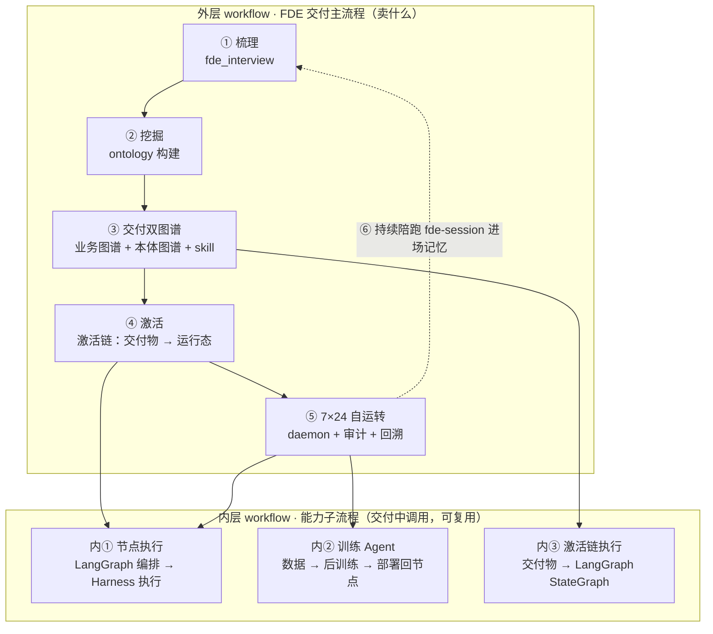

# sofagent 项目导航索引（WIKI）

<p align="center"></p>

> v1.5.2 · 2026-09-24（UTC）· ✅ 已发版 · 孔放勋

> **EN summary**: sofagent is an open-source (MIT) FDE Harness layer for AI Agents — it doesn't build the Agent; it adds the discipline layer around whichever host (DSH / OpenClaw / WorkBuddy) runs it. **Product story**: an FDE maps your workflow, freezes every AI node's acceptance criteria into machine-checkable files, then departs — the Harness judges every change against those files 24/7 (24 git-diff audit rules, HMAC-chained tamper-evident history, every model registered/rolled out/trained/deployed under audit). Five capabilities: inject · audit · rollback · distill · evolve. (Chinese-first project; full English face in README.en.md.)
> **读者**：人类开发者 & AI Agent 均可阅读。本文档是项目全局索引入口。
> 如果你是 AI Agent 且需要查找具体实现路径，请直接跳转到"## 五、文件地图"段。

> ⚠️ **术语声明（AI Agent 与人类读者必读）**：sofagent 现行架构术语以 [ARCHITECTURE.md](./ARCHITECTURE.md) 与 [PHILOSOPHY.md](./PHILOSOPHY.md) 为准——**约束层**（一个层五种能力：注入·审计·回溯·沉淀·进化，FORGE 为内部工具）+ **双层架构**（约束层 × 生命周期）。`docs/archive/` 与 `docs/changelog/v1.0/`、`docs/changelog/v1.1/` 为**历史版本快照**，其中"四引擎""认知底座"等旧术语反映当时版本，**不代表现行设计**，请勿据此推断当前架构；`docs/changelog/v1.5/` 为**当前版本目录**（内容为各版本变更记录；后续排期内容**不代表已交付能力**）。**后训模块归属**：工程骨架随开源仓排期交付 + 训练资产商业侧，真相源见 [ROADMAP](./ROADMAP.md) 版本表。

> **3 分钟建立全景理解**：核心文档太长？先看这 4 条：
> - **[ARCHITECTURE.md](./ARCHITECTURE.md)**：双层架构设计（约束层 × 生命周期）+ 约束层工程三层嵌套（约束层 → Graph → Loop），关键技术决策记录。**3 秒版**：约束层管"做对"（注入·审计·回溯·沉淀·进化）· 激活链四阶段管"跑起来" · Graph 控制图分波次 · Loop 自迭代闭环。
> - **[VALIDATION.md](./VALIDATION.md)**：行业印证与生态定位——sofagent 直觉如何被行业验证 + Agent 三层模型 + 架构框架映射 + 行业坐标（企业 Neo-Lab 的智能主权基础设施，Sovereign AI 四层主权落点）。
> - **[PHILOSOPHY.md](./PHILOSOPHY.md)**：设计哲学与产品方法论（§一~§九）。"不替代 Agent，做 Agent 的控制面"。
> - **[ROADMAP.md](./ROADMAP.md)**：版本路线图 + 迭代历程。当前 v1.5.2。

> **📋 文档分工一页表**（写内容前先看——什么内容往哪个文档写，防止交叉重复）：
>
> | 内容类型 | 落点文档 | 文体 | 纪律 |
> |---------|---------|------|------|
> | 行业案例 / 研报数据 / 外部印证 | [VALIDATION](./VALIDATION.md) | 叙事·印证 | 案例不进 PHILOSOPHY——PHILOSOPHY 只引用结论（如「Harvey 筑起垂直壁垒」），数据与来源全在 VALIDATION |
> | 产品结论 / 设计哲学 / 论证 | [PHILOSOPHY](./PHILOSOPHY.md) | 叙事·论证 | 结论自带的最小论证可以，行业案例展开留给 VALIDATION |
> | 审计规则清单 / 安全边界 | [SECURITY](../SECURITY.md) | 参考 | 24 条规则完整清单只有 SECURITY 一处（SSOT），其他文档只引用不复制 |
> | 版本路线 / 排期 / 探索方向 | [ROADMAP](./ROADMAP.md) | 参考 | 已交付进「迭代历程」、已排期进「版本规划」、未排期进「探索方向」——三态不混写 |
> | 版本变更记录（未发布版） | `docs/changelog/vX.Y/vX.Y.Z.md` | 历史 | 排期版日志不进主 [CHANGELOG](../CHANGELOG.md) 索引（纯已发布索引）；发布时才收编 |
> | 架构决策 / 术语定义 / 数据流 | [ARCHITECTURE](./ARCHITECTURE.md) | 参考 | 行业对标委托 VALIDATION、规则清单委托 SECURITY、路线委托 ROADMAP |
> | 接口总览 / MCP 工具清单 | [API](./API.md) | 参考 | 七大接口面 + 107 tools 分域清单，由 tool-registry.ts 生成（check-docs §17 对账防漂移） |
> | 已知限制 / 诚实边界 | [LIMITATIONS](./LIMITATIONS.md) | 参考 | 各文档披露「已知风险」时引用 LIMITATIONS，不展开重复 |
> | 任务流程 / 操作步骤 / 发版 SOP | [SKILL/](../SKILL/) · [changelog/releasing/](./changelog/releasing/) | 任务流程 | 「干什么用什么步骤」——写给执行者（人/Agent）照着做；深度参考链接 docs/，不复制 |
> | 面向使用者的操作说明 | [README](../README.md) · [HANDBOOK](./HANDBOOK.md) | 用户手册 | 永不含代码库内部细节；开发者向操作说明进 DEVELOPMENT/guides |
> | 全局导航 / 文档间分工 | [WIKI](./WIKI.md)（本表） | 导航 | 只做索引与分工声明；内容本体仅「三层嵌套架构图 / 运行时数据流」两处为已声明例外（见 §四） |
>
> **单一权威源禁二份纪律**：任何清单/数字/规则在仓内出现第二处时，必须一处为权威源、其余标注「引用自哪里」——不维护第二份完整副本（防止与权威源漂移；存量漂移由 check-docs §15 全仓扫描兜底）。

> **30 分钟深度路径**（想动手或评估选型时，承接上面的 3 分钟全景）：① 深入 [ARCHITECTURE](./ARCHITECTURE.md) §一~§二 + [PHILOSOPHY](./PHILOSOPHY.md) §一（在 3 分钟版基础上读双层架构与"不替代 Agent"论证，~15 分钟）→ ② [SECURITY](../SECURITY.md)「已知风险」+ [LIMITATIONS](./LIMITATIONS.md) 目录（诚实边界，~10 分钟）→ ③ 按角色进 [guides/](./guides/)：企业 IT 读 enterprise-deploy · 开发者读 harness-sdk · 想看审查体系读 review-system
>
> **评估选型对照框架**：对照 [README · 什么是 FDE Harness](../README.md#什么是-fde-harness) 对比表 + [VALIDATION](./VALIDATION.md) 生态定位，建议按四维评估——**审计方式 / 部署方式 / 数据主权 / 知识积累**——逐一对照自身现状做选型决策。

---

## 目录

- [一、一句话](#一一句话)
- [二、产品叙事：sofagent 是 FDE Harness 层（不造 Agent，嵌在 Agent 与模型之间做治理）](#二产品叙事sofagent-是-fde-harness-层不造-agent嵌在-agent-与模型之间做治理)
- [三、核心概念](#三核心概念)
- [四、架构全景](#四架构全景)
- [五、文件地图](#五文件地图)
- [六、当前状态](#六当前状态)
- [七、术语表](#七术语表)
- [八、导航：按你的意图选路](#八导航按你的意图选路)

---

## 一、一句话

**sofagent 是一个开源 FDE Harness 层**（MIT，同时也是 FDE 方法论的参考实现）——不造 Agent，嵌在成熟 Agent（DSH / OpenClaw / WorkBuddy）与模型层（通用大模型 + 专属小模型 / 后训练模型）之间做治理：进场把业务判断写成文件（梳理工作流、构建本体图谱、把能自动化的环节变成 AI 节点），部署后按文件 7×24 执行与审计。底层是 **约束层**——约束 Agent 行为、审计每次变更、沉淀经验。**产品形态 = FDE Harness 层**：对执行体（Agent）做约束、对智力源（模型）做治理——它给自己做的第一份 FDE，就是 sofagent 自己（自举）。

---

## 二、产品叙事：sofagent 是 FDE Harness 层（不造 Agent，嵌在 Agent 与模型之间做治理）

> **主轴**：sofagent 全部叙事的主语是同一件事——**判断**（该不该做、做到什么算好、谁拍板）。进场把它写成文件（FDE 交付物），离场按文件执行与审计。**一条 workflow 的产品**：给企业做 AI 落地 = 一条 FDE workflow。执行这条 workflow 的 Agent = 装上 FDE Harness 的 Agent（sofagent 让任何成熟 Agent 具备这个能力）。**它对自己做的第一份 FDE，就是 sofagent 项目本身**——自举循环：FDE Harness 对自己做 FDE → 项目更 AI 化 → 更好地服务企业 → 数据飞轮转起来。**自举不是比喻，是可核对的事实**：本仓的每次变更过审计闸门、判据集版本可举证、门禁故障注入自证、经验沉淀进反思区——sofagent 项目本身就是第一个被 FDEing 的对象，本仓的全部工程纪律都是 FDEing 循环跑过一遍的产物。

**FDE 交付**：进场梳理 → 交付**双图谱**——人看的业务图谱（workflow graph）+ 机器读的本体图谱（ontology graph，本体数据的图形化形态）。图谱里每个 AI 节点承担工作流中的职能；节点执行 = workflow 要求 → LangGraph 编排 → DeepSeek Harness 执行（ExecutionBackend 双后端：workflow 以 DAG 形态在所选后端运行）→ 全程约束层审计 + 回溯净化（plugin 功能）。**行业坐标**：两张图谱同属「知识层」（描述业务世界的语义资产），构建·校验·维护实践属「工程层」（图谱工程），详见 [ARCHITECTURE §一](./ARCHITECTURE.md)。

**训练 Agent（内层新 workflow）**：企业 AI 节点要数据主权 → 训练 Agent（受约束）驱动后训练工具：收集企业数据 → 模型后训练 → 私有化部署回节点。这本身是几个新 workflow（数据采集 / 训练 / 部署）。后训模块**工程骨架**随开源仓排期交付（编排/审计/沙箱，详见 ROADMAP；训练资产走商业侧）；训练也围绕 FDE——怎么让 FDE 更好、怎么让数据飞轮转起来。

> **现实预期（产品口径 · 详细边界见 v1.4.1 开发日志）**：后训练分两种——**行为对齐型**（教模型守企业规矩/风格，用自家服务轨迹数据，sofagent 自给自足）与**知识注入型**（教模型懂行业知识，需企业提供业务数据）。最现实起步 = 行为对齐 + 小模型 QLoRA（一张消费级 GPU 即可）；框架安装、算力检测由训练 Agent 自动接管。期望边界：垂直精调（LoRA/QLoRA），不是从零训大模型。

**内外层 workflow 全景**（产品 = FDE Harness 层嵌在 Agent 与模型之间的可视化）：



> 外层 = 卖什么（FDE 交付，每企业一次 + 持续陪跑）；内层 = 交付中调用的能力（节点执行 / 训练 / 激活，可复用）。全程约束层审计：外层每次 FDE 动作记 fde-session，内层每次节点执行 / 训练决策进审计链。

**为什么这条 workflow 会一直跑**：企业持续需要 AI 落地 → 这条 FDE workflow 不只是 sofagent 的项目，也会成为企业的 workflow。

---

## 二·五、能力全景（用「你遇到的事」说 · 3 分钟版）

> 模块语言（注入/审计/回溯/沉淀/进化）是给开发者的；下面这张表用**用户任务语言**回答「到底能干什么」。状态：✅ 已发版（v1.5.1 · 2026-09-22） · 📋 排期中。

| 你遇到的事 | sofagent 做什么 | 状态 |
|------|------|:--:|
| AI 改代码会不会把密钥/后门带上生产？ | 每次 commit 自动过 24 条安检，违规当场拦截（秒级、零配置） | ✅ |
| AI 搞砸了怎么办？ | 每次变更自动存快照，一键回到任意时点 | ✅ |
| 不知道该在哪些环节上 AI？ | FDE 四阶段：梳理业务流 → 三问判定 → 算清每个节点值多少钱 | ✅ |
| AI 不懂我们公司的规矩？ | 规则写成机器可判定文件注入（五平台挂载，DSH 档逐工具可拦） | ✅ |
| 老板问「AI 到底在干什么」？ | Dashboard 驾驶舱 + 治理 KPI 面板（六卡 + 合规报告导出） | 🚀 |
| 数据怕出门？ | 全部本地；训练数据脱敏后走自控通道；离线 USB 节点完全离线 | ✅/📋 |
| AI 干久了会变强吗？ | 错题本 → 经验考核 → 晋级技能 → 微调内化（自进化闭环，可量化收益） | 📋 |
| 出了事说不清谁干的？ | 每个决策 HMAC 留痕，第三方不装 sofagent 也能验证据 | ✅ |
| 多台设备/多个 Agent 谁来管？ | 设备注册身份码 + 心跳派单 + 数据承接（多设备中间层） | ✅ |

**一句话版**：进场帮你把业务摸清写成文件，离场后管住你的数字员工——干活有安检、出事能回滚、越用越懂你、老板看得见、数据不出门。

**五分钟亲眼看**：`sofagent demo`（v1.5.1 已交付，经 npm 通道可用：`npx -y -p @sofagent/audit sofagent-audit demo`；install 态 CLI 暂无 demo 子命令）——一条命令跑完「注入 → 故意违规 → 审计拦截 → 快照回滚 → 举证导出」完整链路，看到拦截发生的那一瞬间你就懂了这个产品。

---

## 三、核心概念

| 概念 | 一句话 | 详情 |
|------|--------|------|
| **FDE Harness** | 对外的产品身份：**FDE 方法论 × Harness 工程**——同一件事的两个阶段：FDE 进场生成判断（哪里上 AI、做好标准、谁拍板），冻结成交付物（workflow.yml + 本体数据）；约束层离场驻留判断（按交付物 7×24 执行、进化时写回），装进成熟 Agent（DSH / OpenClaw / WorkBuddy）；装上它的 Agent 即以 FDE 方式作业，离场后留一套能持续维护的 AI 化资产 | [README · 什么是 FDE Harness](../README.md#什么是-fde-harness) |
| **约束层** | 对内的技术身份：约束 Agent 行为的「缰绳」——一个层五种能力（注入·审计·回溯·沉淀·进化），编排（FORGE）为内部工具 | [ARCHITECTURE §二](./ARCHITECTURE.md) |
| **约束层七维度** | Agent = 模型 + 上下文 + 工具 + 状态 + 执行控制 + 权限 + 可观测性——五种能力各自覆盖其中哪些维度 | [ARCHITECTURE §一 · 约束层七维度](./ARCHITECTURE.md#约束层七维度agent-的构成面)（维度构成以本行为准；五种能力维度分工详见 [PHILOSOPHY §一·四件事的分工](./PHILOSOPHY.md#四件事的分工mcp--skills--ontology--harness)） |
| **约束层构成（企业视角）** | 黄仁勋定义：企业专属约束层 = 知识 + 记忆 + 工作流 + 权限 + 安全机制 + 运行环境——模型是起点，围绕模型积累的这套专属系统才是核心资产 | [PHILOSOPHY §一·理论锚点](./PHILOSOPHY.md#智能与控制分离sofagent-的理论锚点) |
| **业务图谱** | 人读的流程图谱 = Workflow Graph——FDE 交付的企业工作流完整拓扑，每条业务链路即一条工作流 | [ARCHITECTURE §定义表](./ARCHITECTURE.md) |
| **本体图谱** | 机器读的语义图谱 = Ontology Graph——FDE 交付的企业全部业务节点和关联关系的全局拓扑（本体数据的图形化呈现） | [ARCHITECTURE §定义表](./ARCHITECTURE.md) |
| **工作流** | 企业业务链路的完整流程 = Workflow，由业务节点（AI 节点 + Human 节点）交替组成 | [ARCHITECTURE §定义表](./ARCHITECTURE.md) |
| **业务节点** | 工作流中的执行单元 = Node——AI 自动执行（Loop）或 Human 介入（审批/检查/兜底）；AI 节点 = 业务节点中经三问判定法识别为可 AI 化的部分 | [ARCHITECTURE §定义表](./ARCHITECTURE.md) |
| **审计模块** | git diff 驱动，24 条规则（17 默认 + 7 扩展），活跃编号 A1-A11 + A14-A23 + E1/E2/E4（A12/A13/E3 已并入 A11，编号不再使用），每次 commit 自动跑 | [24 条完整清单（SECURITY SSOT）](../SECURITY.md#24-条审计规则完整清单文档级-ssot) |
| **三层治理** | Ledger（原始数据）→ Views（派生视图）→ Policy（约束规则），单向派生、不可逆写 | [PHILOSOPHY §五](./PHILOSOPHY.md) |
| **FORGE** | 自迭代工具链（内部工具，外部用户可忽略）——通过 Workflow 驱动 Agent 审查/修复/验证自己的代码，核心是 fresh-eyes-loop | [FORGE/README.md](../FORGE/README.md) |
| **SKILL** | Agent 的行为约束文件系统——三层：SKILL.md（主入口）/ harness/（约束层）/ agents/（Sub Agent） | [SKILL/SKILL.md](../SKILL/SKILL.md) |
| **激活链** | FDE 交付物→企业工作流自运转的四阶段生命周期：ACTIVATE→ORCHESTRATE→EXECUTE→SUSTAIN | [guides/fde-activation-chain.md](./guides/fde-activation-chain.md) |
| **data/** | ~/.sofagent/data/ SSOT 数据目录（原 .sofagent/ 已迁移）：history.jsonl、knowledge/、audit/；用户配置入口为项目级 `.sofagent/config.yml`（data/config/ 是 daemon 运行时产物，非用户配置面） | [DEVELOPMENT §数据文件架构](./DEVELOPMENT.md) |

---

## 四、架构全景

```
┌─────────────────────────────────────────────────┐
│  模型层（智力源 · 对模型治理）                    │
│  通用大模型 + 专属小模型 / 后训练模型             │
│  （注册 / 灰度 / 训练 / 部署全留痕）              │
├─────────────────────────────────────────────────┤
│             FDE Harness 层（sofagent）            │
│  ┌─────────┬─────────┬─────────┬─────────┬─────────┐ │
│  │ 注入能力 │ 审计能力 │ 回溯能力 │ 沉淀能力 │ 进化能力 │ │
│  │ 约束注入链│ git diff │ HMAC 链 │知识蒸馏 │自迭代  │←约束层本体│
│  │ SKILL加载│ 24条规则 │ 防篡改  │knowledge│sustain │（五能力）│
│  └─────────┴─────────┴─────────┴─────────┴─────────┘ │
│  分发形态：插件 · Skill · MCP · CLI · Dashboard    │
│  方法论：FDE 四阶段（梳理→构建→部署→离场）         │
│  内部：编排模块 @sofagent/orchestrator（LangGraph）│
├─────────────────────────────────────────────────┤
│  成熟 Agent 宿主（DSH · OpenClaw · WorkBuddy）    │
│  模型 + 工具 + 会话（执行能力，不替代）            │
├─────────────────────────────────────────────────┤
│  data/（运行时数据） │ engine/（13 个 @sofagent/* 包，测试口径 13 包） │
└─────────────────────────────────────────────────┘
```

### 运行时数据流

每个模块运行时往 `data/` 写数据，消费者从 `data/` 读数据：*（完整全景图见 [ARCHITECTURE §二·运行时数据层](./ARCHITECTURE.md)）*

| 生产者（模块） | → data/ 目录 | → 消费者 |
|---|---|---|
| audit（commit→runRules） | `audit/history.jsonl` | daemon（巡检）、think（反思生成） |
| think（generateThinkEntry） | `think.md` | harness 加载链（注入上下文） |
| eval（runEval）⭐ | `eval/history.jsonl` | think（进化模块：passRate 下降→告警） |
| daemon（health-reporter） | `daemon-health.json` | Dashboard（健康面板） |
| daemon（dream-cycle） | `knowledge/` | harness 加载链（Skill 知识注入） |
| FORGE driver（loop） | `forge-runs/`（唯一落点 `~/.sofagent/data/forge-runs/`，仓内 `FORGE/SKILL/*/runs/` 仅占位壳；顶层 `FORGE/runs/` 历史留档已移出仓） | 人类（verdict.md），执行证据查证路径见 [FORGE/README.md](../FORGE/README.md)「runs 目录边界」 |

**数据流铁律**：生产者只写不读自己的输出，消费者只读不写——单向派生，不可逆。

### 三层嵌套：Harness → Graph → Loop

> 📌 **本节是三层嵌套架构图的唯一源（SSOT）**——ARCHITECTURE.md 的「补充视角」只做说明引用此处，不重复维护完整图。修改三层结构请改本段。

上述架构全景中，约束层五种能力（注入·审计·回溯·沉淀·进化）与 FORGE 内部编排不是并列关系——它们按 Agent 工程三层架构嵌套：

```
约束层（工作环境）       Graph（流程拓扑）         Loop（反馈改进）
┌─────────────────┐     ┌──────────────────┐      ┌─────────────────────┐
│ 约束注入链 + 加载链│ ──→ │ 编排模块（内部）     │ ──→  │ FORGE（fresh-eyes +   │
│ 审计能力（24规则）│     │ LangGraph ReactAgent│      │ release-gate-loop）+  │
│ daemon（文件监控） │     │ 多Agent 任务拆解     │      │ sustain（进化能力）    │
│ data/（状态持久） │     │                     │      │ eval 反馈闭环         │
│ ToolGate（权限）  │     │                     │      │                      │
└─────────────────┘     └──────────────────┘      └─────────────────────┘
  决定"能做什么"          决定"下一步去哪"          决定"怎么越做越好"
```

> **一句话记忆**：环境、流程、反馈。约束层给 Agent 一个工作间，Graph 告诉它任务流向哪，Loop 让它出错后能自己改。

---

## 五、文件地图

> 💡 **FDE/ 是给人看的部署流程文档；SKILL/ 是给 Agent 读的行为约束文件。新 Skill 放 SKILL/。**

### 根目录（重要性排序）

| 文件 | 看什么的 |
|------|---------|
| `README.md` | 项目介绍、安装、部署（给人看） |
| `FDE/GUIDE.md` | FDE 诊断方法论四阶段十二步（独立产品入口，见 [FDE/README.md](../FDE/README.md) 总览） |
| `CHANGELOG.md` | 纯目录索引——每版本一行，细节见 `docs/changelog/` |
| `SKILL/SKILL.md` | FDE Harness 主入口（Harness 加载链起点） |
| `install.sh` | 一键安装脚本 |
| `LICENSE` | MIT |
| `SECURITY.md` | 安全策略、审计规则清单 |
| `CONTRIBUTING.md` | 贡献指南 |
| `CODE_OF_CONDUCT.md` | 社区行为准则 |

### docs/ 目录

| 文件 | 看什么的 |
|------|---------|
| `docs/WIKI.md` | **你正在读的这个**——项目导航索引 |
| `docs/PHILOSOPHY.md` | 产品哲学九节：为什么做、三层治理、FDE 定义 |
| `docs/VALIDATION.md` | 行业印证与生态定位：31 篇行业方法论印证、a16z 七法则、Agent 三层模型、架构框架映射 |
| `docs/ARCHITECTURE.md` | 架构详解：约束层五种能力（注入·审计·回溯·沉淀·进化）、数据流、部署模式、文件结构（含 Ledger-Views-Policy ↔ LLM Wiki 三层同构对照） |
| `docs/DEVELOPMENT.md` | 开发指南：本地环境、工作原理、编排哲学、自进化机制、数据文件架构、验证方法论 |
| `docs/HANDBOOK.md` | FDE 操作手册：进场流程、节点部署、持续维护 |
| `docs/ROADMAP.md` | 版本路线图、行业借鉴项、技术预研方向 |
| `docs/LIMITATIONS.md` | 已知限制和适用边界 |
| `docs/API.md` | 接口总览：七大接口面 + MCP tool 分域清单（由 `tool-registry.ts` 生成） |
| `docs/COMMUNITY.md` | 社区现状、贡献路径、公开数据 |
| `docs/guides/fde-activation-chain.md` | 🔗 激活链设计（v1.2.5+）：FDE 交付物 → 企业工作流自动运转（ACTIVATE→ORCHESTRATE→EXECUTE→SUSTAIN） |
| `docs/THANKS.md` | 致谢——谁启发了哪个设计决策 |
| `docs/changelog/` | 每版本开发日志（`v1.0/` `v1.1/` `v1.2/` `v1.3/` `v1.4/` `v1.5/` `v2.0/`）。⚠️ 早期版本日志含"审查元信息/开发过程备注"等非产品文档内容，属当时开发留痕，不代表产品能力声明。✅ **v1.3.3 起已清理审查元信息**（见 v1.3.4 bugfix），当前版本 changelog 只含产品变更声明。以各版本 changelog 顶部的"已开发/已排期"标记为准。规划中版本的开发排期见 [ROADMAP](./ROADMAP.md) |
| `docs/changelog/releasing.md` | **发版 SOP**——十一阶段全流程 |
| `docs/evidence/` | 效果证据：案例、基准测试、反例 |
| `docs/archive/` | 历史归档：实验版 changelog、早期证据、设计文档 |
| `docs/guides/` | 专题指南：部署、测试、Dashboard 开发、Loop 开发等 |

### engine/（13 个 @sofagent/* 模块包（13 个均含 test script）+ @sofagent/load-chain 工具包 + sofagent 裸名总包 umbrella + 2 个插件族 + hooks/scripts 运维件）

| 包 | 职责 |
|----|------|
| `engine/audit/` | @sofagent/audit — 审计模块（git diff + 24 条规则） |
| `engine/core/` | @sofagent/core — 核心类型、HMAC 工具、memory-contract |
| `engine/orchestrator/` | @sofagent/orchestrator — LangGraph createReactAgent 编排 |
| `engine/train/` | @sofagent/train — 后训模块（数据管道/训练编排/云端执行/eval 闭环） |
| `engine/daemon/` | @sofagent/daemon — 后台守护进程（cron 巡检 + 文件监听） |
| `engine/inject/` | @sofagent/inject — SKILL 加载链（上下文注入） |
| `engine/mcp/` | @sofagent/mcp — MCP Server（知识库 CRUD tool）· **107 个 MCP tool**（以 `engine/mcp/src/tool-registry.ts` 的 `TOOLS` 为 SSOT；各版增量见 [API 工具清单](./API.md) 与 [CHANGELOG](../CHANGELOG.md)；插件家族 MCP 面另计） |
| `engine/hooks/sofagent-load-chain/` | @sofagent/load-chain — SKILL 加载链 git hook（工具包，非模块包口径） |
| `engine/scripts/` | 运维脚本集（9 个 .sh + lib/ 模块 + windows/ .ps1 安装与卸载脚本）——安装（install.sh 调用）、卸载、验证（verify.sh）、daemon 管理、运行时审计日志记录等 |
| `engine/dsh-plugins/` | cordis-plugin-sofagent* 7 款 DSH 插件（v1.4.9 P2 合并批 10→7）——6 款原子（audit（含验收门禁面）· rollback · inject · evolve · daemon · fde（本体/FDE/公地三域厚插件））+ 1 款聚合（裸名 `cordis-plugin-sofagent`，一次挂载全套） |
| `engine/openclaw-plugins/` | OpenClaw code-plugin 4 款（ClawHub 发布形态） |
| `~/.sofagent/bin/sofagent` | CLI 入口（安装时生成，不在仓库内）— `sofagent status/where/version/data/help` |
| 其余 6 包（eval/ab-test/evolve/rules/ontology/think） | 详见 `docs/ARCHITECTURE.md §27 个 workspace 源码包`（包数口径：workspace 27 = 13 模块包 + load-chain + dsh-plugin-kit + umbrella + 7 DSH 插件 + 4 OpenClaw 插件，见 §六口径表；**测试计数口径** = 13 个含 test script 的 workspace 包 —— 与 README「工程可信度」段同口径；@sofagent/load-chain 与 @sofagent/dsh-plugin-kit 为工具包另列） |

### 关键数据路径（`data/`）

| 路径 | 内容 |
|------|------|
| `data/audit/history.jsonl` | 审计历史（HMAC 哈希链，append-only） |
| `data/knowledge/` | 知识库（entities / concepts / comparisons / summaries） |
| `data/config/` | daemon 运行时产物（audit-report.json webhook 推送配置等，未配置相关功能时目录不生成）——**不是用户配置入口**；用户配置走项目级 `.sofagent/config.yml` + `watch.yml`（config-loader 三级 fallback，见 [LIMITATIONS §三](./LIMITATIONS.md)） |

---

## 六、当前状态

| 项 | 值 |
|----|-----|
| 当前版本 | **v1.5.2**（2026-09-22，✅ 已发版）· 上一版 v1.5.0（2026-09-19，✅ 已发版） |
| 下一版 | **v1.5.3**（📋 规划中——双规则引擎统一等，以 [ROADMAP](./ROADMAP.md) 规划表为准） |
| 测试覆盖 | 5296 测试 / 13 包（统计标准：`tools/check/test-count.sh` 实际执行的 workspace 包；实测见该脚本，声称数同步校验见 `tools/check/check-test-count.sh`。包数口径见下表注） |
| 审计规则 | 24 条（17 默认 + 7 扩展），活跃编号 A1-A11 + A14-A23 + E1/E2/E4（A12/A13/E3 已并入 A11，编号不再使用），每次 commit 自动跑 |
| FORGE | fresh-eyes-loop + release-gate-loop 运行中 |
| 数据目录 | **data/**（v1.2.1+ SSOT 运行时数据目录） |

> 📦 **包数口径**：全仓共 **27 个 workspace**——13 个 `@sofagent/*` 模块包 + 1 个工具包 `load-chain` + 1 个插件适配层基座包 `dsh-plugin-kit` + 7 个 DSH 插件（v1.5.2 章九起摘 `private` 转 npm 发布物）+ 4 个 OpenClaw 插件 + 1 个 npm 裸名总包 umbrella；其中 15 个发布为 `@sofagent` scope（13 模块包 + `load-chain` + `dsh-plugin-kit`）+ 7 个 DSH 插件 + 1 个裸名总包，共 **23 个 npm 发布物**。OpenClaw 插件经根 `npm test --workspaces` 统一执行测试。

---

## 七、术语表

> **术语标准表述（SSOT）**：对外中文「约束层」、英文「Harness」；「Constraint Layer」「约束底座」为同义归并，统一写作「约束层」，不再单列。

| 术语 | 简释 | 精确定义 |
|------|------|---------|
| FDE | Forward Deployed Engineer——进场生成判断、部署 AI 节点的工程师 | [PHILOSOPHY §一](./PHILOSOPHY.md) |
| FDEing（= Forward Deployed Engineering） | FDE 的动词化——把 FDE 从一项人力工作变成一种可自动执行的能力（人走能力不走，花更少的人力提供更多的能力）；万物皆可 FDEing：任何业务对象、流程、节点被 FDEing 一遍「梳理 → 判定 → 交付 → 养护」。**思维方式三问**：workflow 怎么搭 / AI 节点是什么 / 怎么让 AI 帮实现。FDE 名词位（岗位）、FDEing 动词位（能力与动作），禁混用 | [README · 什么是 FDE Harness（含 FDEing 愿景引语）](../README.md#什么是-fde-harness) |
| 同名导出消歧 | 不同包导出同名符号时以「来源包 + 符号名」双键区分，禁裸符号名 grep 判接线。已知同名对：`routeRequest`——`@sofagent/orchestrator/workflow`（语义路由，route/route-request.ts）vs `canaryRouteRequest`（`@sofagent/train` 权重灰度分流，weight-canary.ts——该导出 v1.5.0 更名避歧） | [ARCHITECTURE §27 个 workspace 源码包](./ARCHITECTURE.md) |
| 中间件（Harness 中间件） | **品类定位词**——答「sofagent 属于哪个品类」（Harness 类运行时/治理框架）；**不是**「约束层是技术实现层的中间件」这一实现论判断 | [ARCHITECTURE §术语对照](./ARCHITECTURE.md#术语对照) |
| Harness | 约束层的英文 SSOT 称法（对外中文「约束层」、英文「Harness」同指一物）——"缰绳"，非"马" | [ARCHITECTURE §术语对照](./ARCHITECTURE.md#术语对照) |
| 双层架构 | 约束层 × 生命周期——约束层保证"每次做对"，生命周期保证"从诊断到自运转怎么走" | [ARCHITECTURE §二·双层架构](./ARCHITECTURE.md#双层架构约束层与生命周期主框架) |
| 三层嵌套 | Harness → Graph → Loop——环境、流程、反馈三层嵌套，决定"能做什么 / 下一步去哪 / 怎么越做越好" | [WIKI §三·三层嵌套](#三层嵌套harness--graph--loop) |
| 激活链四阶段 | ACTIVATE→ORCHESTRATE→EXECUTE→SUSTAIN——交付物从静态文件到自运转 | [guides/fde-activation-chain.md](./guides/fde-activation-chain.md) |
| 数据流铁律 | 生产者只写不读自己的输出，消费者只读不写——单向派生，不可逆 | [WIKI §三·运行时数据流](#运行时数据流) |
| Ledger | 原始数据层（think.md + history.jsonl），append-only | [PHILOSOPHY §五](./PHILOSOPHY.md) |
| Views | 派生视图层（knowledge/ 四子目录），Ledger 单向派生 | [PHILOSOPHY §五](./PHILOSOPHY.md) |
| Policy | 约束规则层（SKILL + fde.md），Agent 启动时注入 | [PHILOSOPHY §五](./PHILOSOPHY.md) |
| FORGE | 自迭代工具链（内部工具，外部用户可忽略）——Agent 审查/修复/验证自己的代码 | [FORGE/README.md](../FORGE/README.md) |
| fresh-eyes-loop | FORGE 的质量审查闭环（a-check→b-check→a-consolidate→b-fix→a-verify） | [FORGE/SKILL/fresh-eyes-loop/SKILL.md](../FORGE/SKILL/fresh-eyes-loop/SKILL.md) |
| release-gate-loop | FORGE 的发版闸门闭环（acceptance-test + regression + 审查报告） | [FORGE/SKILL/release-gate-loop/SKILL.md](../FORGE/SKILL/release-gate-loop/SKILL.md) |
| ToolGate | Agent 工具调用的前置门禁（A2 密钥/A9 注入/A14 越权等规则） | [ARCHITECTURE §27 个 workspace 源码包](./ARCHITECTURE.md) |
| data/ | v1.2.1 SSOT 运行时数据目录（安装后实际位于 ~/.sofagent/data/），替换旧 .sofagent/ | [DEVELOPMENT §数据文件架构](./DEVELOPMENT.md) |

---

## 八、导航：按你的意图选路

### 了解 FDE Harness（产品 → 理念 → 路线）

| 你想…… | 读这个 |
|---------|--------|
| 3 分钟搞懂它是什么、能干什么 | [README.md](../README.md) |
| 理解设计哲学（为什么这么做） | [PHILOSOPHY.md](./PHILOSOPHY.md) |
| 看行业印证与生态定位 | [VALIDATION.md](./VALIDATION.md) |
| 看版本路线图和下一步 | [ROADMAP.md](./ROADMAP.md) |
| 了解激活链（交付物怎么自己跑起来） | [guides/fde-activation-chain.md](./guides/fde-activation-chain.md)（v1.2.5+） |
| 作为 FDE 进场部署 | [HANDBOOK.md](./HANDBOOK.md) |
| 找效果证据/案例 | [docs/evidence/](./evidence/) |

### 部署 / 集成 / 开发

> 📦 **两条分发通道互斥，别都装。**①**托管只读订阅**——从 ClawHub / SkillHub 装 Skill 或插件，文件由平台管理、随包更新、本地只读，适合「按原样用」；②**拷进项目可改**——把 Skill 文件复制进你自己的项目或工作目录，可自由改，适合「按自己团队改」。**两个都装 = 同一份技能存在两份副本**：改了一份另一份不知道，Agent 可能加载到旧的那份。选一条通道，别混用。

| 你想…… | 读这个 |
|---------|--------|
| 用治理面板 / 查 trace 对账（v1.5.0+） | [HANDBOOK 治理面](./HANDBOOK.md) · [devlog v1.5.0](./changelog/v1.5/v1.5.0.md) |
| 查接口总览（107 MCP tools） | [API.md](./API.md) |
| 了解系统怎么设计的 | [ARCHITECTURE.md](./ARCHITECTURE.md) |
| 搭建本地开发环境 | [DEVELOPMENT.md](./DEVELOPMENT.md) |
| 查某个版本改了什么 | [CHANGELOG.md](../CHANGELOG.md) → `docs/changelog/vX.Y/vX.Y.Z.md` |
| 了解审计规则 | [SECURITY.md](../SECURITY.md) + [ARCHITECTURE §三](./ARCHITECTURE.md) |
| 了解 SKILL 约束体系 | [SKILL/SKILL.md](../SKILL/SKILL.md) |
| 配置 GitHub Actions CI | [guides/github-action.md](./guides/github-action.md) |
| 了解文件系统审计 | [guides/filesystem-audit.md](./guides/filesystem-audit.md) |
| 开发/维护 HTML Dashboard | [tools/dashboard/dashboard.html](../tools/dashboard/dashboard.html)（单文件实现 · `serve-dashboard.mjs` 启动 · 设计标准见 [guides/frontend-design-standard.md](./guides/frontend-design-standard.md)） |
| 企业部署指南 | [guides/enterprise-deploy.md](./guides/enterprise-deploy.md) |
| 多设备联邦同步 | [guides/multi-device-sync.md](./guides/multi-device-sync.md) |
| 团队批量部署 | [guides/team-deploy.md](./guides/team-deploy.md) |
| 接入千问办公（QwenWork） | [guides/qwenwork-integration.md](./guides/qwenwork-integration.md)（MCP 确定可接 · Hook 拦截待实测） |
| 了解多 Agent 团队协作协议 | [guides/team-collaboration-protocol.md](./guides/team-collaboration-protocol.md)（L2 协作底层协议 · v1.3.3） |
| 节点级审计（DSH 事件流口径） | [guides/node-level-audit.md](./guides/node-level-audit.md)（24 条规则子集逐条判定） |
| 运行测试 / 验证效果 | [guides/testing.md](./guides/testing.md) |
| 开发/维护前端（Dashboard 等） | [guides/frontend-design-standard.md](./guides/frontend-design-standard.md)（设计标准 + 开发指南，改前端前必读） |
| 在 DSH 中挂载 sofagent MCP | [guides/dsh-mcp-integration.md](./guides/dsh-mcp-integration.md)（v1.3.5 起 MCP 互通） |
| 用 SDK 接入约束层 | [guides/harness-sdk.md](./guides/harness-sdk.md)（SubAgent 托管 SDK · `harness.wrap` 一行包装） |
| 了解后训模块 | [guides/train-stack.md](./guides/train-stack.md)（双栈契约）+ [train-security.md](./guides/train-security.md)（攻击面声明）+ [train-quickstart.md](./guides/train-quickstart.md)（v1.4.5 十步端到端入门） |
| 判断一个场景该不该上后训 | [guides/fde-training-baseline.md](./guides/fde-training-baseline.md)（能力阶梯四格逐级排查） |
| 浏览全部专题指南 | [guides/README.md](./guides/README.md)（按角色六类索引） |
| 添加新审计规则 | `engine/audit/src/rules/` → 对照现有规则模式（defaultRules / extendedRules） |
| 新建 Sub Agent | `SKILL/agents/` → 参照 `agents/engineer/SKILL.md` |
| 运行测试 | `npm test`（根目录）；全量统计以 `tools/check/test-count.sh` 为准，`npm test` 直跑遇 mcp 超时属 flaky，重跑即可 |

### 贡献 / 审查 / 发版（内部工程）

| 你想…… | 读这个 |
|---------|--------|
| 了解 FORGE 自迭代工具链 | [FORGE/README.md](../FORGE/README.md) |
| 给 FORGE 加新 Loop | [guides/loop-development.md](./guides/loop-development.md) |
| 走发版流程（十一阶段 SOP） | [docs/changelog/releasing.md](./changelog/releasing.md) |
| 跑独立审查 | [playbook/fresh-eyes-review.md](../playbook/fresh-eyes-review.md) |
| 贡献代码 | [CONTRIBUTING.md](../CONTRIBUTING.md) |

---

> **维护规则**：本文档由 AI 在每次发版时更新（版本号、文件清单、状态表）。当前版本 v1.5.2 · 孔放勋 · 2026-09-24。
