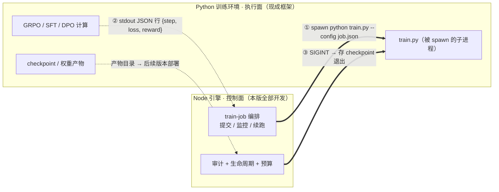

# v1.4.1 开发日志 — 训练引擎 · 地基（编排 + 审计 + 隔离 + 指纹 + 签名 + 回收 + 恢复 + 安全）+ SKILL 体系重构 + 依赖升级

> 📋 **已交付（已发布 2026-08-27 · 2026-08-25 开发完成）。** 前置依赖：v1.3.1（LLM Trace / Benchmark 评测 / 审批模式）+ v1.3.2（Trace 任务级轨迹 / client_type 插槽）+ **v1.3.6（训练协议三约定 + 训练预算控制 · B2 决策前移）**
> ✅ 已交付——训练引擎八大块已实现（编排/审计/隔离/指纹/签名/回收/恢复/安全，2026-08-25 开发完成）。**SKILL 体系重构 + DSH 插件降实已提前落地**（见文末「提前落地」节，2026-08-25 拍板随本版分发）。
> 交付：八大块（编排/审计/隔离/指纹/签名/回收/恢复/安全）+ 依赖升级 + 附项（SKILL 体系重构 + DSH 插件降实）· **workspace 口径 3178 tests across 12 packages 全绿**（2937→3178 +241：train 模块贡献；v1.4.0 后 bugfix 批曾计入基线。另 v1.4.2 bugfix 批 +24（H-01 三层防线/H-02 密钥盲区/H-03 空白折叠/G-01 基线/G-07 脱敏回归用例）→ 本文档定稿后实测 3202；DSH 插件 27 + OpenClaw 插件 17 独立口径不变）· 四门禁全绿（check-version / check-test-count / check-docs / check-review-system）

## 探索方向归并（2026-08-13 评估 · 从 ROADMAP 探索方向升级为本版排期）

> 本版无归并条目。曾评估将「RL 训练治理（AGT Agent Lightning 启发）」归并进本版，2026-08-25 复审裁决**留在 ROADMAP 探索方向表**——reward shaping 需要训练引擎跑通后再接（本版只有地基骨架，无 reward 回路可挂），强行同版交付 = 无实现载体的空头承诺。待 v1.4.4 信号与部署闭环交付后（A/B 对比训练成型）再评估排期。

## 定位

> 🚀 **训练引擎 = 把「后训练」从脚本变成可交付、可审计、可打包的产品能力**——让「提供训练管线 / 联合训练」两种企业专属模型交付模式成立。本版是**地基**：先把双栈契约、训练任务编排、训练审计、预算控制四条定下来——**没有它们，后面的数据管道 / eval / 沙箱都无处安放**。
>
> ⚠️ **训练引擎是可选能力**：企业用通用模型 + 约束层即可获得 sofagent 的全部核心价值（审计 / 注入 / 回溯 / 进化）；仅当需要企业专属模型（如产线校准、领域专属微调）时才走训练引擎。训练引擎服务的是「有数据、要专属模型」的客户，不是所有客户都需要。
>
> 🔗 **2026-08-12 前移说明（B2 决策）**：原 v1.4.1 的「训练协议三约定」+「训练预算控制」**前移至 v1.3.6**（理由：协议是双栈契约不依赖完整训练引擎，提前定稿让接入企业专属模型的早期试点客户更早接入；预算控制是横切能力，与协议同版避免割裂）。本版保留双栈架构决策作为背景，**编排/审计/隔离/指纹/签名/回收/恢复/安全八大块仍在本版**。

**归属边界（2026-08-10 拍板）**：训练引擎的**工程骨架放开源约束层**（通用工程能力 = 编排/审计/沙箱，开源是信任杠杆），**训练资产放模型层**（配方/权重/数据基准 = 壁垒，商业侧）。

**版本拆分（2026-08-10 拍板）**：训练引擎拆四版——**v1.4.1 地基**（本版：编排+审计+隔离+指纹+签名+回收+恢复+安全）→ **v1.4.2 数据与评估**（数据管道/训练集版本/eval 闭环/环境管理/dry-run/训练报告）→ **v1.4.3 运行与需求**（监控+GPU 队列/失败诊断/沙箱+设备打包/需求推导+模板库）→ **v1.4.4 信号与部署闭环**（语料导出三件套/企业专属模型权重部署/产物注册衔接/多基座对比）。

### 交付清单速览

| # | 优先级 | 交付 | 一句话 | 详见 |
|---|:---:|------|--------|------|
| 一 | P0 | 🚂 双栈架构决策 | Node 控制面 + Python 执行面（spawn 契约 + Metal 阶段 0 实测验证路径） | §一 |
| 二 | P0 | ⚙️ 训练任务编排层 | train-job 生命周期（创建/幂等/调度骨架，`train_submit` 66→67 tools） | §二 |
| 三 | P0 | 📒 训练任务审计 | train_job 审计事件 HMAC 链（谁训的/用啥数据/产物指纹） | §三 |
| 四 | P0 | 🔐 训练隔离边界 | enterpriseId 强制绑定 + 覆写清理（多企业数据主权） | §四 |
| 五 | P1 | 🧬 可复现指纹 | datasetHash + 环境快照 + HMAC 冻结 + 不可变重冻结拒绝 + 续跑版本锁定 | §五 |
| 六 | P1 | ✍️ 产物完整性校验 | 权重 HMAC 签名 + 加载阻断（审计 DNA 延伸到权重文件） | §六 |
| 七 | P1 | ♻️ 中断与资源回收 | 心跳守卫 + 四步回收（kill/GPU/tmp/audit）+ 孤儿巡检 | §七 |
| 八 | P1 | 🔄 崩溃后恢复 | 启动扫描 + 三选项决策 + 假活清理（engine-crash-log） | §八 |
| 九 | P1 | 🛡️ 训练安全基线 | 路径白名单 + 注入过滤 + 凭据脱敏（红队攻击面声明） | §九 |
| 十 | P2 | 📦 依赖升级 | LangChain 三包 + vitest（巡检周报收编） | §十 |
| 附 | P1 | 🧩 SKILL 体系重构 + DSH 插件降实 | 主入口信息架构升级 + 9 款插件 description 虚标修复 | §提前落地 |

> P0 = 核心承诺；P1 = 能力深化；P2 = 体验优化。附项为 v1.4.0 后零信任核查发现的缺口修复，2026-08-25 拍板随本版分发。

---

## 训练 Agent 化 · 架构决策（2026-08-23 拍板 · 主线收敛）

> **决策**：训练引擎的**管理面由「受约束的训练 Agent」承载**——训练不是引擎旁路子系统，而是约束层治理的一个 Agent 任务（与跑业务的 Agent 同一套铁律/审计/回溯/进化）。计算面仍由开源框架执行（verl/DeepSpeed spawn）。本决策与「复用 vs 自研边界」并列，是训练引擎的两条主线约束。

### 分层（Agent 管决策 · 框架管计算 · 引擎管资源）

| 层 | 承载 | 说明 |
|---|---|---|
| **决策面** | 受约束的训练 Agent | 数据质检 / 超参选择 / 失败诊断 / 评估 / 晋升决策——有 LLM 决策空间，走约束层（注入训练铁律 + 审计 + 可回溯 + think.md 进化） |
| **计算面** | verl / DeepSpeed（spawn） | LoRA 微调确定性计算，Agent 不碰（防「每步都问 LLM」的成本/不确定性/审计噪音） |
| **资源面** | 训练引擎（Node 控制面） | GPU 队列 / 显存预算 / checkpoint 续跑 / 失败恢复——确定性流程，代码执行 |

### 实现形态：训练 workflow + 约束层插件（非「训练插件」）

训练 = LangGraph 编排的 workflow（ExecutionBackend 双后端 v1.3.6：LangGraph / DSH 二选一执行），约束层能力作为 cordis-plugin 家族插件挂到训练流程 seam：

| 插件 | seam | 对训练的作用 |
|------|------|------------|
| inject | apply(ctx) | 注入训练铁律（预算红线 / 合规红线 / 数据脱敏） |
| audit | tools/result + tools/pre-execute | 训练 Agent 每次工具调用留痕 + 违规当场拦截（= train_job 审计） |
| gate | turn-stopping | 验收不过不放行（训练质量门禁） |
| evolve | think.md + Dream Cycle | 沉淀训练经验 → 下轮训练改进 |

### 后端收敛（防双生态重复）

训练 Agent 走 **DSH（DeepSeek Harness）为主**（与 v1.4.0 cordis-plugin 家族同生态）；OpenClaw 侧只分发轻量能力（训练状态查看 / 审批），**不做第二个训练 Agent**。

### 复用 vs 自研延伸

**复用**：ExecutionBackend 双后端（v1.3.6）· cordis-plugin 家族 seam（v1.4.0）· 审计/审批/决策日志/think.md（主仓）· LangGraph 编排容器。**自研新增**：训练语义的 seam 扩展（数据质检 seam / 评估 seam）——在 cordis-plugin 通用 seam 上补训练特有钩子，不重造插件机制。

### 操作面：语言对话 = 训练的操作界面（2026-08-23 用户拍板）

> **为什么需要训练 Agent**（产品经理视角，作者原话）：「我不会写代码，驱动 Agent 写；我也不会调服务器上的训练工具，所以需要一个操作界面——语言对话驱动 Agent，Agent 驱动后训练工具。」
>
> **三层视角统一**：
> - **用户视角（操作面）**：语言对话 → 训练 Agent → 训练工具——用户不需要懂 GPU/超参/框架，像跟同事交代任务一样驱动训练
> - **实现视角（架构面）**：训练 Agent 内部 = 决策面（LLM 决策）+ 资源面（引擎调度）+ 计算面（开源框架）——见上方分层表
> - **治理视角（约束面）**：训练 Agent 全程走约束层（审计/注入/回溯/进化）——训练过程和 Agent 跑业务同样被管住
>
> **这决定了训练引擎的第一用户是"非工程师"**（产品经理/业务负责人）——训练引擎的价值主张 = 把「模型后训练」从工程师的黑盒操作变成**语言对话可驱动的受审计流程**。

### 训练 Agent 决策点清单（2026-08-23 扩展）

训练 Agent 的决策点（LLM 决策、走约束层）在六版本中的分布：

| 决策点 | 版本 | 内容 |
|--------|------|------|
| **环境准备**（2026-08-23 新增） | v1.4.1 | 检测 GPU → 安装/配置 LLaMA-Factory / verl / CUDA → 验证可用 → 报告——**把"框架就绪"从企业手动装变成 Agent 自动装**（后训练三个硬前提之一被 Agent 接管） |
| 数据质检 | v1.4.2 | 训练集质量把关（脏数据/重复/脱敏验证） |
| 失败诊断 | v1.4.3 | 训练失败（OOM/loss 发散）读日志诊断 + 修复建议 |
| 评估/晋升 | v1.4.4 | 训练质量评估 → 决定晋升/回滚 |
| 持续训练触发/回退 | v1.4.5 | 数据回流评估 → 触发/回退保护 |

### 现实预期与边界（2026-08-23 落盘 · 防不切实际预期）

> **v1.4.6 开发完后能否开始后训练？能跑通链路，但有边界。** 本段写给未来的训练引擎开发者与用户——一开始就知道边界，不抱不切实际的预期。

| 项 | 现实 |
|---|---|
| **能跑通** | 数据 → 训练集 → 编排 spawn 框架 → LoRA 微调 → 评估 → 注册部署，链路完整（v1.4.1-1.4.6） |
| **三个硬前提** | ① 算力（QLoRA 一张 4090 可跑小模型 1~8B；大模型需专业卡/云 VM）② 训练框架就绪（Agent 自动装，见决策点清单）③ 数据 |
| **两种后训练别混** | **行为对齐型**（教模型守规矩/按企业风格做事）= 五源服务轨迹数据，sofagent 自给自足；**知识注入型**（教模型懂行业知识）= 企业业务数据（CSV/DB 导入），数据在企业 |
| **最现实起步** | 行为对齐型 + 小模型 QLoRA（一张 4090）= 零额外数据成本的最低门槛路径 |
| **不现实的预期** | 从零训大模型/比肩 GPT——sofagent 定位是垂直精调（LoRA/QLoRA），全参数训练是自有模型层的事 |

> ⚠️ **依赖项**：训练 Agent 走 DSH 依赖 DSH 正式版（v1.3.6 双后端镜像验证待正式版跑通）；计算面依赖企业环境安装开源框架（Agent 负责装）。

---

## 复用 vs 自研边界（防重复造轮子 · 2026-08-23 收敛拍板）

> **背景**：训练引擎规划被质疑"脱离主线 / 重复造轮子"。收敛结论：**训练引擎 = 治理能力向训练领域的横向扩展**（审计 Agent 的引擎去审计训练），轮子（算法/跟踪/服务）全部复用现成，只自研两块别人没做的（数据闭环 + 训练审计）。

| 能力 | 来源 | 说明 |
|------|------|------|
| LoRA 微调计算 | **复用 LLaMA-Factory / Unsloth / verl / DeepSpeed**（spawn，不重写） | 开源社区标准，v1.4.6 明确"verl/DeepSpeed 集群 spawn" |
| 实验跟踪 | **复用 MLflow**（v1.3.9 已接 logBenchmarkToMlflow） | 不重复造跟踪 |
| 推理服务 | **复用 vLLM / SGLang / Triton**（train serve 封装） | 不重写推理引擎 |
| 模型元数据/版本/阶段 | **复用 MLflow Model Registry**（存储层） | sofagent 不重写注册表 |
| 审计引擎（24 规则） | **复用主仓**（train_job 审计 = 审计能力向训练领域复用） | 不重写 |
| 身份/权限/审批 | **复用主仓**（enterpriseId 隔离 / 训练人审） | v1.3.7 已交付 |
| 模型注册/灰度骨架 | **复用主仓 model_register**（v1.3.6 已交付 endpoint 型） | v1.4.1 扩展本地权重部署 |
| 四源轨迹数据 | **复用主仓**（decision-log / llm-calls / evaluation-log / runtime-audit） | 语料导出的原料，v1.3.x 就在记录 |
| 双栈契约 | **复用 v1.3.6 训练协议三约定**（Node spawn Python + stdout JSON + SIGINT） | 已定稿 |
| MCP / Dashboard | **复用主仓**（`train_submit` tool 本版新增；训练状态查询/训练区块随 v1.4.3 监控交付） | — |
| **train-job 编排层** | **自研（差异化）** | 轻量编排（非 K8s）——Kubeflow/Determined 对企业过重，企业不该为训一个 LoRA 先上 K8s |
| **语料导出三件套（四源→训练集）** | **自研（差异化 · 无成熟项目）** | 用自家 Agent 运行轨迹构建训练集——数据闭环是 sofagent 独有 |
| **训练全过程审计（硬证据）** | **自研（差异化 · 无成熟项目）** | 谁训的 / 用的啥数据 / 产物指纹 / 合规红线——训练治理闭环 |
| **GPU 队列 / 显存预算排队** | **自研（轻量）** | 资源感知层，通用 Workflow 容器不管资源 |

**模型注册差异化（vs MLflow Model Registry）**：MLflow 管"模型元数据/版本/阶段"（复用），sofagent 管"模型怎么来的"——**train-job 关联（这个权重是哪个训练任务产的）+ 语料指纹（用哪批数据训的）+ 合规红线 + 强制人审 + 灰度切换留痕**。定位：**MLflow Registry 之上的治理层**，不是替代品。

**自研判断标准**：候选能力先回答"现成项目有没有？有 → 复用（spawn/封装）；没有 → 是否 sofagent 治理哲学的自然延伸（审计/数据/编排）？是 → 自研；否 → 砍掉或降级"。

---

## 一、双栈架构决策（Node 控制面 + Python 执行面）

### 背景：Node/TS 后训练生态调研（2026-08-10 实测）

主流生产后训练框架（verl / TRL / NeMo RL / Oumi / open-instruct）在 2026 年**全部是 Python**（PyTorch + CUDA 生态决定，Node 无法绕过）。唯一纯 Node 方案：

| 方案 | 生态 | 硬约束 | 用途 |
|------|:---:|------|------|
| **@mlx-node/trl**（npm） | ✅ Node 18+ | **仅 Apple Silicon（M1+）Metal GPU**，SFT/GRPO/DPO + 内置 reward + checkpoint | **个人 Mac 阶段 0 验证**（reward 规则 → 收敛），不用于客户交付 |
| verl / TRL / NeMo RL / Oumi | ❌ Python | CUDA GPU（x86 + 4090 等） | **生产 + 企业交付**，不可替代 |

### 决策

**双栈不可避免，但用「Node 控制面 + Python 执行面」控制**——业界标准做法（NeMo RL 自己也是 Ray 控制面 + Megatron 训练后端）：

- **编排 / 审计 / 生命周期 / 预算全在 Node**（像 dag-runner 管 Agent 一样管 train job）
- **Python 只当被 spawn 的训练子进程**——接口 = 进程参数 + JSON 事件 + 日志流，双栈解耦
- **个人 Mac 阶段 0 用 @mlx-node/trl 纯 Node 跑通验证路径**（reward 规则 → 收敛），验证通过后再无缝换 Python 框架做生产——**阶段 0 不用碰 Python**，省掉学习成本

> 🔗 **训练协议三约定 + 训练预算控制已于 2026-08-12 前移至 v1.3.6**（B2 决策）。本版基于该协议实现完整训练引擎骨架，不再重复定义协议字段——若 v1.3.6 与本版有冲突，以 v1.3.6 协议定义为准，本版只做实现消费。

---

## 二、训练任务编排层（train-job 生命周期 · 引擎骨架）

### 痛点

没有编排层，Oumi 只是「客户自己会的工具」不是「我们交付的能力」——「提供训练管线」交付模式直接缺地基。与 dag-runner 管 Agent 同构：训练任务也是一种长任务。

### 交付

| 组件 | 能力 |
|------|------|
| **train submit** | 提交训练任务（数据路径 + 基座 + 算法 SFT/DPO/GRPO + 超参 + 预算）→ 生成 train job 实例（trainJobId） |
| **train 监控** | 训练进度（step/epoch/loss/reward 曲线）实时可查——事件流从 Python 子进程回流 |
| **train 取消 / 重跑** | 任务可取消、可带 checkpoint 续跑（复用 v1.3.1 Durable Execution checkpoint 语义） |
| **train 生命周期** | queued → running → checkpointing → completed / failed / cancelled，状态机 + 幂等 |
| **checkpoint 管理** | 训练产物（checkpoint / LoRA adapter / 量化权重）目录规范 + 版本清单（衔接 v1.4.4 企业专属模型权重部署） |

### 涉及文件（预估）

| 文件 | 改动 | 说明 |
|------|------|------|
| `engine/orchestrator/src/train/train-job.ts` | 新建 | train job 数据模型 + 状态机 |
| `engine/orchestrator/src/train/train-scheduler.ts` | 新建 | 任务编排（提交/监控/取消/续跑）——spawn Python 子进程 + 事件回流 |
| `engine/mcp/src/tools/train-submit.ts` | 新建 | MCP `train_submit` tool |
| `engine/orchestrator/src/__tests__/train-job.test.ts` | 新建 | 单测（状态机 + 幂等 + checkpoint 续跑） |

### 验收标准

- [x] `train_submit` 提交 → train job 状态机流转（queued → running → completed）
- [x] 训练进度事件流回流（step/loss/reward 可查）
- [x] 取消 / checkpoint 续跑可用（幂等，不重复消费）
- [x] 训练产物目录规范落地（衔接 v1.4.4 权重部署）
- [x] **SKILL.md 登记本版 MCP tool（仅 `train_submit`；`train_budget` 是 v1.3.6 已交付工具、SKILL.md 已登记，勿重复登记，只确认未被本版改动覆盖），工具数声称同步 66→67—— check-version.sh 工具数校验通过**
- [x] `npm test` 全绿

---

## 三、训练任务审计（train_job · 训练本身可审计）

### 定位

对齐 sofagent 铁律「所有断言必须可实测」——训练任务本身要可审计、可回滚：谁提交的 / 用了什么数据 / 什么超参 / 产出什么权重。

### 交付

| 组件 | 能力 |
|------|------|
| **train_job 审计事件** | 提交 / 开始 / checkpoint / 完成 / 失败 / 取消——每次记 `train_job` 事件（trainJobId + 数据源 hash + 超参 + 产出） |
| **数据溯源** | 训练集来源 hash（数据管线输入指纹）——训练可追溯 |
| **失败回滚** | 训练失败 → 回滚到上一 checkpoint / 干净状态（git snapshot 兜底） |

### 涉及文件（预估）

| 文件 | 改动 | 说明 |
|------|------|------|
| `engine/audit/src/writer.ts` | 修改 | 增加 `train_job` 事件类型（对齐 decision-log 模式） |
| `engine/orchestrator/src/train/train-audit.ts` | 新建 | train job 审计写入（复用 atomicAppendSync + HMAC） |

### 验收标准

- [x] 每次 train job 状态迁移记 `train_job` 审计事件
- [x] 数据源 hash 入库（训练集可溯源）
- [x] 失败回滚可用（上一 checkpoint 恢复）
- [x] `npm test` 全绿

---

## 四、训练隔离边界（多企业场景的数据主权）

### 定位

> 📋 **2026-08-10 补充（企业 IT 头号关切）**：训练引擎服务多个企业时，A 企业的训练数据 / 权重 / 审计记录 / 成本，必须保证不串到 B 企业。v1.3.0 曾声称「运行时审计日志按 git 仓库隔离」（复核注记：该能力未随版落地，转规划）——训练引擎的隔离维度需要真正落地且清晰。这是企业 IT 视角的头号问题（「财务 Agent 和人事 Agent 用同一个底座，数据会串吗」同样适用于训练），不补就是定时炸弹。

### 交付

| 组件 | 能力 |
|------|------|
| **enterpriseId 全链路绑定** | 每个 train job 绑定 `enterpriseId`——数据/权重/审计/成本全链路带这个标记，查询/导出/清理均按 enterpriseId 过滤 |
| **隔离边界约定** | 训练产物目录结构按 enterpriseId 分区（`data/train/<enterpriseId>/<trainJobId>/`）；审计事件强制带 enterpriseId 字段（缺失拒绝写入） |
| **清理标准** | 训练后清理走**覆写标准**（非简单删文件）——`train cleanup <enterpriseId>` 覆写训练中间产物（权重目录 + 临时数据），满足数据主权要求 |
| **跨企业访问阻断** | A 企业的 train job 不能读 B 企业的训练集 / 权重 / 审计——训练状态查询（本版 train_submit 返回的 trainJobId 粒度 + v1.4.3 监控 tool）默认按当前 enterpriseId 过滤 |

### 涉及文件（预估）

| 文件 | 改动 | 说明 |
|------|------|------|
| `engine/orchestrator/src/train/train-job.ts` | 修改 | 数据模型加 enterpriseId 字段（必填，缺失拒绝创建） |
| `engine/orchestrator/src/train/isolation-guard.ts` | 新建 | 跨企业访问阻断（查询/读取均校验 enterpriseId 一致） |
| `engine/orchestrator/src/train/cleanup.ts` | 新建 | 覆写清理（权重目录 + 临时数据） |
| `engine/orchestrator/src/__tests__/train-isolation.test.ts` | 新建 | 单测（跨企业访问阻断 + 清理覆写 + 全链路标记） |

### 验收标准

- [x] train job 绑定 enterpriseId，全链路（数据/权重/审计/成本）带标记
- [x] A 企业 train job 不能读 B 企业数据/权重/审计（跨企业访问阻断）
- [x] `train cleanup` 走覆写标准（非简单删文件）
- [x] `npm test` 全绿

---

## 五、训练可复现指纹（train-fingerprint · 完整输入冻结）

### 定位

> 📋 **2026-08-10 补充（A/B 对比训练的声称基础）**：训练不可复现是 ML 最大痛点。sofagent 以审计为 DNA，训练必须做到：**给定 trainJobId，能 100% 复现那次训练的全部输入**——数据 hash + 环境清单 + 超参 + 随机种子，缺一不可。v1.4.2 有训练集版本、v1.4.1 有超参（job.json）+ 环境版本清单（train-env.json），但三者分散，没有绑定为「一次训练的完整指纹」。没有这个绑定，v1.4.4 的 A/B 对比训练（train compare）「同数据同超参」声称站不住——无法证明两次训练真的用了完全相同的输入。

### 交付

| 组件 | 能力 |
|------|------|
| **train-fingerprint.json** | train job 完成时冻结不可变指纹：`{trainJobId, datasetHash, datasetVersion, envSnapshot (train-env.json), hyperparams (job.json), randomSeed, timestamp, hmac}` |
| **HMAC 签名** | 指纹文件 HMAC 签名（复用 decision-log HMAC 链模式）——篡改可检测 |
| **复现校验** | `train reproduce --fingerprint <file>` → 校验当前数据/环境/超参与指纹一致，不一致报告差异（哪一环变了） |
| **A/B 对比基础** | v1.4.4 `train compare` 的「同数据同超参」校验基于指纹——指纹不一致的对比无意义 |
| **checkpoint 续跑版本锁定** | checkpoint 时冻结当前 datasetVersion 引用——续跑时**强制校验数据集版本未变**，变了则告警 + 人审（不自动切换版本）。防止「同 trainJobId 前半段 v3 后半段 v4」破坏可复现性 |

### 涉及文件（预估）

| 文件 | 改动 | 说明 |
|------|------|------|
| `engine/orchestrator/src/train/train-fingerprint.ts` | 新建 | 指纹生成（三元组绑定）+ HMAC 签名 + 复现校验 + 续跑版本锁定 |
| `engine/orchestrator/src/__tests__/train-fingerprint.test.ts` | 新建 | 单测（指纹生成 + 篡改检测 + 复现校验差异报告 + 续跑版本竞争拦截） |

### 验收标准

- [x] train job 完成时生成 `train-fingerprint.json`（数据 hash + 数据集版本 + 环境清单 + 超参 + 随机种子）
- [x] 指纹 HMAC 签名，篡改可检测
- [x] `train reproduce` 校验当前状态与指纹一致性，不一致报告差异
- [x] **checkpoint 续跑强制校验 datasetVersion——版本变了告警 + 人审，不自动切换**
- [x] `npm test` 全绿

---

## 六、训练产物完整性校验（权重防篡改 · 审计 DNA 延伸）

### 定位

> 📋 **2026-08-10 补充（审计 DNA 对齐）**：sofagent 铁律「审计每次变更」。训练产出的 LoRA adapter / 量化权重是**二进制文件**——v1.4.4 规划了版本清单 + 目录规范，但没有**完整性校验**。权重文件被篡改后挂到生产节点，行为就变了，审计链上没有任何一道闸能发现「这个权重不是训练出来的那个」。审计日志有 HMAC 链（事件级），权重文件也需要同等强度的产物级校验。这条不补，训练引擎的「可审计」只到事件级，不到产物级。

### 交付

| 组件 | 能力 |
|------|------|
| **训练产物签名** | 训练完成时对权重产物（adapter.safetensors / 量化权重）逐文件算 SHA-256 + 汇总 HMAC 签名——写入 `artifact-manifest.json`（与 train-fingerprint.json 关联） |
| **加载校验** | `model_register` 加载权重时校验签名——签名不匹配拒绝挂载 + 记 `artifact_tampered` 审计事件（高危告警） |
| **篡改检测** | `train verify <trainJobId>` → 重算权重 hash 比对 manifest——巡检脚本可批量验证历史产物完整性 |

### 涉及文件（预估）

| 文件 | 改动 | 说明 |
|------|------|------|
| `engine/orchestrator/src/train/artifact-signing.ts` | 新建 | 权重 hash + HMAC 签名 + manifest 生成 |
| `engine/orchestrator/src/train/artifact-verify.ts` | 新建 | 加载校验 + 巡检验证 |
| `engine/orchestrator/src/__tests__/artifact-signing.test.ts` | 新建 | 单测（签名 + 篡改检测 + 加载阻断） |

### 验收标准

- [x] 训练完成时生成 `artifact-manifest.json`（权重逐文件 SHA-256 + 汇总 HMAC）
- [x] `model_register` 加载权重校验签名，不匹配拒绝挂载 + 记审计
- [x] `train verify` 可巡检历史产物完整性
- [x] `npm test` 全绿

---

## 七、训练中断与资源回收（异常退出守护 · GPU 泄漏防护）

### 定位

> 📋 **2026-08-10 补充（异常生命周期管理）**：训练是小时级长任务，**中途异常退出是常态**（OOM / 断电 / SIGKILL / 框架崩溃）。train job 状态机（②）覆盖了正常生命周期（queued→running→completed），预算控制（④）覆盖了正常取消（SIGINT 存 checkpoint）——但**异常杀死时，GPU 显存和 Python 子进程谁来回收？** 没有守护回收，异常退出后 GPU 显存不释放（下一个 train job OOM），或 Python 子进程变孤儿继续跑（消耗算力无人知晓）。这不是边缘情况——训练环境会因此逐渐不可用。

### 交付

| 组件 | 能力 |
|------|------|
| **进程守护** | train-scheduler 对每个 spawn 的 Python 子进程注册心跳监听——超时无心跳（默认 120s）判定为卡死，触发回收 |
| **异常回收** | train job 异常退出（非正常 SIGINT/cancelled）时：① 杀残留 Python 子进程（进程组级，不只杀主进程）② 标记 GPU 显存可回收（通知 GPU 队列 v1.4.3 释放占位）③ 清理临时文件（锁文件 / 半写 checkpoint）④ 记 `train_abnormal_exit` 审计事件 |
| **孤儿进程巡检** | daemon 定时任务（对齐 v1.3.0 decision-memory @daily 模式）：扫描无 trainJobId 归属的 Python 训练进程 → 标记孤儿 + 告警 + 可选杀除 |
| **GPU 状态校验** | `train doctor --gpu` 增加显存占用核对——比对已注册 train job 的显存占位 vs 实际占用，不一致告警（泄漏检测） |

### 涉及文件（预估）

| 文件 | 改动 | 说明 |
|------|------|------|
| `engine/orchestrator/src/train/process-guard.ts` | 新建 | 心跳监听 + 异常回收 + 孤儿巡检 |
| `engine/orchestrator/src/train/train-scheduler.ts` | 修改 | spawn 时注册心跳；异常退出触发 process-guard |
| `engine/daemon/src/tasks/train-orphan-scan.ts` | 新建 | 孤儿进程巡检（daemon 定时任务） |
| `engine/orchestrator/src/__tests__/process-guard.test.ts` | 新建 | 单测（心跳超时 + 进程组杀除 + GPU 释放 + 孤儿检测） |

### 验收标准

- [x] Python 子进程心跳监听，超时（120s）判定卡死触发回收
- [x] 异常退出时进程组级杀除（不只主进程）+ GPU 显存释放 + 临时文件清理
- [x] 记 `train_abnormal_exit` 审计事件（含退出原因 / 显存状态 / 回收动作）
- [x] daemon 定时巡检孤儿进程（无 trainJobId 归属的 Python 训练进程）
- [x] `train doctor --gpu` 显存占用核对（泄漏检测）
- [x] `npm test` 全绿

---

## 八、引擎崩溃后训练任务恢复（灾难恢复 · 假活任务清理）

### 定位

> 📋 **2026-08-10 补充（灾难恢复 · 第八章姊妹篇）**：第八章管的是「Python 子进程异常」的清理，本章管的是「Node 控制面自身崩溃」的恢复——两者互补。Node 进程崩溃（OOM / 断电 / 被杀）时，正在跑的 Python 子进程变孤儿，train job 状态永远停在 `running`。重启后这些 job 没人恢复——Dashboard 上堆满假活任务，企业以为在跑实际没跑。

### 交付

| 组件 | 能力 |
|------|------|
| **启动扫描** | 引擎启动时扫描所有 `status=running` 的 train job → 逐个校验对应 Python 子进程是否存活（pid 存在 + 心跳在）|
| **假活标记** | 进程已死但状态仍 running 的 job → 标记为 `interrupted`（区分于 `failed`——中断可恢复，失败是终态）+ 记 `train_engine_crash_recover` 审计事件 |
| **恢复决策** | `interrupted` 状态的 job 提供三选项：① 从 checkpoint 续跑（有 checkpoint 时）② 标记失败终止（无 checkpoint 或企业选择）③ 人审决定——不自动操作，把选择权交人 |
| **崩溃日志** | 引擎崩溃前的最后已知状态写入 `data/train/engine-crash-log.jsonl`（append-only，供事后排查崩溃原因）|

### 涉及文件（预估）

| 文件 | 改动 | 说明 |
|------|------|------|
| `engine/orchestrator/src/train/crash-recovery.ts` | 新建 | 启动扫描 + 假活标记 + 恢复决策 |
| `engine/orchestrator/src/train/train-scheduler.ts` | 修改 | 启动时调 crash-recovery 扫描 |
| `engine/orchestrator/src/__tests__/crash-recovery.test.ts` | 新建 | 单测（假活检测 + interrupted 标记 + 三选项恢复） |

### 验收标准

- [x] 引擎启动扫描 `status=running` 的 job，校验 Python 子进程存活
- [x] 进程已死的 job 标记 `interrupted`（非 failed）+ 记审计
- [x] interrupted job 提供续跑/终止/人审三选项（不自动操作）
- [x] 崩溃前状态写 `engine-crash-log.jsonl`（append-only）
- [x] `npm test` 全绿

---

## 九、训练安全基线（攻击面声明 · 红队视角）

### 定位

> 📋 **2026-08-10 补充（安全攻击面）**：sofagent 的审计引擎对 git diff 做安全审计，但训练引擎自身的攻击面需要显式声明——哪些由训练引擎覆盖、哪些是模型层（商业侧）职责。不声明 = 安全边界模糊，企业 IT 不敢用。

### 训练引擎覆盖的攻击面

| 攻击面 | 覆盖措施 | 归属版本 |
|--------|---------|---------|
| **job.json 路径注入** | zod schema 校验 + 路径白名单（只允许 `data/train/` 下）+ 命令注入字符过滤 | v1.3.6 ⑤ 协议（B2 前移）|
| **Python 子进程沙箱逃逸** | v1.4.3 沙箱（虚拟 FS + 网络白名单 + 工具中介）+ **沙箱完整性自检**（启动时校验隔离边界未被绕过） | v1.4.3 ③ |
| **云 VM 凭据泄漏** | 凭据走 v1.3.7 虚拟 key 边界 + **日志/审计/错误信息脱敏**（凭据字段写入前 mask） | v1.4.6 ② |
| **权重防篡改** | SHA-256 + HMAC + 加载校验（本版 ⑥） | v1.4.1 ⑥ |
| **跨企业数据泄漏** | enterpriseId 全链路隔离 + 跨企业访问阻断（本版 ④） | v1.4.1 ④ |

### 声明为模型层（商业侧）职责的攻击面

| 攻击面 | 为什么不放训练引擎 |
|--------|-------------------|
| **训练数据投毒检测** | 投毒模式检测需要领域知识（什么数据是「恶意的」取决于业务语义）——属于模型层的领域安全能力，训练引擎只提供数据管道 + 质量闸门（结构性校验），不做语义级投毒判定 |
| **基座模型后门检测** | 第三方基座模型预置后门的检测属于模型供应链安全——训练引擎消费基座模型但不负责基座本身的可信验证（类比：npm 不负责审计第三方包的代码逻辑，只提供 audit 接口） |

### 涉及文件（预估）

| 文件 | 改动 | 说明 |
|------|------|------|
| `engine/orchestrator/src/train/security-baseline.ts` | 新建 | 路径白名单 + 命令注入过滤 + 沙箱完整性自检接口 |
| `docs/guides/train-security.md` | 新建 | 训练安全基线文档（攻击面声明 + 覆盖措施 + 模型层职责边界）|
| `engine/orchestrator/src/__tests__/security-baseline.test.ts` | 新建 | 单测（路径注入拦截 + 命令注入过滤 + 沙箱自检） |

### 验收标准

- [x] job.json 路径白名单生效（只允许 `data/train/` 下，注入字符拦截）
- [x] 沙箱完整性自检（启动校验隔离边界）
- [x] 云 VM 凭据日志脱敏（mask 后才写日志/审计）
- [x] `docs/guides/train-security.md` 攻击面声明文档就绪
- [x] `npm test` 全绿

---

## 十、依赖升级（2026-08-24 巡检周报收编 · 用户拍板纳入本版）

> 来源：依赖巡检 automation 周报（2026-08-24 22:00）。均为 minor/patch 级，无 breaking 风险；升级是第二块训练编排（LangGraph workflow）的前置依赖刷新。

- **LangChain 族 + vitest 升级（四包）**：
  - `@langchain/langgraph` 1.4.10 → 1.4.12、`@langchain/core` 1.2.8 → 1.2.9、`@langchain/openai` 1.5.8 → 1.5.10（声明位于 `engine/orchestrator/package.json` + `engine/ab-test/package.json`）
  - `vitest` 4.1.10 → 4.1.11（多个 engine 包 devDependencies）
  - 流程：改版本声明 → `npm install` 刷新 lock → **package-lock.json 随 commit**（v1.4.0 lock 教训）→ 跑 orchestrator + ab-test 两包全量测试
- **SkillOpt 快照同步（落后 16 commits）**：
  - 本地 `/Users/kongfangxun/WorkBuddy/SkillOpt`（ecb7610，对上游 9c776fc 08-15）→ 远程 main 0389ace（08-23）
  - 通道：Git Data API 增量同步（trees 递归对比 + blobs 逐文件下载，gh api 认证通道）——git fetch 直连不可用（08-17 已验证的降级方案）
  - 同步后落 snapshot commit（沿用 ecb7610 的快照 commit 风格），抽样文件 SHA-1 核对
  - 顺带细读两条与 sofagent 生态相关的新 commit：#237（dsh 集成进 SkillOpt-Sleep plugins）、#170（Copilot CLI 工具权限收紧，security）——有可借鉴点记入开发日志

### 验收标准

- [x] 升级后 `npm ls @langchain/langgraph @langchain/core @langchain/openai vitest` 版本一致无幽灵
- [x] SkillOpt 本地 HEAD 对齐 0389ace
- [x] 全量测试门禁全绿

---

## 提前落地：SKILL 体系重构 + DSH 插件降实（2026-08-24 · 原独立收尾工作随本版分发）

> 📦 **随 v1.4.1 分发**（2026-08-25 用户拍板）：v1.4.0 发版后零信任核查发现的 skill 缺口——DSH 生态在主入口零覆盖、9 款插件 description 虚标——修复重构随本版发布，不另发 patch。

### SKILL 体系重构（skill 主入口信息架构升级）

| 文件 | 改动 |
|------|------|
| `SKILL/SKILL.md` | 178→190 行：新增「部署形态速查」四形态表（FDE Skill / 企业底座 / MCP Server / DSH 插件家族）+「DSH 生态」四环节链路；四层注入链补 MCP 自动配置注记（install.sh 已实现但文档零提及的事实修正）；A0+闸门补「跨平台脚本调用约定」修复 harness/loop-check + task-closure 两处断链；浓缩版全流程步骤编号改中文序号；scenarios「业务工作流」笔误修正 |
| `SKILL/AGENTS.md` | 116→108 行：安装表扩 DSH 插件通道（`skillhub install` 单通道口径）+ MCP 自动配置两行；新增「DSH 插件家族」9 款表（桥接实况口径）；删 Agency Agents 格式考古段；「Workflow 巡检」→「工作流巡检」 |
| `SKILL/agents/fde` + `agents/reviewer` | 版本考古注记清零（v1.1.8+/v1.1.4/v1.2.3）；审计引擎规则数 21→24 对齐现状；scenarios 笔误修正 |
| `install.sh` | 头注释补 MCP 自动配置行为说明（纯注释不动逻辑） |

### DSH 插件 description 降实（发布物口径对齐实现）

- **fde 款**：「进场方法论六 tool 闭环」→「FDE 进场方法论桥接——本体数据视图生成（fde_* 六 tool 为规划中形态，见 ROADMAP）」——invoke() 实际只桥接 `@sofagent/ontology generateOntologyView` 单函数，发布物不得虚标
- **其余 8 款**：统一补「——桥接 @sofagent/<包> <函数>」实况后缀
- 每款四处对齐：package.json description / SKILL.md / src/index.ts（pluginMeta + define purpose/message）/ cordis.patch.yml
- 六 tool 完整实现属训练 Agent 化后的 FDE tool 面（见本日志「训练 Agent 决策点清单」），届时 description 随实现升级回「六 tool 闭环」口径

### 验收状态

- [x] check-version 86/86 全绿（版本号未动）
- [x] check-docs exit 0（U+FFFD 全 0、断链 0、死链 0）
- [x] CI 4 工作流全绿（pr-check / verify / shellcheck / windows-ci）
- [x] 分发通道口径 = SkillHub 单通道（F-03 校准对齐）

### 头脑风暴修复批（2026-08-25 第二轮 · commit 473f9aa3）

> 📦 17 项检查发现的 skill 缺口收口：triggers 零覆盖 DSH（重构内容成死库存）、MCP 速查表 42/66 漏 24 工具、无漂移门禁。03-quantify 工具密度定性为「设计如此」不修。

| # | 修复 | 落点 |
|---|------|------|
| T1 | triggers +5 词（DSH接入/skillhub/装sofagent插件/插件分发/cordis插件）、scenarios +2 场景（DSH 用户装插件/生态用约束能力）——主入口 DSH 内容可被正常触发 | `SKILL/SKILL.md` frontmatter |
| T2 | 速查表改「分类+数量+代表」12 类结构（16→12 行，42→66 全覆盖）；AGENTS.md 新增 MCP 全量工具表（66 tools · 12 类，描述取自 tool-registry.ts 权威源） | `SKILL/SKILL.md` + `SKILL/AGENTS.md` |
| T3 | check-docs 新增 section 12：全量表与 registry 双向差集门禁（node 内嵌 `[\x60]` 字符类避开 backtick 转义；负向测试：移除任一工具即 MISSING 阻断） | `tools/check/check-docs.sh` |

**验收**：check-docs 12/12 ✅（section 12 首跑即绿）· check-version 86/86 ✅ · check-review-system 13 项 ✅ · SKILL.md 188 行（预算 190 内）· commit-msg hook 审计 17 规则 PASS · 远端 be7b11d8（tree 逐字节一致）

---

## 发布检查清单（汇总）

> 发版门禁总表——与各交付章节内的「验收标准」是两个层次：验收标准 = 功能层面；发布检查清单 = 发布层面（能不能发版）。

### 通用
- [x] `npm test` 全绿（workspace 3178 测试，12 包；全量 3222 = 3178 + DSH 27 + OpenClaw 17）
- [x] `check-version.sh` 全绿（93/93）
- [x] `check-test-count.sh` 全绿（2981+241=3222 算术自洽）
- [x] `check-docs.sh` 全绿（E 层 3252/3300 · 复验追加维度：install.sh 迁移/symlink/SSRF 开关披露/README 待发版标注等 round-02 修复项）
- [x] `check-review-system.sh` 全绿（13 项）
- [x] `npm ci --dry-run` exit 0（依赖无幽灵）

### 质量循环
- [x] 质量循环：fresh-eyes + release-gate 双闸全 PASS（过程细节属开发留痕，不在此展开）

### 版本号
- [x] SSOT 版本号 bump 1.4.1（阶段六执行，d601aa5d + 中断恢复补齐 f9c516d0）
- [x] 文档头日期统一（阶段六步骤三执行）
- [x] ROADMAP 版本头更新（阶段六步骤五执行）
- [x] 发版状态三件套核对（WIKI 状态表 / ROADMAP「现在在哪」/ HANDBOOK 近期速览）

---

## Release Notes（GitHub Release 发布用）

v1.4.0 给 Agent 装上了「眼睛和手」（工作明细页 + 图谱栏 + 成本审计），v1.4.1 给它们建「训练学校」的地基——当企业想用专属模型（产线校准、领域微调）时，训练不再是黑箱脚本，而是一个可编排、可审计、可复现的受约束流程。就像工厂扩建车间前先铺水电：八大块地基（编排/审计/隔离/指纹/签名/回收/恢复/安全）就是训练引擎的水电管线。

## 🔨 核心变更
### 🚂 训练任务编排（train-job）
- 新增 `train_submit` MCP tool（66→67 tools）——语言对话提交训练任务，`train doctor` CLI 体检训练环境
- train-job 生命周期管理：创建幂等 + enterpriseId 强制绑定 + datasetVersion 续跑锁定
### 📒 训练全程可审计
- train_job 审计事件 HMAC 链：谁训的 / 用哪批数据 / 产物指纹 / 合规红线，全链留痕可回滚
- 权重产物 HMAC 签名 + 加载阻断——审计 DNA 从代码 diff 延伸到权重文件（防投毒）
### 🔐 多企业隔离与可复现
- enterpriseId 隔离边界（缺失拒绝创建）+ 企业数据覆写清理
- 可复现指纹：datasetHash + 环境快照 + HMAC 冻结，重冻结拒绝（A/B 对比训练的声称基础）
### ♻️ 异常退出守护
- 心跳守卫 + 四步资源回收（进程组杀除 / GPU 显存释放通知 / tmp 清理 / 审计入链）+ 孤儿进程巡检
- 引擎崩溃恢复：启动扫描 + 三选项决策 + 假活任务清理（engine-crash-log.jsonl）
### 🛡️ 训练安全基线
- 路径白名单 + 环境变量注入过滤 + 凭据脱敏（红队攻击面声明）
### 🔒 BugFix（上版遗留）
- install.sh 迁移失败中止叙事（return 1×set -e 场景用户可见 err）+ symlink 谎报守卫（ln -sf/sfn 全守卫）
- DSH 工具注入 zod schema 泄漏根治（判断层四 worker 全灭根因，26f8df4c）+ 防回归单测 5 用例
- EXIT trap 吞退出码 + bash 3.2 多字节变量名两大系统性炸弹根治（acceptance 检查器层）
### 🧩 SKILL 体系重构
- 主入口信息架构升级 + 9 款 DSH 插件 description 虚标修复（零信任核查发现的缺口）

## ⚠️ 破坏性变更
- MCP 工具数 66→67（新增 `train_submit`，默认全量暴露不变）
- 训练任务创建强制 `enterpriseId`（缺失抛 zod 校验错——多企业隔离的数据主权底线）
- `SOFAGENT_FORCE_DSH` 环境变量废弃 → `SOFAGENT_EXECUTION_BACKEND`（S311）

## ✅ 质量验证
| 检查项 | 结果 |
|------|:--:|
| npm test | 3178 tests 全绿 ✅（workspace 12 包；全量 3222 含插件 44） |
| acceptance-test | 340/340 场景全绿 ✅（263 场景含子断言） |
| shellcheck | 零 error ✅ |
| check-version | 93/93 全绿 ✅ |
| 回归检查 | 94 维度 ✅（93 PASS / 0 FAIL / 1 环境态 SKIP） |
| release-gate | verdict=PASS ✅（20260827-01） |
| fresh-eyes | 24+24 视角审查闭环 ✅（含独立补审 + 三角色修复闭环） |

📖 [详细开发日志](./v1.4.1.md)

---

## 与后续版本的依赖

| 后续版本 | 依赖 v1.4.1 的什么 |
|---------|-------------------|
| **v1.4.2 数据与评估** | 数据管道产出的训练集喂给 train-job（v1.3.6 协议① job.json）；eval 闭环消费 train-job 完成事件；数据管道产出走 enterpriseId 隔离 |
| **v1.4.3 运行与需求** | GPU 队列接入 train-scheduler（复用异常回收的 GPU 释放）；失败诊断消费 train_job 审计事件；**process-guard 衔接 GPU 队列的显存回收** |
| **v1.4.4 信号与部署** | checkpoint 管理衔接企业专属模型权重部署；产物注册衔接 train done 事件；**权重部署复用产物签名校验（⑥）**；**A/B 对比基于可复现指纹（⑤）** |
| **模型层（商业侧）** | ① train_job 审计 = 训练本身可审计可回滚 ② @mlx-node/trl = 个人 Mac 阶段 0 纯 Node 验证路径（reward → 收敛）③ **多企业隔离 = 服务多客户的信任底线** ④ **可复现指纹 = A/B 对比训练的声称基础** ⑤ **产物签名 = 审计 DNA 延伸到权重文件**（协议+预算已在 v1.3.6） |

> 📖 行业对标：训练编排的「Node 控制面 + Python 执行面」对齐 NeMo RL 的 Ray 控制面 + Megatron 训练后端；@mlx-node/trl（npm）为 Apple Silicon 纯 Node 后训练库（2026 实测）。
