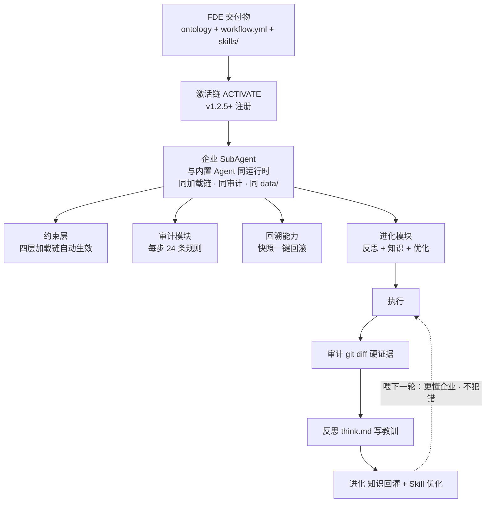

# FDE 交付物激活链 — 从静态交付到自运转企业 Agent

> v1.5.0 · 2026-09-19（UTC）· ✅ 已发版 · 孔放勋
>
> 状态：Phase 1-4（ACTIVATE→ORCHESTRATE→EXECUTE→SUSTAIN）全部已实现。灵感来源：用户提出「FDE Harness 读自己的交付物，自动生成企业 sub-agent」。

---

## 核心问题

### 断裂带

FDE 诊断完成后，交付了一堆**静态文件**：

```
交付物：
  ✅ ontology 本体数据（entities + concepts + relations）
  ✅ workflow.yml（节点清单 + 依赖关系）
  ✅ 每个节点的三层实体（文档层 + Skill 层 + 运行层）
  ✅ 每个节点标记了 🔄/⚡/👤

然后呢？
  ┌──────────────────────────────────────────────────┐
  │           🔴 大断裂带                               │
  │  交付物躺在磁盘上，没人把它们"点燃"                   │
  │  企业 IT 拿到一堆 .md 和 .yml，不知道怎么跑起来       │
  └──────────────────────────────────────────────────┘

理想终态：
  企业的工作流自动运行——每个 🔄 节点是一个 sub-agent，
  每个 ⚡ 节点是一个辅助 Agent，节点间按 workflow.yml 的依赖自动编排
```

### 现有代码的三个零件

轨道铺好了，但只有 4 节自有车厢，企业车厢造好了没挂上去：

| 零件 | 文件 | 现有能力 | 缺什么 |
|------|------|---------|--------|
| **composer.ts** | `engine/orchestrator/src/composer.ts` | 用 LangGraph `createReactAgent` 做任务拆解，输出 workflow YAML | 现在是"用户给 task → 拆通用 workflow"。缺"读 FDE 交付物 → 生成企业专属 workflow" |
| **workflow-parser.ts** | `engine/orchestrator/src/workflow-parser.ts` | YAML → SubAgent 映射，有 DAG 校验 | 映射表写死 4 个内置 Agent（developer/qa/researcher/writer）。缺企业自定义 Agent 注册 |
| **dag-runner.ts** | `engine/orchestrator/src/dag-runner.ts` | 按 DAG 依赖顺序跑 SubAgent（当前串行） | 能跑，但只跑内置 Agent。缺企业 Agent 支持 |
| **registry.ts** | `engine/orchestrator/src/registry.ts` | 从 `.sofagent/subagents/*.yml` 加载自定义 Agent | **已有动态注册机制**，但没人往里写企业 Agent |

**关键发现**：`registry.ts` 的 `listAgents()` 已经支持从 `.sofagent/subagents/` 目录读 YML 注册自定义 Agent。缺的不是机制，是**往这个目录写企业 Agent 的自动化流程**。

---

## 激活链总览

```
FDE 诊断完成（交付物就绪）
    │
    ▼
┌─────────────────────────────────────────┐
│  Phase 1: ACTIVATE（激活）               │
│  读交付物 → 注册企业 SubAgent            │
│  新增 activate.ts                        │
└──────────────┬──────────────────────────┘
               │
               ▼
┌─────────────────────────────────────────┐
│  Phase 2: ORCHESTRATE（编排）           │
│  映射表+注册扩展 → StateGraph 构建        │
│  扩展 composer.ts + workflow-parser.ts   │
└──────────────┬──────────────────────────┘
               │
               ▼
┌─────────────────────────────────────────┐
│  Phase 3: EXECUTE（执行）               │
│  dag-runner+节点执行器 → HITL+审计集成+异常处理 │
│  扩展 dag-runner.ts                      │
└──────────────┬──────────────────────────┘
               │
               ▼
┌─────────────────────────────────────────┐
│  Phase 4: SUSTAIN（持续）               │
│  全闭环验证 + wrapToolCall 联动          │
│  已有 sustain 模式 + think.md            │
└─────────────────────────────────────────┘
```

---

## Phase 1: ACTIVATE — 从交付物注册企业 SubAgent

### 输入

FDE 诊断完成后，以下文件就绪：

```
.sofagent/
├── data/
│   ├── knowledge/
│   │   ├── entities/
│   │   │   ├── 客户管理.md          # entity（含 domain/relations/knowledge-domain）
│   │   │   ├── 订单处理.md
│   │   │   ├── 生产排程.md
│   │   │   └── ...
│   │   ├── concepts/
│   │   │   └── ...
│   │   └── enterprise-profile.md   # 企业画像
│   └── workflow.yml                 # FDE §5 输出的工作流定义
├── skills/                           # FDE §7 交付的节点 Skill
│   ├── 客户管理/
│   │   └── SKILL.md
│   ├── 订单处理/
│   │   └── SKILL.md
│   └── ...
└── nodes/                            # FDE §7 交付的文档层
    ├── 客户管理.md
    ├── 订单处理.md
    └── ...
```

### workflow.yml 示例（FDE §5 产出）

```yaml
name: 制造企业核心工作流
description: 从接单到回款的完整流程
nodes:
  - id: customer-intake
    name: 客户接单
    type: 🔄                    # 自动执行
    agent: enterprise           # 企业自定义 Agent
    skill_ref: skills/客户管理/SKILL.md
    entity_ref: entities/客户管理.md
    task: "接收客户订单，校验客户信息，生成内部订单号"
    depends_on: []
    actions: [read, write]      # 允许的操作
    knowledge_domain:
      include: [客户信息, 订单格式, 客户信用等级]
      exclude: [其他客户数据]
    hitl: false                 # 🔄 不需要人工确认

  - id: production-scheduling
    name: 生产排程
    type: ⚡                    # 强化岗位（需人工确认）
    agent: enterprise
    skill_ref: skills/生产排程/SKILL.md
    entity_ref: entities/生产排程.md
    task: "根据订单生成生产排程方案，人工确认后下发车间"
    depends_on: [customer-intake]
    actions: [read, write, bash]
    knowledge_domain:
      include: [产能数据, 工艺路线, 排程规则]
      exclude: [客户隐私数据]
    hitl: true                  # ⚡ 需要人工确认排程方案
    hitl_config:
      interrupt_before: true    # LangGraph interrupt_before
      prompt: "请确认以下排程方案是否可执行："

  - id: quality-check
    name: 质量检验
    type: 🔄
    agent: enterprise
    skill_ref: skills/质量检验/SKILL.md
    entity_ref: entities/质量检验.md
    task: "自动检验产品合格率，不合格批次自动标记并通知"
    depends_on: [production-scheduling]
    actions: [read, write]
    knowledge_domain:
      include: [检验标准, 合格阈值, 不合格处理流程]
      exclude: []
    hitl: false
```

### activate 命令

```bash
sofagent-orchestrator activate
```

或通过 MCP：

```typescript
// MCP tool（新增）
{
  name: 'activate_workflow',
  description: '读取 FDE 交付物（workflow.yml + skills/ + entities/），注册企业 SubAgent 并构建可执行编排',
  inputSchema: {
    type: 'object',
    properties: {
      dry_run: { type: 'boolean', description: '只预览不真正注册，默认 false' },
      node_filter: { type: 'array', items: { type: 'string' }, description: '只激活指定节点（默认全部）' },
    },
  },
}
```

### activate 内部流程

核心实现 `engine/orchestrator/src/activate.ts`。核心签名与产出：

```typescript
export interface ActivateResult {
  registeredAgents: string[];      // 注册的 Agent 名称列表
  workflowGraph: string;           // 生成的 LangGraph 拓扑描述
  skippedNodes: Array<{ name: string; reason: string }>;  // 跳过的节点（如 👤 暂不动）
  hitlNodes: string[];             // 需要 HITL 的节点
}

export async function activateWorkflow(opts: {
  dataDir: string; dryRun: boolean; nodeFilter?: string[];
}): Promise<ActivateResult>
```

内部七步（逐步幂等，dryRun 只预览不落盘）：①读 workflow.yml → ②遍历节点（👤 暂不动跳过并记录 reason）→ ③读 SKILL.md 提取 system prompt + actions → ④读 entity 提取 knowledge-domain → ⑤`buildConstrainedPrompt` 组装企业 SubAgent 定义（type 按 🔄/⚡ 映射 auto/assist，携带 hitl/hitlConfig）→ ⑥非 dryRun 时写 `.sofagent/subagents/<node-id>.yml`（registry.ts `loadDefinition()` 已支持读）→ ⑦`buildTopology` 生成 LangGraph 拓扑描述（供 Phase 2）。

### 企业 SubAgent YML 格式（写入 `.sofagent/subagents/`）

registry.ts 的 `loadDefinition()` 已支持读 YML。每个激活的节点生成一个：

```yaml
# .sofagent/subagents/customer-intake.yml
name: customer-intake
displayName: 客户接单
type: auto
description: 接收客户订单，校验客户信息，生成内部订单号
tools: [read, write]
modelName: null
systemPrompt: |
  [Agent: customer-intake — 客户接单]
  你是企业"客户接单"岗位的 AI Agent。
  ...（从 SKILL.md 提取的完整 prompt）
mode: deploy
```

---

## Phase 2: ORCHESTRATE — 按 workflow 依赖构建 LangGraph

### 现状

composer.ts 现在做的是"用户给一个通用 task → 用 LLM 拆成 workflow"。这是**通用编排**。

激活链需要的是**企业专属编排**——不拆任务，而是直接用 FDE 交付的 workflow.yml 作为编排方案。

### 新增能力

扩展 composer.ts，新增 `composeEnterpriseWorkflow()` 函数：

```typescript
export interface EnterpriseComposeResult {
  /** LangGraph StateGraph 配置（序列化） */
  graphConfig: string;
  /** SubAgent 配置列表 */
  subagents: SubAgentConfig[];
  /** 数据流映射：节点间怎么传数据 */
  dataFlow: DataFlowMapping[];
  /** HITL 节点列表 */
  hitlNodes: string[];
}

/**
 * 从 FDE 交付物构建企业专属编排方案
 * 与 compose()（通用拆解）的区别：不调 LLM 拆任务，直接用 workflow.yml
 */
export async function composeEnterpriseWorkflow(
  workflow: ParsedWorkflow,
  agents: EnterpriseAgentConfig[]
): Promise<EnterpriseComposeResult> {
  // Step 1: 构建节点拓扑（DAG 校验已在 workflow-parser 中）
  // Step 2: 为每个节点创建 LangGraph node
  // Step 3: 按 depends_on 添加 edges
  // Step 4: 标记 HITL 节点的 interrupt_before
  // Step 5: 设计数据流映射
  return { graphConfig, subagents, dataFlow, hitlNodes };
}
```

### 数据流设计

节点间数据怎么传——三层架构：

| 数据类型 | 传法 | 轻重 |
|---------|------|------|
| **实时业务数据**（订单号、排程结果） | LangGraph State（内存传递） | 轻，跑完就没了 |
| **知识数据**（客户信息、工艺标准） | ontology entity（持久化） | 重，写入磁盘 |
| **状态标记**（处理中/已完成/异常） | State + entity 双写 | 中，State 传 + entity 留痕 |

```typescript
// LangGraph State 定义
const enterpriseState = {
  // 实时业务数据（内存传递）
  currentOrder: null,           // 接单 → 排产传递的订单数据
  scheduleResult: null,         // 排产 → 质检传递的排程结果

  // 状态标记（双写）
  nodeStatus: {},               // { customer-intake: 'done', production-scheduling: 'running' }

  // 异常队列
  exceptions: [],               // 任何节点可以往里塞异常
};
```

### HITL 集成

LangGraph 原生支持 `interrupt_before`：

```typescript
const graph = new StateGraph(enterpriseState);

// 注册节点
for (const node of workflow.nodes) {
  graph.addNode(node.id, createNodeExecutor(node, agents));
}

// 添加边
for (const node of workflow.nodes) {
  for (const dep of node.depends_on) {
    graph.addEdge(dep, node.id);
  }
}

// 标记 HITL 中断点
const hitlNodes = workflow.nodes.filter(n => n.hitl).map(n => n.id);
const compiled = graph.compile({
  interruptBefore: hitlNodes,   // 在 ⚡ 节点前暂停
});
```

---

## Phase 3: EXECUTE — DAG 运行 + 审计监控

### 运行方式

```bash
# 启动企业工作流
sofagent-orchestrator run-enterprise

# 或通过 MCP
调用 run_enterprise_workflow tool
```

### 运行时行为

```
1. 从 .sofagent/subagents/ 加载所有企业 Agent（registry.ts 已支持）
2. 从 workflow.yml 构建编排方案（composeEnterpriseWorkflow）
3. 构建 LangGraph 并编译（含 HITL 中断点）
4. 从入口节点开始执行

执行过程中：
  - 每个 🔄 节点：自动执行，结果写入 State + entity
  - 每个 ⚡ 节点：执行到此处暂停 → 向用户展示方案 → 等待确认 → 继续
  - 每个节点执行后：自动触发审计（@sofagent-audit）
  - 审计 FAIL：暂停整个工作流，通知用户
  - 异常：写入 exceptions 队列，根据节点配置决定重试 or 跳过
```

### 审计集成

每个节点执行后自动审计（复用现有 audit engine）：

```typescript
// createNodeExecutor 内部
async function executeNode(node, state) {
  // 1. 执行节点任务
  const result = await subAgent.invoke({ messages: [...] });

  // 2. 如果有文件变更，跑审计
  const diff = getDiffSinceLastRun();
  if (diff.length > 0) {
    const auditResult = await runAuditRules(diff);
    if (auditResult.exitCode === 2) {  // FAIL
      // 暂停工作流，通知用户
      state.exceptions.push({ node: node.id, audit: auditResult });
      return { ...state, nodeStatus: { ...state.nodeStatus, [node.id]: 'audit-failed' } };
    }
  }

  // 3. 写入 think.md 回溯
  generateThinkEntry(diff, auditResult, `企业节点 ${node.name}`);

  // 4. 更新状态
  return { ...state, nodeStatus: { ...state.nodeStatus, [node.id]: 'done' } };
}
```

---

## Phase 4: SUSTAIN — 持续优化

### 已有能力（无需新建）

| 能力 | 现状 |
|------|------|
| FDE sustain 模式 | 已有：读 audit 报告趋势 → 生成优化建议 |
| think.md 回溯 | 已有：每次任务自动写反思 |
| evolve 优化 | 已有：分析 Skill → 生成优化候选 |
| A/B 测试 | 已有：orchestrator-compare 跑 A/B 对比 |

### 激活链补全的闭环

```
企业工作流运行
  → 每个节点执行 → 自动审计 → think.md 回溯
  → FDE sustain 读 think.md 趋势 → 发现"某节点反复出错"
  → evolve 优化该节点 Skill → A/B 测试验证
  → 通过 → 更新 .sofagent/subagents/<node>.yml
  → 下次 activate 时自动加载优化后的 Skill
```

**这就是自运转**：企业工作流不仅跑起来了，还能自己优化自己。

---

## 设计问题与决策

### 决策 1：每个企业 SubAgent 的工具权限

**方案**：从 workflow.yml 的 `actions` 字段提取，映射到工具集：

| actions 声明 | 实际工具 |
|-------------|---------|
| `read` | Read, Glob, Grep |
| `write` | Write, Edit |
| `bash` | Bash |
| `audit` | run_audit, audit_file（通过 MCP） |
| `mcp` | 所有 MCP tools |

未声明 actions 的节点 → 默认 `[read]`（最小权限原则）。

### 决策 2：数据流方案

采用**混合方案 C**（实时走 State + 知识走 entity）：节点执行结果写入 LangGraph State（实时传递），同时更新 ontology entity（持久留痕）——State 保证实时性，entity 保证持久性和可审计性（详见上方「数据流设计」）。

### 决策 3：HITL 实现方式

用 LangGraph 原生 `interrupt_before`：在 ⚡ 节点前暂停，向用户展示方案 → 确认 / 修改 / 拒绝 → 确认继续、修改更新 State 后继续、拒绝终止并写异常日志（详见上方「HITL 集成」）。

### 决策 4：平台兼容性

激活链生成的企业 Agent 需要在多种平台运行：

| 平台 | 运行方式 |
|------|---------|
| **CLI**（sofagent-orchestrator） | 原生支持，Phase 3 直接跑 |
| **WorkBuddy** | 通过 Skill 加载 + MCP 调用 `activate_workflow` |
| **OpenClaw** | 通过 Skill + bridge 转发 |
| **Claude Desktop / Cursor** | 通过 MCP `activate_workflow` tool |

企业 Agent 注册后，任何能调 MCP 的平台都能使用。

---

## 文件清单

### 新增文件

| 文件 | 说明 |
|------|------|
| `engine/orchestrator/src/activate.ts` | **核心**：Phase 1 激活逻辑 |
| `engine/orchestrator/src/enterprise-graph.ts` | Phase 2 企业编排图构建 |
| `engine/orchestrator/src/node-executor.ts` | Phase 3 企业节点执行器（含 HITL/审计集成） |
| `engine/orchestrator/src/hitl-handler.ts` | Phase 3 HITL 中断处理 |
| `engine/orchestrator/src/__tests__/activate.test.ts` | 单测 |
| `engine/orchestrator/src/__tests__/enterprise-graph.test.ts` | 单测 |
| `engine/orchestrator/src/__tests__/node-executor.test.ts` | 单测 |
| `engine/mcp/src/tools/activate-workflow.ts` | MCP `activate_workflow` tool |

### 修改文件

| 文件 | 修改内容 |
|------|---------|
| `engine/orchestrator/src/workflow-parser.ts` | 扩展映射表支持 `agent: enterprise` 类型 |
| `engine/orchestrator/src/registry.ts` | 扩展 `SubAgentDefinition` 增加 hitl / hitlConfig 字段 |
| `engine/orchestrator/src/composer.ts` | 新增 `composeEnterpriseWorkflow()` |
| `engine/orchestrator/src/dag-runner.ts` | 扩展支持企业 Agent + HITL 节点 |
| `engine/orchestrator/src/cli.ts` | 新增 `activate` 子命令 + `run-enterprise` 子命令 |
| `engine/mcp/src/mcp-server.ts` | 注册 `activate_workflow` tool |
| `SKILL/agents/fde/SKILL.md` | FDE §8 新增 activate 引导（交付后执行 activate） |

### 依赖关系

`activate.ts` → workflow-parser（解析 workflow.yml）+ registry（写入 subagents/）+ parseSkillMd（复用 SKILL.md 解析）；`enterprise-graph.ts` → activate 输出 + LangGraph StateGraph；`dag-runner.ts` 扩展支持企业 Agent 执行 + HITL 中断（细节见 Phase 1-3 正文）。

---

## 验证方式

| 检查项 | 通过标准 |
|--------|------|
| activate 命令 | 能读 workflow.yml + skills/ + entities/ → 生成 .sofagent/subagents/*.yml |
| dry-run 模式 | `--dry-run` 只预览不写文件 |
| 👤 节点跳过 | type 为 👤 的节点被跳过，记录在 skippedNodes |
| 企业 Agent 注册 | registry.listAgents() 能读到企业自定义 Agent |
| StateGraph 构建 | composeEnterpriseWorkflow 输出合法 LangGraph 配置 |
| 数据流 | State 实时传递 + entity 持久化双写 |
| 节点执行器 | dag-runner 能跑企业 Agent |
| HITL 中断 | ⚡ 节点执行前暂停，等待用户确认 |
| 审计集成 | 每个节点执行后自动审计，FAIL 时暂停工作流 |
| MCP tool | `activate_workflow` 可从任意 MCP 平台调用 |
| 纯 CLI | `sofagent-orchestrator activate && sofagent-orchestrator run-enterprise` 可跑通 |
| npm test | 全绿 |
| 现有 compose 不受影响 | 通用 compose() 功能不变 |

---

## 与其他开发线的衔接

| 开发线 | 衔接 |
|--------|------|
| **Skill × MCP 集成（S1-S5）** | FDE Skill 有 MCP 工具调用能力；激活链的 `activate_workflow` 是新增 MCP tool |
| **Skill 分包** | `SKILL/skills/04-deliver.md` 应含 activate 引导——交付后不是结束，activate 才是 |
| **运行时审计** | LangGraph middleware wrapToolCall（通用拦截）与激活链"每个节点执行后审计"（企业专属）互补 |
| **沙箱** | 激活链生成的企业 Agent 最终也需要沙箱隔离 |

---

## 企业 SubAgent = 引擎公民，不是独立脚本

> **激活链注册的企业 SubAgent 自动继承约束层五种能力**——因为注册后与内置 4 个 SubAgent（@sofagent-fde / @sofagent-audit / engineer / reviewer）**跑在同一个运行时**：同一条四层加载链、同一个审计 hook、同一个 data/ 状态层。不是"给企业 Agent 装约束层"，是企业 Agent 本来就在约束层里。这就是"轨道从早期就铺好了"的真正含义。五能力 = 注入·审计·回溯·沉淀·进化（v1.4.4 新增沉淀）。



### 继承是自动的，不是配置出来的

| 引擎 | 企业 SubAgent 怎么继承 | 触发点 |
|------|----------------------|--------|
| 🧭 **约束层** | `buildConstrainedSystemPrompt()` 注册即生效，走 SKILL.md → fde.md → think.md → knowledge/ 四层加载链 | 启动时自动 |
| 🔍 **审计模块** | EXECUTE 阶段 `on_step: true`，每步执行后自动跑 24 条规则 | 每步执行后 |
| 🔄 **回溯能力** | 审计后自动 git snapshot，违规一键回滚 | 审计完成后自动 |
| 🧬 **进化模块** | think.md 反思 + Dream Cycle 吃 task/logs + evolve 优化企业 Skill | daemon 定时/事件 |

### 自我进化的两层边界

| 进化层级 | 机制 | 状态 | 企业 SubAgent 能得到吗 |
|---------|------|:--:|----------------------|
| **行为级进化** | think.md 反思（不犯同样错）+ Dream Cycle 知识回灌（越跑越懂企业）+ evolve Skill 优化（失败 3 次自动改） | ✅ 已交付/轻量态 | **能，自动获得**——沉淀机制随使用迭代（轻量态，效果待验证） |
| **模型级进化** | QLoRA 后训练小模型（workflow 数据训练进权重） | ⚠️ v3.x-v4.x 远期 | 远期蓝图，当前不具备 |

> 🔒 **进化不碰宪法**：进化模块优化的是 Skill / 知识 / 反思，**不碰加载链第 1 层 SKILL.md 宪法**（4 底线 + 9 铁律，`❌ 不可修改`）。企业 SubAgent 的沉淀机制会随使用迭代，但不会"越用越不守规矩"——**自主性只给到能力层，宪法层永远不可改**。这是"受控自主"的设计哲学。

---

## 一句话总结

> **FDE 诊断产出的是"图纸"（ontology + workflow + skills）。激活链是"施工队"——读图纸、砌墙（注册 Agent）、接水管（数据流）、通电（编排）、验收（审计）。施工完了，企业的工作流就自己跑起来了。**
