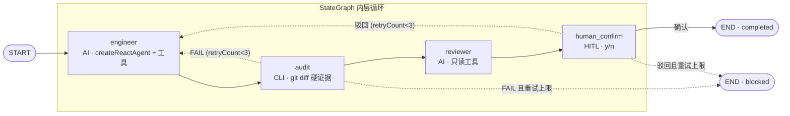

# FORGE Loop 开发指南

> **想给 FORGE 加新 loop？这份文档告诉你怎么搭。** 从 driver 脚本结构到三个必踩的坑，每条都来自真实 debug 会话。
>
> v1.5.1 · 2026-09-22（UTC）· ✅ 已发版

- [一、技术栈：一句话声明](#一技术栈一句话声明)
- [二、为什么选 LangGraph（弃用 deepagents）](#二为什么选-langgraph弃用-deepagents)
- [三、核心 Driver 脚本结构](#三核心-driver-脚本结构)
- [四、新 Loop 开发 Checklist](#四新-loop-开发-checklist)
- [五、三个必踩的坑](#五三个必踩的坑)
- [六、异构模型配置](#六异构模型配置)
- [七、参考实现：fresh-eyes-loop](#七参考实现fresh-eyes-loop)

---

## 一、技术栈：一句话声明

**FORGE loop = LangChain Core（LLM 调用底座）+ LangGraph `createReactAgent`（编排模块）。**

不多不少。不用 deepagents 全家桶，不用 LangChain 全家桶（Document Loader / Vector Store / RAG pipeline 都不碰）。完整技术选型原则见 [VALIDATION](../VALIDATION.md#技术选型原则用什么不用什么)。

```js
const { createReactAgent } = await import('@langchain/langgraph/prebuilt');
const agent = createReactAgent({ llm: model, tools, prompt: systemPrompt });
```

这一行替代了 deepagents 的 `createDeepAgent({ middleware, subagents })` 全套——更简单、更可控、不崩。

> 完整踩坑记录（为什么从 deepagents 迁移到 LangGraph）见 [FORGE/lessons/index.md](../../FORGE/lessons/index.md)。

---

## 二、为什么选 LangGraph（弃用 deepagents）

deepagents 早期启发了编排模块设计，后因三个**不可逆硬伤**弃用，改用 LangGraph `createReactAgent`（同一套 React 模式，但节点/边全暴露，白盒可控）：

| 硬伤 | 说明 |
|------|------|
| FilesystemMiddleware 硬编码注入 | 源码强制注入文件中间件，`middleware:[]` 语义是「追加到链尾」不是「替换」，无法禁用 |
| wrapToolCall 并行调用崩溃 | 并行工具调用触发 `Cannot read properties of undefined`，偶发崩溃 = 根因未解 |
| REQUIRED_MIDDLEWARE_NAMES 白名单 | 源码禁止排除内置中间件，想修也改不了 |

**适用边界**：deepagents 适合快速原型 / 串行工具调用 / 标准文件操作；FORGE loop 需要进程隔离、并行双盲审查、自定义工具集、按步 recursionLimit、审计可追溯——这些需求下 deepagents 的黑盒成了枷锁。

---

## 三、核心 Driver 脚本结构

参考实现：`FORGE/src/fresh-eyes-driver.mjs`。以下是新 loop driver 的关键结构。

### 3.1 整体架构：Driver + Worker

```
driver（主进程）          worker（子进程，每步一个）
  ├─ 解析 CLI 参数          ├─ 读 prompt 模板
  ├─ 建 run 目录            ├─ buildSystemPrompt
  ├─ 编排循环轮次      →    ├─ createModel（异构模型）
  │   ├─ spawnWorker ①      ├─ loadTools + tool() 转换
  │   ├─ spawnWorker ②      ├─ createReactAgent
  │   ├─ spawnWorker ③      ├─ agent.invoke({ recursionLimit })
  │   ├─ ...                └─ 写产物文件
  ├─ 判停止条件
  ├─ 写 LEDGER
  └─ emit 可见性事件
```

Driver 只做编排（起进程、传路径、判停止、写索引），不做语义判断。Worker 在独立子进程中跑——**真·零上下文**，每步的内存和状态完全隔离。

### 3.2 createReactAgent 导入

```js
const { createReactAgent } = await import('@langchain/langgraph/prebuilt');
const agent = createReactAgent({
  llm: model,
  tools,
  prompt: systemPrompt,
});
```

### 3.3 工具定义与 `sf_` 前缀

FORGE 的自定义工具用 `sf_` 前缀（`sf_read` / `sf_write` / `sf_edit`），避免和 LangGraph 生态的 BUILTIN 工具名冲突（`read_file` / `write_file` 等是保留名）。

工具必须用 `@langchain/core/tools` 的 `tool()` 函数创建（不是手写 ExecutableTool 格式），否则 ToolNode 报 `Cannot read properties of undefined`：

```js
const { tool } = require('@langchain/core/tools');
const { z } = require('zod');

const wrappedTool = tool(
  async (input) => await rawTool.func(input),
  {
    name: rawTool.name,
    description: rawTool.description,
    schema: z.object(zodShape),  // JSON Schema → zod 转换
  }
);
```

### 3.4 STEP_RECURSION_LIMITS：按步骤区分

**不能一刀切。** 审查类步骤需要大量读文件+搜索，文本处理类步骤主要是合并/格式化——用同一个 recursionLimit 会导致前者不够、后者 OOM。

```js
const STEP_RECURSION_LIMITS = {
  'a-check':       150,  // 审查类：≈75 轮工具调用，够 12 视角完整审查
  'b-check':       150,
  'a-consolidate': 50,   // 文本处理类：≈25 轮工具调用，够合并/格式化
  'b-fix':         60,
  'a-verify':      50,
};

const recursionLimit = STEP_RECURSION_LIMITS[step] ?? 50;
```

经验值：每次工具调用 = 2 步（model call + tool node）。超过 150 步 → OOM 风险（exit 137）。

### 3.5 buildSystemPrompt + macOS BSD 约束

systemPrompt 末尾必须注入 macOS 运行环境约束段——LLM 默认用 GNU/Linux 语法，macOS 的 BSD 工具全报错：

```js
const shellConstraints = [
  '',
  '## 运行环境约束（macOS BSD 工具）',
  '',
  '你在 macOS 上运行，shell 是 BSD 版本，不是 GNU/Linux：',
  '- grep：不支持 -P（PCRE），用 grep -E 代替',
  '- sed：不支持 --version/-V；-i 必须带后缀',
  '- cat：不支持 -A，用 cat -v 或 od -c',
  '- stat：不支持 --format，用 stat -f',
  '- 不支持 <(...) process substitution（/bin/sh 没有）',
  '',
  '命令报错时，不要反复重试同一命令——换一种方式或跳过。',
].join('\n');
```

### 3.6 失败降级机制

每个关键步骤必须有 try/catch + 降级兜底。最典型的是 `writeFallbackFindings`——a-consolidate 失败时，直接拼接两份 check 报告作为 findings.md，让循环继续走到 b-fix：

```js
try {
  await spawnWorker('a-consolidate', roundDir, target, roundNum);
} catch (consolidateErr) {
  console.warn(`⚠️ a-consolidate 失败: ${consolidateErr.message}`);
  writeFallbackFindings(roundDir);  // 降级：拼接 check-a + check-b
}
```

降级产物质量不如正常流程，但"有"比"没有"强——一个步骤崩不能拖死整条链。

### 3.7 spawnWorker 独立进程模型

每个步骤在独立 `node` 子进程中执行，保证真·零上下文（完整实现见 `FORGE/src/fresh-eyes-driver.mjs`）。核心模式：`spawn(process.execPath, [__filename, '--worker', '--step', step, ...])`，stdio 继承、`FORGE_ROUND` 环境变量传轮次，`close` 事件里非 0 退出码 reject。

步骤 ①②（双盲独立审查）可并行调用 `spawnParallel`；步骤 ③④⑤ 必须串行（有数据依赖）。

---

## 四、新 Loop 开发 Checklist

开发新 loop 前，对照这份清单逐项确认：

- [ ] **每个 loop 都须包含**——`prompts/` / `specs/` / `runs/` 独立目录，不混用
- [ ] **driver 用 `createReactAgent`**——不用 `createDeepAgent`（已弃用）
- [ ] **工具用 `tool()` 创建**——JSON Schema → zod 转换，不用手写 ExecutableTool
- [ ] **工具名加 `sf_` 前缀**——避免和 LangGraph BUILTIN 工具冲突
- [ ] **recursionLimit 按步骤区分**——审查类 150 / 文本处理类 50，不能一刀切
- [ ] **systemPrompt 注入 macOS BSD 工具约束**——LLM 不知道你跑在 macOS 上
- [ ] **失败路径有降级兜底**——关键步骤 try/catch + writeFallback 函数
- [ ] **driver catch 块写 ERROR + LOOP_END 事件**——否则 Dashboard 看到"永远在跑"
- [ ] **`runs/` 目录放在 loop 自己目录下**——`.gitignore` 加 `FORGE/SKILL/*/runs/`
- [ ] **`LEDGER.md` 追加一行记录**——git 跟踪的跨 run 永久索引
- [ ] **注入片段登记**——buildSystemPrompt 拼入的每段有名 / token 估算 / owner；新段超 1K token 须标记并进入复审清单（Codex AGENTS.md 同款纪律的运行时近似，Node 无编译期保证）
- [ ] **系统注入走 `core/context` 等价物**——注入物一律经登记表校验大小上限，不做无上限字符串拼接（no unbounded items）

---

## 五、三个必踩的坑

以下三个坑在 fresh-eyes-loop 开发过程中全部踩过，每个都附代码示例和修复方案。

### 坑 1：recursionLimit 不分步骤导致 OOM（exit 137）

**现象**：`a-consolidate`（合并两份审查报告）worker 报 `exit 137`（SIGKILL / OOM）。Node.js 进程被操作系统强杀。

**根因**：recursionLimit=150 对文本处理类步骤太高。LangGraph 的 agent 在每次工具调用后把 message 追加到 messages 数组——150 步意味着消息可能累积到数十 MB，Node.js 默认堆内存（~1.5GB）撑不住就 OOM。

审查类步骤（a-check）用 150 不会 OOM，因为消息增长慢（大量是工具调用结果，短文本）；但 a-consolidate 要读取两份完整的 check 报告 + 产出 findings.md + result.md，单条消息体积大，150 步累积就爆了。

**修复**：按步骤类型区分 recursionLimit——配置表见 [§3.4](#34-step_recursion_limits按步骤区分)，审查类 150 / 文本处理类 50，不能一刀切。

**经验值参考**：

| recursionLimit | ≈ 工具调用轮数 | 适合什么步骤 |
|:-:|:-:|------|
| 25 | 12 轮 | 简单问答 |
| 50 | 25 轮 | 文本处理（合并/格式化/验证） |
| 150 | 75 轮 | 完整代码审查（12 视角） |
| >150 | — | OOM 风险区 |

### 坑 2：macOS BSD 工具不兼容

**现象**：循环日志里大量 `grep: invalid option -- P`、`sed: illegal option -- -`、`openssl:Error: '--version' is an invalid command`。LLM 浪费 recursionLimit 步数在重试错误命令上——本来 50 步够完成的任务，20 步浪费在报错重试上，剩下的步数不够产出。

**根因**：LLM 训练数据以 Linux（GNU 工具）为主，默认用 GNU 语法。macOS 是 BSD 工具，行为差异显著：

| GNU 语法（LLM 默认） | BSD 实际行为（macOS） | 正确写法 |
|------|------|------|
| `grep -P "pattern"` | `-P` 不存在 | `grep -E "pattern"` |
| `sed --version` | `--version` 报错 | 不用 |
| `sed -i "s/a/b/"` | `-i` 需要后缀 | `sed -i "" "s/a/b/"` |
| `stat --format=...` | 不支持 `--format` | `stat -f ...` |
| `cat -A` | 不支持 | `cat -v` 或 `od -c` |
| `<(...)` process substitution | `/bin/sh` 没有 | 用临时文件 |

**修复**：在 `buildSystemPrompt` 返回的 systemPrompt 末尾追加 BSD 约束段（代码见 [§3.5](#35-buildsystemprompt--macos-bsd-约束)）。

**验证效果**：加上约束后，`a-consolidate` 从"40 步不收敛"变成"完美产出 49 行 findings.md"。

### 坑 3：worker 崩溃导致整个循环挂掉

**现象**：步骤 ③（a-consolidate）OOM 崩溃后，driver 的 `main()` catch 写了 ERROR + LOOP_END 事件，但整个循环还是退出了——后面的 b-fix / a-verify 都没跑。

**根因**：步骤 ③ 的 `spawnWorker` reject 后，异常一路冒泡到 `runRound` → `main` 的 for 循环 → `main().catch()`。没有在步骤级别做 try/catch 拦截。

**修复**：两个层面——

**层面 1：步骤级 try/catch + 降级函数**（实现见 [§3.6](#36-失败降级机制)——一个步骤崩不能拖死整条链）

**层面 2：driver catch 块写可见性事件**

```js
// 模块级引用——让 catch 块也能写可见性事件
let globalVisibility = null;

main().catch(err => {
  console.error(`💥 致命错误: ${err.message}`);
  if (globalVisibility) {
    globalVisibility.emit(EVENTS.ERROR, { message: err.message });
    globalVisibility.emit(EVENTS.LOOP_END, {
      actualRounds: 0, stopReason: 'fatal-error',
    });
  }
  process.exit(1);
});
```

没有层面 2，status.json 会停在 `round-1-running`，Dashboard 看到"永远在跑"。

---

## 六、异构模型配置

fresh-eyes-loop 使用两个不同厂商的模型，分别承担审查者和工程师角色。

### 配置表

| 维度 | A（审查者） | B（工程师） |
|------|-------------|-------------|
| **模型** | GLM-5.2（智谱） | DeepSeek V4 Pro |
| **baseURL** | `https://open.bigmodel.cn/api/coding/paas/v4/` | `https://api.deepseek.com/` |
| **计费** | Coding Plan 订阅制 | 按量计费 |
| **特殊参数** | `temperature: 1.0` / `maxTokens: 16000` | `thinking: { type: "enabled" }` / `reasoningEffort: "high"` |
| **token 消耗** | 高（~85万/轮） | 低（~9万/轮） |
| **适用步骤** | 审查 / 合并 / 验证 | 审查 / 修复 |

### 模型实例化代码

```js
const MODEL_CONFIGS = {
  A: {
    baseURL:         'https://open.bigmodel.cn/api/coding/paas/v4/',
    model:           'glm-5.2',
    temperature:     1.0,
    maxTokens:       16000,
    apiKeyEnv:       'SOFAGENT_LLM_A_API_KEY',
    billing:         'subscription',
  },
  B: {
    baseURL:         'https://api.deepseek.com/',
    model:           'deepseek-v4-pro',
    thinking:        { type: 'enabled' },
    reasoningEffort: 'high',
    apiKeyEnv:       'SOFAGENT_LLM_B_API_KEY',
    billing:         'pay-as-you-go',
  },
};
```

### API key 注入

在 `~/.zshrc` 中设置环境变量：

```bash
export SOFAGENT_LLM_A_API_KEY="your-glm-api-key"
export SOFAGENT_LLM_B_API_KEY="your-deepseek-api-key"
export SOFAGENT_LLM_A="glm-5.2"     # 可选：覆盖默认模型名
export SOFAGENT_LLM_B="deepseek-v4-pro"
```

### 行为差异注意

- **DeepSeek 更保守**：倾向串行调用工具，不太触发并行 bug
- **GLM-5.2 更激进**：经常同一步并行调多个工具（读文件+搜索+跑测试），容易踩并行坑
- **GLM-5.2 在 macOS 上更容易踩 BSD 工具坑**（可能训练数据中 Linux 占比更高）

异构模型不只是"用不同模型"——还要理解它们的工具调用行为差异，据此调 recursionLimit 和 prompt 约束。

---

## 七、参考实现：fresh-eyes-loop

### 完整链路（5 步）

```
① a-check       (A 新 session)    独立跑 12 视角审查     → check-a.md
② b-check       (B 新 session)    独立跑 12 视角审查     → check-b.md    [与①并行]
③ a-consolidate (A session)       合并 A/B 报告          → findings.md + result.md
④ b-fix         (B 新 session)    按 result.md 修复      → summary.md
⑤ a-verify      (A 新 session)    验证修复               → result.md 回填 verify 列
```

步骤 ①② 双盲独立（可并行），步骤 ③④⑤ 串行（有数据依赖）。每轮用全新 session 跑——零上下文保证独立性。

### 目录结构

```
FORGE/SKILL/fresh-eyes-loop/
├── SKILL.md              # loop 定义（frontmatter + 概述）
├── loop.md               # 循环 SOP（角色/轮次协议/产物 schema/停止条件）
├── evolution.md          # 循环级演化记录（加一减一）
├── prompts/              # A/B 行为指令
│   ├── a-check.md
│   ├── b-check.md
│   ├── a-consolidate.md
│   ├── b-fix.md
│   └── a-verify.md
├── specs/                # 审查规范
│   ├── fresh-eyes-review.md
│   ├── regression-checklist.md
│   └── acceptance-test.sh
└── runs/                 # 运行产物（不进 git）
    └── YYYY/MM/DD/run-NN/
        ├── round-01/
        │   ├── check-a.md
        │   ├── check-b.md
        │   ├── findings.md
        │   ├── result.md
        │   └── summary.md
        ├── status.json
        ├── usage.jsonl
        └── progress.jsonl
```

### driver 源码

完整 driver 实现：`FORGE/src/fresh-eyes-driver.mjs`（~1150 行）。关键函数：

| 函数 | 职责 |
|------|------|
| `main()` | CLI 入口：解析参数 → 编排循环 → 判停止 → 写 LEDGER |
| `runRound()` | 执行一轮（5 步：并行 ①② → 串行 ③④⑤） |
| `spawnWorker()` | 起独立子进程执行单个步骤 |
| `runWorker()` | Worker 主逻辑：读 prompt → 建 model+tools → createReactAgent → invoke → 写产物 |
| `buildSystemPrompt()` | 从 SKILL.md 构建 systemPrompt + macOS BSD 约束 |
| `createModel()` | 异构模型实例化（GLM vs DeepSeek 参数差异） |
| `loadTools()` | 工具集加载 + ExecutableTool → DynamicStructuredTool 转换 |
| `writeFallbackFindings()` | 降级兜底：a-consolidate 失败时拼接两份 check 报告 |
| `parseStopCondition()` | 读 findings.md 数 P0/P1 标记，判定是否"干净轮" |
| `recordUsage()` | 从 invoke 结果提取 usage，算成本，追加到 usage.jsonl |

---

> **完整踩坑记录**（11 个坑 + 修复时间线）见 [FORGE/lessons/index.md](../../FORGE/lessons/index.md)。
>
> **跨 run 运行历史**（永久索引）见 [FORGE/LEDGER.md](../../FORGE/LEDGER.md)。

---

## FORGE 内部架构（内部工具链）

> 本篇原是 [ARCHITECTURE §二](../../docs/ARCHITECTURE.md) 的「⚙️ FORGE 自迭代工具链」小节——FORGE 是内部工具链，细节归本指南（Loop 开发者读），ARCHITECTURE 保留五种能力的架构概要。锚点 `#四节点状态机v113` 随内容迁至本文件，外部引用已同步更新。

### ⚙️ FORGE 自迭代工具链（内部）

大任务拆小、多 Sub Agent 并行、A/B 对比找更优方案。基于 LangGraph createReactAgent，`sofagent-orchestrator compose --task` CLI 入口——任何 Agent 平台都能用。

**为什么是 Skill + 脚本 + Runtime**：
| 什么事 | 谁来做 | 为什么 |
|------|------|------|
| 判断（评分、反思、选模板） | Skill（MD prompt） | LLM 长项——模式识别 |
| 机械操作（文件读写、API） | 脚本（bash） | 确定性操作 |
| 硬安全（加载链、断路器） | Runtime（Agent 平台，如 OpenClaw） | Agent 失控时没法自己管自己 |

**编排收敛条件**：目标必须可验证（有量化标准）+ 模型可自主判断。Maker-Checker 分离是收敛前提——详见「解题/验证分离」（本篇）及 [ARCHITECTURE §四 编排收敛与 A/B 测试](../../docs/ARCHITECTURE.md#编排收敛与-ab-测试)。

> 💡 **Loop 和 Graph 不是替代关系**
>
> 行业从 Loop Engineering 热到 Graph Engineering，但 Loop 没有被淘汰——**Loop 是带回边的 Graph**，复杂 Graph 内部嵌套大量局部 Loop。sofagent 的 fresh-eyes-loop（A/B 双盲审查 5 步循环）就是一个 Loop，它未来会成为 v1.3.1 控制图里的一个子图节点。演进路径是"Loop 跑通一个 → 编排进 Graph"，不是"丢掉 Loop 换成 Graph"。
>
> Graph 的价值在于把**不可合并的独立角色 + 交接点**直接写进系统里——实现→测试→独立审查、合规审批强制节点、多来源并行检索后合并冲突。sofagent 的审计（24 条规则，其中 19 条纯确定性 git-diff，其余需 LLM 语义判断）= "必须走固定流程"；编排模块（createReactAgent）= "让模型自由判断"——这正是 Graph Engineering 真正的工程难点：**控制权分配**。
>
> **一句话分界线：看「谁决定下一步」。** 节点是 Agent 还是 Workflow，不看节点里装了什么（大模型调用、工具调用、子 Agent 都只是积木），只看下一步去哪由谁决定——**模型现场决定 = Agent；代码提前写死 = Workflow**。所以 Workflow 的节点可以是任意类型，关键在控制流归谁。生产环境的主流打法正是"骨架确定、关节灵活"：Workflow 锁死主流程，需要灵活判断的节点才嵌 Agent——纯 Agent 不可控，纯 Workflow 太脆弱，两者组合才是稳态（对应本文件下方「Workflow 的混合架构」）。

> 💡 **「翻译官不应该有决策权」——智能与控制分离**
>
> 行业对受控智能体引擎的共识判断验证了一个核心判断：**模型负责理解，不负责执行。** LLM 的不可替代价值是把模糊的自然语言翻译成结构化意图（意图识别、参数提取、歧义消解）；但写操作的确认、权限校验、状态流转——所有需要确定性的控制——必须握在系统代码手里，不交给概率性的模型。你永远无法 100% 确定模型不会在某个奇怪的上下文里，把一句模棱两可的话判定为"用户确认了"。
>
> 这正是 sofagent 审计的设计逻辑：24 条规则中 19 条是纯 git-diff（零 token、不调 LLM、100% 确定性），不是因为模型不够聪明，而是因为**确认这件事，必须由系统代码硬判断**——"是就是，不是就不是"，没有概率空间。模型产出意图（工程师 Agent 写代码），系统决定能不能放行（审计跑规则）——这就是"智能属于模型，控制属于系统"在 sofagent 的工程落地。

**工具集设计约束**：每个 Sub Agent 的工具集应零重叠、无歧义——工具功能描述不能模糊交叉。当工具数上百时，瓶颈不在模型推理而在工具描述歧义。v1.1.0 daemon 工具注册将做静态重叠检测。

**为什么多 Agent 协作 > 单强模型**：来自 Apple Dex RSI 训练团队的一手观察——基于 self-attention 架构的固有局限，单模型处理超长上下文有不可逾越的上限。多 Agent 协作（分治验证 + 多路径冗余 + 记忆机制）效果远超单强模型。核心推论：**工程化能力具备独立于模型基础能力的结构性壁垒**，不会被通用模型迭代轻易覆盖。sofagent 的编排模块（Sub Agent 分治 + Maker-Checker 分离）正是这个理论的产品化落地。

**解题/验证分离**：RSI 研究表明，同一 Agent 自验覆盖率仅 7-33%，分离为独立验证后提升至 73%（内部实测参考值，非外部基准）。这与审计的"不信任 Agent 自我报告"原则同构——解题 Agent 和验证 Agent 必须物理隔离，验证是核心基因，需分领域（代码用单测、数学用形式化证明、非标准领域用多 Agent 协作）。

> 💡 **Agent 粒度判定（X4）**：单请求内被调 >3 次的 Agent 合并到上游；日均调用 <5 次的 Agent 标记僵尸预警——防纳米 Agent 膨胀。

> 💡 **Graph Engineering 实操四纪律**
>
> **① 节点不全是 Agent。** 节点分三类：Agent 节点（需求分析/代码理解等要语义判断的）、工具节点（跑编译器/JSON 结构校验——普通代码更便宜更稳定）、人工节点（合并主分支这类关键操作交给人）。别看到 graph 就往每个方框里塞一个 Agent——「连三个数组都召唤一个大模型」不是智能，是铺张浪费。sofagent 的四节点状态机正是活例：engineer/reviewer = Agent 节点，audit = 工具节点（19 条纯 git-diff 零 token），human_confirm = 人工节点。
>
> **② 汇合比并行更难。** 并行的难点不是怎么出去，是怎么回来：哪些结果必须全部到齐、哪些只看关键结果、超时后是停止任务还是带着「尚未确认」的标记继续——这才是汇合规则。不能简单等全部完成（最慢的拖垮整张图），也不能投票放行（两票通过就假装漏洞不存在）。v1.3.1 并行波次落地时须为每一波显式定义汇合条件。
>
> **③ 画图之前先问值不值得。** 两个条件：任务里真的存在多组依赖/并行/条件分支；每个阶段能交出一个可单独检查的结果。一个 Agent 能完成的简单任务就继续用 Loop——别为了追新名词硬拆五个 Agent 开会；还在探索、问题边界没摸清的任务先让 Agent 调查，等结构稳定再固化成 Graph。
>
> **④ 五问检验真工程还是花架子**：每个节点交什么？边上传递什么？并行后怎么汇合？失败从哪里继续？哪一步会扩大权限？答得出来才是能稳定运行的图，答不出来就是一张看起来很忙的组织架构图。
>
> 注：五层工程谱系、「Loop 是带回边的 Graph」、控制权分配等已见于本文件上方「Loop 和 Graph 不是替代关系」段及 [DEVELOPMENT.md「控制权分配」](../../docs/DEVELOPMENT.md)，不重复。

#### 四节点状态机（v1.1.3+）

编排模块的核心是 LangGraph StateGraph——一条 `engineer → audit → reviewer → human_confirm` 的流水线，跑挂了能回退重试，中断了能从断点续跑。



**三态终态**：`completed`（人工确认通过）/ `blocked`（重试 3 次仍不过）/ `aborted`（stdin 关闭等中断，checkpoint 已保存可 `loop --resume` 恢复）。

**三个条件路由函数**（纯函数，可单测）：

| 路由 | 判定 | 出口 |
|------|------|------|
| `routeAfterAudit` | blocked→END；FAIL→engineer；PASS/WARN→reviewer | engineer / reviewer / END |
| `routeAfterHuman` | 非 running→END；running（驳回）→engineer | engineer / END |
| `routeFromStart` | 正常→engineer；resume→指定节点 | 四节点之一 |

**为什么 audit 是程序不是 AI**：audit 节点调 `@sofagent/audit` 跑 A1-A11、A14-A23 + E1-E2/E4（共 24 条）规则——只看 `git diff HEAD` 硬证据，标准是硬的、可复现的，不随模型波动。reviewer 才是 AI 语义审查。这正是上文"解题/验证分离"在编排层的产品化落地——audit 做确定性验证，reviewer 做概率性语义验证，两者物理隔离。

#### 状态契约：LoopArtifacts

节点之间不靠全局变量，全靠 `state.artifacts` 这个对象传递。LangGraph 的 `Annotation` 给它配了浅合并 reducer——节点返回时只需给增量字段，框架自动合并。

| 字段 | 类型 | 谁写 | 谁读 |
|------|------|------|------|
| `task` | string | 初始化 | 全部节点 |
| `engineerOutput` | string | engineer | audit / reviewer |
| `engineerOutputs` | string[] | engineer（追加） | 历史追溯 |
| `auditReport` | string | audit | reviewer / engineer 修复 |
| `auditReports` | string[] | audit（追加） | 历史追溯 |
| `reviewReport` | string | reviewer | human_confirm / engineer 修复 |
| `reviewReports` | string[] | reviewer（追加） | 历史追溯 |
| `humanFeedback` | string | human_confirm | 路由判定 |

> 这张表对应的源码是 `engine/orchestrator/src/loop/state.ts` 的 `LoopArtifacts` 接口。

> 💡 **节点交接三件套：接口契约 + 共享状态 + 上下文隔离**
>
> Graph 的节点之间怎么交接是真正的工程难点——光有共享状态不够，三件事缺一不可：
>
> - **接口契约**：每个节点必须明确输入输出（少一项不算完成）。sofagent 的 LoopArtifacts 表就是契约——engineer 交 `engineerOutput` + 追加 `engineerOutputs`，audit 交 `auditReport`，字段缺失则路由判定直接 FAIL。**别只给 Agent 分岗位，还要规定他怎么交差。**
> - **共享状态**：整张图有一份持续更新的公共记事本（任务 ID、版本、证据、修改记录、当前步骤）。LoopArtifacts 的浅合并 reducer 就是这个公共记事本。
> - **上下文隔离**：不是所有节点都能看全部信息——前端调查 Agent 不需要生产数据库凭证。sofagent v1.3.7 的 SubAgent 沙箱（文件系统隔离 + 虚拟 key 边界注入）正是上下文隔离的工程落地。Graph 决定信息往哪儿走，Context Engineering 决定每个节点具体看到什么。

#### Graph Engineering 视角（控制图 = StateGraph）

> 📐 2026-07 行业新概念「Graph Engineering」把 Prompt→Context→Harness→Loop→**Graph** 的演进框定为五层工程化方法。核心判断：「先做扎实前四层再上 Graph，跳过前四层直接上图会组织混乱」。sofagent 前四层已扎实（v1.2.0 完成），**Graph 层是自然进化而非跳步。** Carlos E. Perez（[From Loop Engineering to Graph Engineering?](https://engineering.zooz.com/intuitionmachine/from-loop-engineering-to-graph-engineering-d3ebeb08511c)）系统论证了四类失效与拓扑解法，并指出真正的分界线不在 Loop vs Graph，而在是否显式化了 grounding。理论根 = FSM/Statecharts（Harel 1987）。

sofagent 的编排模块天然就是一张**控制图（Control Graph）**——不必新造能力，只需用这套精确词汇重新表述已有实现：

| Graph Engineering 构件 | sofagent 对应实现 | 源码位置 |
|------|------|------|
| **控制图 Control Graph**（node=state, edge=transition, guard edge 守门） | `StateGraph` 四节点 `START→engineer→audit→reviewer→human_confirm→END`，`routeAfterAudit`/`routeAfterHuman` 条件路由，WARN 透传为 guard 放行 | `engine/orchestrator/src/loop/graph.ts` |
| **★Reality Anchor**（无锚点 = 披 PM 外衣的幻觉） | `audit` 节点——只看 `git diff HEAD` 硬证据（A1-A11、A14-A23 + E1-E2/E4，共 24 条），不信任 Agent 自报，比"只看 PR 号"更硬。**Grounding 三必要条件**（Carlos E. Perez）：① audit 规则不可篡改 = ground-truth ② `acceptance-test.sh` = 冻结验收标准 ③ 用户 task 来自系统外部 | `@sofagent/audit` |
| **可审计状态文件**（状态落盘可复核） | `FileCheckpointer` 每节点前后 snapshot 到 `.sofagent/checkpoint/`，`resumeLoopGraph()` 断点续跑 | `engine/orchestrator/src/graph/checkpoint.ts` |
| **数据图 Data Graph**（知识图谱/血缘） | 蓄水池（知识库 `knowledge/`） + 市政规划（Ontology，Ledger-Views-Policy）——与编排控制图正交 | `knowledge/` + Ontology 层 |
| **Org Graph（稳定角色）** | 四节点（engineer/audit/reviewer/human_confirm）是稳定角色——不随任务变化；变动的是节点内的 Work Graph 子拓扑 | `engine/orchestrator/src/loop/graph.ts` |
| **Work Graph（临时拓扑）** | 每个任务的子任务拆分 + 并行 engineer 实例 = 任务结束即解散的工作图；Planner 节点 + 并行子图已落地 | ✅ 已交付 |

**控制图 vs 数据图二分天然具备**：管道（Workflow / StateGraph）= 控制图，决定"先干什么后干什么"；蓄水池 + 市政规划 = 数据图，承载"知道什么、怎么理解"。两者解耦——控制图无知识库也能跑（纯编排），数据图无控制图也能沉淀（Dream Cycle 独立跑）。

**Org Graph vs Work Graph 双图模型**（行业前沿框架）：Org Graph = 长期稳定的角色节点（engineer/audit/reviewer/human_confirm），变动慢，像公司组织架构；Work Graph = 为当前任务动态拼装的协作拓扑（子任务 engineer 实例 + 并行扇出），任务结束即解散。两者分离——长期能力与短期任务解耦，避免每次任务都重建整套组织。

**Org Graph 节点六要素**（每节点定义：职责 / 输入契约 / 输出契约 / 工具权限 / 状态范围 / 退出条件）：

| 节点 | 职责 | 输入 | 输出 | 工具权限 | 退出条件 |
|------|------|------|------|---------|---------|
| **engineer** | 写代码/改文件 | `artifacts.task` + `reviewReport` | `engineerOutput` | write/edit/run_bash | audit PASS→next；FAIL→retry；retry≥3→blocked |
| **audit** | git diff 硬证据审计 | `engineerOutput` | `auditReport` + `auditResult` | 只读 git diff | 规则跑完→next |
| **reviewer** | AI 语义审查 | `auditReport` + `engineerOutput` | `reviewReport` | 只读上下文 | 审查完成→human_confirm |
| **human_confirm** | HITL 人工确认 | `reviewReport` + 全量上下文 | `humanFeedback` | 人工决策 | 确认→END；驳回→engineer |

**Work Graph 示例**（行业调研任务，v1.2.3 Planner 落地后自动生成）：

```
START → plan（拆解："调研 AI 笔记产品"）
     → engineer-search（并行：竞品 A）
     → engineer-search（并行：竞品 B）
     → engineer-search（并行：竞品 C）
     → merge（合并结果）
     → engineer-analyze（功能/价格/评价）
     → audit（审计引用来源）
     → reviewer（审查分析质量）
     → human_confirm
```

**单闭环四类失效 → sofagent 解法**（Carlos E. Perez）：① Goodhart 目标漂移→audit 用 git diff 不信自报；② 参照盲→audit 规则硬编码不随模型波动；③ 耦合冲突→Maker-Checker 职责硬分离；④ 测量退化→指标来自事实层非主观报告。

**Loop 四类失败（行业科普版）**（与 Carlos 四类失效同源互补，偏「业务表现」视角）：① **指标异化**——优化解决率 → 客户流失率翻倍 → audit 节点看 git diff 硬证据兜底；② **目标僵化**——Agent 不质疑目标本身 → human_confirm 节点 + 危险操作前人工批准钩子兜底；③ **多目标冲突**——两个 loop 互相打架 → ★Reality Anchor guard edge 统一裁决；④ **测量衰退**——测试数据老化 95% 通过率是假象 → audit 规则不可篡改（ground-truth）+ acceptance-test 冻结验收标准。完整映射见 [VALIDATION §三](../../docs/VALIDATION.md)。

**Loop → Graph 六触发信号**（什么时候该升级，sofagent 并行编排 v1.3.1 的适用性判断框架）：任务需交接 / 需散出汇合 / 每步不同模型工具 / 需显式可审计角色 / 节点失败需隔离 / 需独立 reviewer——满足其一才上 Graph，否则用 Loop 就够（"先用 loop，复杂到需要多角色协作再 graph"，避免过度设计）。sofagent 落点对照（dag-runner vs Send API 并行 / worktree 隔离 / StateGraph 四节点 / audit+fresh-eyes 独立审查）见 [VALIDATION §三](../../docs/VALIDATION.md#循环的边界入场判据与升级判据)。

**五类边契约**（行业共识）：当前实现仅有 **数据流**（`artifacts` 传递）和 **控制流**（`routeAfterAudit`/`routeAfterHuman`）——**缺权限流、证据流、失败流**。待 v1.3.1 并行编排落地时形式化全部五类边。

**可学习的未来迭代（详见 [ROADMAP](../../docs/ROADMAP.md)「v1.2.x Graph Engine 进化路线」）**：① **Planner 节点**——任务分解（✅ v1.2.2）；② **降级路由链**——retry→降级→标记→人工（✅ v1.2.2）；③ **engineer-decide/execute 分层**——LLM 层 + 代码层（✅ v1.2.2）；④ **并行子图执行**——worktree 隔离 + 多 engineer 并发（✅ v1.2.3）；⑤ **Dashboard ASCII 控制图**——节点/边/波次分层（✅ v1.2.3）；⑥ **控制图多循环 DAG 波次并行**——LangGraph 原生 Send API + ★Reality Anchor 每波次卡关（📋 v1.3.1）。

#### 重试语义：统一计数器

`retryCount` 一个计数器管两种失败——audit 判 FAIL 或 HITL 驳回，都 `retryCount++` 回 engineer。达到上限（默认 3）仍未过 → `finalStatus = 'blocked'` 终态 + 写 audit history（engine 字段标 `loop-graph`），不无限循环。blocked 可被 `audit-root-cause` / 周报追溯。

WARN 不阻断流转——`[审计告警]` 前缀透传给 reviewer 输入，由 reviewer + human_confirm 兜底把关。

#### Checkpoint 持久化

每个节点执行**前后各 snapshot 一次**到 `.sofagent/checkpoint/`。`resumeLoopGraph()` 读 latest checkpoint → 算出恢复入口节点 → 重新跑图。daemon 重启后的自动续跑也复用这条路径。

**FileCheckpointer 五条并发安全规矩**（`engine/orchestrator/src/graph/checkpoint.ts`）：

| # | 规矩 | 实现 |
|---|------|------|
| 1 | 文件名永不覆盖 | `checkpoint-{ISO时间戳}-{6位随机}.json`（时间戳 `:`/`.` 替换为 `-`，Windows 兼容） |
| 2 | latest 指针 | symlink 指向最新（Windows 无权限时降级为指针文件，读取端两种都兼容） |
| 3 | schema 版本 | JSON 第一字段 `schemaVersion: 'v1'`，未来变化走 `migrateCheckpoint()` 显式迁移，不静默丢字段 |
| 4 | 原子写 | `writeFileSync(tmp) + renameSync(final)`，跨设备 EXDEV 时降级 copy+unlink |
| 5 | 文件锁 | `O_EXCL` 排它创建 `locks/{checkpointId}.lock`，30s stale 检测回收，防多进程并发写脏 |

#### audit 节点降级逻辑

audit 节点程序化调用 `@sofagent/audit`（比 CLI 子进程侵入更小，类型安全）。审计不可用时（如 git 环境缺失）**降级 WARN 而非 FAIL**——不直接烧穿重试次数，由 reviewer + human_confirm 兜底。降级时 audit history 的 engine 字段标 `loop-graph-degraded` 便于追溯。`git diff HEAD` 为空时也返回 WARN（engineer 可能未产生文件修改）。

#### 上下文预算管理：四层防御

FORGE 的 worker（LangGraph createReactAgent）跑长任务时面临上下文膨胀——工具调用越多、工具输出越长，prompt_tokens 从 30K 膨胀到 100K+ 直至 OOM。v1.2.5–v1.2.9 的性能优化经验总结为四层防御，每层解决不同层面的膨胀问题：

| 层 | 做什么 | FORGE 实现 | 设计依据 |
|---|---|---|---|
| L1 工具输出截断 | 超长工具输出按步骤预算截断 | tool-output-budget.mjs：头尾各半 + 渐进式磁盘加载 | 短结果直接入上下文，长结果截断但不丢失 |
| L2 小模型总结 | 超阈值输出用 lite 模型按任务目标总结 | summarizeToolOutput：审查类步骤触发，失败 fallback 截断 | 信息密度 > 原文截断 |
| L3 上下文裁剪 | 每次模型调用前裁剪历史消息 | trimMessagesSafe + preModelHook + 动态 token 估算 | 保留 system + 首条 user + 最近 N 条 |
| L4 工具调用预算 + 内存限制 | 硬上限撞了立即 break | TOOL_SOFT_LIMIT=35 / HARD=45 + --max-old-space-size=2048 | prompt 层纪律对模型无效，须代码层硬熔断 |

与 ClaudeCode 上下文管理的对标：ClaudeCode 三级压缩（SN 快照→微压缩→全局压缩）解决单进程长会话；FORGE 四层防御解决多 worker 短任务进程。交集在 L1（渐进式加载）和 L3（消息裁剪），差异在 FORGE 独有的 L4（工具调用预算——ClaudeCode 不限制工具调用次数，FORGE 用零窗口熔断强制收敛）。FORGE 不需要 ClaudeCode 的磁盘持久化恢复——worker 是短命子进程，跑完就退出，不存在跨 session 恢复场景。
